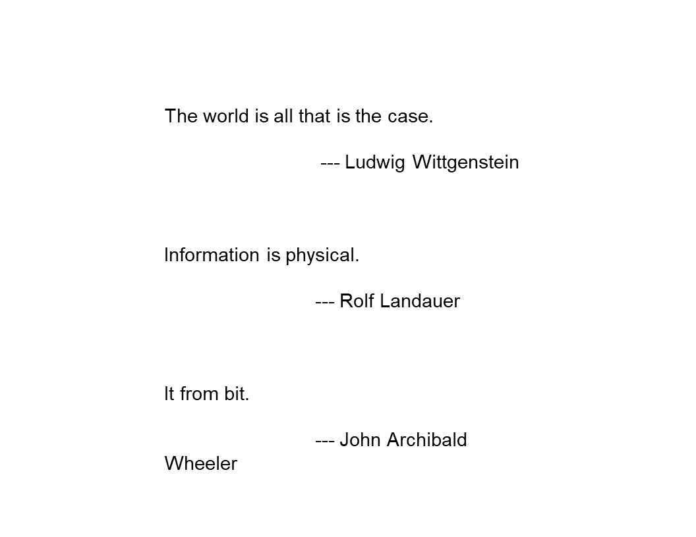
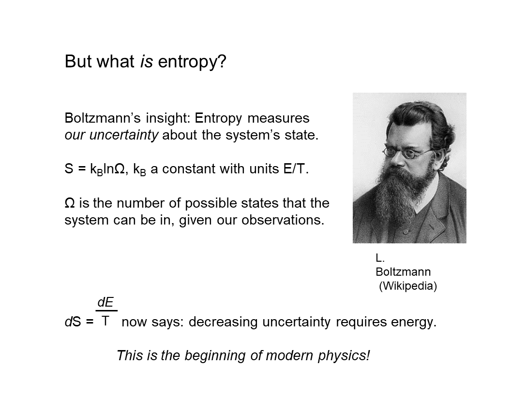

---
title:  'Physics as Information Processing - Lecture 1, "Historical Perspective"'
author:
- 'Chris Fields (Allen Discovery Center at Tufts University) '
- 'Ander Aguirre (Ohio State University) '
- 'Daniel Friedman (Active Inference Institute; University of California, Davis) '
date: "2023-05-18 Version 1.0"
doi: 10.5281/zenodo.9999999
...

## INTRODUCTION
_Daniel:_
 Hello and welcome, everyone, to the Active Inference Institute.
 This is Session 1 of the course "Physics as Information Processing" with Chris Fields.
 First we'll have Ander Aguirre and Chris Fields
 introduce themselves.

 And then we'll carry on with the first lecture,
 here.
 Check out the video description for a link to the [Course Overview website](https://coda.io/@active-inference-institute/fields-physics-2023), where you can ask questions that will be answered asynchronously; register to participate in the discussions, which happen about two weeks after each of the six lecture sessions; and just learn more about this area.
 So thank you both so much for joining into this adventure
 we are starting now.

 And first, please, Ander Aguirre, introduce yourself.
 And then Chris' introduction and lecture.
 Thank you.

_Ander:_
 Hello!
 So I'll be the course assistant.

 And I'm a postdoc in math, specializing in probability. And I have a deep interest in the physics of information.
 And I've been familiar with Chris's papers for a while.
 So, yeah, just here to learn myself!

_Chris:_
 Thank you, Ander.
 And thank you, Daniel.
 I'm Chris Fields. And I'll be presenting this course in six sessions, and Ander will be organizing discussion sessions after each of those.
 And all of this is explained on the course website.
 So let's start!

## HISTORICAL PERSPECTIVE: PHYSICS
 This is a course on "Physics as Information Processing," and this first session will be a historical perspective on the idea that physics is, or is about, information processing.

 And I'll just start with a few quotations that span the middle of the 20th century - from **[Ludwig] Wittgenstein** in the 1920s saying "The world is all that is the case,"
 so, defining the world in terms of facts, not objects;

 **[Rolf] Landauer** in the early '60s, proclaiming that "Information is Physical;"
 and then **John Archibald Wheeler**, who in many ways is the grandfather of this era recently, stating it is "It from Bit,"

 so things come from information, i.e. bitstrings.
 And if nothing else, this shows that formulations of this idea get pithier as the 20th century rolls on!

 But the history goes back farther clearly than the 20th century.
 But I'm only going to really talk about a piece of it and the timeline that I'll actually discuss today,
 the most relevant history of this idea, goes back to the mid-19th Century.

### Clausius
 And the first specific thing I'll talk about is **[Rudolf] Clausius**'s definition of entropy.

 But with the beginning of the understanding of thermodynamics and the role of information in thermodynamics, you get this very interesting multidisciplinary progression of ideas that incorporates the beginning of quantum theory.

 And the beginning of **quantum theory** can kind of be dated to the [fifth]{first} **Solvay conference** in [1927]{1928}, and the famous debate between **[Nils] Bohr** and **[Albert] Einstein** over whether quantum theory is about knowledge, information - or [about] objects, things.
 But it incorporates a lot of work in computer science and logic and mathematics.
 So, interestingly, computer science was born effectively in the mid-30s with the work of **[Alonzo] Church** and **[Alan] Turing**, which very rapidly converged with the work in physics.

### Physics, Computation, Information
 So today we'll be talking about both computer science and physics.
 And then in the second half of the 20th Century, this just exploded into a huge area.

 And in consequence of that mid-20th Century development, we're beginning to see a new idea about physics which is roughly encapsulated in quantum information theory.

 And the new idea is this.
 It's that what physics is actually about is information transfer across **boundaries** and the information... We can represent
 the information transfer like this.
 And this is a convention I'll use.

 A **boundary** is always a blue ellipse.
 And the agents that are exchanging information across this boundary are conventionally called Alice and Bob, which is just a more polite way of saying A and B.

 And when you think about this picture, it becomes clear that what physics is really about is communication.
 And this is a wild redescription of the idea of what physics is, compared to the ideas of Newton or LaPlace or even the 19th century ideas.
 And it's very different from the idea that's been preserved in 20th Century physics in the lineage of Einstein and others who viewed **classical physics** as, in a sense, either as completely fundamental or as a fundamental adjunct to quantum theory.

 So this way of thinking about physics is a very deeply quantum-theoretic way of thinking about physics.

## COURSE OUTLINE

 And where we're going in this course today is really "how did this all happen?"
 It's the origin story.
 And then in the next session, I want to discuss quantum information theory explicitly. And in particular, how quantum theory makes this conclusion that physics is about communication very simple and obvious, much more obvious than it is in classical physics where it takes _work_ to formulate this idea.
 Then in the next session, we're going to talk about **semantics**, and how observations become meaningful to the agents who make them and hence how actions become meaningful to the agents who make them.

 Then in August, we'll talk about **communication theory** a little bit more explicitly, and talk about how agents employ multiple communication channels when they're communicating.

 And this is obvious when you think of people communicating: they not only talk to each other, they look at the same things, they point to things, et cetera.
 So this is what I mean by multiple communication channels.
 Then in September, we'll leverage that discussion to talk about how **spacetime** actually emerges from communication.
 And this is one of the most important aspects, I think, of quantum information theory.

 It provides us with a way of viewing spacetime as an emergent phenomenon, that communication is what is _fundamental_ in some ontological sense; and the _box_ in which it happens, spacetime, is not.
 So in the final session in October we'll talk about applications to biology via the **Free Energy Principle**, and future directions both in physics and biology and elsewhere.
 So it's going to be an interesting ride!

 I'm keeping formalism to a minimum, because we're directing this toward the _broad_ array of people who are interested in **Active Inference** and who are involved with the Active Inference Institute.
 And I would ask you to hold questions (because we have a lot to get through in an hour) for the interactive discussion and for the discussion forum.

 So I hope I explain things well enough that all of the concepts will be understandable.
 If not, **Wikipedia** is actually a wonderful resource in this area for just definitions of terms.
 So if there's anything that... just a term that is a trip-up, try Wikipedia.
 It's probably a very good source for what these terms mean.

## BACK TO THE PHYSICS

 So let's start! Our story, as I said, begins in the 19th Century.

### Steam Engines
 And in the mid-19th Century, lots of physicists were devoting their efforts to figuring out how to make better steam engines.
 And one question that arises when you're trying to design a steam engine is "what happens _physically_ when you add heat to a system at constant temperature?"
 So if you're building a steam engine, you've got a boiler, because you need to make steam.
 And as you turn up the heat to your boiler, you get more steam, but the temperature doesn't change.
 So this is a mystery.

 What is the heat actually _adding_ to the boiler that is not increasing the temperature?
 And Clausius responded to this question in a way that's sort of typical for a physicist or a mathematician.
 Since he didn't know what the answer was, he just _invented a new name_ for whatever it was, and gave it a formal definition.

 So he called it **entropy**, which is a made-up word that, if it was translated from the Greek, would roughly mean "transformation content," en-tropy.
 And he represented it by a simple equation that the change in this new concept, entropy, which is always called S, is just equal to the change in heat, Q, at constant temperature, T.

 So obviously, this equation just reformulates the question in declarative form, saying "whatever this stuff is, its changes in this stuff are just changes in heat at constant temperature."
 Well, heat is energy.
 And this wasn't completely recognized in the mid-19th Century. But the way you'll see this equation in a current textbook is "dS is the change in _energy_ at constant temperature."

 So even more commonly, you would see it written as "the change in energy is equal to the temperature times the change in entropy."
 It's the most common sort of textbook way of seeing this.

 But the question, of course, is, "What _is_ this quantity?
 What is this entropy?
 What does this concept _mean?_"

### Boltzmann

 And about 15 years after Clausius proposed it, **[Ludwig] Boltzmann** had the key insight, which is that "entropy is a measurement of _our uncertainty_ about the **state** the system is in."
 And in particular, he again, of course, went to formalism, and said "the entropy, S, is equal to some constant times the number of states that the system can be in that look the same to us."

 And since that number of states is enormous, the way to make that manageable is to take the _log_ of the number of states.

 The **natural log** is _ln._
 And this constant k is called **Boltzmann's constant**.
 And Boltzmann was able to do this because he subscribed to a radical, very unpopular theory that material things, including gases like air, were made of atoms; and heat made the atoms move around.
 And as you increase the amount of heat, the atoms can move in many different ways.

 So the number of _states_ that they can be in that look the same to us _increases._
 And that's what entropy is.
 It's this increase in the number of states that the system can be in that all look the same to us with the measurements that we can make.
 And since they look the same to us, we're _uncertain_ about exactly what state they're in.
 So entropy is a measure of uncertainty.

 This was really the beginning of modern physics,
 because what it says now is that "decreasing uncertainty requires energy."
 It links a measurement of uncertainty to a measurement of energy.
 And if you think about the **uncertainty principle** in quantum theory, the core idea of the uncertainty principle is "you can't _measure_ a system without _disturbing_ it."
 So to actually _act_ on a system requires energy.

 And that's what you have to do to get information.
 So here's Boltzmann, basically inventing quantum theory.

### Planck

 So we're going to fast forward by another 15 years, to 1900.
 And in 1900, **[Max] Planck** solved this problem called the "black-body radiation problem," which was basically "how much heat does your hot boiler give off into the air?"

 And all of the measurements of the heat that hot boilers gave off to the air ran into problems in classical physics, and caused contradictions and quantities that went to infinity.

 And all of that was bad.
 So many people were trying to solve this problem. And Planck solved it by making a simple postulate.
 He said "the energy of the radiation is proportional to its frequency."
 So its _color_ in the case of light.
 And if you go higher frequency, you end up in ultraviolet and X rays and gamma rays.

 If you go to lower frequency, you go into microwaves and radio and all of that.
 So this is a nice way of talking about radiation.
 And it turned out that this solved the problem!
 I mean, just assuming this simple proportionality relationship produced spectra for black-body radiation that worked, that matched what you saw experimentally.
 Well, this means something very important.

 It means because this number _h_, the proportionality constant called **Planck's constant**, is a _number,_
 it's finite,
 it means that energy comes in discrete units of _h_.
 You can have one _h_ or two _h_ or 10 million _h_, but you can't have half an _h_ of energy.
 So it's quantized.

 And this is widely recognized as the birth of quantum theory.
 But of course, we should have known this already,
 if we just thought a little bit,
 right?
 We know that changes of energy are proportional to changes in entropy by temperature.

 And we know that entropy is a measure of the number of states, and numbers of states are just numbers.
 You can have one state, two states, three states, 10 million states, 100 billion states, but they're all just a number - one, up.

 And it's not infinite.
 There's not an infinite number of states unless you have an infinite amount of energy, which you don't have.
 So we knew already that entropy could only take discrete values.

 And since energy and entropy are basically the same thing, we knew already that energy could only take discrete values.
 So we _could_ have realized in 1900 that energy is quantized because the number of states is quantized.
 So it shouldn't have really been a _mystery_ why energy was quantized. But it was a mystery, and it stayed a mystery, and it's still a mystery!
 People still debate the meaning of quantum theory.

 But another thing we _could_ have known in 1900 was something _very_ important, and it's that this quantum of action, Planck's constant, which has units of action, which is energy times time, is intimately related to Boltzmann's constant.

 And Boltzmann's constant has units of energy over temperature.

 But this wasn't actually understood until the 1950s.
 No one really figured {that} this out.
 There was this relation until the 1950s.

### Wick
 And when it was figured out, it was figured out by a guy named **Gian Carlo Wick**.
 And he introduced this notion of the **Wick rotation** by realizing that if you have an equation in classical physics, and in it there's the term "1 over kT,"

 you can always replace that "1 over kT" with this other expression,
 "_i_ _t_ over h-bar."
 H-bar is just _h_ divided by 2 pi; and you'll get an equation that's valid in quantum theory.
 And this is typically described in textbooks as "a trick."
 And whenever something in physics is described as a trick, what that really means is it's something we don't understand.

 And lots of papers have been written about the meaning of the Wick rotation.
 But to start to understand the Wick rotation, I want to look at this equation a little bit.
 "1 over kT" is 1 over an energy. And "_i_ _t_ over h-bar" is 1 over an energy,
 since h-bar is units of energy times time. We have time in this equation, and then we have this factor, _i_, which is typically thought of as just an imaginary number.
 So it's the square root of minus one.

 And - what's this "_i_" doing in this equation?
 And in fact, you see factors of _i_ _t_ over h-bar
 (if you're familiar with quantum theory) _everywhere_ in quantum theory!
 So what's the meaning of this "imaginary number?"

 And if you just think of "_i_ _t_," or of _i_, as this "arbitrary, imaginary number" that somehow renders the equation mysterious, then the whole of quantum theory is mysterious. But the Wick rotation is very mysterious.

 But what _i_ is actually is an **operator**.
 And if you think of the real numbers as an axis (which is always drawn horizontally)...
 So here it is.
 Here's zero, and the axis is pointing that way.
 {(I'm sorry - I can't get the camera really far enough away to see my arm here.)}

 So what is _i_?
 _i_ is actually an operator that rotates the whole real axis by 90 degrees.
 So if you see a plot of complex numbers, then the real numbers go this way, and the, quote, "imaginary numbers" go that way.
 So what multiplying by _i_ has done is rotate by 90 degrees.

 And of course, if you do _i_ squared, you rotate _twice_ by 90 degrees (my arm won't do this), but you end up pointing _that_ way, and those are the negative numbers.

 So _i_ is an operator that rotates something by 90 degrees, and if you rotate four times by 90 degrees, you're back to the identity.
 So _i_ to the fourth is one.
 So this tells us something very interesting, which is that what the Wick rotation is really talking about is a rotation.
 It's a geometrical equation.
 And in July, we'll come back to this and really probe what this Wick rotation _means, physically._

 But as I said, this wasn't understood 'till the 1950s. And by the 1950s, a lot had happened.
 So - quantum theory had been developed.
 Bohr and Einstein had had their debate.
 Particle accelerators had been built.

 The atomic bomb had been built.

 Nuclear physics was well on its way. So an enormous amount of practical physics had been done.
 Quantum theory was highly developed.
 People were starting to think about quantum field theory before they made this simple realization that's formulated in the Wick rotation.
 So this is a harbinger of things to come.
 But before we continue in physics, we need to backtrack in time a little bit, and look at what the mathematicians were doing.

## MATHEMATICS
### Gödel

 So across the hall in the math department, one year after the Solvay conference, in 1929, Kurt Gödel proved his famous first incompleteness theorem.
 And the theorem states that "no formal system that contains arithmetic can be both consistent and complete."
 And that means that either there are true statements that aren't provable in the formal system; _or_ there are false statements that are provable; _or,_ of course, both.

 And Gödel's proof is actually extremely simple.
 Almost all of the work in the proof is setting up all of the notation and procedures and so forth to formulate within arithmetic the sentence, "This sentence is not provable."

 And once you have that sentence formulated within arithmetic, then the conclusion of the proof is obvious.
 If you can prove the sentence, "this sentence is not provable," then you've proved something that's false.
 And if you can't prove it, then there are sentences that you can't prove in arithmetic.
 So this was incredibly bad news for mathematicians who thought that finite discrete operations, which is what proofs are and also what computations are, can exhaustively enumerate the facts. And this was the assumption behind Wittgenstein's claim that "the world is all that is the case," the world is a collection of _facts._

 And optimistically, he thought that first order logic would allow us to enumerate all those facts and we'd be _done._ Dreams of a Final Theory, again!

 So Gödel's theorem means that no system with finite capabilities, no system that can just do finite discrete operations, can fully describe its _environment._
 It will always be in an environment where there are true things that aren't provable or false things that are provable.
 But I think more relative to a discussion of agents, is that it means that no _agent_ can describe itself.
 Any agent's theory of itself {will either contain true statements that it can't derive or false statements, or it} will either _miss_ true statements that it can't derive, or will end up deriving things that are false about itself.
 Of course, we see this in psychology all the time.

 So an immediate consequence of Gödel's theorem was an intense investigation of what computation actually _is,_ what it _meant_ to talk about finite discrete operations.

### Computation

 And two leaders of this were, of course, Church and Turing.
 And here's a picture of a Turing machine, which is just a little device with a couple of tapes, and a tape reader, and a simple logic unit that either writes a one or a zero if it sees a one or a zero.
 And they defined a **computation** as a process that can be implemented in finite time by such a machine, or by Church's **lambda calculus**, or by any of the now hundreds of other methods that are provably equivalent to a Turing machine.
 So what does _this_ mean?

 It means that computation is a _physical_ process that can be mechanized; and it turns out, mechanized in any one of a huge array of ways.
 It means that many different implementations of any computation are possible.
 So I can do it on a Turing machine, I can do it on my laptop, I can do it on my head, et cetera.
 The most important things it means is that there are questions with no computable answer.
 This is the Revenge of Gödel's theorem.

 And two of the most famous questions of this kind are, "Given some arbitrary program,
 will it halt?
 Will it get to an answer in finite time?"
 And the answer to that question is, "This is undecidable.
 No procedure can figure this out."

 And the other undecidable question is, "Given some arbitrary program, what _function_ does it compute?"
 And you'd think that would be simple, that you can read a program and figure out what function it computes.
 But it turns out that is undecidable.
 That cannot be done by any finite process.
 So this was another body blow to the goal of understanding everything with finite discrete processes.

 But it also set the stage for something *new.*
 It set the stage for thinking about an agent who interacts with a computational process by giving it an input, and then looking at its output some time later.

 And this, of course, will look familiar, because I've included the blue ellipse, which is the boundary, which these days we call a "**user interface**."
 And the user interface just allows some finite action on the system, and then the ability to observe some finite response by the system.
 So we can now ask, "What can Alice determine by acting in some finite way, and then making some finite number of observations?" -
 i.e.
 receiving some finite number of outputs from the system that she's acting on.

 And the first 20 years of this produced a _large_ number of answers, all of them negative.
 So to go back to Turing, he proved that Alice can't tell what's _implementing_ the function that she sees being implemented.
 She can't tell whether a given input will lead to an output -
 that's the **halting problem**.

 **[Claude Elwood] Shannon** showed that Alice can't tell what the inputs _mean_ to the system -
 his whole theory of communication is completely independent of semantics,
 and his theory of communication actually accurately describes what Alice can observe.
 **[Henry Gordon] Rice** is the one who proved that you can't determine what program is generating the outputs. 
[Classes of Recursively Enumerable Sets and Their Decision Problems](https://www.ams.org/journals/tran/1953-074-02/S0002-9947-1953-0053041-6/S0002-9947-1953-0053041-6.pdf)

 And then **[Darrell R.?] Moore** proved a very similar result in a completely different formal setting of general cybernetics, that you can't tell what _process_ is generating the outputs by finite observation.
 But what Alice _can_ do, is build a predictive _model_ of what generates the output she sees in response to her inputs, and test it by designing new inputs.
 And this is, of course, as **Karl Popper** told us, the process that we call "science."

 So Alice can do science even though she can't answer any of these fundamental questions.

 Now, this, of course, has a huge technological consequence. Since this theory of computation tells us that processes are effectively virtual,
 we don't know what they are and we can't _determine_ what they are except in theory,
 by _making_ a theory. Technologically, it means we're free to _use_ virtualization everywhere because we have to deal with it anyway.
 And this allows us to build multilevel architectures.
 It means that we can architect computers where no layer of the computation has any idea what's going on below or above it, and doesn't need to.

 And that's what makes practical programming possible.
 So from these no-go theorems that tell you what you _can't_ do, you actually get an enormous boost into [inaudible] and use, to probe the world and develop theories and on and on and on.

 So in a sense, Gödel birthed not only computer science, but practical computing by showing us that virtualization is just the way the world works.

## PHYSICS AGAIN
### Feynman

 So now let's go back to physics, where these ideas were replicated, basically reintroduced, reinvented by Feynman in developing his path integral formulation of quantum theory.
 And basically what Feyman realized was that in any physical process, the observer, Alice, prepares some state that she's interested in.

 She prepares some input to an experiment.
 Then she lets something happen, and then she sees what the result of the experiment is.
 And the canonical experiment in physics is scattering.
 You {you know} fire two protons at each other, and they intersect someplace, and stuff comes out, and you measure the stuff that comes out.

 And what you can measure is momentum and spin energy, things like that, position.

 So these processes conserve the total values of the things you can measure.
 So in particular, they preserve momentum and angular momentum, and they preserve {you know} other things that are harder to measure and are only approximately conserved anyway, like **lepton number**.
 But Feynman's contribution to this way of thinking about experiments was to say, "Look, if you want to understand the output, you have to _sum_ over all of the possible processes that could have produced the output from the input, no matter how improbable they are."
 So the famous idea from Feynman **diagrams** is if you have an electron that's scattering off an atom, you measure the initial state of the electron that you've generated with an accelerator or something, and you measure the final state, which involves momentum and spin and so forth.

 And for all you knew, partway through the process, the electron disappeared, and an entire universe appeared and then annihilated with a copy of an entire anti-universe, and the electron came back out!

 And you have to include processes like that if you really want to understand and correctly predict the outcomes of your measurements.
 And **Murray Gell-Mann** lifted the bumper sticker slogan from T. H. White and "The Once and Future King," "Everything not explicitly forbidden is mandatory."
 That sums up Feynman's idea.
 And this is called the **totalitarian principle**, since it's what's written in T. H. White's book on the Kingdom of the Ants, for which "everything not explicitly forbidden is mandatory."
 So let's think about a real example that's {a bit actually it's...} the same as scattering.

 The ultimate scattering experiment in physics is a black hole.
 Stuff goes into the horizon, stars, whole galaxies, whatever.
 Something happens, and stuff comes out.
 And what comes out is **Hawking radiation**, and information is conserved if the information in the Hawking radiation is actually the same as the information in the "stuff" that went in.
 And conservation is not qualitative.
 It's quantitative.
 It's only the **quantity of information** that's supposed to be preserved.
 And you can ask, "How much is the information that's being emitted by a black hole that's emitting Hawking radiation?"
 And [Jacob David] Bekenstein was the one who figured this out, using an incredibly simple argument.
 But I'll just give the answer here.

 The answer is that the total entropy of the black hole is its area divided by four. And the area in this equation has to be computed in **Planck units**, which are units where Planck's constant and the speed of light and Boltzmann's constant and other interesting things are all set equal to _one._
 So one Planck area is the Planck length squared, which turns out to be about ten to the minus 70th meters squared.
 So this says that black holes are the most entropic entities we know of.
 So a black hole about this big [gesturing], with a radius of about a meter, has an entropy of about ten to the 70th, which is, of course, an astonishingly big number. And a black hole with the area of the sun - 
 so a moderate sized cosmological black hole, a real thing that we can observe with a gravity wave telescope or something - has an entropy of about ten to the 79th.

 And really big black holes, which are bigger than the entire solar system, have entropies into the ten to the 80th, 10 to the 85th, or something.
 So these are enormously entropic entities.

 But Beckenstein didn't just tell us that.
 He told us something about the _structure_ of the interface, the horizon of a black hole.

 And this is what he told us.

 You can compute entropy in bits just by using logs base two instead of logs base _e_, natural logs.
 And that's just multiplying the natural log by about 1.4.
 So we can write the entropy {of black hole,} of black hole in units of bits, and it's about a over six.

 So what does this mean to say that we can think of the entropy in terms of _bits?_
 What it says is that we can think of the interface in terms of a bit array. And we can think of all of these bits as encoded on this interface at a density of one bit every roughly six Planck lengths squared, six plank areas.

 So this is an incredibly dense encoding in a black hole.

 And it's an interesting idea about black holes.
 But what gets really interesting is what happens when you _generalize_ it.
 And of course, physicists are prone to generalization, and that's what happened _next._

### The Holographic Principle

 Gerard 't Hooft, almost immediately thereafter, on the basis of Beckenstein's work, formulated the **Holographic Principle**.

 And what the Holographic Principle says is "We can think of _any_ system as _approximately_ a black hole.
 And the only approximation is the encoding density."
 The _boundary_ of any system encodes the information that we can _get_ about the system at some density.
 And the density is less than the density for a black hole because we're not black holes.

 And this rules out a lot by limiting the amount of information that you can _extract_ from a system to the amount of information that you can actually _write on its boundary._
 And one of the things that it rules out is knowing the **geometry** on the inside of the system.

 And 't Hooft put it this way, which I think is a brilliant thought experiment. He says, "Look, the metric inside this system can be _so curved,_ effectively the space time inside the system can be so curved, that you could stick an entire universe inside.
 And we never know, because it wouldn't change the amount of entropy, number of bits that are encoded on the boundary.
 So the inside geometry can be anything.
 And you can't find out by
 looking at the outside of the system."

 Now, the Holographic Principle almost follows from classical physics!
 There's [Leonhard] **Euler's theorem**, which tells you about one over R squared forces, and you can think of the force as penetrating the boundary at some density.
 And the difference between Euler's theorem and the Holographic Principle is just that the density in classical physics can go to infinity.

 And in the Holographic Principle, it can only go to this maximal density that's achieved by a black hole.
 Why?
 Because if you try to get any higher, more information, the information gets sucked into the black hole, and you can't get it out.

 So the Holographic Principle becomes a _guiding principle_ for thinking about any physical system and what it means to extract information from a physical system.
 And in fact (we'll talk about this next time),
 you can say exactly what the information encoded on the boundary of any system _is._
 And what I'll go through next time is seeing that the information that's encoded on the boundary is a specification of the energy that's being exchanged by the interaction, which, of course, is linear in the number of bits.
 It's just counting the number of bits.

 Okay!
 So with the Holographic Principle, we now have a complete new science about systems that are exchanging finite discrete information across a boundary by encoding that information _on_ the boundary and then reading the information _off_ the boundary.

 So here's a new way of thinking about physical interaction.
 Alice writes a message _on_ her boundary with Bob, and Bob reads the message _off_ the boundary, and then writes his own new message, which Alice then reads.

 And of course, that's what's happening _right now._
 I'm writing information by speaking _on_ an interface, which is effectively the Internet.
 And you're reading that information _off_ the Internet by listening to it.
 And when we get time for questions, you'll be writing information on the Internet, which I'll be reading.
 Now, the key thing about this new science is that it's **topological**.
 It's about connectivity across some communication channel, which we represent as a boundary.

 It's not geometric, so it doesn't assume anything about spacetime.

 So it allows us to _build a model_ of _space_ in particular as an emergent phenomenon.
 And it allows us to see _time_ as not some absolute external abstraction, but something that the communicating agents measure for themselves.
 And so they each act in their _own time._
 And we get a very natural measure of time in terms of how many bits I see coming across my boundary.

 And again, we'll talk about that in the next couple of sessions, and then talk about it more thoroughly in September when we talk about emergent spacetime.
 So quantum information theory looks very different from the physics that came before, not because it's adopted a new formalism, the tools of quantum theory;
 it's because it's entirely changed the _thinking_ about what physics _is_ and what it's _about,_ and replaced this idea of forces and balls banging into each other and all of that with the idea of communication between agents.
 And of course that's familiar from an Active Inference perspective.

 So we can now back up a little bit to see what they were doing in _classical_ physics during this period.
 {Well, let me go on a little bit.
 Sorry.}

### Wheeler on The New Physics
 This is just a slide quoting Wheeler, who of course is the most radical {in terms of} and _pithiest,_ in terms of formulating these ideas.
 But here's his characterization of this new physics.

 It's not reductive:
 all of the reasoning is circular;
 you don't have smaller things and then yet smaller things, and then yet smaller things forever.

 There are no laws:
 so what you see on the interface is a message;
 it's not something that's governed by laws since the beginning of the universe.

 There's no continuum:
 so there's nothing described by real numbers;
 it's all described by integers;
 everything's done in finite dimensional spaces.

 And finally, and most importantly, there's no "spacetime _box_" in which things happen.
 So think of how radical this is!
 It means there's no big bang, there's no big rip, there's no bouncing universe.
 All of those ideas are out the window because they're classical and they're about spacetime.
 And what the new physics wants to do is derive spacetime out of basically users' experiences.

 So the agents here are all "observer-participants" in Wheeler's language.
 But what that just means is _agents_ that want to communicate. And it's their communication that gives rise to physics.

### Markov Blankets

 So _now_ we'll go back to classical physics. And what was happening, or one thing that was happening in classical physics at that time, was a lot of thinking about **stochastic causal networks**.
 And [Judea] Pearl realized that if you have any stochastic causal network that's **unidirectional**, then around any **node**, you can draw what he called a **Markov blanket**.

 And a Markov blanket is just the set of nodes in the network that absorb all outside causation and then transmit that causation into whatever node you're interested in; and then absorb all causation coming from the node you're interested in and transmit it to the rest of the world.

 And so we can redraw that in "part b" here, and it should look very familiar.
 A Markov blanket is just a classical-physics way of talking about a **holographic screen**.
 And the number of nodes in the Markov blanket, or in particular the number of **degrees of freedom** times the number of nodes, is just the number of bits that flow across that Markov blanket.
 So it's the entropy of the effective holographic screen.

 All these ideas were reinvented more or less independently within classical physics.

## Active Inference

 And it was from this classical physics background that Karl Friston came up with the idea that a Markov blanket defines a persistent 
[**** inaudible ****] [**thing**, a system that persists through time], 
 at least from an Active Inference Institute point of view everyone is familiar with, because it's the foundation of the idea of Active Inference.

 Any system that persists through time does so by making sure that it doesn't dissolve into its environment.
 Well, what does that _mean?_
 It means it persists through time by maintaining the integrity of its Markov blanket, or the integrity of its boundary.
 So this of course is just a tautology. But it's a very interesting and very productive tautology, because it says that any system is using the information it gets on its boundary from its environment to build a model of how its environment behaves.
 And then it uses that model to act back on its environment to test and refine its model.

 And again, as Popper told us, this is just what _science_ is.
 So what the free energy principle really tells us is that all systems are agents that are doing science all the time.

 So physics is effectively not just the study of communication, but it's the study of agents doing science with each other, pairs of agents who are trying to figure each other out by their communicative exchanges.
 So that's the history of how we got from {1930s sorry,} 1850s thermodynamics to the free energy principle, and how the free energy principle connects to these very deep and extremely radical (especially within context) ideas in quantum theory and quantum cosmology and computer science.
 All of which tell us that the world we see is a projection that's being written on our boundaries by a process that we have no access to - except the procedure of Active Inference, or the procedure of science - which is to formulate predictive models and test them by doing things in the world and seeing how the world responds.

## Conclusion

 So that's it for this session.

 The first discussion session, which Ander is going to lead, will be the 3rd of June at this same time, i.e. 5 o'clock European time.
 And then my session number two will be in mid June.

 And if you look at the course website [1st Discussion; 2nd Lecture](https://coda.io/@active-inference-institute/fields-physics-2023/questions-answers-3), there's this subsidiary website for interactive Q and A.
 And I invite everyone to post questions, and discuss them; and hope that we'll have an interesting exchange and that everyone will come to sort of an understanding of what was talked about today through discussion.

 And we'll be interested in being back in June to see how to formulate this in quantum theory.

 So thank you very much and thank you again, Daniel, for organizing this and hosting it and putting together all the technical things necessary to pull this off.
 I could never do that on my own.

_Daniel:_
 Thank you.
 We're really excited here.

 Any closing thoughts?
 Or Ander, I'd love to hear your reflection just briefly.
 How would you have told that history; or how does that history reflect on the areas that you're familiar with?

_Ander:_
 Well, I don't think I have much to add.
 I've been mainly interested in the Wick rotation part.
 I'm excited to hear more about that, Chris.
 But no, I found this to be a very nice summary.
 I'm less familiar with the staff on computation, formal computation, despite being a mathematician by training, it was a little more familiar with all the physics stuff, but yeah, I thought it was great.

_Chris:_
 Thank you.

_Daniel:_
 All right.
 Thank you.
 I will close it.
 So in about two weeks, we'll have the first discussion.
 Everyone's welcome to join.
 I will share with Ander and Chris the questions, and we can develop that.

 And we'll have that on the course front end before the coming discussion.
 So thanks again, fellows.
 See you next time.

## Acknowledgements

We extend gratitude to the following contributors whose expertise enhanced the quality of this transcription:

- David S. Douglass (Active Inference Institute) 
- Alexander Vyatkin (Active Inference Institute) 
- Holly Grimm (Active Inference Institute) 

## Appendix: Terminology

Action

:   Broad sense: The dynamics, mechanisms, and measurements of Behavior

Active Inference

:   Active Inference is a Process Theory related to Free Energy Principle.

Agent

:   Entity as modeled by Active Inference, with Internal State separated from External State by Blanket State

Free Energy

:   Free Energy is an Information Theoretic quantity that constitutes an upper bound on Surprisal.

Free Energy Principle

:   A generalization of Predictive Coding (PC) according to which organisms minimize an upper bound on the Entropy of Sensory input  (or sensory signals) (the Free Energy). Under specific assumptions, Free Energy translates to Prediction error.

Inference

:   Process of reaching a (local or global) conclusion within a Model, for example with Bayesian Inference.

Information

:   Measured in bits, the reduction of Uncertainty on a Belief distribution of some type. Usually Syntactic (Shannon) but also can be Semantic (e.g. Bayesian).

Markov Blanket

:   Markov Partitioning Model of System, reflecting Agent as delineated from the Niche via an Interface. The Markov Blanket Blanket State reflect the State(s) upon which Internal State and External State are conditionally independent.

Observation

:   The Belief updating of an Internal State registered by a Sensory input, given the weighting assigned to that class of input in comparison with weighting of the competing Priors. (This is a narrow sense of “observation,” where the Agent is “looking for this kind of input.” This sense excludes situations where (a) an incoming stimulus with these attributes has already been explained-away or pre-discounted, or (b) the prior is so strongly weighted as to exclude updating in response to any inputs (other than, perhaps, “catastrophic” ones, as may occur in e.g. fainting, hysterical blindness).)

Particle

:   An Agent consisting of Blanket State and Internal State, partitioned off from Niche.

State

:   is the statistical, computational, or mathematical value for a parameter within the State space of a Model.

System

:   Set of relations described by State space of a Model.

Uncertainty

:   In Bayesian Inference, a measure of the Expectation of Surprise (Entropy) of a Random variable (associated with its variance or inverse Precision)

{ width=5% } Act to connect with The Institute by [web](https://activeinference.org), [email](mailto:Blanket@ActiveInference.Institute), [YouTube](https://www.youtube.com/c/ActiveInference/videos), [Discord](https://discord.gg/8VNKNp4jtx), or [LinkedIn](https://www.linkedin.com/company/active-inference/).
