---
title:  'Physics as Information Processing - Lecture 6, "Biology"'
author:
- 'Chris Fields (Allen Discovery Center at Tufts University) '
- 'Daniel Friedman (Active Inference Institute; University of California, Davis) '
date: "2023-10-12 Version 1.0"
...

# Lecture 6, "Biology"

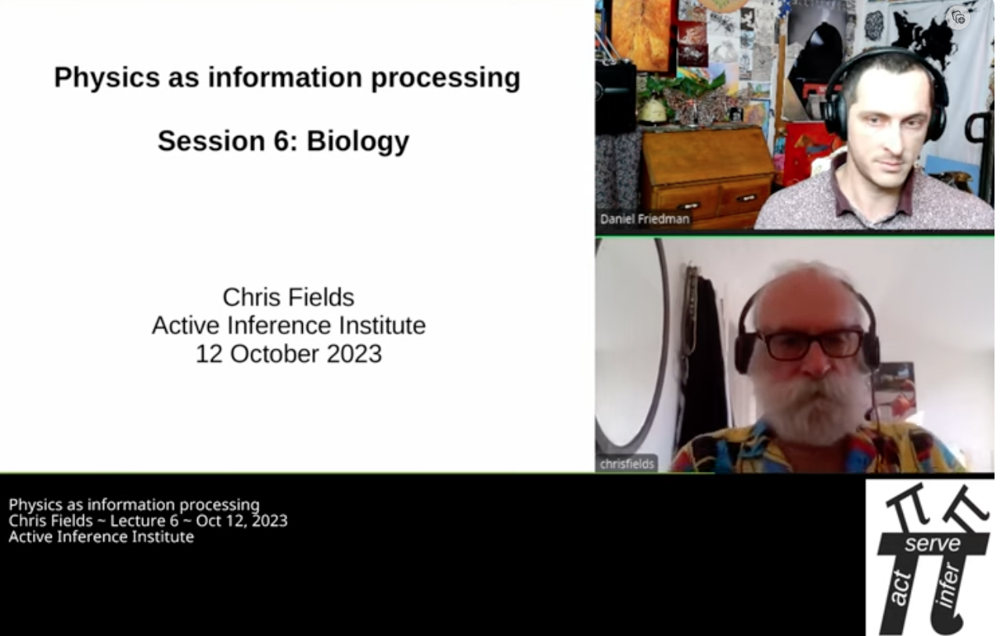

## Introduction

00:08 _Daniel:_
[[start:8040][end:9748]] Hello and welcome, everyone.
[[start:9914][end:21968]] It is October 12, 2023, and we are in the final lecture, session six in **Physics as Information Processing** with Chris Fields.
[[start:21984][end:24832]] {So,}Chris, thank you for this journey.
[[start:24976][end:32892]] Exciting to get to this final lecture, which will be followed only by the last discussion for this go around.
[[start:32946][end:34028]] {So}It's really awesome.

00:34 [[start:34114][end:36060]] And to you for this lecture.

00:38 _Chris:_
[[start:38240][end:39192]] Thank you, Daniel.
[[start:39256][end:47200]] And welcome, everyone, to this last session that I'll be doing with a focus on biology.
[[start:48660][end:51936]] And just to give a brief review.

## Generic Quantum Systems

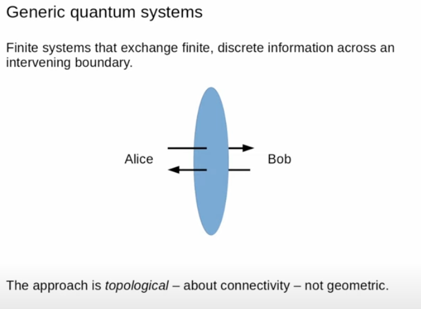

[[start:32946][end:34028]] {So} It's really awesome.
[[start:52118][end:67960]] As usual, we've focused in this course on generic quantum systems, by which I mean just any quantum system that has some number of degrees of freedom.
[[start:68300][end:86940]] And we really haven't made any assumptions about these systems other than the assumption that both interacting partners have sufficient degrees of freedom that they can be considered separable.

01:27 [[start:87680][end:95120]] So their boundary is small with respect to the total size of each of the interacting systems.
[[start:95940][end:101212]] And I want to emphasize again that the approach we've taken is completely **topological**.

01:41 [[start:101276][end:105030]] So we haven't assumed anything about embedding in space.
[[start:106840][end:113270]] And as we've characterized these systems, we focused really on two things.

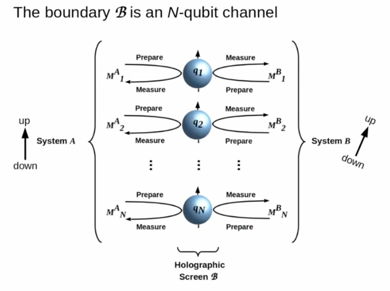

[[start:115000][end:120760]] One, the amount of information that the two systems can exchange.

02:01 [[start:121500][end:125956]] And that amount is determined by the size of their boundary.
[[start:126068][end:132280]] It's determined by this number, n, which is the **Hilbert Space** dimension of the boundary.
[[start:132440][end:144000]] And as we've discussed now in several of the sessions, we can think of this boundary as a collection of N **qubits** via which the two systems, A and B, communicate.
[[start:145140][end:161200]] The other feature of the interaction on which we focused is the **reference frames** that are used by the two systems to interact with this set of qubits.

02:41 [[start:161280][end:187710]] And it's these reference frames that assign the information that flows between A and B, meaning, or functional significance, or actionability, or however you want to refer to the idea that when a system gets some information, it does something useful with it.

03:08 [[start:188720][end:195440]] So those are very generic kinds of ways of characterizing an interaction.
[[start:196420][end:206230]] You can think of it as a qualitative characterization, the semantics of the information, and a quantitative characterization, the amount of information.
[[start:207000][end:211910]] But other than that, we've left the nature of these systems open.

## Free Energy Principle (FEP)

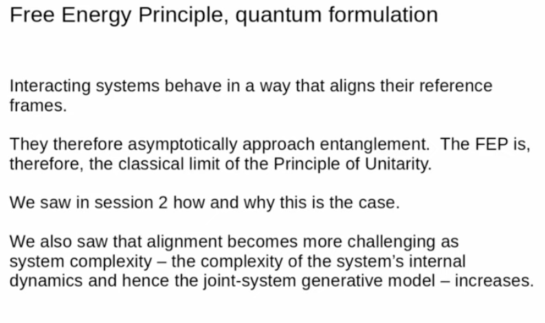

[[start:213000][end:230700]] And this characterization allowed us to reformulate the **free energy principle (FEP)** in quantum information theoretic terms, as the principle that interacting systems behave in a way that will asymptotically align their reference frames.

03:51 [[start:231360][end:238380]] And we saw that full alignment of reference frames is equivalent to **entanglement**.

03:58 [[start:238800][end:249404]] So the FEP drives systems toward entanglement, which is not surprising, because that's what happens to generic quantum systems.
[[start:249452][end:254980]] They may start out separable, but if they interact long enough, they'll become entangled.
[[start:255800][end:263540]] So we've had a discussion that is really very generic.

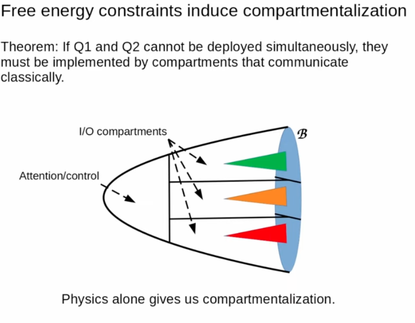

04:26 [[start:266380][end:277000]] Now, we showed a couple of sessions ago that under these very generic assumptions, we got some interesting outcomes.
[[start:277340][end:300690]] And one is that if systems have sufficient degrees of freedom under the action of the FEP, they will be driven toward making a diverse set of measurements of their environment, because they're trying to get information about it so that they can predict what it's going to do.

05:01 [[start:301780][end:311620]] And that as they add ways of making measurements, they'll come up against a noncommutativity of their measurements.
[[start:312120][end:320890]] And this may be due to intrinsic mathematical facts about their measurements, and it may just be due to their limited supply of free energy.
[[start:322060][end:335340]] So either way, what this induces is **compartmentalization** and the requirement for internal, classical communication on internal boundaries.

05:36 [[start:336160][end:342716]] So I just wanted to reemphasize that this is a result of basic physics.
[[start:342908][end:348080]] And we see compartmentalization, of course, ubiquitously in biology.
[[start:349940][end:364950]] But this suggests to us that features of biology that are very familiar actually follow from fairly deep physics, and compartmentalization is one of them.

## Spacetime

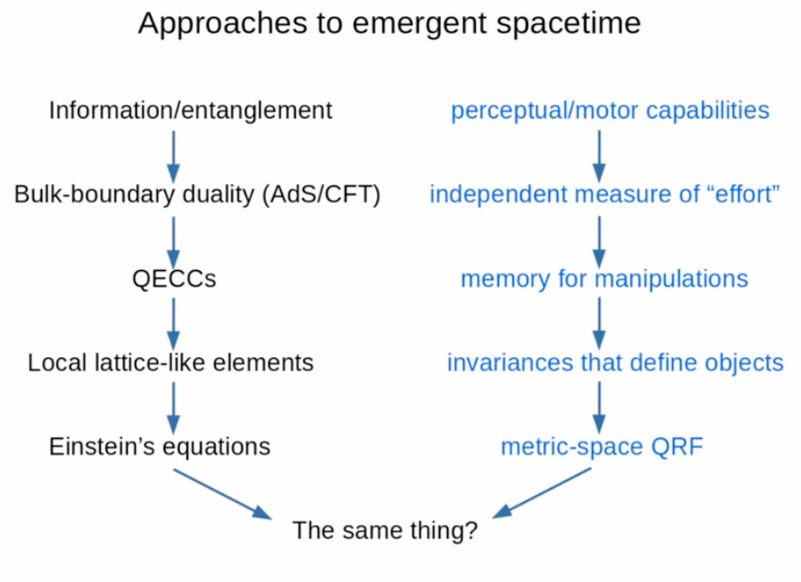

06:06 [[start:366540][end:385740]] We then talked last time about space and time and the computational requirements on any system that is able to perceive an external clock or perceive an external spatial layout.
[[start:386400][end:393890]] And we discussed this from a very kind of developmental psychology point of view.

06:34 [[start:394500][end:414340]] We discussed it using essentially the kinds of terms on the right here, as opposed to the kind of language that's much more technical and mathematical, that's used in physics to derive **spacetime** as **emergent** from information transactions.

06:57 [[start:417340][end:425400]] But we at least hypothesize that both of these are ways of getting to the same sense of emergent spacetime.
[[start:426140][end:445040]] And one important outcome of this discussion was that systems can perceive external clocks, so external periodic behavior with fewer computational resources, so before they're able to perceive spatial layouts.

07:25 [[start:445380][end:448050]] And we'll get back to this later.

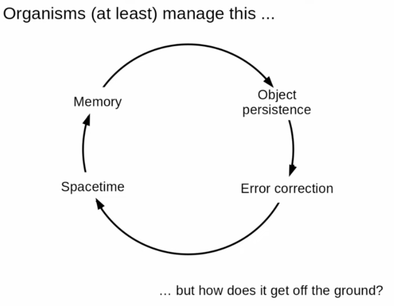

[[start:449460][end:463700]] So, organisms and maybe other complex systems, seem to manage a collection of capabilities that are all mutually dependent.
[[start:464520][end:474280]] So memory depends on having layouts of persistent things that can be distinguished.

07:55 [[start:475500][end:480750]] So it depends on space, and it certainly depends on time.

08:04 [[start:484480][end:488380]] Space gives structure to persistent objects.
[[start:488720][end:492960]] Memory allows you to identify persistent objects.
[[start:493700][end:500480]] And objects, in turn, give structure to space by being located in different places.
[[start:500980][end:519880]] And objects enable the fundamental requirement for memory, which is some form of error correction, so that one has enough redundancy in the memory to check to see whether a memory has been degraded.

08:40 [[start:520780][end:537820]] So, organisms seem to manage a physically very important process, which is the use of spacetime and memory as a basis for cognition.

08:58 [[start:538160][end:547584]] You'll recognize these four functions that are mutually interdependent as underlying complex cognition across the board.
[[start:547702][end:553920]] And you can't really do complex cognition unless you have these capabilities.

## Life as Computation

09:16 [[start:556040][end:571880]] So today, we're going to put some of these things together in a discussion of biology and end by looking forward to future directions, not just in biology, but in all of **quantum information theory (QIT)**.
[[start:573260][end:588700]] So, let's talk about biological systems, living systems, which, of course, includes us, but also includes all other organisms and communities of organisms and so forth, at multiple scales.

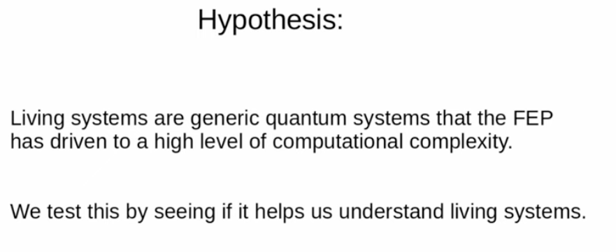

09:50 [[start:590480][end:607620]] And I want to put forward a fairly radical hypothesis that living systems are just generic quantum systems that the FEP has driven to a high level of computational complexity.
[[start:608360][end:611270]] So what does this really say?
[[start:612120][end:647360]] It suggests that living systems are just quantum systems that have enough degrees of freedom and a sufficiently complicated internal dynamics that the FEP, by requiring them to predict what their environment is going to do next, has driven them to make complicated measurements and complicated **inferences** on the basis of those measurements that enable fairly complicated actions on the environment.

10:47 [[start:647700][end:659940]] So **these are systems that you would characterize as computers**, essentially information processing systems, with a high degree of computational capability.

11:00 [[start:660920][end:667568]] Now, this is clearly as much a philosophical hypothesis as an empirical hypothesis.
[[start:667664][end:674170]] And that's due in part to the fact that we don't really have a good definition of what a living system is.
[[start:674540][end:679900]] We can just point and say, that's a living system, and that thing over there isn't.
[[start:681040][end:683720]] But beyond that, we don't have much of a theory.

11:23 [[start:683880][end:687100]] And, of course, people have worked on a theory of what is life?
[[start:687170][end:692640]] For decades, but there's not a lot of agreement.
[[start:693620][end:702332]] And so this is, in a sense, a definitional kind of hypothesis.
[[start:702476][end:711670]] And we test such kinds of hypothesis by seeing if they're useful conceptually to help us understand what living systems are doing.

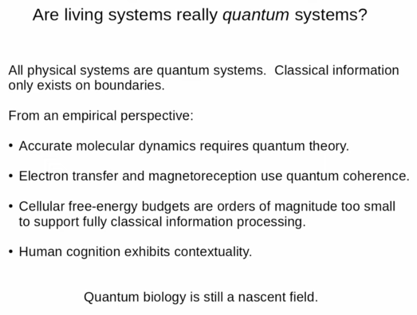

[[start:712680][end:724170]] Now, as soon as we put forward something like this, inevitably the question comes up, are living systems really quantum systems, or are they classical in some intrinsic sense?

12:05 [[start:725100][end:729260]] And this question is really an artifact of two things.
[[start:729330][end:739016]] One, the continuing association between quantum systems and microscopic systems, which is, of course, traditional.
[[start:739128][end:743564]] Quantum theory was developed to deal with microscopic phenomena.
[[start:743612][end:748524]] It was first tested as a theory of microscopic phenomena.
[[start:748652][end:757430]] And it's only in the past couple of decades that quantum theory is being applied to big things, to cosmology, for example.

12:38 [[start:758760][end:767156]] So there's a long tradition of association between quantum and microscopic.
[[start:767188][end:780396]] And living systems are mesoscopic, much bigger than atoms, bigger than molecules, and they're not nearly as big as cosmological systems, so they're somewhere in between.
[[start:780578][end:792256]] And those systems have traditionally been regarded as classical, and even chemistry, even biochemistry {is} are still taught in a very classical way.

13:12 [[start:792438][end:796480]] So we're not used to thinking of these things as quantum systems.
[[start:797060][end:813936]] But at least in the approach we've taken in this course, all physical systems are quantum systems, and classical information exists only on boundaries, only on boundaries between systems, and it only describes their interaction.

13:34 [[start:814128][end:825690]] And I want to emphasize, I've said it before, but since this is the last class, I want to say it again, that this is not a universally held view.

13:48 [[start:828880][end:832110]] It's a view that's becoming more common.

13:54 [[start:834560][end:840350]] And I think a generation from now it will probably be the dominant view of things.
[[start:841200][end:847232]] But it's not fair to say that it's the dominant view now.
[[start:847366][end:854820]] It's, I think, quite fair to say that it's a view on the rise, especially in the quantum information and quantum gravity communities.

14:15 [[start:855800][end:861350]] But from a strict empirical perspective, we know a number of things.
[[start:862040][end:868440]] We know that accurate molecular dynamics calculations require quantum theory.

14:29 [[start:869580][end:878680]] We know that a lot of biologically important molecular processes use quantum coherence.
[[start:879040][end:886060]] We know that things like hydrogen bonding can only be understood using quantum theory.
[[start:887520][end:896844]] We know that cellular free energy budgets are way too small to support fully classical information processing.
[[start:896892][end:913856]] If we think of information processing in terms of what proteins are doing or what other molecules are doing in terms of changing shape, we know that shape changes in proteins and other molecules underlie all cellular information processing.
[[start:914048][end:922840]] So if we think of them as actually implementing cellular information processing, we have way more information processing than could be funded classically.

15:23 [[start:923900][end:928276]] And finally, we know that **human cognition exhibits contextuality**.
[[start:928388][end:932152]] So human cognition uses quantum coherence.
[[start:932216][end:945292]] It's not a classical causal process in all cases, but this is still a very nascent field, and it's a field with a lot of potential.
[[start:945356][end:960470]] And I think again, a generation from now, quantum biology is going to be regarded as a very mainstream endeavor, even though it's something of a small emerging field now.
[[start:961400][end:966470]] And I'll just show you one picture in support of this third point.

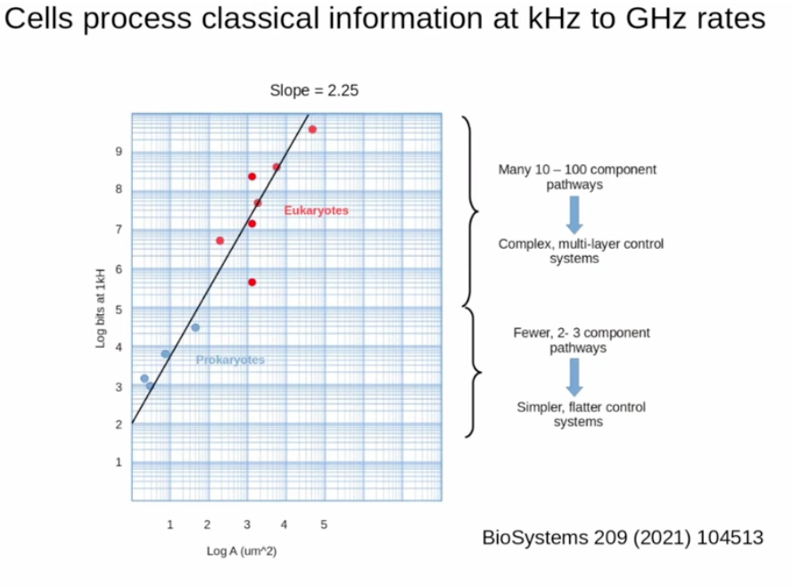

16:08 [[start:968700][end:985420]] This is a plot of measured free energy usage converted to numbers of bits processed at one kHz for a number of prokaryotic and eukaryotic cells.

16:25 [[start:985840][end:997250]] All that I could find a few years ago that had good calliometric measurements versus the log of their area, their membrane surface area.
[[start:998180][end:1008950]] And the thing to note here is that these cells are processing classical information at pretty low rates, KHz to gigahertz rates, for 1000 bits at a time.
[[start:1010280][end:1015430]] And we know that a lot more is happening in cells than that.
[[start:1015960][end:1021930]] Cells have many more than 1000 proteins, and those proteins are all moving all the time.

17:02 [[start:1022460][end:1035980]] And if that motion is processing information, then there's not nearly enough classical, **not nearly enough thermodynamic power to power all of that information processing**.

17:18 [[start:1038240][end:1048850]] So let's now talk a little bit about life and living systems and what they look like.

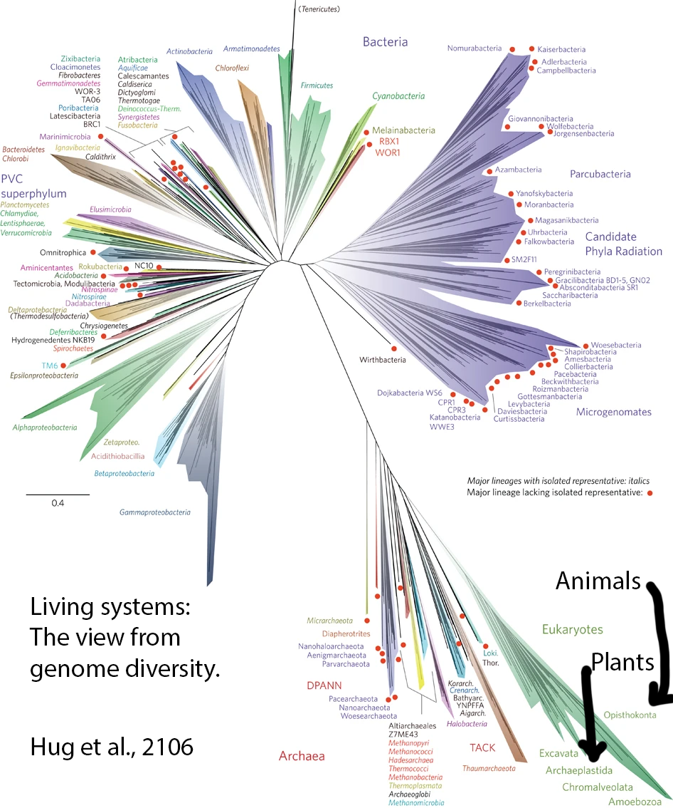

17:29 [[start:1049860][end:1054960]] Here's a view of living systems from the point of view of genome diversity.
[[start:1055040][end:1062020]] This is a few years old, so it's out of date by now, but it tells us a lot qualitatively.

17:44 [[start:1064120][end:1082168]] It tells us that almost all genome diversity is microbial, that the sorts of organisms that we're familiar with, medium sized organisms like us, animals and plants, have only a tiny amount of genome diversity.
[[start:1082264][end:1085432]] So we think of ourselves as pretty diverse.
[[start:1085496][end:1094624]] We think of ourselves as quite different from other animals, from flies or worms or sponges or something like that.
[[start:1094742][end:1098112]] But in fact, we're not all that different from them.
[[start:1098246][end:1101644]] We share many, many proteins with all of those other organisms.

18:21 [[start:1101692][end:1105380]] We share the same cellular organization and so forth.
[[start:1105800][end:1114980]] We're not, in fact, all that different from plants, and we're much more similar to the fungi than to the plants.

18:35 [[start:1115960][end:1125000]] So we get a very biased view of genome diversity when we just look at familiar, large types of living systems.
[[start:1125820][end:1130510]] Most genome diversity is buried down there in the microbial world.
[[start:1132240][end:1139608]] This isn't the only way we can look at life as a diverse set of organisms.

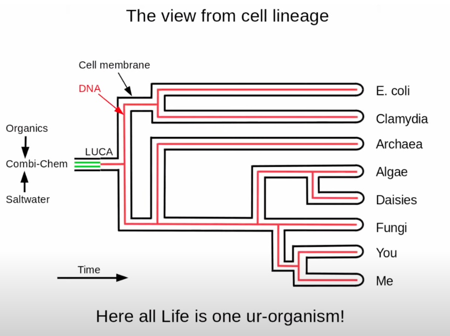

## Common Ancestry

18:59 [[start:1139784][end:1143440]] We can also look at it in terms of a cell lineage.
[[start:1144580][end:1157600]] The fact that we're all related at the DNA level tells us that we're all descendants of a common ancestor, which is usually called **LUCA**, the **last universal common ancestor**.
[[start:1158580][end:1167320]] And LUCA is generally modeled as being a cell, more or less like a bacterial cell.
[[start:1167390][end:1174484]] So fairly simple, with not very many pathways, with maybe a DNA genome.
[[start:1174612][end:1183500]] And if LUCA didn't have one, then they arose fairly shortly thereafter, because all organisms that we know of have DNA genomes.

19:44 [[start:1184640][end:1204820]] But the point of looking at life as a lineage is that we get a diagram that looks very much like the cell lineage from an embryological situation, much like the cell lineage of our own bodies growing from a fertilized egg.
[[start:1206040][end:1231100]] And in particular, looking at life as a lineage shows us that not only do we share DNA with all other organisms, we actually share a membrane cytoplasm that's continuous in time all the way back to Leuka, and so continuous in time between us and bacteria.
[[start:1232000][end:1248480]] So if you look at life this way, you realize that life is, in a sense, all one organism, all one connected structure that's developed over time through division, cell division.

20:49 [[start:1249140][end:1261732]] And so we are very closely related to all other parts of life in the same way that different cells in our bodies are closely related to each other.
[[start:1261866][end:1263332]] The time span is just longer.

21:03 [[start:1263386][end:1271400]] I mean, here the time span is three and a half or four billion years between us and LUCA.
[[start:1272540][end:1277524]] These lineages have been diverging for that long, but they're still continuous.
[[start:1277652][end:1283420]] And in particular, they form a continuous cell membrane.
[[start:1284320][end:1295250]] So when you think of life in this way, we realize that we are reasoning from just one example when we think about terrestrial life.
[[start:1295780][end:1310740]] And this strongly limits what we can say about living systems, what we can say about biology, that we really only have one example, the lineage that descends from LUCA here on Earth.

21:51 [[start:1311160][end:1313488]] And at some point, we may have more examples.
[[start:1313584][end:1326650]] And there's certainly groups working on artificial organisms that aren't part of this lineage, that are constructed from parts derived from this lineage, but aren't members of this lineage themselves.
[[start:1327660][end:1330270]] And that may tell us something new about life.

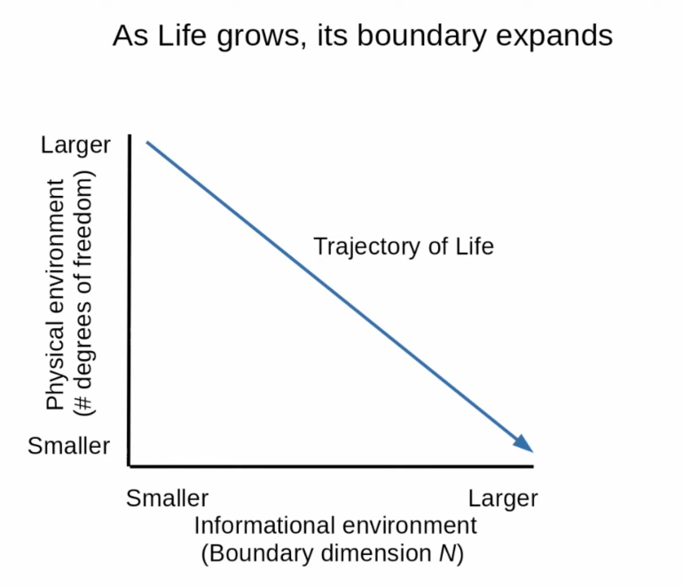

#Life Boundary

22:13 [[start:1333280][end:1346080]] But if we think of life this way, we see something very important, which is that as life grows, its boundary gets bigger.
[[start:1347700][end:1368440]] And since the boundary of a system constitutes its informational environment, its dimension getting bigger means that more information flows into it from its environment and more information flows out of it into its environment.
[[start:1369180][end:1380700]] So as life develops from LUCA, it gets a larger and larger informational environment, and this dimension of its boundary grows and grows.

23:01 [[start:1381200][end:1393680]] Now, what that means, if you go back to our original picture of two interacting systems, is that the dimensionality of the physical environment is decreasing.
[[start:1394980][end:1398688]] And we think of the physical environment as increasing in size.

23:18 [[start:1398774][end:1401248]] We have the expanding universe and all that.
[[start:1401414][end:1403970]] But what's increasing in size is space.
[[start:1405080][end:1413632]] And if space is emergent, then that increase is not a real increase in degrees of freedom.
[[start:1413776][end:1422490]] What we're really interested in is the Hilbert Space of the physical environment, as distinct from the Hilbert Space of life.
[[start:1423340][end:1430972]] And as life gets bigger, it literally, quite literally eats the physical environment and turns it into more life.

23:51 [[start:1431106][end:1433710]] So there's less physical environment around.
[[start:1434960][end:1441048]] So the trajectory of life is toward a bigger informational environment and a smaller physical environment.

24:01 [[start:1441224][end:1446556]] And as the physical environment gets smaller, you might imagine it gets easier to predict.
[[start:1446748][end:1455300]] And as the informational environment gets bigger, you have more information with which to predict the behavior of the physical environment.
[[start:1455960][end:1459780]] So this all hangs together very nicely with the free energy principle.

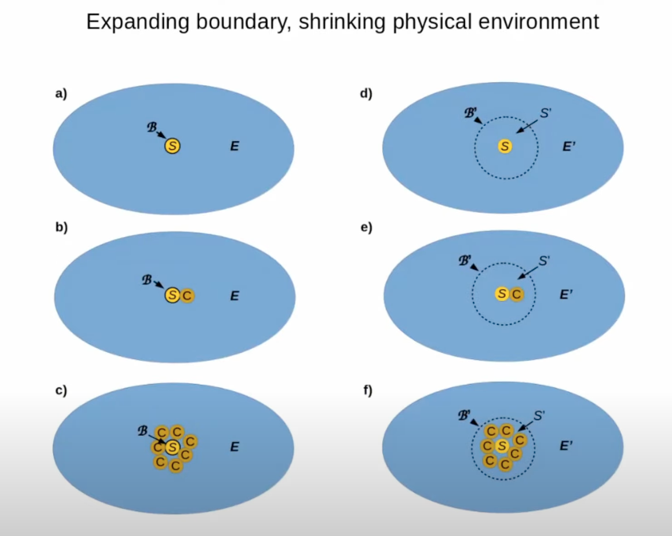

24:20 [[start:1460760][end:1463350]] Here's another picture of this same thing.
[[start:1464520][end:1474490]] If we start with some boundary here on the left labeled B, around some system labeled S, and it's embedded in an environment, E.
[[start:1475420][end:1495810]] Then as S makes copies of itself through some process like cell division, then it starts to fill up more of E, it's actually converting degrees of freedom of E into degrees of freedom of its copies that it's made of itself.
[[start:1496900][end:1504320]] And if we think of some larger boundary drawn somewhere in E, here on the right side, I've labeled that B prime.

25:05 [[start:1505080][end:1515140]] What happens is that B prime gets slowly filled up with copies of S, and it starts to look like a large organism.

25:16 [[start:1516200][end:1519428]] And that's what life is doing in the physical environment.
[[start:1519524][end:1527560]] It's making a bigger boundary for itself at the expense of degrees of freedom of its physical environment.
[[start:1528620][end:1531790]] So we can ask, what drives this process?
[[start:1532960][end:1534364]] Why is life doing this?
[[start:1534402][end:1536670]] Why is it making copies of itself?

25:37 [[start:1537840][end:1544850]] And the answer to that question, at least one answer to that question, is the free energy principle drives it to do this.

[[start:1545940][end:1556660]] And I'll just show you some simulations from several years ago of a cell population.
[[start:1557240][end:1571432]] In this upper left panel, the green cells are stem cells that divide, and they've been embedded in an environment that's safe on the left side and 100% lethal on the right side.

26:11 [[start:1571566][end:1580830]] So they're embedded in an environment that's conducive to life on one side and very dangerous as you get toward the middle.
[[start:1582240][end:1604056]] And the purpose of these simulations was to study what happens when the stem cells are able to divide and create not just other stem cells, but create specialized progeny that don't divide.

26:44 [[start:1604188][end:1617400]] So **somatic progeny** that don't divide and hence have free energy resources, thermodynamic resources, that they can devote to doing something other than dividing.
[[start:1618940][end:1622330]] Cell division is incredibly expensive when it comes to energy.
[[start:1622700][end:1636712]] So if you take that energy and apply it not to cell division, but to protecting the stem cells, you can allow the stem cell population to expand.

27:16 [[start:1636776][end:1639548]] And that's what these other simulations show.
[[start:1639634][end:1646240]] The blue cells are somatic cells that have {very} varying ability to protect the stem cells.

27:27 [[start:1647140][end:1664340]] And if they're fairly good at protection and they're fairly hard to kill, down in the right bottom quadrant, you can actually get a population expanding well into the highly lethal part of the environment.
[[start:1664920][end:1669560]] So this shows you the FEP in action.
[[start:1671500][end:1694428]] What the stem cells are doing is constructing a very predictable neighborhood around themselves in the environment by dividing to make progeny that don't themselves divide, that just sit there and help protect the stem cells.
[[start:1694524][end:1707940]] So the stem cells are now living in a safer, more predictable environment, and that allows them to invade more and more of their physical environment by having this fairly benign, informational environment.

28:28 [[start:1708520][end:1716340]] So this is the FEP in action driving the expansion of life at the expense of the physical environment.

## Scale Transition Mechanism

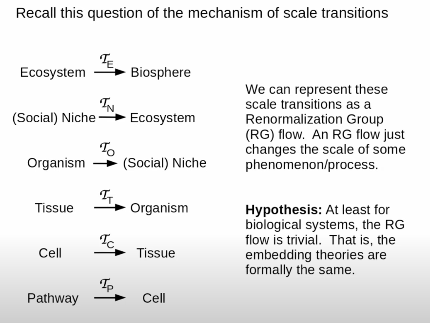

28:38 [[start:1718940][end:1732750]] So that lets us go back to this question that was raised last time about the mechanism of these **scale transitions** that we see ubiquitously in life.
[[start:1733680][end:1751248]] Life gets bigger and bigger as time goes on phytogenetically, and as time goes on developmentally, we start with some molecular pathways that somehow get assembled into a cell.
[[start:1751334][end:1754370]] That's the origin of life question, how does that happen?
[[start:1755640][end:1764980]] And about 2 billion years later, cells start to group together to make multicellular organisms.
[[start:1765560][end:1771800]] Now, bacteria group together to make facultative multicellular systems like microbial maps.

29:32 [[start:1772140][end:1775210]] 3 billion years ago, very, very early on.
[[start:1776140][end:1788030]] But we don't see the emergence of obligate multicellulars until much, much later, before the Cambrian explosion, but still less than a billion years ago.
[[start:1788960][end:1792290]] And from there, things get more complicated very quickly.
[[start:1792740][end:1798880]] So one has large multicellular organisms.
[[start:1799780][end:1813700]] They develop complicated social relations that probably first emerged with social insects, but are certainly well developed in invertebrates, including in mammals.

30:17 [[start:1817340][end:1824360]] Organisms group together in very complex ecosystems.
[[start:1825260][end:1835800]] And recall here that it's now known that **all multicellular organisms have obligate microbial symbiotes**.

30:35 [[start:1835880][end:1843788]] So all of our bodies are, in fact, very complex ecosystems populated by many, many different species of bacteria.
[[start:1843964][end:1850450]] And that's true not just for us, but for trees and insects and worms and sponges and everything else.
[[start:1851220][end:1862012]] So **organisms, from a body point of view, are themselves ecosystems**.

31:02 [[start:1862076][end:1873376]] And organisms organize themselves into ecosystems, and these ecosystems come into contact across the entire biosphere.
[[start:1873568][end:1884840]] So processes as simple as the wind disperse organisms as small as bacteria all over the planet.
[[start:1885980][end:1900030]] So this scaling of life toward larger and larger organizational structures is, in a sense, the major thing for biology to explain.

31:41 [[start:1901360][end:1923010]] And the hypothesis that we floated last time was that this transition from very small scales to very large scales uses the same mechanism over and over again, or a mechanism that has the same structure over and over again.
[[start:1923940][end:1928156]] So the renormalization group is trivial.

32:08 [[start:1928268][end:1935130]] Basically, it's just the identity operating at different scales or mapping from one scale to the next.
[[start:1935980][end:1939770]] So the question is, can we approach this in any way?
[[start:1940220][end:1941770]] Does this make sense

[[start:1943280][end:1958160]] And to try to make sense of it, we can go to the one developed theory that we have in biology, which has been formulated by Dawkins and others as universal Darwinism.
[[start:1959380][end:1968480]] This is just kind of an abstraction of the modern synthesis between Darwinian evolution and genetics.

## Universal Darwinism

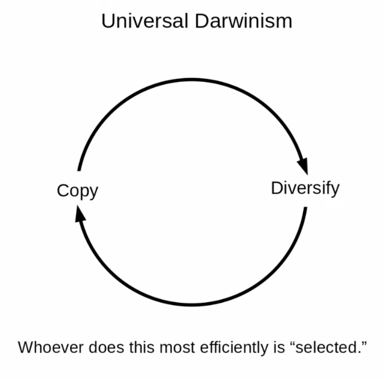

32:49 [[start:1969720][end:1974948]] But universal Darwinism is incredibly simple and very obvious.
[[start:1975034][end:1981480]] It says if you have systems and they can copy each other, they can copy themselves, and the copies can diversify.
[[start:1982380][end:2004140]] Then if you want to know what's going to happen at the population level, what you will find is the systems that copy themselves and diversify most efficiently will win because there'll be more of them, so they end up dominating the population, and winning gets called natural selection.
[[start:2004480][end:2010112]] But natural selection is not an extra part of the Darwinian process.
[[start:2010246][end:2022100]] It's just the outcome of efficiency of the systems that copy themselves most efficiently, coming to dominate any population.

33:43 [[start:2023000][end:2032040]] So there's no sort of kind of hand of god or whatever, reaching down and selecting some organisms and not others.

33:52 [[start:2032110][end:2052030]] And of course, when Darwin put the idea of natural selection together, he was thinking very explicitly of the analogy of a gardener or a farmer selecting the crops or the animals or whatever that the gardener liked best, and keeping those.
[[start:2052400][end:2055084]] And that's where this selection metaphor comes from.
[[start:2055122][end:2061484]] But there's no real process of selection in evolution by natural selection.
[[start:2061532][end:2064000]] It's just copying and diversifying.

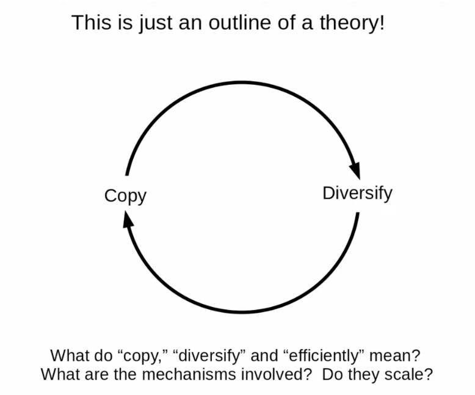

34:25 [[start:2065140][end:2082410]] But this clearly is just the outline of what a real mechanistic theory would be, because we need to have a story about what copying is and what diversifying is and what efficiently means.

34:44 [[start:2084620][end:2101260]] And in particular, to address the question that we raised a couple of slides ago, we need to know whether these mechanisms are the same, or at least isomorphic, of the same form at different scales.

35:02 [[start:2102080][end:2107810]] So that's what I want to talk about for the next little bit.

## Copying

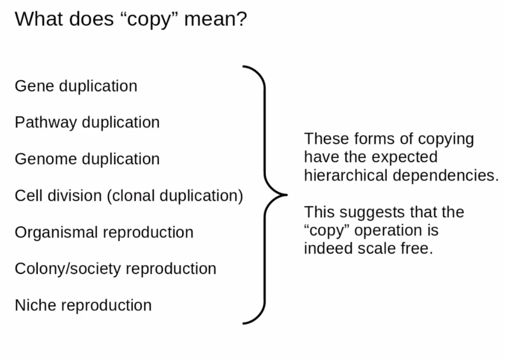

35:11 [[start:2111000][end:2112980]] Let's start with copying.

35:19 [[start:2119540][end:2131296]] Up until the 70s, copying in biology really meant DNA replication and, to some extent, cell division.
[[start:2131488][end:2135560]] But the focus in evolutionary theory was on DNA replication.
[[start:2136700][end:2147020]] And in the 70s, it was realized that whole genes could be duplicated, so whole genes could be copied.
[[start:2148480][end:2169680]] And then shortly after that, it was realized that particularly in prokaryotes, where genes - functionally related genes are next to each other in chromosomes - often in what are called operons, that operons could be duplicated and so entire pathways could be duplicated.

36:10 [[start:2170740][end:2179780]] And as genomes began to be sequenced and structures of genomes were understood, it became clear that genomes could be copied.

36:20 [[start:2180600][end:2191960]] And of course, we have two copies in each of our cells, with the exception of red blood cells of our complete genome.
[[start:2192620][end:2199260]] But some plants, for example, have six or eight or even more copies of their genome in each of their cells.
[[start:2199600][end:2203260]] So there's large scale genome duplication.
[[start:2204480][end:2208056]] Cell division is clonal duplication of cells.
[[start:2208248][end:2213324]] Organismal reproduction works by cell division.

36:53 [[start:2213452][end:2239960]] In all known systems, colonies or societies of organisms reproduce themselves, in part through cultural transmission, and entire niches reproduce themselves, for example, in processes like forest evolution, or desertification, or even urbanizaTion.

37:21 [[start:2241100][end:2247470]] We see humans reproducing the same sorts of niches in city after city, for example.
[[start:2248800][end:2257612]] So these forms of copying have the kind of hierarchical dependencies that one might expect.
[[start:2257746][end:2261120]] So to duplicate pathways, you have to duplicate genes.
[[start:2262260][end:2265840]] To duplicate cells, you have to duplicate the genome.

37:46 [[start:2266340][end:2269760]] To duplicate organisms, you have to duplicate cells.
[[start:2270660][end:2284970]] And this suggests that this copying operation is indeed scale free, that the copying operation at each level enables the copying operation at the next level.

## Diversification

[[start:2286780][end:2303580]] Now, with diversification, we see much the same thing in the early days of the modern synthesis and still in the work of people like Richard Dawkins.

38:24 [[start:2304240][end:2308460]] Diversification is generally thought of as random.
[[start:2308820][end:2312320]] So mutation, for example, is thought of as random.

38:33 [[start:2313460][end:2350590]] And here I have **Barbara McClintock**, who is kind of the hero of non randomness in doggedly over decades, pointing out that **much of genome diversification is not random at all**, and that genomes actively diversify by moving whole clusters of genes around and duplicating them, or just changing their positions so that they're under the influence of different local control.
[[start:2352400][end:2362772]] So at the gene and genome level, you have active diversification by various processes, enzymatic processes.
[[start:2362936][end:2368076]] As McClintock showed us, transposon mediated mechanisms, which are enzymatic at the bottom.

39:28 [[start:2368268][end:2376180]] Cells actively diversify by lots of different mechanisms.
[[start:2376680][end:2393144]] And in the 70s, **Carl Woes** was in part large, personally responsible for pointing out that in the microbial world there's a lot of horizontal gene transfer.

39:53 [[start:2393262][end:2397100]] And again, no one believed him for quite a while.
[[start:2397250][end:2408140]] But now it's broadly accepted that **microbes exchange DNA very frequently** and across large distances phylogenetically.
[[start:2408900][end:2419410]] And this is how things like microbial resistance to antibiotics spread so quickly, or one way that it spreads so quickly.
[[start:2420340][end:2430390]] And it's a tremendous agent of essentially speciation to the extent that that even makes any sense in the microbial world.

40:31 [[start:2431880][end:2436200]] Of course, in our cells we have functional differentiation.

40:39 [[start:2439180][end:2449820]] As mentioned earlier, there are lots of symbiotic interactions that lead to diversification in cells by radically altering their local environments.
[[start:2450480][end:2453900]] And of course, sex is a mechanism for diversification.

40:56 [[start:2456240][end:2459520]] Organisms actively diversify in many different ways.
[[start:2459590][end:2478500]] The most obvious one is just by moving around, by moving to a different environment, the organism is exposed to different inputs and is allowed different outputs, and so it can move into a different direction, morphologically, genetically, et cetera.
[[start:2479320][end:2488680]] Organisms can regulate their own evolvability by altering things like DNA repair systems or activating transposons.
[[start:2489980][end:2499660]] Again, these are sorts of things that went very much against the grain when they were first discovered, but are now pretty well accepted.

41:40 [[start:2500080][end:2508460]] And of course, organisms can learn and so can diversify their behavior by diversifying their computational capabilities.

41:49 [[start:2509620][end:2514930]] And social groups, of course, actively diversify in many different ways.
[[start:2515780][end:2534440]] And organisms are increasingly, non human organisms are increasingly regarded as having cultures that they pass on intergenerationally by intergenerational learning and can exchange with other groups.
[[start:2535340][end:2541560]] So diversification is active and occurs at every scale.
[[start:2542380][end:2549260]] And, again, diversity, although this is a bit less clear than in the case of copying,
[[start:2550240][end:2556780]] diversification mechanisms at one scale enable diversification mechanisms at other scales,

42:38 [[start:2558740][end:2569680]] so, for example, transpose, unmediated mechanisms enable horizontal gene transfer in microorganisms.

## FEP: Efficiency due to Intelligence

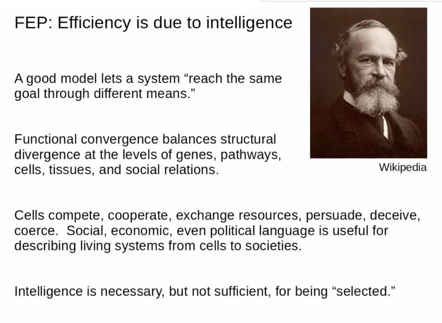

42:53 [[start:2573990][end:2589270]] And the FEP tells us that efficiency is actually about intelligence, because the FEP drives systems to build good models of their environments or the behavior of their environments.
[[start:2589930][end:2606330]] And what a good model lets a system do is reach a single goal by many different means, because it allows, in a sense, planning, and it allows flexibility and adaptability.
[[start:2606910][end:2618590]] And I put **William James** here on this slide because he was the first, as far as I know, to define **intelligence** as this **ability to use different means to reach the same goal**.
[[start:2619570][end:2648470]] Now, in evolution, that's long been known, and it's called **convergent evolution**, when you see two lineages adapting to a single environment with very different genetics and very different morphologies, and often the organisms will end up with similar morphologies that work well in that environment, but very different genetics and very different biochemistry.

44:09 [[start:2649230][end:2659094]] So throughout evolution, we see this phenomenon of functional convergence, balancing structural divergence at many, many different levels.

44:19 [[start:2659142][end:2664030]] So we have multiple genes for very similar proteins.
[[start:2664610][end:2668880]] We have multiple pathways that do more or less the same thing.
[[start:2670050][end:2675970]] We have different cell types that support the same basic functions.
[[start:2676950][end:2689570]] We have tissues that are fairly different, but that have the same functions, for example, eyes and different kinds of organisms that allow vision, but have very different structure.
[[start:2689730][end:2693160]] And, of course, we have functional convergence and social relations.

## Life's Social Nature

44:54 [[start:2694250][end:2702410]] And if we look at how cells interact, traditional evolutionary theory really focuses on competition.
[[start:2703310][end:2722880]] But we now know that cells cooperate, that they exchange resources in various ways, even across vast differences in phylogeny, for example, the interchange between plants and fungi, or between bacteria and us.

45:24 [[start:2724630][end:2734180]] We know that cells, in a sense, persuade each other by secreting things like hormones, that cause other cells to do different things.

45:36 [[start:2736490][end:2746150]] Cells deceive each other, for example, microbes that are trying to escape the immune system, and cells coerce each other.
[[start:2746220][end:2751690]] Cells even kill each other when they detect, for example, genetic defects.
[[start:2752750][end:2765390]] So these sorts of social and economic and even political ideas are useful for describing living systems from the level of cells on up.
[[start:2765540][end:2773950]] They were developed in social settings to describe what goes on in human societies and then extended to other animals.
[[start:2774550][end:2779966]] And now it's very clear that they extend to individual cells.

46:20 [[start:2780158][end:2783570]] So when we think about **social intelligence**.
[[start:2784150][end:2788950]] We can think about social intelligence even at the level of individual cells.

46:29 [[start:2789450][end:2798274]] And we see these sorts of competition, cooperation, resource exchange, et cetera, even at the level of microbial mats.
[[start:2798322][end:2802060]] So, biological structures that are 3 billion years old.
[[start:2803710][end:2808374]] Now, of course, intelligence is necessary, but it's not sufficient for being selected.

46:48 [[start:2808422][end:2819322]] It won't protect you from impacts of asteroids that happen to land on your planet, which has happened often in the evolution of the Earth.
[[start:2819386][end:2824820]] And we're now trying to figure out how to predict and prevent such things.
[[start:2825830][end:2830500]] But who knows whether we'll be successful at that?
[[start:2831750][end:2840614]] But this intelligence is necessary when it's viewed in this FEP sort of way.
[[start:2840732][end:2847910]] Intelligence is what lets you build models that enable you to predict the environment.

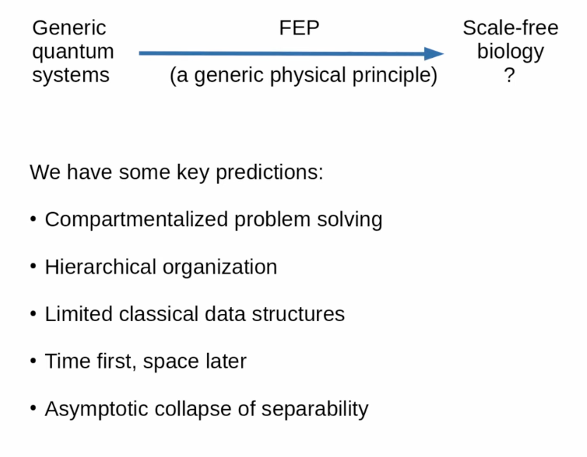

47:29 [[start:2849470][end:2851500]] So where does this leave us?

47:34 [[start:2854350][end:2878770]] By thinking of evolutionary theory in terms of scale-free mechanisms, we seem to have a picture in which we start with quantum systems with a certain level of complexity, and the FEP actually gives us scale-free biology, or something very close to scale-free biology.
[[start:2880310][end:2884878]] And that's very interesting, because the FEP, of course, is a generic principle.
[[start:2884974][end:2889190]] It just says that systems do what they need to do to keep existing.
[[start:2891050][end:2894390]] And this way of thinking gives us some predictions.
[[start:2895770][end:2903930]] One is that we'll find compartmentalized problem solving everywhere, because the FEP drives compartmentalization.

48:24 [[start:2904350][end:2909930]] And the reason is just non-commutativity of measurement processes.

48:30 [[start:2910830][end:2925954]] It predicts that we'll see hierarchical organization everywhere, in the same way we did on that first compartmentalization slide, where once you have a number of compartments, you need a metacompartment that, if nothing else, distributes free energy.
[[start:2926072][end:2928866]] So some sort of very basic attention system.
[[start:2929048][end:2933170]] And we see attention systems, of course, throughout biology.

48:55 [[start:2935270][end:2941510]] It predicts that living systems will have very limited classical data structures.
[[start:2942010][end:2971600]] So since they have to write classical data on their boundaries, and their boundaries are much smaller than they are, and because writing classical data is expensive, the living systems will tend to use as little classical data as they can get away with, since classical data is needed for **thermodynamic irreversibility**, where we see thermodynamic irreversibility, that's where we look for classical data.

49:32 [[start:2972610][end:2978658]] We saw that organisms will be able to detect time first before they can detect space.
[[start:2978824][end:2988486]] So we can expect organisms to have clocks even before they can represent space.
[[start:2988668][end:2992790]] And, of course, we see things like diurnal variation throughout biology.

49:53 [[start:2993850][end:3001370]] And finally, the FEP predicts this asymptotic collapse of separability back to entanglement.
[[start:3001710][end:3010070]] So it predicts that living systems will eventually degrade and become indistinguishable from their environments.
[[start:3010230][end:3014720]] And we know that happens at the cell level and the individual organism level.
[[start:3015970][end:3017390]] We call it death.
[[start:3018690][end:3033410]] So the FEP seems to give us a lot of the features of biology, and it gives us these features in a scale free way, and it derives them from this very basic physics.

## Challenge to Evolve QIT 

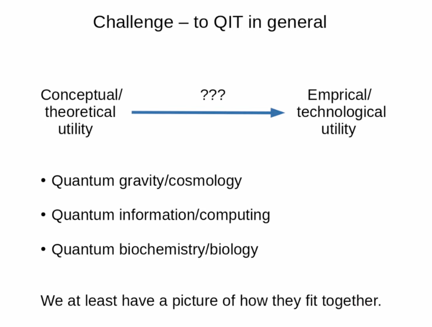

50:35 [[start:3035430][end:3037400]] So where does that leave us?
[[start:3038170][end:3052940]] I think it leaves us here with a challenge not just to thinking about the FEP, which is what this course has been about, but to quantum information theory in general.

50:55 [[start:3055150][end:3077730]] And that challenge is to evolve from the kind of contextuality and theoretical utility that we've been discussing in this course, and which is very well developed in the physics community, to some sorts of empirical and technological utility.
[[start:3079030][end:3087330]] And I've listed three areas here where QIT is very active, one in quantum gravity and cosmology.
[[start:3087930][end:3098390]] And you're probably familiar with things like string theory that sort of fairly famously seem not to be empirically testable.

51:39 [[start:3099310][end:3106620]] And the quantum gravity community is enormous, many thousands of people working in this area.
[[start:3107070][end:3120400]] But coming up with theories that can be tested empirically at the scales that we can actually do experiments, so at accessible energy scales, for example, has proved to be very difficult.

52:01 [[start:3121970][end:3132770]] So this is a real challenge to the field, is somehow getting not just to empirical testability, but to some sort of technological utility.
[[start:3133510][end:3135474]] And you can imagine that if the
[[start:3135512][end:3152810]] main prediction of quantum gravity is that spacetime is emergent, that there could be enormous utility in that some ability to manipulate the way spacetime emerges.
[[start:3153870][end:3157798]] The second area, of course, is quantum information and computing.
[[start:3157974][end:3164670]] And here massive resources are being put into technological utility.

52:45 [[start:3165250][end:3172000]] And I think it's reasonable to expect that we'll have useful quantum computers within a generation, at any rate.
[[start:3173170][end:3178020]] So there, I think the field is going quite well.
[[start:3178390][end:3183486]] And the last area, what we've talked about here, is quantum biochemistry and biology.
[[start:3183678][end:3201370]] And this, I think, is an area with enormous practice promise that maybe some of you will actually contribute to making this area more useful technologically and more accessible empirically.
[[start:3202030][end:3206060]] But at least we have a picture of how these different areas fit together.

53:27 [[start:3207470][end:3209354]] So that's it.
[[start:3209472][end:3212400]] Thank you very much for participating in this class.
[[start:3213570][end:3236182]] Andrew will be doing (unintelligable)

53:56 _Daniel:_
[[start:3236356][end:3239574]] Sorry, could you just repeat the last, like 30 seconds from.
[[start:3239612][end:3243430]] Andrew will be Chris.

54:10 _Chris:_
[[start:3250320][end:3251470]] (unintelligable).
[[start:3252080][end:3258464]] Andrew will be discussion session on Saturday, the 20 October at the usual time, 08:00 a.m.
[[start:3258502][end:3259616]] Pacific time.
[[start:3259798][end:3262048]] And the interactive Q and A is open.
[[start:3262134][end:3263740]] I really appreciate your questions.

54:23 [[start:3263830][end:3267172]] I try to answer them, and.
[[start:3267226][end:3268390]] Thank you very much.

54:29 _Daniel:_
[[start:3269400][end:3269956]] Awesome.
[[start:3270058][end:3272550]] Can I ask a question, or do you want to call it here?

54:34 _Chris:_
[[start:3274200][end:3275364]] Sure, go ahead.

54:35 _Daniel:_
[[start:3275482][end:3284760]] All right, Inks wrote, Chris spoke last time introducing the mechanisms of scale transition.

54:47 [[start:3287180][end:3290040]] I'll read your question, then I'll fix the cropping on the live stream.
[[start:3290200][end:3299656]] Chris spoke last time introducing the mechanisms of scale transition of these essentially semantic theories about how one scale embeds in another scale.
[[start:3299848][end:3306572]] I would love to learn more about this, especially in terms of natural language semantics and human cognition
[[start:3306636][end:3308610]] semantics versus machine learning.

55:11 _Chris:_
[[start:3311490][end:3312190]] Wow.
[[start:3312340][end:3314640]] Well, that's a very good question.
[[start:3315810][end:3348490]] Um, I think that's a very relevant question, given the sorts of machine learning that we see deployed in systems like chat GPT, and especially as these systems start to associate language with images, for example, and as such systems are embedded in robotic systems that can actually move around in the world and interact with real objects.

55:50 [[start:3350590][end:3357710]] I think one of the key questions in natural language semantics is, to what extent does it depend on reference?
[[start:3358770][end:3381910]] To what extent do the meanings we attach to words or the usages that we allow for words depend on our ability to connect words to external objects?

56:22 [[start:3382570][end:3390940]] And to what extent do those abilities rely on connections between words themselves?
[[start:3391870][end:3408750]] So if you think of an LLM like ChatGPT, by itself, it's just a statistical model of relationships between words, as used in some corpus of text, which is large, of course, but we can debate its representativeness.
[[start:3410450][end:3417374]] And so that's a model of semantics that's entirely self contained.

56:57 [[start:3417422][end:3422450]] It's entirely relations between different pieces of language.
[[start:3423110][end:3442330]] Whereas when we start to connect those words, statistics, to images, or better yet, to actual objects that are interacted with not just visually, but haptically, for example, by a robot, they start to be connected to external reference.

57:23 [[start:3443390][end:3449660]] And that transition, I think, is going to be very, very interesting to watch.
[[start:3450510][end:3452220]] And it's just starting.
[[start:3452770][end:3459710]] So we all have ringside seats on an incredible experiment in semantics.

57:41 [[start:3461730][end:3485240]] And so that would be my response, really, to that question, is, keep your eyes on this experiment and see how it goes, because it's bound to tell us something about how semantics really works.
[[start:3486170][end:3498860]] And I suspect that there will be enormous opportunity to start relating the results of that experiment to what we see in developmental psychology, for example.

58:20 _Daniel:_
[[start:3500430][end:3501130]] Wow.
[[start:3501280][end:3501980]] Awesome.
[[start:3502450][end:3512990]] All right, Tucker asks areas of macroscopic quantum mediated phenomena in biology that get Chris Fields excited.

58:41 _Chris:_
[[start:3521030][end:3542890]] I think the one that excites me the most right now is just this question of how cells are managing to do the information processing that they're doing and how much of it they can accomplish.

59:06 [[start:3546110][end:3551580]] I think the right way to put it is how can they get away with so little classical information?
[[start:3553250][end:3559440]] And I don't think we have the cell biology yet to answer that question.
[[start:3560610][end:3568420]] But I think asking the question may help us design the right kinds of cell biology to look for an answer.
[[start:3569270][end:3586390]] And our cell biology has been organized around the idea that the structures that we see are essentially static, that they're classical, and that they're constructed in a way that's thermodynamically irreversible.

59:47 [[start:3587290][end:3602874]] But if we think of what we measure as not necessarily reflecting a static structure, I think we'll start to conceptualize it differently and build models of it differently.

1:00:02 [[start:3602922][end:3610990]] I mean, clearly, when we look at things like protein structure, we're looking at snapshots of something that's very dynamic.
[[start:3612130][end:3621902]] And when we look in a chemistry textbook and we see pictures of this confirmation that changes to that confirmation.
[[start:3622046][end:3635000]] We think of those as static, stable structures, that that's kind of a switch, but it's not actually a switch the way a light switch is.
[[start:3635450][end:3637640]] It's a much more dynamic process.
[[start:3638570][end:3654350]] And the kinds of molecular dynamic simulations that allow you to study that process are incredibly complicated and time expensive and uncertain due to resolution problems and other things.

1:00:54 [[start:3654420][end:3668980]] But I think thinking of these as kind of fluid, reversible processes is going to change the way we think about them.

1:01:10 _Daniel:_
[[start:3670630][end:3672260]] That's a great point.
[[start:3672630][end:3684486]] And it reminds me of the more physics based way of thinking about the paths that could happen between observations or the statistics based way of samples of a dynamical process.
[[start:3684588][end:3693286]] And in biology, we know that even if we take a snapshot, okay, this organism is 1, it's 2 cm tomorrow, something changed.
[[start:3693318][end:3700262]] So we know there was a developmental process, then we know there's an ecological process, and then there's an evolutionary context.

1:01:40 [[start:3700326][end:3701930]] Eco Evo Devo.
[[start:3702370][end:3711150]] And then from that, more biological understanding of contextual developing organisms.
[[start:3711730][end:3732230]] All of these different biological phenomena actually help us expand our space of measurement and analysis for material that on one hand, some people may have called inanimate, but then they have their own dynamics, different timescales.

1:02:13 [[start:3733210][end:3758830]] And so bringing some of those, like the challenges of measuring and observing, intervening in historical and biological things, gives us a bigger understanding, even on measuring and summarizing, analyzing ensembles or scales that don't immediately appear to have that kind of historiosity, like pieces of silicon or carbon.

1:02:41 _Chris:_
[[start:3761090][end:3763822]] Yeah, that's well put.
[[start:3763956][end:3769102]] And I think we have the same problem as we go up in scale.
[[start:3769166][end:3779240]] Also, we tend not to think of things like societies as living systems, but in one sense, they clearly are.
[[start:3780090][end:3791382]] And to the extent that we can think of these structures that are much larger than we are individually as living systems, cognitive systems, et cetera.
[[start:3791446][end:3793900]] I think we'll understand their dynamics better.

1:03:15 _Daniel:_
[[start:3795150][end:3796666]] Okay, final question.
[[start:3796848][end:3811680]] Upcycle Club wrote, how can a quantum system detect and respond to quantum context shifts (switches), which are changes in the measurement basis or the entanglement structure of the system.

1:03:34 _Chris:_
[[start:3814050][end:3814910]] Mmm.

1:03:39 [[start:3819760][end:3826040]] Well, the answer here is simple and not very informative.
[[start:3826120][end:3845940]] It's by making measurements, which is all that quantum systems can actually do, and making measurements that follow probing actions that try to push the boundaries of the model of a context.

1:04:11 [[start:3851240][end:3863992]] When having this discussion, I always like to go back to the frame problem in artificial intelligence, which is the problem formulated in the late 60s,
[[start:3864046][end:3869900]] of predicting what won't change is the result of an action.
[[start:3870400][end:3874300]] So it's sort of the inverse of the problem of predicting the side effects.

1:04:35 [[start:3875120][end:3879712]] And if you could predict all of the side effects, you can predict what doesn't change.
[[start:3879766][end:3883420]] So it's equivalent to the question of predicting all the side effects.

1:04:43 [[start:3883580][end:3894630]] And context change is a side effect, and it's often an unobserved and maybe unobservable side effect.
[[start:3895320][end:3915050]] But if you have a model that says, I'm working in this context, then you can intentionally probe the boundaries of that model and see if you can actually alter the context you're in as a way of discovering what context you're in.
[[start:3915420][end:3919550]] And humans do that in social settings all the time.

1:05:22 [[start:3922080][end:3931692]] But I think this is something that we need to think about happening at many different scales.
[[start:3931836][end:3934930]] I suspect that cells are doing this all the time.

1:05:35 [[start:3935540][end:3937170]] We just don't know how.

1:05:41 _Daniel:_
[[start:3941210][end:3942742]] There's so much to say there.
[[start:3942796][end:3952380]] It just makes me think of the paradox or the tension between expecting the expected, expecting the unexpected, and life needing to expect both of that.

1:05:53 _Chris:_
[[start:3953070][end:3953820]] Right.

1:05:54 _Daniel:_
[[start:3954830][end:3956422]] So thank you, Chris.
[[start:3956486][end:3958054]] It's been an amazing lecture series.

1:05:58 [[start:3958102][end:3971490]] Many people in the live chat are very appreciative, and we'll look forward to their submitted questions and their participation in the final discussion coming soon.
[[start:3971640][end:3972846]] So thank you, Chris.

1:06:12 _Chris:_
[[start:3972958][end:3974258]] Till next time, okay?
[[start:3974344][end:3975394]] And thank you all.

1:06:15 _Daniel:_
[[start:3975512][end:3975854]] Bye.

1:06:16 _Chris:_
1:06:15 [[start:3975902][end:3976110]] Ciao.
