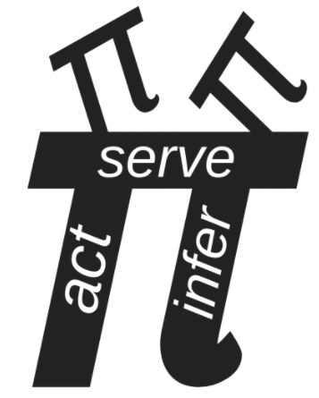

---
title:  'Physics as Information Processing'
author: 
  - name: Chris Fields[{ width=12px }](https://orcid.org/0000-0002-4812-0744)
    institute: [allen]
  - name: Ander Aguirre[{ width=12px }](https://orcid.org/0000-0002-6337-8292)
    institute: [ohio]
  - name: Daniel Friedman[{ width=12px }](https://orcid.org/0000-0001-6232-9096)
    institute: [aii, ucdavis]
  - name: Francesco Balzan
  - name: Ross Berger
  - name: David Draguta[{ width=12px }](https://orcid.org/0009-0005-3179-9286)
    institute: [independent]
  - name: Avel Guénin-Carlut[{ width=12px }](https://orcid.org/0000-0001-8239-7264)
    institute: [sussex, kairos, aii]
  - name: Ana Magdelena Hurtado[{ width=12px }](https://orcid.org/0000-0003-4064-1876)
    institute: [asu]
  - name: V. Bleu Knight[{ width=12px }](https://orcid.org/0000-0002-9894-1989)
    institute: [aii]
  - name: Kate Koles
  - name: Haris Neophytou[{ width=12px }](https://orcid.org/0009-0003-0921-737X)
    institute: [interfusion, upcycle]
  - name: Corby Prior
  - name: Dean Rickles[{ width=12px }](https://orcid.org/0000-0003-2213-0773)
    institute: [professional, aii]
  - name: Ian Tennant[{ width=12px }](https://orcid.org/0009-0003-2185-8620)
    institute: [anglia]
  - name: Alexey Tolchinsky, Psy.D.[{ width=12px }](https://orcid.org/0009-0009-4721-515X)
    institute: [gwu]
institute:
  - allen: Allen Discovery Center at Tufts University
  - ohio: Ohio State University
  - aii: Active Inference Institute
  - ucdavis: University of California, Davis
  - independent: Independent
  - sussex: University of Sussex
  - kairos: Kairos Research
  - asu: Arizona State University
  - interfusion: Interfusion Services
  - upcycle: UpCycleClub
  - professional: Professional Initiatives Programming
  - anglia: Anglia Ruskin University
  - gwu: The George Washington University
date: "2023-05-18 Version 1.0"
output:
  pdf_document:
    pandoc_args: 
      - --lua-filter=images/scholarly-metadata.lua
      - --lua-filter=images/author-info-blocks.lua
    latex_engine: xelatex

geometry:
  - left=2.5cm
  - top=2cm
  - right=2.5cm
  - bottom=2cm
pagestyle: headings

# xeLaTeX
mainfont: Arial

header-includes:
    - \usepackage{xpatch}
    - \xapptocmd{\tableofcontents}{\vspace{2em}}{}{}
...
\newpage
```{=latex}
\setcounter{tocdepth}{1}
\tableofcontents
```

\newpage

# Lecture 1, "Historical Perspective"


## Introduction

_Daniel:_
 Hello and welcome, everyone, to the Active Inference Institute.
 This is Session 1 of the course "Physics as Information Processing" with Chris Fields.
 First we'll have Ander Aguirre and Chris Fields
 introduce themselves.

 And then we'll carry on with the first lecture,
 here.
 Check out the video description for a link to the [Course Overview website](https://coda.io/@active-inference-institute/fields-physics-2023), where you can ask questions that will be answered asynchronously; register to participate in the discussions, which happen about two weeks after each of the six lecture sessions; and just learn more about this area.
 So thank you both so much for joining into this adventure
 we are starting now.

 And first, please, Ander Aguirre, introduce yourself.
 And then Chris' introduction and lecture.
 Thank you.

_Ander:_
 Hello!
 So I'll be the course assistant.

 And I'm a postdoc in math, specializing in probability. And I have a deep interest in the physics of information.
 And I've been familiar with Chris's papers for a while.
 So, yeah, just here to learn myself!

_Chris:_
 Thank you, Ander.
 And thank you, Daniel.
 I'm Chris Fields. And I'll be presenting this course in six sessions, and Ander will be organizing discussion sessions after each of those.
 And all of this is explained on the course website.
 So let's start!

## Historical Perspective: Physics

 This is a course on "Physics as Information Processing," and this first session will be a historical perspective on the idea that physics is, or is about, information processing.


 And I'll just start with a few quotations that span the middle of the 20th century - from **[Ludwig] Wittgenstein** in the 1920s saying "The world is all that is the case,"
 so, defining the world in terms of facts, not objects;

 **[Rolf] Landauer** in the early '60s, proclaiming that "Information is Physical;"
 and then **John Archibald Wheeler**, who in many ways is the grandfather of this era recently, stating it is "It from Bit,"

 so things come from information, i.e. bitstrings.
 And if nothing else, this shows that formulations of this idea get pithier as the 20th century rolls on!


 But the history goes back farther clearly than the 20th century.
 But I'm only going to really talk about a piece of it and the timeline that I'll actually discuss today,
 the most relevant history of this idea, goes back to the mid-19th Century.

### Clausius

 And the first specific thing I'll talk about is **[Rudolf] Clausius**'s definition of entropy.

 But with the beginning of the understanding of thermodynamics and the role of information in thermodynamics, you get this very interesting multidisciplinary progression of ideas that incorporates the beginning of quantum theory.

 And the beginning of **quantum theory** can kind of be dated to the [fifth]{first} **Solvay conference** in [1927]{1928}, and the famous debate between **[Nils] Bohr** and **[Albert] Einstein** over whether quantum theory is about knowledge, information - or [about] objects, things.
 But it incorporates a lot of work in computer science and logic and mathematics.
 So, interestingly, computer science was born effectively in the mid-30s with the work of **[Alonzo] Church** and **[Alan] Turing**, which very rapidly converged with the work in physics.

### Physics, Computation, Information

 So today we'll be talking about both computer science and physics.
 And then in the second half of the 20th Century, this just exploded into a huge area.

 And in consequence of that mid-20th Century development, we're beginning to see a new idea about physics which is roughly encapsulated in quantum information theory.


 And the new idea is this.
 It's that what physics is actually about is information transfer across **boundaries** and the information... We can represent
 the information transfer like this.
 And this is a convention I'll use.

 A **boundary** is always a blue ellipse.
 And the agents that are exchanging information across this boundary are conventionally called Alice and Bob, which is just a more polite way of saying A and B.

 And when you think about this picture, it becomes clear that what physics is really about is communication.
 And this is a wild redescription of the idea of what physics is, compared to the ideas of Newton or LaPlace or even the 19th century ideas.
 And it's very different from the idea that's been preserved in 20th Century physics in the lineage of Einstein and others who viewed **classical physics** as, in a sense, either as completely fundamental or as a fundamental adjunct to quantum theory.

 So this way of thinking about physics is a very deeply quantum-theoretic way of thinking about physics.

## Course Outline


 And where we're going in this course today is really "how did this all happen?"
 It's the origin story.
 And then in the next session, I want to discuss quantum information theory explicitly. And in particular, how quantum theory makes this conclusion that physics is about communication very simple and obvious, much more obvious than it is in classical physics where it takes _work_ to formulate this idea.
 Then in the next session, we're going to talk about **semantics**, and how observations become meaningful to the agents who make them and hence how actions become meaningful to the agents who make them.

 Then in August, we'll talk about **communication theory** a little bit more explicitly, and talk about how agents employ multiple communication channels when they're communicating.

 And this is obvious when you think of people communicating: they not only talk to each other, they look at the same things, they point to things, et cetera.
 So this is what I mean by multiple communication channels.
 Then in September, we'll leverage that discussion to talk about how **spacetime** actually emerges from communication.
 And this is one of the most important aspects, I think, of quantum information theory.

 It provides us with a way of viewing spacetime as an emergent phenomenon, that communication is what is _fundamental_ in some ontological sense; and the _box_ in which it happens, spacetime, is not.
 So in the final session in October we'll talk about applications to biology via the **Free Energy Principle**, and future directions both in physics and biology and elsewhere.
 So it's going to be an interesting ride!

 I'm keeping formalism to a minimum, because we're directing this toward the _broad_ array of people who are interested in **Active Inference** and who are involved with the Active Inference Institute.
 And I would ask you to hold questions (because we have a lot to get through in an hour) for the interactive discussion and for the discussion forum.

 So I hope I explain things well enough that all of the concepts will be understandable.
 If not, **Wikipedia** is actually a wonderful resource in this area for just definitions of terms.
 So if there's anything that... just a term that is a trip-up, try Wikipedia.
 It's probably a very good source for what these terms mean.

## Back to the Physics


 So let's start! Our story, as I said, begins in the 19th Century.

### Steam Engines

 And in the mid-19th Century, lots of physicists were devoting their efforts to figuring out how to make better steam engines.
 And one question that arises when you're trying to design a steam engine is "what happens _physically_ when you add heat to a system at constant temperature?"
 So if you're building a steam engine, you've got a boiler, because you need to make steam.
 And as you turn up the heat to your boiler, you get more steam, but the temperature doesn't change.
 So this is a mystery.

 What is the heat actually _adding_ to the boiler that is not increasing the temperature?
 And Clausius responded to this question in a way that's sort of typical for a physicist or a mathematician.
 Since he didn't know what the answer was, he just _invented a new name_ for whatever it was, and gave it a formal definition.

 So he called it **entropy**, which is a made-up word that, if it was translated from the Greek, would roughly mean "transformation content," en-tropy.
 And he represented it by a simple equation that the change in this new concept, entropy, which is always called S, is just equal to the change in heat, Q, at constant temperature, T.

 So obviously, this equation just reformulates the question in declarative form, saying "whatever this stuff is, its changes in this stuff are just changes in heat at constant temperature."
 Well, heat is energy.
 And this wasn't completely recognized in the mid-19th Century. But the way you'll see this equation in a current textbook is "dS is the change in _energy_ at constant temperature."

 So even more commonly, you would see it written as "the change in energy is equal to the temperature times the change in entropy."
 It's the most common sort of textbook way of seeing this.

 But the question, of course, is, "What _is_ this quantity?
 What is this entropy?
 What does this concept _mean?_"


### Boltzmann

 And about 15 years after Clausius proposed it, **[Ludwig] Boltzmann** had the key insight, which is that "entropy is a measurement of _our uncertainty_ about the **state** the system is in."
 And in particular, he again, of course, went to formalism, and said "the entropy, S, is equal to some constant times the number of states that the system can be in that look the same to us."

 And since that number of states is enormous, the way to make that manageable is to take the _log_ of the number of states.

 The **natural log** is _ln._
 And this constant k is called **Boltzmann's constant**.
 And Boltzmann was able to do this because he subscribed to a radical, very unpopular theory that material things, including gases like air, were made of atoms; and heat made the atoms move around.
 And as you increase the amount of heat, the atoms can move in many different ways.

 So the number of _states_ that they can be in that look the same to us _increases._
 And that's what entropy is.
 It's this increase in the number of states that the system can be in that all look the same to us with the measurements that we can make.
 And since they look the same to us, we're _uncertain_ about exactly what state they're in.
 So entropy is a measure of uncertainty.

 This was really the beginning of modern physics,
 because what it says now is that "decreasing uncertainty requires energy."
 It links a measurement of uncertainty to a measurement of energy.
 And if you think about the **uncertainty principle** in quantum theory, the core idea of the uncertainty principle is "you can't _measure_ a system without _disturbing_ it."
 So to actually _act_ on a system requires energy.

 And that's what you have to do to get information.
 So here's Boltzmann, basically inventing quantum theory.


### Planck

 So we're going to fast forward by another 15 years, to 1900.
 And in 1900, **[Max] Planck** solved this problem called the "black-body radiation problem," which was basically "how much heat does your hot boiler give off into the air?"

 And all of the measurements of the heat that hot boilers gave off to the air ran into problems in classical physics, and caused contradictions and quantities that went to infinity.

 And all of that was bad.
 So many people were trying to solve this problem. And Planck solved it by making a simple postulate.
 He said "the energy of the radiation is proportional to its frequency."
 So its _color_ in the case of light.
 And if you go higher frequency, you end up in ultraviolet and X rays and gamma rays.

 If you go to lower frequency, you go into microwaves and radio and all of that.
 So this is a nice way of talking about radiation.
 And it turned out that this solved the problem!
 I mean, just assuming this simple proportionality relationship produced spectra for black-body radiation that worked, that matched what you saw experimentally.
 Well, this means something very important.

 It means because this number _h_, the proportionality constant called **Planck's constant**, is a _number,_
 it's finite,
 it means that energy comes in discrete units of _h_.
 You can have one _h_ or two _h_ or 10 million _h_, but you can't have half an _h_ of energy.
 So it's quantized.

 And this is widely recognized as the birth of quantum theory.
 But of course, we should have known this already,
 if we just thought a little bit,
 right?
 We know that changes of energy are proportional to changes in entropy by temperature.

 And we know that entropy is a measure of the number of states, and numbers of states are just numbers.
 You can have one state, two states, three states, 10 million states, 100 billion states, but they're all just a number - one, up.

 And it's not infinite.
 There's not an infinite number of states unless you have an infinite amount of energy, which you don't have.
 So we knew already that entropy could only take discrete values.

 And since energy and entropy are basically the same thing, we knew already that energy could only take discrete values.
 So we _could_ have realized in 1900 that energy is quantized because the number of states is quantized.
 So it shouldn't have really been a _mystery_ why energy was quantized. But it was a mystery, and it stayed a mystery, and it's still a mystery!
 People still debate the meaning of quantum theory.


 But another thing we _could_ have known in 1900 was something _very_ important, and it's that this quantum of action, Planck's constant, which has units of action, which is energy times time, is intimately related to Boltzmann's constant.

 And Boltzmann's constant has units of energy over temperature.

 But this wasn't actually understood until the 1950s.
 No one really figured {that} this out.
 There was this relation until the 1950s.

### Wick

 And when it was figured out, it was figured out by a guy named **Gian Carlo Wick**.
 And he introduced this notion of the **Wick rotation** by realizing that if you have an equation in classical physics, and in it there's the term "1 over kT,"

 you can always replace that "1 over kT" with this other expression,
 "_i_ _t_ over h-bar."
 H-bar is just _h_ divided by 2 pi; and you'll get an equation that's valid in quantum theory.
 And this is typically described in textbooks as "a trick."
 And whenever something in physics is described as a trick, what that really means is it's something we don't understand.

 And lots of papers have been written about the meaning of the Wick rotation.
 But to start to understand the Wick rotation, I want to look at this equation a little bit.
 "1 over kT" is 1 over an energy. And "_i_ _t_ over h-bar" is 1 over an energy,
 since h-bar is units of energy times time. We have time in this equation, and then we have this factor, _i_, which is typically thought of as just an imaginary number.
 So it's the square root of minus one.

 And - what's this "_i_" doing in this equation?
 And in fact, you see factors of _i_ _t_ over h-bar
 (if you're familiar with quantum theory) _everywhere_ in quantum theory!
 So what's the meaning of this "imaginary number?"

 And if you just think of "_i_ _t_," or of _i_, as this "arbitrary, imaginary number" that somehow renders the equation mysterious, then the whole of quantum theory is mysterious. But the Wick rotation is very mysterious.

 But what _i_ is actually is an **operator**.
 And if you think of the real numbers as an axis (which is always drawn horizontally)...
 So here it is.
 Here's zero, and the axis is pointing that way.
 {(I'm sorry - I can't get the camera really far enough away to see my arm here.)}

 So what is _i_?
 _i_ is actually an operator that rotates the whole real axis by 90 degrees.
 So if you see a plot of complex numbers, then the real numbers go this way, and the, quote, "imaginary numbers" go that way.
 So what multiplying by _i_ has done is rotate by 90 degrees.

 And of course, if you do _i_ squared, you rotate _twice_ by 90 degrees (my arm won't do this), but you end up pointing _that_ way, and those are the negative numbers.

 So _i_ is an operator that rotates something by 90 degrees, and if you rotate four times by 90 degrees, you're back to the identity.
 So _i_ to the fourth is one.
 So this tells us something very interesting, which is that what the Wick rotation is really talking about is a rotation.
 It's a geometrical equation.
 And in July, we'll come back to this and really probe what this Wick rotation _means, physically._

 But as I said, this wasn't understood 'till the 1950s. And by the 1950s, a lot had happened.
 So - quantum theory had been developed.
 Bohr and Einstein had had their debate.
 Particle accelerators had been built.

 The atomic bomb had been built.

 Nuclear physics was well on its way. So an enormous amount of practical physics had been done.
 Quantum theory was highly developed.
 People were starting to think about quantum field theory before they made this simple realization that's formulated in the Wick rotation.
 So this is a harbinger of things to come.
 But before we continue in physics, we need to backtrack in time a little bit, and look at what the mathematicians were doing.

## Mathematics


### Gödel

 So across the hall in the math department, one year after the Solvay conference, in 1929, Kurt Gödel proved his famous first incompleteness theorem.
 And the theorem states that "no formal system that contains arithmetic can be both consistent and complete."
 And that means that either there are true statements that aren't provable in the formal system; _or_ there are false statements that are provable; _or,_ of course, both.

 And Gödel's proof is actually extremely simple.
 Almost all of the work in the proof is setting up all of the notation and procedures and so forth to formulate within arithmetic the sentence, "This sentence is not provable."

 And once you have that sentence formulated within arithmetic, then the conclusion of the proof is obvious.
 If you can prove the sentence, "this sentence is not provable," then you've proved something that's false.
 And if you can't prove it, then there are sentences that you can't prove in arithmetic.
 So this was incredibly bad news for mathematicians who thought that finite discrete operations, which is what proofs are and also what computations are, can exhaustively enumerate the facts. And this was the assumption behind Wittgenstein's claim that "the world is all that is the case," the world is a collection of _facts._

 And optimistically, he thought that first order logic would allow us to enumerate all those facts and we'd be _done._ Dreams of a Final Theory, again!

 So Gödel's theorem means that no system with finite capabilities, no system that can just do finite discrete operations, can fully describe its _environment._
 It will always be in an environment where there are true things that aren't provable or false things that are provable.
 But I think more relative to a discussion of agents, is that it means that no _agent_ can describe itself.
 Any agent's theory of itself {will either contain true statements that it can't derive or false statements, or it} will either _miss_ true statements that it can't derive, or will end up deriving things that are false about itself.
 Of course, we see this in psychology all the time.

 So an immediate consequence of Gödel's theorem was an intense investigation of what computation actually _is,_ what it _meant_ to talk about finite discrete operations.


### Computation

 And two leaders of this were, of course, Church and Turing.
 And here's a picture of a Turing machine, which is just a little device with a couple of tapes, and a tape reader, and a simple logic unit that either writes a one or a zero if it sees a one or a zero.
 And they defined a **computation** as a process that can be implemented in finite time by such a machine, or by Church's **lambda calculus**, or by any of the now hundreds of other methods that are provably equivalent to a Turing machine.
 So what does _this_ mean?

 It means that computation is a _physical_ process that can be mechanized; and it turns out, mechanized in any one of a huge array of ways.
 It means that many different implementations of any computation are possible.
 So I can do it on a Turing machine, I can do it on my laptop, I can do it on my head, et cetera.
 The most important things it means is that there are questions with no computable answer.
 This is the Revenge of Gödel's theorem.

 And two of the most famous questions of this kind are, "Given some arbitrary program,
 will it halt?
 Will it get to an answer in finite time?"
 And the answer to that question is, "This is undecidable.
 No procedure can figure this out."

 And the other undecidable question is, "Given some arbitrary program, what _function_ does it compute?"
 And you'd think that would be simple, that you can read a program and figure out what function it computes.
 But it turns out that is undecidable.
 That cannot be done by any finite process.
 So this was another body blow to the goal of understanding everything with finite discrete processes.


 But it also set the stage for something *new.*
 It set the stage for thinking about an agent who interacts with a computational process by giving it an input, and then looking at its output some time later.

 And this, of course, will look familiar, because I've included the blue ellipse, which is the boundary, which these days we call a "**user interface**."
 And the user interface just allows some finite action on the system, and then the ability to observe some finite response by the system.
 So we can now ask, "What can Alice determine by acting in some finite way, and then making some finite number of observations?" -
 i.e.
 receiving some finite number of outputs from the system that she's acting on.


 And the first 20 years of this produced a _large_ number of answers, all of them negative.
 So to go back to Turing, he proved that Alice can't tell what's _implementing_ the function that she sees being implemented.
 She can't tell whether a given input will lead to an output -
 that's the **halting problem**.

 **[Claude Elwood] Shannon** showed that Alice can't tell what the inputs _mean_ to the system -
 his whole theory of communication is completely independent of semantics,
 and his theory of communication actually accurately describes what Alice can observe.
 **[Henry Gordon] Rice** is the one who proved that you can't determine what program is generating the outputs. 
[Classes of Recursively Enumerable Sets and Their Decision Problems](https://www.ams.org/journals/tran/1953-074-02/S0002-9947-1953-0053041-6/S0002-9947-1953-0053041-6.pdf)

 And then **[Darrell R.] Moore** proved a very similar result in a completely different formal setting of general cybernetics, that you can't tell what _process_ is generating the outputs by finite observation.
 But what Alice _can_ do, is build a predictive _model_ of what generates the output she sees in response to her inputs, and test it by designing new inputs.
 And this is, of course, as **Karl Popper** told us, the process that we call "science."

 So Alice can do science even though she can't answer any of these fundamental questions.


 Now, this, of course, has a huge technological consequence. Since this theory of computation tells us that processes are effectively virtual,
 we don't know what they are and we can't _determine_ what they are except in theory,
 by _making_ a theory. Technologically, it means we're free to _use_ virtualization everywhere because we have to deal with it anyway.
 And this allows us to build multilevel architectures.
 It means that we can architect computers where no layer of the computation has any idea what's going on below or above it, and doesn't need to.

 And that's what makes practical programming possible.
 So from these no-go theorems that tell you what you _can't_ do, you actually get an enormous boost into [inaudible] and use, to probe the world and develop theories and on and on and on.

 So in a sense, Gödel birthed not only computer science, but practical computing by showing us that virtualization is just the way the world works.

## Physics Again


### Feynman

 So now let's go back to physics, where these ideas were replicated, basically reintroduced, reinvented by Feynman in developing his path integral formulation of quantum theory.
 And basically what Feyman realized was that in any physical process, the observer, Alice, prepares some state that she's interested in.

 She prepares some input to an experiment.
 Then she lets something happen, and then she sees what the result of the experiment is.
 And the canonical experiment in physics is scattering.
 You {you know} fire two protons at each other, and they intersect someplace, and stuff comes out, and you measure the stuff that comes out.

 And what you can measure is momentum and spin energy, things like that, position.

 So these processes conserve the total values of the things you can measure.
 So in particular, they preserve momentum and angular momentum, and they preserve {you know} other things that are harder to measure and are only approximately conserved anyway, like **lepton number**.
 But Feynman's contribution to this way of thinking about experiments was to say, "Look, if you want to understand the output, you have to _sum_ over all of the possible processes that could have produced the output from the input, no matter how improbable they are."
 So the famous idea from Feynman **diagrams** is if you have an electron that's scattering off an atom, you measure the initial state of the electron that you've generated with an accelerator or something, and you measure the final state, which involves momentum and spin and so forth.

 And for all you knew, partway through the process, the electron disappeared, and an entire universe appeared and then annihilated with a copy of an entire anti-universe, and the electron came back out!

 And you have to include processes like that if you really want to understand and correctly predict the outcomes of your measurements.
 And **Murray Gell-Mann** lifted the bumper sticker slogan from T. H. White in the book "The Once and Future King," "Everything not explicitly forbidden is mandatory."
 That sums up Feynman's idea.
 And this is called the **totalitarian principle**, since it's what's written in T. H. White's section in the book "The Once and Future King" on the kingdom of the ants, for which "everything not explicitly forbidden is mandatory."
 So let's think about a real example that's {a bit actually it's...} the same as scattering.


 The ultimate scattering experiment in physics is a black hole.
 Stuff goes into the horizon, stars, whole galaxies, whatever.
 Something happens, and stuff comes out.
 And what comes out is **Hawking radiation**, and information is conserved if the information in the Hawking radiation is actually the same as the information in the "stuff" that went in.
 And conservation is not qualitative.
 It's quantitative.
 It's only the **quantity of information** that's supposed to be preserved.
 And you can ask, "How much is the information that's being emitted by a black hole that's emitting Hawking radiation?"
 And **[Jacob David] Bekenstein** was the one who figured this out, using an incredibly simple argument.
 But I'll just give the answer here.

 The answer is that the total entropy of the black hole is its area divided by four. And the area in this equation has to be computed in **Planck units**, which are units where Planck's constant and the speed of light and Boltzmann's constant and other interesting things are all set equal to _one._
 So one Planck area is the Planck length squared, which turns out to be about ten to the minus 70th meters squared.
 So this says that black holes are the most entropic entities we know of.
 So a black hole about this big [gesturing], with a radius of about a meter, has an entropy of about ten to the 70th, which is, of course, an astonishingly big number. And a black hole with the area of the sun - 
 so a moderate sized cosmological black hole, a real thing that we can observe with a gravity wave telescope or something - has an entropy of about ten to the 79th.

 And really big black holes, which are bigger than the entire solar system, have entropies into the ten to the 80th, 10 to the 85th, or something.
 So these are enormously entropic entities.

 But Beckenstein didn't just tell us that.
 He told us something about the _structure_ of the interface, the horizon of a black hole.


 And this is what he told us.

 You can compute entropy in bits just by using logs base two instead of logs base _e_, natural logs.
 And that's just multiplying the natural log by about 1.4.
 So we can write the entropy {of black hole,} of black hole in units of bits, and it's about a over six.

 So what does this mean to say that we can think of the entropy in terms of _bits?_
 What it says is that we can think of the interface in terms of a bit array. And we can think of all of these bits as encoded on this interface at a density of one bit every roughly six Planck lengths squared, six plank areas.

 So this is an incredibly dense encoding in a black hole.

 And it's an interesting idea about black holes.
 But what gets really interesting is what happens when you _generalize_ it.
 And of course, physicists are prone to generalization, and that's what happened _next._


### The Holographic Principle


 **Gerard 't Hooft**, almost immediately thereafter, on the basis of Beckenstein's work, formulated the **Holographic Principle**.

 And what the Holographic Principle says is "We can think of _any_ system as _approximately_ a black hole.
 And the only approximation is the encoding density."
 The _boundary_ of any system encodes the information that we can _get_ about the system at some density.
 And the density is less than the density for a black hole because we're not black holes.

 And this rules out a lot by limiting the amount of information that you can _extract_ from a system to the amount of information that you can actually _write on its boundary._
 And one of the things that it rules out is knowing the **geometry** on the inside of the system.

 And 't Hooft put it this way, which I think is a brilliant thought experiment. He says, "Look, the metric inside this system can be _so curved,_ effectively the space time inside the system can be so curved, that you could stick an entire universe inside.
 And we never know, because it wouldn't change the amount of entropy, number of bits that are encoded on the boundary.
 So the inside geometry can be anything.
 And you can't find out by
 looking at the outside of the system."

 Now, the Holographic Principle almost follows from classical physics!
 There's **[Leonhard]** **Euler's theorem**, which tells you about one over R squared forces, and you can think of the force as penetrating the boundary at some density.
 And the difference between Euler's theorem and the Holographic Principle is just that the density in classical physics can go to infinity.

 And in the Holographic Principle, it can only go to this maximal density that's achieved by a black hole.
 Why?
 Because if you try to get any higher, more information, the information gets sucked into the black hole, and you can't get it out.

 So the Holographic Principle becomes a _guiding principle_ for thinking about any physical system and what it means to extract information from a physical system.
 And in fact (we'll talk about this next time),
 you can say exactly what the information encoded on the boundary of any system _is._
 And what I'll go through next time is seeing that the information that's encoded on the boundary is a specification of the energy that's being exchanged by the interaction, which, of course, is linear in the number of bits.
 It's just counting the number of bits.


 Okay!
 So with the Holographic Principle, we now have a complete new science about systems that are exchanging finite discrete information across a boundary by encoding that information _on_ the boundary and then reading the information _off_ the boundary.

 So here's a new way of thinking about physical interaction.
 Alice writes a message _on_ her boundary with Bob, and Bob reads the message _off_ the boundary, and then writes his own new message, which Alice then reads.

 And of course, that's what's happening _right now._
 I'm writing information by speaking _on_ an interface, which is effectively the Internet.
 And you're reading that information _off_ the Internet by listening to it.
 And when we get time for questions, you'll be writing information on the Internet, which I'll be reading.
 Now, the key thing about this new science is that it's **topological**.
 It's about connectivity across some communication channel, which we represent as a boundary.

 It's not geometric, so it doesn't assume anything about spacetime.

 So it allows us to _build a model_ of _space_ in particular as an emergent phenomenon.
 And it allows us to see _time_ as not some absolute external abstraction, but something that the communicating agents measure for themselves.
 And so they each act in their _own time._
 And we get a very natural measure of time in terms of how many bits I see coming across my boundary.

 And again, we'll talk about that in the next couple of sessions, and then talk about it more thoroughly in September when we talk about emergent spacetime.
 So quantum information theory looks very different from the physics that came before, not because it's adopted a new formalism, the tools of quantum theory;
 it's because it's entirely changed the _thinking_ about what physics _is_ and what it's _about,_ and replaced this idea of forces and balls banging into each other and all of that with the idea of communication between agents.
 And of course that's familiar from an Active Inference perspective.


 So we can now back up a little bit to see what they were doing in _classical_ physics during this period.
 {Well, let me go on a little bit.
 Sorry.}

### Wheeler on The New Physics

 This is just a slide quoting Wheeler, who of course is the most radical {in terms of} and _pithiest,_ in terms of formulating these ideas.
 But here's his characterization of this new physics.

 It's not reductive:
 all of the reasoning is circular;
 you don't have smaller things and then yet smaller things, and then yet smaller things forever.

 There are no laws:
 so what you see on the interface is a message;
 it's not something that's governed by laws since the beginning of the universe.

 There's no continuum:
 so there's nothing described by real numbers;
 it's all described by integers;
 everything's done in finite dimensional spaces.

 And finally, and most importantly, there's no "spacetime _box_" in which things happen.
 So think of how radical this is!
 It means there's no big bang, there's no big rip, there's no bouncing universe.
 All of those ideas are out the window because they're classical and they're about spacetime.
 And what the new physics wants to do is derive spacetime out of basically users' experiences.

 So the agents here are all "observer-participants" in Wheeler's language.
 But what that just means is _agents_ that want to communicate. And it's their communication that gives rise to physics.


### Markov Blankets

 So _now_ we'll go back to classical physics. And what was happening, or one thing that was happening in classical physics at that time, was a lot of thinking about **stochastic causal networks**.
 And **[Judea] Pearl** realized that if you have any stochastic causal network that's **unidirectional**, then around any **node**, you can draw what he called a **Markov blanket**.

 And a Markov blanket is just the set of nodes in the network that absorb all outside causation and then transmit that causation into whatever node you're interested in; and then absorb all causation coming from the node you're interested in and transmit it to the rest of the world.

 And so we can redraw that in "part b" here, and it should look very familiar.
 A Markov blanket is just a classical-physics way of talking about a **holographic screen**.
 And the number of nodes in the Markov blanket, or in particular the number of **degrees of freedom** times the number of nodes, is just the number of bits that flow across that Markov blanket.
 So it's the entropy of the effective holographic screen.

 All these ideas were reinvented more or less independently within classical physics.

## Active Inference


 And it was from this classical physics background that **Karl Friston** came up with the idea that a Markov blanket defines a persistent 
[**** inaudible ****] [**thing**, a system that persists through time], 
 at least from an Active Inference Institute point of view everyone is familiar with, because it's the foundation of the idea of Active Inference.

 Any system that persists through time does so by making sure that it doesn't dissolve into its environment.
 Well, what does that _mean?_
 It means it persists through time by maintaining the integrity of its Markov blanket, or the integrity of its boundary.
 So this of course is just a tautology. But it's a very interesting and very productive tautology, because it says that any system is using the information it gets on its boundary from its environment to build a model of how its environment behaves.
 And then it uses that model to act back on its environment to test and refine its model.

 And again, as Popper told us, this is just what _science_ is.
 So what the free energy principle really tells us is that all systems are agents that are doing science all the time.

 So physics is effectively not just the study of communication, but it's the study of agents doing science with each other, pairs of agents who are trying to figure each other out by their communicative exchanges.
 So that's the history of how we got from {1930s sorry,} 1850s thermodynamics to the free energy principle, and how the free energy principle connects to these very deep and extremely radical (especially within context) ideas in quantum theory and quantum cosmology and computer science.
 All of which tell us that the world we see is a projection that's being written on our boundaries by a process that we have no access to - except the procedure of Active Inference, or the procedure of science - which is to formulate predictive models and test them by doing things in the world and seeing how the world responds.

## Conclusion


 So that's it for this session.

 The first discussion session, which Ander is going to lead, will be the 3rd of June at this same time, i.e. 5 o'clock European time.
 And then my session number two will be in mid June.

 And if you look at the course website [1st Discussion; 2nd Lecture](https://coda.io/@active-inference-institute/fields-physics-2023/questions-answers-3), there's this subsidiary website for interactive Q and A.
 And I invite everyone to post questions, and discuss them; and hope that we'll have an interesting exchange and that everyone will come to sort of an understanding of what was talked about today through discussion.

 And we'll be interested in being back in June to see how to formulate this in quantum theory.

 So thank you very much and thank you again, Daniel, for organizing this and hosting it and putting together all the technical things necessary to pull this off.
 I could never do that on my own.

_Daniel:_
 Thank you.
 We're really excited here.

 Any closing thoughts?
 Or Ander, I'd love to hear your reflection just briefly.
 How would you have told that history; or how does that history reflect on the areas that you're familiar with?

_Ander:_
 Well, I don't think I have much to add.
 I've been mainly interested in the Wick rotation part.
 I'm excited to hear more about that, Chris.
 But no, I found this to be a very nice summary.
 I'm less familiar with the staff on computation, formal computation, despite being a mathematician by training, it was a little more familiar with all the physics stuff, but yeah, I thought it was great.

_Chris:_
 Thank you.

_Daniel:_
 All right.
 Thank you.
 I will close it.
 So in about two weeks, we'll have the first discussion.
 Everyone's welcome to join.
 I will share with Ander and Chris the questions, and we can develop that.

 And we'll have that on the course front end before the coming discussion.
 So thanks again, fellows.
 See you next time.

\newpage

# Discussion 1, "Historical Perspective"

_Daniel:_
 Hello and welcome, everyone.
 It's June 3, 2023.
 We're in the first discussion section for Physics as Information Processing course with Chris Fields.
 So welcome to all who are here on and off camera.

 Really exciting to see so many people joining for this participatory discussion section.
 So in this first interval, we're going to go to anyone who raises their hand, and it would be awesome to hear from everyone who would like to share what excites them about what they heard in the first lecture.
 How has their background and journey led to them joining?
 What are they hoping to learn and do in this course?
 So firsT hand we'll get to go, maybe.

 Ander, you can actually start first, just speaking as a normal participant.
 And then meanwhile, anyone is welcome to raise their hands.

_Ander:_
 That sounds good.
 So I am a mathematician by training, but I've always been interested in the more physics side of things.
 And in particular, I followed Chris's work pretty closely since probably 2019.

 I'm just very interested in the whole ontology of quantum measurement, what it means.
 I feel like very often when it's taught in physics classes, it's hand waved away.
 And even though I myself subscribe to the philosophy of shut up and compute, sometimes not everything you need to do a little bit of philosophy, maybe, and this may be one of the things where you need to do it and you need to address it from first principles.
 Right?
 And I think Chris is doing that.

 So I'm just here to learn more.
 And yeah, that's basically it.

_Daniel:_
 Awesome.
 I'll just go from the top left because I'm not necessarily watching, like, what order, but Ross first.

_Ross:_
 Hi.
 I'm interested in the kind of overlap between cognitive science and physics and seeing if there are any panpsychist implications of the observation that physical processes seem to follow the same kind of principle that we see applied to brains and cognitive systems.

_Daniel:_
 Awesome.
 Thank you. Avel?

_Avel:_
 Hi.
 I'm Avel Guenin-Carlut.
 I have mixed backgrounds, mostly physics and cognitive science.
 Right now, I could be qualified as a philosopher of physics and cognitive science.
 And I'm interested in basically formalizing participatorialism, the idea that observer participates in creating reality.

 I did some work in formalizing that in the case of social norms and things like language.
 And I met a block, based on my lack of knowledge of quantum physics and the mathematical tools that I used for that.
 So I'm here in a course to get those formal skills.

_Daniel:_
 Awesome.
 Thank you,
 Avel. Bleu?

_Bleu:_
 I think Alexey was first.

_Daniel:_
 Okay, Alexey, go for it.

_Bleu:_
 Sorry.

_Alexey:_
 Hi, I'm Alexey.
 I'm a clinical psychologist in Maryland.

 In the States.
 I work with patients, do psychotherapy mostly.
 My interest came through Mark Solms, who is the creator and leader of neuropsychoanalysis, and he has been collaborating with Friston on “the hard problem of consciousness,” and he's now working on AI with emotions.

 I blame him.
 I say it with respect and love that for introducing mathematics into our field, which was mostly devoid of mathematics.
 And people started looking at these partial differential equations and Markov blankets.
 So I wrote a paper about a possible extension of their model to include chaos theory and I just want to understand deeper concepts involved.
 I have some understanding of them, but perhaps not enough.

 And I'm enjoying this course a great deal.
 I think Chris, among other things, is a fantastic teacher and he is able to express things very clearly and I have awe – I have goosebumps.

 So I'm very grateful to everybody and thank you so much.

_Daniel:_
 Cool.
 Bleu. Then, Francesco.

_Bleu:_
 Hi, everyone.
 I'm Bleu Knight.
 I'm with the Active Inference Institute.
 So I've been tracking this work of Chris's connecting quantum information and Active Inference for, I don't know, a couple of years now.
 Through that thread, I'm super interested actually in the aspect of spacetime arising from communication.

 I think that that's like fascinating to dive into and how it connects to the Buddhist and maybe more Eastern religion concept of dependent arising, like how the interdependence of all things leads to their existence from that aspect.
 I think that's what I'm most interested in exploring. My background is neuroscience, but I've also been studying practicing Buddhism for like 25 years.
 So yeah, that's it.
 Thanks.

_Daniel:_
 Awesome.
 Francesco. Then, Corby.

_Francesco:_
 Thanks,
 Daniel. Ciao, everyone!
 Super happy to be here.

 I also have a mixed background because I studied cognitive anthropology and philosophy of science.
 And currently a few months ago I started a PhD in artificial intelligence in an 8th application in the educational field.
 And yes, I'm actually super excited about all the science-based implications that Chris Fields mentioned in the first lecture.
 The connection...I have no background in physics, but the connections between the first principles, physics and free energy principle and scientific cognition in general is what is really getting me excited these days.

_Daniel:_
 Thank you.

 Cool.
 Corby. Then,anyone else who raises their hand.

_Corby:_
 Yeah, great to be here.
 My background is in quantum engineering.
 I've always been motivated by figuring out what the next big thing in computing was.
 In high school, Moore’s Law was sort of coming to an end and it seemed like a really big opportunity to figure out what the next big computing architecture might be.
 So I did academic research in neuromorphic computing, quantum computing and quantum sensors.

 And I felt like I was a little bit too early for all of those things.
 So I went into cloud and cloud gaming and streaming AI services.
 But I'm still extremely motivated to figure out what the next big thing is. And the Holographic principle seems like a good foundation to explore that.

_Daniel:_
 Awesome.
 I'll raise my own hand then.
 Anyone else is welcome to go.
 So, I'm Daniel.
 I'm a researcher at the institute and have known Ander for some years and learned about all kinds of stochastic matrices and how the math and the quantum were linked.

 And we had talked and joked about learning from Chris Fields for a long time.
 So when the opportunity arose to enact it and extend it and open it, we were very excited and also don't have much of a formal background in physics outside of working with Yaaka Bin Ali on Live Stream 49.

 So it's just going to be a great time to learn and see where it all goes.

 Anyone else want to say hello in this kind of opening section?

 Okay, well, continuing forward, of course, please just feel free to raise your hand anytime you'd like to jump into the stack. Ander, for several minutes or however you see, could you reflect on Lecture One?
 Where did Chris enter?
 How did he proceed?
 And where did the lecture take us?

 Thank you.

_Ander:_
 Yeah.

_Daniel:_
 {Can you zoom in a little bit more on the PDF?}

_Ander:_
 {Can you hear me?}

_Daniel:_
 {Thank you.}
 {Go for it.}

_Ander:_
 Let's take a look at the slides from last time.
 So I think if we were to summarize this whole lecture, basically what Chris was trying to say is that there are many hands coming from different directions, pointing at the same thing, right?

 Pointing at the fact that information will have a central aspect in physics in the future, but also possibly biology, right?
 So the earliest hints came from statistical mechanics, if you wish, but also quantum mechanics, right?
 And here we need to make an important but subtle distinction between what it is, the uncertainty principle, right?
 Because we think of that as the informational part, right?
 Like a limit on the resolution on information and what is the observer effect.

 Just to make that distinction clear.
 I think Chris is talking about the observer effect.
 The uncertainty principle is an artifact of the wave nature of quantum mechanics, right?
 You can get it from properties of the Fourier transform, cautious words, inequality.
 But at the end of the day, it's what I was saying earlier, right?

 What is the basic picture of measurement, right?
 And that's sort of what Chris with Glazebrook and Marciano is trying to address.
 And the first two hints came from quantum mechanics around 1900 and statistical mechanics a few decades earlier.
 Then there's more stuff, right?
 Like, obviously physicists resisted to inertia of hundreds of years of a totally objective, observer-independent universe, but the hints continued to pile on, some stuff coming from math.

 But perhaps the most interesting is, again, how all those paradoxes from statistical mechanics were made sense of with [Rolf] Landauer's proposal.
 And then as physics got more fancy past QFT and stuff, people started thinking about quantum information more seriously.
 So we had Bell's theorem and all these proposals by Deutsche and Wheeler and so on.
 And I should say that this is not a fringe idea in physics.
 The paradigm of "it from qubit" is very much mainstream.

 I mean, Google it.
 A lot of physicists think about it.
 I don't know how many of them talk about it, openly, but it's been a widespread folk intuition, so to speak, that information will have this sort of central role.
 And the last sort of hints pointing in that direction of information having a central role came on the one side from high energy stuff.

 And that's what the Holographic principle is.
 It originally arose in the context of black hole thermodynamics, but then it was extended to what's called the Ads CFT [anti–de Sitter/conformal field theory] correspondence.
 And the very most recent stuff that was basically Chris' work, on the one side from high energy stuff.
 Sorry, I can speak a little more loudly.

_Daniel:_
 It's all good.

 Continue.

_Ander:_
 Yeah, I thought there was a question.

_Daniel:_
 Someone was just unmuted.
 It's all good.

_Ander:_
 Okay.
 Yeah.
 So that's basically it, right?
 There's hints from many directions, and most recently the work of Friston and Levin coming from biology, all pointing in the same direction, right.
 That we might have to make sense of some sort of eventually scale-free information processing [per ?] for what it means to be an observer.

 All of these things are pointing in that direction.
 And I think Chris's work is addressing that head on.
 Right.
 As I said earlier, sometimes it's good to do computations, but sometimes you need to take a step back and think more philosophically about what you're doing and what the bigger picture is.

 And then maybe after people talk a little bit, we can warm up to the second lecture.
 The other windows that I have open here, some of them are the papers that are to come.

 Yeah.
 Anyone?

_Daniel:_
 Please feel free to raise your hand on this.
 Alexey and then anyone else?

_Alexey:_
 I had one thought about this thing when you mentioned that there's various perspectives on the same concept.
 And I'm trying to be cautious.
 On the one hand, I think, again, this amazing clarity and precision with which Chris expressed thoughts is fantastic and enjoyable.
 On the other hand, it requires simplification and generalization.
 And what I observe in my field is people take a term like entropy and run with it.

 And then they get very quickly from thermodynamic entropy to Shannon to whatever entropy.
 And they talk about sort of and that's not the case.
 I mean, if we go back to Clausius and all the others, there was a system of postulates and axioms that must be maintained.
 And if you step outside of that so, like us organisms, we're open systems.
 We're not closed systems.

 So we should not apply directly the second law thermodynamics and I deal a little more with Kolmogorov-Sinai entropy, which is not the same thing.
 And I guess when we very quickly move from sort of thermodynamics to statistical mechanics with Boltzman to all the way around and we assume it is the same thing, I think we may need to be careful because we are just ignoring the differences in assumptions.

 Shannon talked about telegraph.
 He talked about a receiver getting a message from a sender, right?

 And Clausius talked about gas.
 But I do think it's a balancing act and there's no way to not have simplification and generalization.
 I just wanted to say somewhere, somehow we need to kind of go back there and just say entropy is not entropy is not entropy.
 And all these things are kind of long papers, right?

_Ander:_
 Yes.

_Daniel:_
 Yakub, then Ali, then anyone else?

_Ander:_
 I just wanted to ask for, I guess perhaps slightly longer comment from Alexey on what you see as the fundamental differences in different descriptions of entropy and whether there is some general concept that could be extracted from all of them, such as level of information or uncertainty about a particular system even though these specific formulations of entropy, they talk about, they were derived from different specific systems and they have different equations describing them and they mean slightly different things, do you think it would be wrong to say that there is some commonality between them?

_Alexey:_
 Should I answer Daniel or yeah, please.
 I don't know, I just think we need to at some point formalize it and be careful with these generalizations.
 For example, when we talk about Active Inference and Friston right.
 When we say living organisms must minimize I'm quoting Friston, by the way, these are not my thoughts.
 The entropy of sensory states, right?

 And then people take that idea sometimes and generalize and they say that that's what life is, minimization of entropy.
 Right?
 But if you actually look into human brain and measure entropy, then it goes all over the place, up, down and in between.
 And so I don't think that's an accurate description.
 And the reason for that is where we shifted away from the assumptions.

 And again, so Kolmogorov-Sinai entropy talks about the phase space and the divergence of trajectories in phase space and sort of the volume and phase space, while when you talk about this Friston's entropy of sensory states, these are probability distributions.

 And Shannon talked about the uncertainty of the receiver, about the message sent by the sender.
 So if you want to extract the same thing, I suppose you can.
 But it's important not to lose at least the difference between what kind of object are we applying to?
 Are we looking at probability distributions?

 Are we looking at phase space?
 Are we looking at ideal gas?
 Where are we at?
 And we're just not to say entropy is entropy is entropy.
 That's not the case.

 It's just a formula, but depending on the context, assumptions and things, it can be very different.

_Daniel:_
 Thanks, Ali.
 And Avel.

_Speaker I:_
 Yes.
 In regard to Alex's comments, I just wanted to mention the research of people like Rudolph Hanel and Stefan Surger [spelling?], because for many years they've been exploring this idea of different conceptions of entropy and they've come up with at least a dozen different meanings for entropy.
 And they've formulated it in a kind of generalized framework, but at the same time, they've also devised a way to somehow classify them into equivalence classes and to see whether one or more of those conceptions of entropy can be theoretically derived from some others or they're totally distinct and different conceptions of entropy.
 So, yes, I agree that in some situations, we need to be more specific about what exactly we mean by entropy and information.

 I mean, based on the question or the situation of interest.

_Daniel:_
 Thanks, Avel.

_Avel:_
 So, just to vote in the entropy discussion, I want to emphasize that entropy is PLNP [? write the concept's name].
 So it's a function of probability distribution, which is I think I'm not sure what the term is in English, but it's a measure of how big something is in a space.
 And to get that, you have to define a space.
 And in many cases, it's pretty arbitrary to decide what the space you're looking at is.
 For example, you talk I don't know if it was Alexey, someone talked about entropy of fMRI.

 Well, those are aggregate measurements of general activity.
 This is not the space of all possible configuration.
 And even if I add something like the space of all, let's say, functional configuration, the state in neuron that reflect activity, this would be another thing than the space of atomic configuration, where the specific atoms are.

 You don't have a warranty that when you define entropy, you define it on a meaningful space that's not given.

 I kind of think there is one entropy and that's it, and it's an information construct.
 But also we have to if we agree to that, then it entails that we have to find it.
 It's not just given out there in the data.

_Daniel:_
 Well, certainly being precise in the formalism and in natural language for what we mean by information and entropy and all these terms is pretty important.
 I mean, the course we're in is physics as information processing.
 But without an understanding of how information is being meant here or what measurements and transformations we're performing, what informational operations, then it is a non sequitur.
 So how do we go about clarifying or understanding what kinds of theoretical results in a given domain or, like, what is shown on the timeline here might apply to some other area?

 Just one thought.

 Anyone else can raise their hand with a thought or a question.
 Otherwise Ander, you can maybe flip over to select a few of the submitted questions.

 Cool.
 Could you zoom in with control plus a fair amount?

 Thanks.
 So, everyone, we really appreciate the submitted questions.
 We've been able to get 13 answered by Chris so far.
 And as with the transcripts of the discussions and lectures, the questions and answers are going to be part of what is published by the Active Inference Journal.
 So we really encourage basic questions, advanced questions, just there's no question that doesn't make sense to submit.

 So, Ander, maybe just pick one question that you think is interesting to begin with and summarize Chris's response, and then everyone else is welcome to kind of add some other thoughts on this.

_Ander:_
 So, I'm going to scroll up and down just to sort of sample.
 Let me start with the first two.
 Can you hear me well?

 Yes, since perhaps I think you submitted this as a trial, right?
 Is that right?
 Yeah.
 So what is information?
 What is time?

 Here is Chris's response.
 I guess everyone has a chance to look at it.
 Now, if I am to summarize this, the one thing I've heard that personally, the one I like the most, answer, at least as an adash, to summarize it, is that information are differences that make a difference.
 This I might have heard from Chris, I might have heard from someone else.
 I don't remember.

 But that's one thing.
 Now, onto the question of what is time, and I guess this also addresses Alexey's question of what is entropy.

_Ander:_
 I'll make a bigger point now.
 What is time?
 This is partially addressed, and I guess the main thing I'll be doing here is rather than look back, look forward into what's to come in the course, in particular, I'm thinking about these two papers [The Physical Meaning of the Holographic Principle-Fields, Glazebrook and Marciano, and A Free Energy Principle for Generic Quantum Systems--Fields, Friston, Glazebrook and Levin] and in particular, and I finally chat with Chris about this this picture over here [The Physical Meaning of the Holographic Principle, Figure 5. Cartoon illustration of QRFs required to observe and write a readable memory of an environmental state |E)].
 Okay.

_Daniel:_
 More?

_Ander:_
 Yeah.
 I'll get back to it in a bit.
 But basically, this sort of, like, kills two birds with one stone, right?
 This picture, and especially the text around it, and the title of this paper is The Physical Meaning of the Holographic Principle.

 Okay.
 You guys can see here archive 22, ten, blah, blah, blah.
 Anyway, this addresses the notion of time and entropy, because the claim that's made in this paper is that these are local observer relative definitions, and we can look into more detail around it.
 But basically, the coordinate time, t subscript A, is an entropic measure, so it is non-decreasing, and it goes up with the observer measuring entropy in the system.
 Because of the symmetry of the definition the second law applies to both.
 So both observer and environment see entropy increasing in their environment and vice versa.

 Anyways, from this picture, one gets that you have this internal circle time QRF.
 So this just is a necessary artifact of recording information into a memory, that's the claim made in the paper, and that essentially induces the passage of time, at least from the perspective of the observer.
 It also, I think, Alexey was talking about, which I totally understand and agree that there's different notions of entropy.

 Now, I suppose I would be the one to like definitions and so on, but I do think it's good to have a certain amount of flexibility.
 So I see it the same as energy, right?
 Like, there are different kinds of energy.
 You know, there's energy-mass equivalences.
 And, you know, if you push it into supersymmetry, you can think of it as equivalent to force also.

 But I do think there is some value in being sloppy or intuitive about the notion.
 So the fact that entropy yes, there are different definitions.
 I don't see it quite as a problem one can explore here.
 Around this page, there is a definition of local entropic time.

 One can think of it as phase space, or one can think of it as coding theory, a la Shannon.
 But it is at the end of the day, I do think it is true that both of them are hinting at the same direction.
 Just like you may have different kinds of energy, but they're not unrelated concepts.
 Yeah.
 I hope one day we get very precise definitions out of everything, but for now, I think it's good to speculate.

 Okay.

_Daniel:_
 Corby and then anyone else on this?

_Corby:_
 Yeah, quick question.
 So I haven't read that specific paper, but is there any work on the frequency or the rate at which one could read and write information on the boundary?

_Ander:_
 Yes, well, I can't think of the paper exactly, but this is lower bounded.

 I think Chris talked about it, if not in the last lecture.
 I think I've seen a talk of him on YouTube.
 It's lower bounded by the uncertainty principle.
 Right.

 For instance, Planck's constant is in units of action, which is energy times time.
 Right.
 So [Rolf] Landauer's principle says you need a certain amount of energy to erase information and you have time.
 Right.
 And then you have an energy-time uncertainty principle. Putting those things together, you have a minimum amount of action, which is literally the minimum.

 The action is measuring what I said earlier.
 Right.
 Like differences that make a difference, the minimum difference that you can make.
 So the minimum difference to erase a bit or rewrite it on the boundary, so to speak.

 Right.

 So, yeah, that would be given by the uncertain relation, energy times time.
 I don't know exactly what the figure is, but it's obviously very small compared to everyday life.

_Corby:_
 Got it.
 And is there work on the upper bound?
 Like, for example, would it be the number of degrees of freedom on the boundary?

_Ander:_
 No, I don't think it's bounded from above.
 But obviously then we do want to bond it from above for technological reasons, if you wish.
 But I think that is an engineering problem, not one of physics.

_Daniel:_
 Ander, a few questions on this figure.
 What are Y and E?
 B, the blue oval, as Chris has pointed out, is going to consistently be the screen, the blanket.
 And so we often associate that with at least some blankets, they include these information gathering and utilizing systems.

 So what is happening internal to the agent here?
 What kind of computation is happening?
 And is this something that is actually proposed to be occurring?
 Or is this a schematic or a map of how we could think about something occurring?

_Ander:_
 I think this question is going to be better addressed by Chris himself, probably in the next lecture.
 For now, what I can say is I can reiterate what I was trying to say earlier, which is that what this addresses and this basic measurement picture, so to speak, is the observer effect, right?
 Like this notion that you cannot observe something without disturbing the environment.
 So if you then try to make sense of this by constraining from first principles, [Rolf] Landauer's principle and so on, basic requirements on information processing from the point of view of energy, then you get that this boundary is constrained in some ways, right?
 This Y is what's called the memory sector, meaning that you don't just act on the immediate information that you perceive.

 You may also act on stuff that's stored that you have perceived before. Then sure, E, the red part is what you're perceiving right now, the environment.

 But actually I don't know if I have it in here, but this is further broken up into other parts.
 So not schematically here, let me try to find it over here.

 Now, I don't know, actually, bear with me for a second.
 I think you might be here.

 That's the same picture anyways.
 I don't want to waste time by trying to find it, but back to the original picture sure.
 What you're measuring, and again, Chris will talk about this in more detail, but from first principle assumptions, they deduce that you're going to have to deploy your finite resources for gathering information in clever ways on the boundary, right?

 So you're going to have to deploy some resources for memory, some resources as a heat sink, right?
 So you're going to be processing information, you're going to be dumping so called low quality stuff into the environment, you're going to be dumping heat and then other than the memory, you're going to be focusing on what's going on right now in this environment.

 And what I wanted to say is that it can be further broken up into what's called pointer and reference sectors.
 So you can imagine this E sector here has to be broken into further sectors because then there is the other first principle notion.
 Okay?
 So what does it mean to observe something?
 The differences that make a difference, right?

 So there is only information with context, right?
 There is no information per se.
 It's all semantics, right?
 So you only observe things in context.
 So some things are going to have to stay the same, namely reference states here, and some things are going to bear, right?

 So you can think of this as the gauge in your car, right?
 Obviously the circle stays the same and that's your context, so to speak, with the numbers in it.
 They never go away, they stay the same.
 But as you speed up or down, the gauge is going to change.
 And that's how you know only in that context you can tell your own speed when you're driving a car, right?

 So anyways, this is just a teaser for things to come.
 We can go back to more questions.
 Daniel, what do you think?
 I'll pick maybe two or three more over here.
 Yeah.

_Daniel:_
 Pick another question, or anyone raising their hand, or if anyone in the live chat wants to write something, I'll read it.
 How about the Wick rotation?
 Could you summarize what the Wick rotation is and then state this question about it?

_Ander:_
 That's a great question.
 I wish I knew the answer better.

 But formally speaking, the Wick rotation is just what Chris said, you take a quantity, multiply by i [an imaginary time variable], the square root of -1, that amounts to a 90 degree rotation in a complex plane.
 Fine.
 Now, that appears to be a trick.
 And what it does effectively is take you from quantum mechanics to statistical mechanics, roughly speaking.

 Now, why it works, I have no clue.
 I don't know the answer myself.
 But now when things appear to be a trick and they get you something, maybe there's more to it than what's apparent at first, but I myself don't know the answer.
 It's a very good question, but I do think it may have to do with the fact that on the one hand, quantum and statistical mechanics both are talking about constraints on information processing, maybe from different perspectives.

 But again, that's just speculation on my end, so it's maybe a way of relating the two.

_Daniel:_
 Could we just review, just read Chris's full answer to this.
 Read the question, and then Chris's full answer.

_Ander:_
 Does the Wick rotation tell us that matter-energy somehow exists 90 degrees perpendicular to a three-dimensional space?

_Daniel:_
 And then I'll just read Chris's answer.
 Then anyone?
 Please raise your hand if you want to add something more on this.
 He wrote, in a sense, yes, time is perpendicular to our three dimensions of space, matter, and energy.
 We ourselves exist in time.

 Wick is pointing to the intimate relationship between how we measure time and how we determine or judge that something maintains its identity through time, i.e., stays the same thing through time.
 To tell time by a clock, I have to be sure I'm looking at the same clock, set the same way, etcetera.
 We'll get to this in July and August.

 Could you connect this, Ander, to some of the semantic information flows discussed in Live stream 17 or any of the other Cone-Cocone diagrams from the papers that you showed earlier?

_Ander:_
 Sure.
 Again, I have to preface it by saying that I am working on understanding it myself, but just from small email exchange that I had with Chris and what's said in this paper, one can sort of see that it's related to the picture I was showing earlier, namely this one.
 Right.
 But let's scroll down a little bit to page to page 23, 24.

 Here they talk about the Wick rotation again.

 So I think it has it has to do with, at least from what I heard from Chris' email, it has to do with this notion of local time, the definition of local time in this observation picture, and the fact that you rotate 90 egrees twice, you get the opposite sign, basically, right?
 So the local time, effectively, that's going to ensure that the picture is symmetric and that the flow is going to be opposite in the direction towards the observer and towards the environment.

_Daniel:_
 Okay, Alexey, then.
 Anyone else raising their hands?

_Alexey:_
 I am struggling to understand and part of my difficulty bear with me for being so kind, but I remember Sean Carroll's lecture on time in different versions of physics, and it took a whole hour.
 So are we talking Newtonian time, which is universally the same?
 Are we talking relative time, philosophically?

 Are we talking about people who believe that only present here and now is real, while future and past do not exist?
 So when we say time is perpendicular too, my sense is that just like Chris mentioned in the lecture, we're reinventing the time.
 We're creating a new definition by calling it the same word we're all familiar with.
 And that creates some dissonance where I just think that maybe we need to kind of say that this is something new.
 And if it's not something new, then which version of the time are we talking about?

 Einsteinian, Newtonian or whatever?
 It's a simple question before we say it's perpendicular, do people agree that future is real or not?

_Daniel:_
 I'll give it all on this, Alexey.
 Again, speculation neither here nor then.
 If we take Chris seriously, that communication is an ontological primary, and that rather than putting communications protocols in some sort of time Newtonian time, Einsteinian time, these are these different time concepts, these different scaffolds that then communication gets inscribed within or stretched within.
 But if we start with a topological understanding of communication rather than a geometric understanding of spacetime--so the topology of the blanket and the observer in their sensorium, then different kinds of cognitive agents, ranging from what we would call nonliving to what we could call living, they, depending on their cognitive sophistication are able to create or project different time concepts.

 Time concepts that are not useful will lead to their own material dissolution, the failure to maintain that kind of cognitive sophistication, which requires not just information gathering and utilization, but also energy gathering and utilization.
 And so when you have multiple agents, who are, whether you conceptualize them as within a message passing relationship and having no surprise on the clock on the wall, then they're like in a local time synchrony.
 But the primary case is one entity engaging with its sensorium and itself modeling time in terms of progression.
 And so these previous time concepts and these different attempts to kind of survey the structure of spacetime reflect different cognitive models that cognitive agents have proposed for time and that communication actually takes ontological primacy over all of these ramified, potentially overlapping, potentially non overlapping time concepts.

 But they're downstream of agents cognitive models, not vice versa.
 I'm not sure. It's how I interpreted what Chris said about communication being an ontological primary, though.

_Alexey:_
 So if we take one instance of a COVID-19 virus, a single kind of instance, right, it's got no memory and no ability to plan.
 Is there a local time for that virus versus humanity observing how the virus spreads across the globe?
 And we have agents with memory and planning.
 Is there time relative to a single photon?

 My hunch is that there's a possibility that we're simply inventing something brand new and defining it brand new and they draw in parallel back to all these other times.
 I understand the effort, but is that a brand new time?
 Is it some other kind of time?
 I don't know.

_Ander:_
 Daniel.

 Can I say words?
 So I understand Alexey's question, and I think it's sort of related to, at least morally speaking, to your concern about different kinds of entropy, right?
 And what I can say is that also they have Glazebrook, Marciano and so on they have this recent paper on quantum error correction [Communication Protocols and Quantum Error-Correcting Codes from the Perspective of Topological Quantum Field Theory], so I have yet to read it and take a closer look.
 But here they talk about spacetime, right?

 And my hunch, to address Alexey's question is that if you could sort of recover the more familiar notions of time in a correspondence principle sort of way by taking some Newtonian limit or H bar goes to zero or speed of light goes to infinity and so on, that would be very satisfactory.
 Sure, they may be doing a new thing, but recovering old stuff in the new thing is a good sanity check.

 And so long as we can see that being worked out, I think I'd be very happy.

_Daniel:_
 And just to the virus point, I would argue that viruses, through their physical engagement, they do have memory, but they don't necessarily have the awareness or metacognition on that memory, except as granted by intergenerational evolutionary type pressure.
 But they do have past events modifying them within some set of possibilities.
 So they're just being them in their internal time.
 There isn't a cognitive observer necessarily.

_Ander:_
 In terms of like a narrative "I", "I am watching the clock", but they do change.

 But it's certainly very provocative if this is not.
 Or we could also look to Kronos and Cairos and about the relationship of time and timeliness and agentic time.

 And then at this point, are we stretching just this one four letter word too far, just like we brought up with information entropy?
 Can we think about these as kind of like continents and then just if someone said, I visited this continent, you know that you need to specify a lot more, or what granularity are these topics? Corby and then anyone else raising their hands?

_Corby:_
 Yeah, on this topic, for a Markov blanket, you have a transition matrix.
 My question is, how are you allowed to increment that transition matrix to calculate a future state?

 What does that mean in terms of time?
 Are you only allowed to increment it by the lower bound time, which is h over Ln and kBT.
 Does that question make sense?

_Daniel:_
 I'll give a first pass on this.
 We have discrete time and continuous time models in Active Inference.

 For a discrete time model where you have the B transition matrix, then the choice of delta T is a modeler's decision.
 And we talked about this a lot in live stream 52 on accelerated optimization, there's some delta T that's like, going to get you the most accelerated optimization.
 If you have too small of delta T, then you're either oversampling or you're maybe even physically unrealistic like you pointed to.
 Or if you have some long delta T, you're also not making an informative simulation in the discrete time case where you're explicitly making time steps.
 Contrast with the continuous time generative model, where we're doing more of a Taylor series expansion on the generalized coordinates, at which point delta T is not required.

 You're merely just taking an extended approximation from a given snapshot, and so delta T doesn't even come into play.

_Corby:_
 Got it.
 Okay, that makes sense.
 I don't know how it ties into time, but it helps clarify a little bit.

_Daniel:_
 Okay.
 Anyone else can raise their hand or Ander kind of maybe one more question or one more topic from a paper?
 Just what's one more puzzle piece that you think gives us a first coat of paint from questions submitted or from one of these papers that you have up?
 What's something that helps us connect the dots a little bit?

_Ander:_
 I don't think I have a good answer.
 Let me look at the questions again. Regarding time,I'll just reiterate what I said as I look over these questions, which is that I believe Chris will address it.

 I don't know if you can see what I'm sharing on the screen, but the paper, whose title is Communication Protocols and Quantum Error-Correcting Codes from the Perspective of Topological Quantum Field Theory from March of this year does talk about spacetime.
 It's a quantum error correction code, and to me personally, it'd be nice to see if that can be more familiar notions of time, such as special relativity, can be recovered as limits in correspondence principles.

 Do you want me to say anything else?

_Daniel:_
 If anyone could even just summarize what are these codes referring to?
 Or how are these codes one and the same as communication protocols?
 Or are they related to the blanket and the heat that was being output as waste?

 What will these codes allow us to do better if we understood them more?

_Ander:_
 I don't know that I can answer that right now.
 I don't think I understand the question.
 Yeah, I just don't know.
 Sorry.

_Daniel:_
 Terry.
 And then anyone else raising their hands.

_Ross:_
 I'm not a physicist.
 I don't understand maths at all.

 But what attracted me to this idea of physics as information processing is that it feels like at a base level, whatever the unknowable external state is, it could be perceived as made up of information.
 You know, we kind of think of ourselves living in a particulate universe, but at a base level there are these, and stop me if I'm just talking 14 year old nonsense here, but this notion of quantum fields, they feel like informational fields.
 And that the concept of physics is purely information that we then interpret as a physical universe which we inhabit because we can't see beyond our Markov blanket.

 I find this a really exciting idea. Whenever you start to think of the surprisal as the variational free energy between sort of your prior and your posterior, if you start to think of that variational free energy, not as energy but as an information gap.
 So that if you see the energy as actual... because energy, when you think of energy in physics terms, it's kind of this magical thing that allows work to happen.
 But what is it?

 We've got a term for it.

 Is it jewels or whatever?
 But what does it mean?
 It has this magical property.
 But if you think of it as information, then it starts to make sense.
 So variational free energy starts to be seen as a difference in information between your prior and your posterior.

 So whenever you start to think about time, time is this conceptual metric that we use almost because we have memory.
 And I wonder if we are getting trapped in this semantics.
 And all I have is English because I don't understand the maths really.
 But you guys come in here and you do understand the maths and then you convert it into English, which I think I understand.
 And then I can think of it like a kid in a sweetie shop or a physics class at 14 years of age.

 I don't really know what I'm saying.
 I don't know what I'm saying.
 But at a fundamental level, everything that we're talking about, I can understand it as information, and I'm excited to see how things develop.
 What are your thoughts on this craziness?

_Daniel:_
 So many great pieces in there.
 Physics as information processing.
 What is it that actually allows the steam engine to run and the ball to move?
 That kind of physics.
 And then as the timeline laid out, also occurring during a period of immense technology and apparatus development and digitization and all of this and unconventional computing as well.

 It's almost like this materialist dualism that instead of with mind and body that there was some kind of dualism between the types of forces and energies and ways of thinking about what made the steam engine work and then what makes a computer work.
 And so you'd understand how the computer could fall off a cliff, but then you wouldn't necessarily be able to use that exact kind of mechanics and physics and dynamics to study like how the computer operated.

 But you could say it weighed eleven pounds.
 And so I think the provocation, which is as you hinted towards first off, would be awesome to have a natural language math and graphical synthesis, the triple play.
 But also then to use a common approach to understanding this and what wasn't working or is not proposed to work, is trying to fit information into that non-cognitive universe.

 But rather if we take the cognitive primacy of communication, then all of these forces as inferred by the sensorium, which is all we're ever going to have, totally the most valid first principles constraint to make, maybe then we'll be able to have a lot more synthesis about even how steam engines work when we understand that we're bound in that inference by our sensorium and all that comes along with that and the variational free energy bounding surprise on our generative model.

 Dean.

_Dean:_
 I'm going to come at this from the position of a 14-year old lens because I don't think there's anything unique about that.
 I think on the most basic level, what I took away from Chris's lecture was that there's information processing of at least two types.
 One is figuring it out, as in Figure 5 or any of these other figures that are up on the screen right now, or anything that stabilizes the world around us.
 I think examples have come up in this conversation already of topology or geometry.
 There's a second type of information processing which is outing the figure type of information which is searching.

 And I think Alexey used the expression which time are we talking about?
 So these two types of processes are quite different.
 If you do a comparative analysis of the two, you have information practicing and you have to have both of the processes to really get a sense conceptually of what it is that communication is really talking about.

 If you are information practicing, you are way-finding until you collapse to something we might describe in a verb tense, as "way found". It's in the quantizing of that invariant state, that vast ocean, if you want to think of it.
 Metaphorically out to all horizons on the manifold into a variant or a nuanced or a discretized or an orientation type of state where all of a sudden things like currents and temperature shifts and even things that we've applied labels to, like entropy and a transition matrix suddenly appear out of the seeming nothingness or the invariance.

 So that's not the math, but that's kind of stepping back and saying what is the math trying to say?
 I think it boils down to the comparative analysis.
 And then I'm hoping that in the coming lectures, Chris starts opening that up and doing kind of the back and forth between the two types of figuring it out and outing the figures.

 Because I think when both are part of the conversation, that's when we start to get a sense of what's really going on.

_Daniel:_
 Thank you.
 In this sort of closing sessions, especially if anyone hasn't added anything, please feel free to give any last reflections or questions arising.
 So first, as many people as would like can reflect that way.
 And then after every hand has been addressed, then Ander if you could just give us a kind of look ahead.
 So Avel first, then anyone else with just where does this discussion take us and where do you want to continue to learn more about Avel?

_Avel:_
 So, two things.
 First, if I walk out of here without understanding what is Cone-Cocone, I will be disappointed.
 And I don't actually expect it to happen in like 12 hours.
 That seems like it's something.
 But more seriously, I can agree with that difficulty that there is a unity between physical structure and communication protocols and that communication protocols are quantum reference frame, kind of individuate physical states, individuate meaningful measurement outcomes that are ray-file as physical possibilities.

 But the question is then where do communication protocols/quantum merchants frame come from?
 Like, what are the physical determinants that bring about those things?
 And that seems like a question that could be addressed at the conceptual level of this course.
 And I would like, I saw the live stream 17, so that did not help.

 Anyway, I would like to have more grip into that if we can address it in the [?] courses.

_Daniel:_
 Thank you.

 Anyone else?
 Especially if they haven't added anything yet, want to give kind of a closing thought?

 Yeah, there's a lot to learn and Chris brings up a lot in his lecture, even though we've only had one.
 It's one of the denser hours of epistemic resourcing that I've seen.
 And there's also all of these accessory and cutting edge works that Ander is showing.
 So I'm really looking forward to how we can continue to curate and improve the questions that we have, so that the uncertainties in our generative model that we have, how would this be useful?

 What does this mean?

 Why is this variable this way?
 What is the implication for that?
 Those are all the great questions and let's just get them inscribed on our classical documents so that we can have other quantum cognitive agents reduce their uncertainty by looking at the responses.
 So with that, Ander, if you could just look ahead to lecture two and just point towards where we're going to be going.

_Ander:_
 Yes, lecture 2 will, I think, from what I hear from Chris, is going to start to address these basic ontological aspects of the quantum measurement.
 So the two sources to look at would be two papers, mainly this one, Physical Meaning of Holographic Principle.
 This one's, by far the most pedagogical one.
 So if I had to suggest that folks look at one, it would be this one.
 It's very easy to read, I think, but maybe for a bit more detail there's the slightly older one and they talk at length about Cone-Cocone background here in "Free Energy Principle for Generic Content Systems".

 So I think that's what's going to come in these two lectures.
 Basically, the main ideas behind these two papers, and yeah, that's all I have to say.

_Daniel:_
 All right, well, thank you for all who joined this first discussion.
 Hope that it was fun for you and for the audience.
 And check out the course site for the readings to get ahead of the second lecture.
 We'll all watch the second lecture and come back in about a month for the second discussion.
 Everyone's welcome to join, and the website has the registration information.

 And so now that we've seen a little bit of one way, it can be, we may do something similar or we may do something different for the second discussion.
 So thanks again, everybody.
 See you later.

_Ander:_
 Bye.

\newpage

# Lecture 2, "Why Quantum Physics?"


## Introduction

_Daniel:_
 Hello, everyone.
 It's June 15th, 2023.
 We are here in lecture two of Chris Field's course: Physics as Information Processing.
 {So}

 Thank you, Chris.
 Looking forward to the lecture.

_Chris:_
 Thank you, Daniel.
 And, yes, welcome to this session.


 This section is titled "Why Quantum Physics?".
 And, if you will recall, from the first session, we reviewed the History of Physics and some of the History of Mathematics and Computer Science, from the end of the 19th century through to the beginning of the 21st century.

## Quantum Information Theory


 And, we discussed the slow development from classical thermodynamics of **Quantum Information Theory** and specifically we characterized Quantum Information Theory as a new kind of physics that describes systems that are exchanging finite amounts of discretely encoded information across some intervening **boundary**.

 And so, we use this very conventional graphical notation of two agents or physical systems, Alice and Bob (A and B), that are exchanging energy and information across some boundary.
 And I always use a blue ellipse like this to indicate the boundary that separates Alice from Bob.

 And, this new approach to physics is entirely **topological**.
 It's not geometric.
 So, it doesn't assume a particular background spacetime. So, it doesn't assume that Alice and Bob are spatially separated.
 And, so, this makes it a very different kind of theory from Classical Information Theory in that the channel that separates Alice from Bob, this boundary, is a boundary in **state space**.

 It's not a boundary in some geometric embedding space.

 And, in particular, it's not a boundary or a channel that's embedded in a three-dimensional space that separates Alice from Bob.


 So, that's what we talked about last time. And today, what I want to discuss is how **Quantum Theory** in particular makes this idea of physics as a theory of communication simple and obvious.
 And, Quantum Theory, of course, has a terrible reputation of being abstruse and mathematically incredibly complicated and counterintuitive and difficult to understand.


 And, this is one quotation among many from leading physicists pointing out that quantum mechanics is just difficult.

 And, as you probably know, there's an entire philosophical industry of interpretations of Quantum Theory that try to make sense of its ontology.

 And so, what I don't want to do today is try to introduce quantum mechanics.
 We're not doing any of this.


 Some of you will recognize this as the table of contents, the first part of the table of contents of the famous textbook by Landau and Lifshitz.
 If you've studied Quantum Theory in undergraduate or graduate school, you've probably dealt with a textbook structured much like this one.

 And, you've probably been introduced to quantum mechanics as it was traditionally conceived: as essentially a mechanical theory, a theory of motion, with wave functions and particle representations, and on, and on, and on.

 So, we're not going to try to do that
 (this). What we're going to do instead is take a completely information theoretical approach, and we're going to characterize information transfer in a quantum theoretical way without any assumptions about mechanics or spacetime or any of that.


 So, instead of this, we're going to ask a simple question.

 By a simple question, I mean a question with just a "yes-no" answer or a binary answer.

 So, let's use "up or down" as our example question.
 And, to ask this question, we need three things:
 First, we need an **action**.
 We need a way of asking it.
 For example, making a sound or writing something down.

 Second, we need a **thing** that we can ask the **question** of.

 We need an environment or a friend or the rest of the world or an experimental apparatus or some system or other that we're going to act on to ask this question.
 And, the third thing that we need to ask this question is a **shared language**.
 And, it's the shared language that's often neglected in models based on physics.
 And, I think the importance of the shared language became clear in Classical Information Theory.

 And, it's become clear again, of course, in Quantum Information Theory.
 But this has only happened over the last few decades.
 So, what I want to do today is to construct in a step-by-step fashion a formal representation of these three things that we need to ask a simple question.
 And, what we'll find is that that formal representation is, in fact, Quantum Theory.

 So, it's the Quantum Theory that provides us with a formal representation of asking these simple binary questions.

 And of course, if you can ask a binary question, you can ask any finite number of binary questions.
 So, you can construct an arbitrarily complex, finite decision tree that ends up formulating an arbitrarily complex but still finite question.
 So, this really is a **general model of communicative interactions between agents**.

 ## First, Action
 


 So, let's go about this. And, talk first about the action of asking you a question.
 And, so, the first thing I want you to do is actually say out loud "up or down?". Actually, ask a question, and then note two things about what just happened.

 The first thing to note is that it took some **time** to do that.
 That action actually required a finite amount of time, a couple of seconds, not very long, but it's **not zero**.
 It always takes time to ask a question.

 And the second thing to note is that it took **energy** to actually say "up or down".
 It requires a little bit of exertion to ask a question.
 So, let's put those two together and define a word.
 We're going to define the word "**action**" to mean some energy that's been spent in some time.
 So, asking a question is an action and it qualifies as an action because it requires spending some energy in some finite amount of time.

 And, so, we can write this as ***action* equals *energy* times *time***.

 Or I'll sometimes use the abbreviation ***E* times *T***.

 And, action is always required when there's some inter-action or two-way-action between systems.
 So, whenever we talk about physical interaction, we're always talking about *two systems doing something to each other that requires both energy and time*.
 So, let's define another concept.
 A concept of a minimum action needed to ask a question, and, specifically, a question with a binary answer.
 And, we'll just pick a symbol to stand for that minimum action.

 And the symbol we'll use because it's conventional is "*h*".
 And it turns out that this ***h* is Planck's constant**, the number that Planck came up with when he was trying to solve the black-body problem back in 1900 that we talked about last time. And, recall that was the problem of characterizing the spectrum of radiation emitted by some physical system that was hot.
 How much energy comes out as a function of temperature.
 And, if you assume that the spectrum of energy coming out is continuous, you get predictions that are wrong.

 And, Planck got predictions that were correct by assuming that that spectrum was discrete and that this *h* represented the minimum amount of energy that could be emitted in a particular time.
 So, it represented the minimum energy times time or action.
 So, let's look at an example of that.

### Vision


 And, here's an example that may be familiar.
 It's the example of your own visual system.

 So, in the retinal, the cells of your retinas, there are many, many molecules that are **rhodopsins** (of one variety or other) that respond to different wavelengths of visible light. And they have some efficiency for capturing light.

 And, let's just assume that they're optimally efficient, that they're as efficient as they could possibly be.
 And that means that they require the minimum amount of energy to change shape, which is what they do when they're impacted by light, to capture the energy and hence the information that's available in the light. And, the minimum energy to do anything that records one bit of information, so yes or no, up or down, is 0.7.

 So, *log two* of **Boltzman's constant** times the temperature.
 And again, we saw this last time.
 This is from roughly 1875 and was then built into Classical Information Theory by **Shannon** and then by **Landauer** in the mid-20th century.

 So, what we're doing is assuming that, since rhodopsin is optimally efficient, all it requires is this amount of energy to change shape.
 And, it's known experimentally, that rhodopsin takes about 200 femtoseconds to change shape.

 So, that's 200 times ten to the -15
 seconds.
 So, it's a very, very fast reaction, chemical reaction.
 So, we can just calculate what the action is. And, at 37 degrees centigrade, so human body temperature, *KT* is about 4.3 times 10 to the -21 Joule, and Joule is just a standard unit of energy. And, so we can multiply everything together:
 *KT* times 0.7 times this response time of 200 femtoseconds. Multiplied together gives you an action of about 6 times 10 to the -34 joule seconds.

 And, if you're familiar with quantum mechanics, you'll instantly recognize that number because it's very close to the value of Planck's Constant, which is 6.6 times 10 to the -34 Joule seconds.
 So, this says that rhodopsin is very near to optimal.

 The best it would be able to do would be Planck's constant.
 That's the minimum action that can be undertaken.
 So rhodopsin is clearly doing very well.
 It can't be as efficient as we're assuming it to be, but it's pretty efficient.
 So, this number Planck's constant (is) and this idea of a minimum action is not something we just pulled out of the air.

 It's something that one can observe.
 When you're looking at what real biological systems in particular do, and other physical systems do.

## Second, The Thing to Ask


 So, let's think about the second component of this project of asking a question.
 And, that's the thing to be asked.
 And, we want to ask a very simple question.

 We want to have a theory of asking very simple questions.
 So, let's define the simplest thing that we can ask a **binary question** to.
 And, let's say this is the thing that we can ask a binary question of using just this minimum action h.
 So, we're going to ask for the minimal thing that it's possible physically to ask a question of.
 And, this thing needs a name, so let's call it a "**qubit**".

 And, that word is a contraction of "quantum bit".
 And, we can draw it like this.
 A little sphere with an arrow through it.
 That's called a "block sphere".
 And, we use a symbol ***|q***>.
 And, that notation with the bar and the angle bracket is called a "**bra-ket notation**".

 And, it originates with Durac.
 So, it's a traditional way of writing inner products, actually, in Quantum Theory to indicate the **state** of *q*.
 So, this thing called a qubit only responds to binary questions.

 So, it clearly can have only two states.
 The state that answers yes and the state that answers no.
 And, conventionally, we draw the arrow going up if the answer is yes and the arrow going down if the answer is no.

 And, so those are the two states that the qubit can be in when it's answered a question.
 So, now let's draw a picture for the act of asking a question of *|q>* in the state *q*, and let's draw it like this.
 This curvy arrow is the action of asking the question and getting the answer back.

 And, we're asking it of this minimum system, the qubit.
 And, let's call this entire act of *H* and write *H* acting on *|q>* by this expression ***H|q*>**.
 So again, we're developing the notation of Quantum Theory, which all of you who know the theory already will find familiar.

## Third, the Shared Language


 So, the third thing that we have to build into this picture and into the theory is the shared language.
 So, we have to know what we mean by "up" or "down" if we're going to ask the question "up or down?".
 And, we have to have some representation of what it means for the qubit to distinguish up or down.
 So, let's say that to us, "up" and "down" mean this little diagram with an arrow that's labeled "up" on one end and "down" on the other end.

 So, we're defining "up" and "down" in a very simple way as just opposites.

 We don't know anything else about them except that they're opposites.
 So, this is a stripped-down one-bit question.
 We could have called them 1 and -1.
 We could have called them *A* and *B*.
 We could have called them anything.

 We're just indicating that up and down are two opposing concepts.
 And so, this object that we've used to make this definition of the relationship between our two words (up and down) is called a **reference frame**.
 It's a physical object that encodes a concept or a meaning.
 And, if you think about using language, using English, for example, you can understand me speaking in English because your brain has the right sorts of **neural circuits** to allow you to understand English and produce English using your hand and your mouth.

 And, those neural circuits are reference frames in your brain for understanding and producing English.

 And, they encode the relationships between different words.
 So, you all know about Chat GPT.
 You can think of all of the weights on all of the 10th to the 19th or however many parameters there are in GPT-4 as a reference frame that describes the relationships between words and phrases in English and many other languages.
 So, this idea of a reference frame is an instance of Landauer's principle, which is often summarized as saying that "information is physical".
 What that means is that information always has to have some encoding and that encoding, that object, can always be thought of as a reference frame.

## Putting it all Together


 So, let's put all this stuff together.

 What we have now is a reference frame that defines the difference between up and down.
 We have an action that we've labeled *h*, and the action acts on this object, the qubit, which is in some state.
 And, what we've drawn here now is an experiment.
 And, you can think of the incoming part of the arrow that goes from the reference frame to the qubit as a preparation of the qubit.
 So, you can think of it as I'm doing something to the qubit to put it in a particular state like up because that's the state I want it to be in.

 And I can think of this returning part of the arrow as a measurement of the state that the qubit is actually in.

 So, if the qubit is actually in this state with the arrow pointing up, then I'm going to get back the answer up when I act on the qubit to measure its state.
 So, now we can recognize this action *H* as the **Hamiltonian operator** in Quantum Theory, which always takes some time, which we represent by an interval **dt**, to act on some state and in particular this binary state, *|q>*.
 So, this whole picture depicts the action of a very simple Hamiltonian operator.

 And again, I want to emphasize that we've just defined the qubit as the simplest thing that we can ask a binary question of.

### How Does *H* Work?


 So how does this *H* work?

 We can use H to prepare this qubit in one of two states, which we're going to label "1" and "-1".
 The state 1 corresponds to the up direction, and the state -1 corresponds to the down direction. And, doing this to *|q>*, so, preparing *|q>* in one of these two states takes energy, and we know how much.
 Boltzman told us back in 1875 that the minimum energy to reduce the entropy of the universe by one bit is ***log two*** of ***KT***.

 We saw that earlier when we were thinking about rhodopsin.
 So, we can say that acting with *H* always requires some number times *KT*, where that number is bigger than the log of two.
 Remember, the *log* of *two* is just in there to get **units of bits of binary questions**, as opposed to units of **nats**, which are questions that have ***e*** answers, where *e* is the exponential base, the natural exponential base.

 But we want to use units of bits, so we have to always have this factor of *log two*.
 So, this lets us write *H* in a particular way.

 We can take out this energetic term that Boltzman tells us we have to include beta (**β**) times *KT*.
 And, what's left over is, in a sense, the pure representation of the action, stripping out the energy requirement.
 And, we're going to call that **M**, because *M* is the standard symbol to use in Quantum Theory for a measurement operator.
 And, *M* is now dimensionless.
 ***H* has units of energy, *KT* is an energy, and *M* has no units at all.**

 So, it's H without the energy.
 So, now we can ask, what is this operator M that we've defined as the simplest possible action on a qubit, but abstracting away the amount of energy that we have to use to act on the qubit.

### What is the Operator *M*?


 Well, what *M* does is just encode a bit or decode a bit.
 So, we can use this operator M to say: I want *Q* to have the value 1.
 I want it to be up, so I can sort of reach out with my operator *M* and grab |*q*> and turn it so that its arrow is pointing up.

 And that's the operation.
 That's called preparation in physics.
 It's what it means to prepare an experimental apparatus.
 For example, you actually grab hold of the apparatus, and you twist some knobs, and flick some switches to prepare it to be in some state.
 And you can use M to measure a state that isn't known.

 So, I can use *M* to grab a hold of |*q*> and look at it and determine whether it's in state 1 or -1.
 And, I can represent these as just a cycle that starts with measuring and then preparing, or that starts with preparing and then measuring.

 And, if I represent it that way, what I see is *M* having a value which is either the value I want to encode or the value that I have measured.
 And *q* and *M* act on that value and q to produce a particular state of *q*, to put *q* in a particular state, or to realize that *q* is in that state.
 And so, *M* is actually an identity acting on some value and *q*.

 So it maps 1 in |*q*> to 1 in |*q*>, and it maps -1 in |*q*> to -1 in |*q*> if you do the whole cycle of preparation and then measurement.
 And that makes sense.
 It's actually an axiom in some formulations of Quantum Theory that if I measure the state of some object, what I'm doing is also preparing it in that state.

 So, if I immediately measure it again, I'll see the same value.
 And that makes sense physically.

 If I, you know, put my coffee cup on the table and then I look for it, it's likely going to be on the table unless something else intervenes.
 Well, what does this mean?
 It means that we can do a little bit of algebra.

 It means that we can write this original expression of acting on *q* with our Hamiltonian in this somewhat more explicit form of using the energy β*KT* and our operator *M|q>*.
 And what I get out of that is the energy β*KT* multiplied by *|q>*.

 So *H|q>* equals *E|q>*.
 That's the **Schrodinger equation**.
 So that's one of the central equations of Quantum Theory.

 What it says is that this operator, *H*, is the total energy operator on a system.
 Its eigenvalues are the total energies of the system.

 And, we can now see where that energy is coming from in this very, very simple, stripped-down kind of representation of an action.
 The energy is the thermodynamic energy that has to be spent to determine one binary outcome (up or down).
 Now, if you're familiar with quantum mechanics, you will have seen exponentiated operators like the next line here of algebra.
 This operator *P*, which is time-dependent and which is the exponential of *H* multiplied by it over *H bar*, is called the propagator.

 It's the **unitary operator** in Quantum Theory, the operator that conserves probability or conserves information.

 And so, using the representation of *H* as β*KT*, we can see that this operator *P* is just *E* to the minus β*M*.
 If we recall the Wick rotation from the first session, this strange equivalence of it over *H bar* with *1/KT* (that) wasn't discovered until 50 years after the invention of Quantum Theory.
 And it's still a very debated thing.
 I mean, people worry about what this equation really means.
 But one thing that it means in this setting where H has this particularly simple form is that the propagator is now just the exponential of a number multiplied by this very simple strip-down operator that encodes a bit or decodes a bit.

 But we know something about the exponential propagator just by looking at its form.
 If you're again familiar with these sorts of exponential operators, you know that they're wave equations.
 And we can make sense of that using the diagram up above.
 What M is doing is just performing a cycle.
 It's just mapping 1 and *|q>* back to itself, or -1 and *|q>* back to itself.

 So we can think of *M* as just taking this object and flipping it back around until it gets itself again.
 And that kind of cycle can always be turned into a wave equation and *e* to the *i* over *H bar* times *Ht* is a canonical form of a wave equation, where the horizontal axis here on the wave is time.

 Or if you look at the little cycle that I've drawn as a circle with an arrow, it's the time of the thing spinning around like this, which is exactly the same thing as a wave traveling through time.
 So, that tells us something very important.

 It tells us that this equivalent expression, *e* to the minus β*M*, is also a wave equation.
 So it tells us that this operator *M* has built into it some sense of time.

 It's the sense of time of this prepare measure cycle.
 And that's implicit in *M*, right?
 We've used the Wick rotation to get rid of what I'll end up calling the external time ***T***, the objective time *T*.
 And we'll see in July where this internal time comes from, in terms of the Wick rotation.

 But we can say now that it's an agent-specific time.

 It's an internal time reference frame that's built into our idea of this system, Alice, that can act on the world. And it represents the time that's required to ask this question. Ok.

_Ander:_
 Can I ask a question at this point?

_Chris:_
 Yes.

_Ander:_
 So, on this slide with the operator *M*, I'm curious.
 How can the agent deploy in the operator *M* tell the difference or break the symmetry between preparation and measurement?

 Or are they just completely dual pictures?

_Chris:_
 Yeah, they're completely dual.
 So the agent never breaks the symmetry.
 The agent can't actually distinguish the act of preparing from the act of measuring.
 Every preparation is a measurement, and every measurement is a preparation.

_Ander:_
 Right.

_Chris:_
 That's, in fact, what this axiom of (unitarity) measuring a state leaves the particle in the measured state means.

_Ander:_
 Right.

_Chris:_
 So, yeah, mathematically, they're duals.

_Ander:_
 Thank you.

### Describing Alice and Bob


_Chris:_
 Okay, so let's now use this theory that we've developed to describe the interaction between Alice and Bob.
 And, let's think of a situation in which Alice prepares a qubit that Bob then measures, and then Bob prepares the very same qubit, and then Alice measures it.
 So, Alice acts with her Hamiltonian operator, which we'll label "Ha", and Bob acts with his Hamiltonian operator that we label "Hb".
 And, let's say that Alice prepares the qubit as in state up.
 And, Bob can then measure the qubit in state up and say: "Oh, the qubit is now up".

 And, if Bob then prepares the qubit in state down, Alice can measure the qubit in state down and say: "Oh, the qubit switched from the up that I prepared to down".

 So, Bob must have prepared it as down.
 So, what's happened here?
 Alice and Bob have actually shared a bit flip.
 Alice said "up" and Bob said "down", {so} and Alice heard him say "down".

 So, they've shared this idea of change by interacting with each other.
 Now, this works as long as they mean the same thing by "up" and "down".
 So, we've implicitly assumed, in talking about them communicating, that they both have this reference frame that distinguishes "up" from "down".
 And, this is actually a completely general model of what I'll call a **noiseless 1-qubit channel**.
 Now, what does that mean?

 It's noiseless because there's nothing else in the picture, right?

 There's nothing in the picture that can jiggle the qubit when Alice and Bob aren't looking.
 Alice and Bob are the only systems we're talking about, and they share this qubit and there's nothing else in the picture.
 So, there's no kind of third party or environment or heat bath or anything like that that's going to mess with the qubit and disrupt their interaction.
 So, that's a noiseless channel and it's a 1-qubit channel because they just have one qubit that they're interacting with and they're alternately preparing and measuring its state.

 Now, clearly, if they can interact using 1-qubit, they can interact using any finite number of qubits.

### Generalizing to an *N*-qubit Channel


 So, here's a picture of an ***N*-qubit channe**l that Alice and Bob, which here I've labeled A and B, (because I took this figure from a paper) are sharing.
 And, Alice and Bob both have N operators, one for each of the N-qubits that they share.

 And, they just do this prepared measurement cycle on all N-qubits.
 So, you can think of Alice preparing the N-qubits, Bob measuring the N-qubits, and then Bob preparing and Alice measuring, and that allows them to exchange N-bit messages.

 And, we can make N as large as we want.
 And so, they can exchange messages of arbitrary complexity.
 And, if they share the meaning of "up" and "down", then they can exchange these messages with no noise, so they can communicate.
 And, we now have our theory of two communicating agents that are sharing arbitrary finite information.
 Now, I've labeled q1 through *qN* in this picture, a **Holographic Screen**.

 And, in fact, that's exactly what it is.

### Recalling the Holographic Principle


 Recall from Session 1 this slide illustrating the Holographic principle.

 Shannon made this point that a bit of information is an answer to a yes-no question.
 And so, we can write down a number of possible states.
 We can write down an entropy.
 And, the limiting case of that entropy is the entropy of a black hole.
 The densest possible encoding of information in space or on a boundary.

 And, this Holographic principle allows us to see any boundary, as we discussed in Session 1, as an encoding of bits.
 So, the previous boundary of these in qubits, we can think of as a Holographic Screen.

 Now, why is that important?

 It's important because it allows us to use this idea of holography and this idea of a fixed encoding of a message or a fixed encoding of an observable entropy at some density that was developed in Cosmology to talk about arbitrary quantum communication channels.
 So, we can import a whole bunch of theory that was done someplace else into Quantum Information Theory and see that it works perfectly because it describes exactly the same situation.
 Now, what does this tell us?
 Philosophically, it tells us that Alice and Bob can learn about each other at most *N* bits per communication cycle.

 So, the maximal amount of information that they can get from an observation is the *N* bits that the other one wrote on the screen.

 So, this tells us something very important, that when an agent is looking at their environment, which is this other agent, Bob, the amount of information that can be extracted from the environment is actually proportional to the size in bits of the boundary.
 And, the Holographic principle just makes that size finite in space.
 And, I said early on that there's no embedding spacetime in this theory, that Alice and Bob are not thought of as separated in space.
 But as soon as we use the Holographic principle, we can think of the boundary between them as having a spatial coordinate, even though they don't have a spatial coordinate.
 So, we'll get back to this point in September when we talk about theories of emergent spacetime, but all of these theories of emergent spacetime come back to this idea that boundaries can have spatial extent, even though the systems that they separate don't have any natural spatial description or natural spatial degrees of freedom.

### Recalling Feynman's Theory of Scattering


 Okay, so now let's recall another picture from Session 1.

 We talked a little bit about Feynman's theory of scattering, the origin of Feynman diagrams, and the idea that if Alice prepares some system in some initial state and then measures the state later. If we want to calculate what the new state is, we have to take into account all of the possible paths that join the initial state that Alice prepared to the final state that Alice measured.
 So, what does that mean?
 I mean, here effectively, if we think of... Suppose I'm Alice and the boundary is my screen. I'm talking to the screen, and then later on, I'm going to measure the screen.

 And, between my preparation actions and my measurement actions, a bunch of stuff happens on the other side of the screen.

 And, if I want to predict what's going to happen on the other side of the screen, I've got to take into account every possible thing that could happen.
 And, I have to give some weight to those possible things that could happen.
 And, Quantum theory, in fact, tells you how to assign those weights to things that could happen, in order to make a measurement, given some theory of the mechanism that makes things happen.
 But the fact that all of the paths have to be counted is what **unitary evolution** means.

 This evolution that preserves information that doesn't take any away, it doesn't add any, it just represents it in different ways.
 So, if you look at this screen and imagine that Alice is interacting with her boundary and then she's interacting with her boundary again, it looks just like the previous screen.

 And the wavy red arrows are what's happening inside Bob.
 The wavy red arrows are a representation of what's going on inside Bob as he measures his side of the screen and then prepares his side of the screen.
 So, what Feynman is representing here is just the action of the environment or the action of the system while Alice isn't looking.

 Between Alice's preparation stage and her measurement stage, while Bob is doing his measurement and preparation.
 So this diagram is actually completely symmetrical.
 We could have drawn an arrow where the wavy red things are and drawn wavy red things where we talked about Alice.
 And, we'd have the same picture just from Bob's point of view.
 We can also think of this, of course, as Alice communicating with her future self by writing a memory record someplace in the world and then coming back and reading it.

 And if Alice writes a memory in the world and then comes back later on and reads it, she actually has to take into account some theory of all of the things the world might have done to her memory while she wasn't looking.
 So, this picture of Feynman's actually tells us a lot about memory.
 And, when we think about organisms running around in the world doing things like we do all the time, we tend to think of memories as things that are persistent and unchanging and all of that.
 But we know that that's not true.
 We know that memories degrade in various ways.

 We know that adversarial third parties can come and change what we've done so that they fool us into thinking that we've remembered something that we haven't.
 And so on, and so forth.

 That whole picture of memory is actually encoded in this picture that Feynman drew in the late 1950s to represent the scattering of particles.

### Asking Questions -> Quantum Theory


 So, what we've done here is started with this simple idea of asking questions.
 And, we've actually constructed a fair amount of Quantum Theory.
 We constructed the Schrodinger equation. We constructed the unitary propagator.
 We constructed the idea of a reference frame, which we'll talk about intensely next time in July.
 So, we can sum this up by saying that Quantum theory simply is a theory of communicating agents.

 And that quantum mechanics, the theory that Feynman was complaining about in that earlier slide, that quantum mechanics generates this problem that seems intractable of how to understand measurement because the theory is in fact about measurement.

 It's not about mechanical motion at all.
 So, Quantum Theory actually tells us nothing about ontology.
 And, this is why the interpretations of Quantum Theory, the many worlds interpretation, where you have all these branching universes and so forth, are not really science.
 They're philosophy.

 They're attempts to understand an **ontology** that's generated by a theory that doesn't talk about ontology.
 It talks about communication between agents.
 But we've left something very important out.
 We've left out a consideration of what happens when Alice and Bob don't mean the same thing by "up" and "down".
 And, we've left out the famous phenomenon of **entanglement** - the spooky action at a distance, as Einstein called it.

## Preview: Quantum Reference Frames


 And, it turns out these things that we've left out are very, very closely related.

 And, we're going to see why in July.
 But I'm going to give you a brief preview now.
 So, what happens when Alice and Bob actually mean different things by "up" and "down"?
 What if their reference frames aren't aligned?

 Well, the first thing to note is that nothing in the theory says they have to be aligned.
 So, we have to consider the possibility that they're not.
 And, in fact, both Alice and Bob have to have what's called "free choice" of reference frame.
 When Alice prepares her instrument, she has to be able to prepare it any way she wants to, in order to do an experiment.
 And, when Bob makes up a sentence to tell Alice, he has to be able to choose any language he wants to use, he's a free agent in this way.

 And, if they don't have that freedom, it turns out they're entangled.
 So reference frame, nonalignment, and entanglement are very, very closely coupled.

### Misalignment produces superpositions of outcomes


 Now, the misalignment of reference frames is what produces superpositions of outcomes.
 So, if Alice makes her measurements with her up-down arrow arranged vertically, for example, but Bob prepares his qubit with his up-down arrow arranged at 90 degrees to Alice's, Alice is not going to have any idea what Bob did.
 I mean, she can't see distinctions in the left-right direction.
 She can only see distinctions in the up-down direction.
 So, all she can do is flip a coin.

 If she wants to know what Bob prepared, it's 50% likely he prepared up for her what she calls 1.
 And it's 50% likely that he prepared what's down for her.
 She can't tell.
 Now, if Bob's reference frame is pointing at about 45 degrees, so, up for him means 45 degrees off of Alice's up, then she can sort of tell what he did.

 If he's pointing 45 degrees from up, then she's probably going to measure up.
 And if he's pointing 45 degrees from down, she's probably going to measure down.
 So, her outcomes are 75% for 1 and 25% for -1.
 If he prepares at this 45-degree angle.
 So, we can write this in a particular way.

 We can say that the value that Alice gets acting with her M on a qubit that Bob prepared is some number times what she measures as up plus some other number plus times what she measures as -1, where those numbers, the squares of those numbers, add to 1.
 So, why do they have to add to one?
 Well, they add to one because of the Pythagorean theorem.

 1 is the distance, the total distance between the two outcomes.
 And A squared plus B squared are the other two sides of that triangle.
 So, another way to think of it is that the metric distance in possibility space is 1 and A squared and B squared are just the Euclidean distance components.
 Again, Euclidean distance is based on the Pythagorean theorem.
 So, this is the Born rule in Quantum Theory.

 It's the rule that tells us what happens when we're trying to measure a superposition and it tells us where these superpositions come from.
 We have a mismatch in reference frames between two agents that are communicating.

## Free Energy Principle, Quantum Formulation


 So, if we go back to the Free Energy Principle, which is what this whole active inference class is about, and we formulate it in Quantum Theory, we get a very simple idea of what the Free Energy Principle is.

 The FEP and Quantum Theory just say that interacting systems are going to behave in a way that aligns their reference frames and that makes their communication as good as it can be.
 But since aligning reference frames perfectly leads to entanglement, the Free Energy Principle drives systems asymptotically toward entanglement.

 Well, the **Principle of Unitarity** says that all systems will approach entanglement asymptotically.
 So, we can see the FEP is actually a classical statement of the Principle of Unitarity.
 And, what we'll see in the next Session is why this is the case, why active inference, when we think of it quantum mechanically, is a way of talking about the Principle of Unitarity, which is the deepest axiom of Quantum Theory.

 And, we'll also see that this question of **alignment** becomes more and more complex as the complexity of the messages that the systems are trying to communicate to each other increases.
 And that message complexity correlates with system complexity.

 So that aligning complicated systems is very hard, although aligning very simple systems is fairly easy.
 And, if you think about what's the simplest possible theory in science, it's particle physics, because you're dealing with these very simple things that interact in extremely simple ways.
 And, the really difficult parts of science are things like sociology, where you're dealing with incredibly complicated systems like humans that interact in incredibly complicated ways.
 And, all we have are very vague kinds of folk theories of how that works.

 But we know from that example that aligning complex systems is extremely difficult.

 So, humans don't get along very well.
 So, the 2nd Session well, the 2nd discussion section which Andrew will be leading is on Saturday, the 1st of July, a couple of weeks from now.
 The 3rd lecture Session will be on July 13th and I hope you all will contribute to the interactive question and answer session on the web and show up for the discussion on Saturday, the 1st of July and join us again in July for the discussion of quantum reference frames and reference frame alignment.
 So thank you very much.

_Daniel:_
 Thank you, Chris.

 All right.

 Thank you all again.
 Please check out the course syllabus, ask questions through the site, and see you at the discussion.
 See you next time.

 Thank you.
 Bye.

\newpage

# Discussion 2, "Why Quantum Physics?"

_Daniel:_
 Hello.
 It's July 1, 2023.
 We're in “Physics as Information Processing” in the second discussion.
 So thanks all for joining, and we'll see who else comes in.

 If you're watching Live, feel free to write questions in the Live chat and I'll relay them onwards.
 So Ander,
 thanks,
 nd it would be awesome to begin with a little bit of some overview and some points that you wanted to get to.

_Ander:_
 Yeah.

 Thank you, Daniel.
 So, good morning, everyone.
 So if you would start what Chris spoke about last time.
 I have a few slides that I singled out.
 So now we're getting to reformulation of quantum theory in terms of reformulation of opposed to dynamical theory.

 And as we've talked in previous sessions, we need to think a little bit philosophically about what the ontology of measurement entails.
 So Chris last lecture started with these three basic ingredients.

 So an action that's, number one, a thing to ask about.
 This is the qubit, the physical degrees of freedom that we need to perturb in some way to ask a question.

 And then finally, a semantics, a language that makes sense, a context that makes sense of that information that we gather.

 So I should say, number one, I came up in the first question when I can't exactly remember.
 But at some point, we talked about what is information?
 And we came up with or we brought up a definition that goes something like this.
 It's a nice adage.
 It's “a differences that make a difference.”

 This is… Chris told me… I can't remember who first coined this adage, but I think it's quite old, at least early 70s.
 Anyway, so number one, basically perturb that part, right?
 If I want to gather some information, I need to perturb a system somehow.
 So I need to act.
 And this is literally in units of actions, right?

 So units of energy times time.

 And he provided the example of rhodopsin, which is apparently near optimal from a quantum perspective.
 This is mechanically what goes on in your eyes as light comes in.
 And this is clearly the difference that makes a difference in your brain.

 The second part were the physical degrees of freedom.
 So recall that we had a boundary, okay?
 So this theory of quantum mechanics as measurement necessarily breaks down the system into a bipartite system with a boundary, which […] are a lot smaller than the degrees of freedom of A and B, at least in terms of the dimension of the Hilbert space and media change.

_Daniel:_
 Sorry, can you repeat, Ander?

_Ander:_
 Repeat what?

_Daniel:_
 Sorry, just last 30 seconds.

_Ander:_
 Yeah.
 So the second ingredient is the physical medium in which this information exchange occurs, where the physical degrees of freedom, the qubits, are arranged, and these are physically perturbed in order to mediate that difference that makes a difference.
 So we can think of this dually as either preparing those qubits or decoding those qubits.
 And then finally, there was the notion of the reference frame.

 Okay, so the theory necessitates a free choice of the agent of a reference frame.
 And physically what this amounts to is a free choice of a measurement axis for those qubits.
 So we can think of measuring Z spin in those qubits on the boundary.
 So that requires a free choice of that axis.

 And this amounts to your reference frame, the context in which those measurements are performed.

 On one extreme case, we have that if those references are perfectly aligned, then the exchange of information is noiseless.
 There.
 Was it somewhere over here?
 I think I can't quite recall.
 But generically, these two reference frames of Alice and Bob, A and B are not exactly the same.

 They get to choose the reference frames.
 I think it's all the way on the bottom, actually.
 Right, so they can be aligned.
 If they're aligned, they are exchanging noiseless information.
 Right.

 There is no randomness if they are not superposition onto.
 And that's when you're going to get probabilities in the outcomes.
 Trivial probabilities.
 So far, so good.
 Yes.

 Okay, so I have a few more comments of the main things.

 Okay.
 It'll take me a few minutes and then we can chat back and forth.
 Perhaps this slide is interesting, important.
 I remember this is where I asked the question myself, because it's not easy to wrap your head around what's going on here.

 So we said that measurement and preparation are completely dual pictures.
 So this is going to be expanded on in the next lecture.
 But a jerk corollary of that is that if you prepare Chris said it in similar terms, if you prepare something in a certain state and then you measure it right away, you should expect that it's still in that state, right?
 So, intuitively speaking, this induces a cycle, right, where you have preparation and measurement and you're back to square one, so to speak.
 And in generating that cycle, obviously there has to be some notion of time, right?

 So that's where we're going to have to make sense of the distinction between internal and external time.
 If we take this measurement operator and here perform some operations, we can write it as a unitary propagator from quantum mechanics, which again preserves information.
 It just leaves the state as it is.
 But with this little trick of the weak rotation, you can write it as e [raised] to the measurement, up to a constant.
 And that precisely encodes, at least, more or less speaking, what we just said, right, that this preparation measurement thing is a cycle, and more importantly, it gets rid of this t external time.

 And presumably in here it's going to be replaced by some notion of internal time.
 We're going to have an internal time QRF, that is the true local time, as the observer perceives.

 I'm not entirely certain of the details, but now, looking at it, here the beta, which presumably there's beta and inverse temperature here.
 I think this is going to be intimately related to notions of thermal time.
 This has been explored in papers by [Carlo] Rovelli called Internal Time QRFs [Rovelli (1993) Statistical mechanics of gravity and the thermodynamical origin of time]. And thermal time is the way in which the observer observes the passage of time.

 Those papers of Rovelli are linked in the Q and A by the way.
 So I can also provide links later.

 I think there might have been a question.
 Should I stop?

_Daniel:_
 Yeah, Dean.
 Go for it.

_Dean:_
 I was curious about this because what I heard Chris start this session with was that he was going to try to help us understand when we are looking at something through a mechanical lens.

 So quantum mechanics and to me this slide was the way of addressing, as he said his words were characterized information transfer in a quantum theoretic way that the translation from H to M took the mechanics aspect out of the change or timepiece.
 It was the purification, the most theoretical form of transfer of information as opposed to holding up just the one ordered or sequenced or mechanical lens.
 I heard you ask the question and I kind of smiled because I thought to myself no, I understand why Anders is asking this question.

 It's can something be both gripper in the conceptual meaning sense ontologically and gripped a physical object.
 And I think what I thought maybe I was misinterpreting.

 I'd like what your perspective on this is.
 That ability to go from H to M is what allows us to have both the mechanical and the theoretical.
 The transference in its purest sense is that being able to have both can be true.
 Is that what it is?

_Ander:_
 Yes, for sure.

 Yeah.

 Much else to say here.

 It is true that you can think of the information transfer picture as an enlargement or an addition to the mechanical picture.
 And that I don't think that the mechanical picture has to be just thrown out completely.
 I think it's interesting to keep it to see how it can be recovered from the information processing picture.
 This reminds me actually there is an Italian physicist, I think his name is Chiribella [2017, GM D'Ariano, G. Chiribella, P. Perinotti "Quantum theory from first principles: an informational approach"].
 And Dean, if you want, I can link you the papers later who is very fond of the information theoretical approach to quantum mechanics and deducing quantum mechanics from first principles.

 And he [actually, D'Ariano, not Chiribella] has a paper, I think the title is Physics without Physics [2016, Physics Without Physics-The Power of Information-theoretical Principles, GM D'Ariano] or something like that, where he treats this whole thing as a big seller automaton and by taking appropriate scaling limits he derives QFT, non-interacting QFT.

 So he says, okay, let me start with some axioms how information should be information processing.

 I mean, I'm very loose here.
 Then get a cellular automaton out of this and then take scaling and recover QFT, non-interacting QFT at least.
 So start with a few axioms about information processing, recover mechanics from that.
 Does that add to your question a little bit?

_Dean:_
 Yeah.

 All I'm trying to do is tie this back into some of the live streams that we've done in the past.
 And I know I use different language.
 I am not a scientist and I've not studied quantum other than sort of in passing ways.
 But I do think that what this spoke to me about was something that I've always tried to include, which is that there's the figure it out piece, which to me is the conceptual and the meaning part that Chris talked about very clearly here.
 And then there's the outing of the figure.

 There's this sort of physical edge and boundary that if you don't have an awareness of both things happening concurrently the preparation and the measure are a unitary of sort of minimum of two-state then all bets are off.
 In terms of being able to think of these propagators and operators and all of the ways that we're trying to explain the situation, they're off.

 So we have to have both.
 We have to have that sense that there is a transfer and there is the mechanics.
 We have to keep both juggling all the time.

 So that's where this one particular slide was really quite both bias-confirming for me.
 But I think it also, as you say, is going to open up a lot that July.

_Ander:_
 Yeah, I agree.
 I think this might be the most important or mysterious situation slide.

_Dean:_
 Yeah.

 And it turns the pyramid, the conventional approach here's a pyramid into a top that can be spun [Laughs] essentially with a Wick rotation.
 And it validates how information transfer probably gets short shrift in most of this quantum conversation.
 But it's probably at least an equal to the mechanical part.
 What order are we delivering this information in?
 At that point, I'll stop.

_Daniel:_
 Thanks.

 Alexey.

_Alexey:_
 Hi, can you hear me?

_Daniel:_
 Yes.

_Alexey:_
 My mathematics teacher in high school used to say this is beautiful, but I don't quite understand it.
 So I wanted to maybe I have two questions, but I'll start with this simpler one.
 So when Chris talked about the reference frame and said common language, I think in Shannon common language is the alphabet.
 There's a receiver and Sandra and the alphabet that they share.
 And then Chris said this reference frame is a physical thing like neurons or hands or mouth.

 And then I got lost because if when I encode I modify something on the hard drive, then the physical components of the hard drive is the reference frame.
 But this is not the shared language.
 So that's my first question.
 Maybe I'll stop here.
 I understand we're dealing in metaphors, but I want to understand that the reference frame up or down, if Bob and Alice understand it similarly, then is that really physical?

_Ander:_
 I think answer is that Chris would probably give a better answer…

_Daniel:_
 Start from the beginning, Ander. Go.

_Ander:_
 … is that both are true at the same time.
 I think Chris would give you a better answer.
 But the semantics, or sorry, the [inaudible], which a reference frame has, to have physical embodiment and that's a piece of hardware.

 It's a neuron or something.
 In this case, it's your free choice of the spin axis, and that's your reference frame.
 But at the same time, it's it's a physical it's a physical piece of hardware.
 So reference frames are both the piece of hardware but also a piece of semantics.

_Alexey:_
 So if I take it from the language I don't quite understand to computer science.

 So if Alice and Bob communicate through a piece of memory, whether it's Random Access Memory hard drive, then Alice encodes something on that hard drive and Bob reads from the hard drive.
 So in that sense, they understand how to encode and decode, but they use the same physical piece that's the reference frame.
 Would that be correct?

_Daniel:_
 I might just add one again.
 Continuing with the computer science and the Shannon alphabet, let's just say that these are plain text character encodings.
 And so they share the same set of character A through Z encodings that is reflected somewhere physically.
 And so if a message were sent from another letter, it wouldn't render properly.
 It's like outside, they couldn't differentiate omega from zeta because they only have the A through Z software pack.

 And so there's an informational distinguishment that's facilitated by the information that's classically inscribed on the screen, the memory.
 And there is an embodied physical as well as a semantic aspect to that situation.

_Alexey:_
 All right, I think I'm getting closer to understanding.
 So, to move away from computer science, if Ellis is a painter, she took a brush, dipped it in red paint and painted on the canvas red.
 And Bob has the same understanding of red as Ellis.
 And then he looked at the canvas and red.
 Red.

 Then it is both the physical mark on the canvas and the symbol of red.
 Right?

_Ander:_
 Yes.

_Daniel:_
 And if somebody had red green colorblindness that physical apparatus was not able to informationally distinguish, then they couldn't make this Wick rotation into the quantum cognitive space.
 They wouldn't be able to detect that there was a red figure painted on a green background.

_Ander:_
 A key component here is that the reference frame is inside of the agent.
 If you are colorblind, there is something physical inside of your head or your eyes or whatever, that does not allow you to see the difference.

 So your semantics are affected ultimately by a physical piece of hardware.

_Alexey:_
 Yeah, maybe I use the bad example, because color actually is computed in the brain and colorblindness is not necessarily physical.
 Okay.
 But I think I get it closer.
 But if I may ask another question, I get lost with a saying that preparation and measurement are...they have to happen both.

 And that when you prepare or when you read, you modify.
 So I am okay with the act of writing, the act of encoding.
 So when I encode something such as I mark red on the canvas or I write to the hard drive A, I modify the hard drive.
 That is true, but if I am asking a question right, I am not modifying anything on the canvas.
 So in what way the act of asking the question or preparation is modifying the qubit.

 This is where I'm lost.
 Does that make sense?

_Ander:_
 Yeah, I think this is exactly a question I asked to Chris in in the stream, so I can't quite remember his answer.
 But I think it was basically that they're completely dual pictures.
 Duality in the sense of they're both two ways of looking at the same thing, evolving towards the future, or you have time symmetry.

 You can do either.
 Yeah.
 So I myself am slightly confused by the very...but I think the answer is that they are pointing at the same the picture of, or am I preparing?
 Are just completely dual.

 Do you remember that, Daniel?
 Yeah.
 Okay.

_Daniel:_
 I'll give a different angle than the formal duality relationship.
 So let's think about our measuring device is going to be a carpet, and we're interested in whether somebody has walked on the carpet.

 So to prepare the carpet, we comb it very nicely in one direction.
 And I'm sure there's analogies there with the preparation of qubits in a quantum computer.
 But we're going to comb the carpet as an act of preparation, and then something is going to happen.
 Maybe it's a split second later, and so we're very confident that it should be still nicely combed, or maybe it's going to be a whole working day later.
 But now we're going to take that probe, the tip, whatever it may be, and we're going to run it along the carpet, and we're going to measure the state of the direction of the fibers of the carpet.

 So if we didn't prepare the measurements, we wouldn't have a calibrated reference point to know how things had even changed.
 And so there's a cycle of preparing the apparatus through something like a calibration or at least like an emptying of memory, to be able to then make an observation and to have that observation have the kind of meaning that we would have expected, like purge the photo detector, make the measurement.
 Now you have to purge it again.
 That's the preparation.
 What do you think, Alexey?

_Alexey:_
 That is a beautiful metaphor, and I dig that, except I think I heard Chris say that when you prepare, you may qubit into up or down.
 And this is what I'm lost, because when you comb the carpet, you don't do that.
 You don't put the footstep on it.
 In fact, there may not be any footstep.

_Dean:_
 Right.

_Alexey:_
 And this is where I'm missing, I think, in quantum physics as well.
 If you measure the cause and effect, relationships are broken here for me, if in my act of preparation, I'm opening my canvas to read the message, but I do not know what the message will be, I'm game.
 But if he's saying that when I prepare, I modify the carpet such that it becomes either up or down, actually not blank, but up or down.
 Then I'm lost.

_Daniel:_
 You have to comb the carpet up or down.

 There's no blank carpet.
 So you have an Etch A Sketch.
 You could either make all the pixels white and then you'd be able to measure a message in the dark or you can make all the message dark or the slate dark, and then you could be able to measure something that was light, but you pick a direction of polarization in your preparation or calibration step so that deviations from that can be the measurement.

_Alexey:_
 So you're saying carpet is binary?
 Carpet doesn't have multiple states.
 Carpet can only have two states.
 So if I prepare it, I effectively put it in one of those states.

_Daniel:_
 Well, let's say we had the carpet at a 45 degree angle.

 Mathematically we could describe that as a mixed state, and it may not be the most effective for measuring the movement of people across the carpet, but yeah, you could define it or comb it that way.
 If it were only a binary, it wouldn't be a qubit then it would be a classical bit.
 Actually, yeah, Ander, go for it.

_Ander:_
 Yeah.

 If I recall in the lecture a couple of slides more, we briefly talked about it, like ten minutes ago.
 By preparing, you are choosing an axis, and whatever you decide, up or down in that axis.
 Now, that doesn't mean that the environment gets to do its own thing, right?

 And superposition of outcomes, but at least you're measuring that axis, right?
 So it's going to be either up or down in the two pictures.

 I just want to say a few words on screens, on the Feynman diagrams and maybe clarify the question a little more.

_Daniel:_
 Dean.

_Dean:_
 On this.
 Really interesting.
 I don't know how metaphorically you could explain the carpet as a wave, but I think once you get away from the it's up or down, that possibility enters the conversation.
 And the only reason I wonder whether or not metaphorically the wave aspect of that can be included in how you're describing the carpet is that Chris spent quite a bit of time on the all possible paths argument.
 And in particular, and I love this, when Alice isn't looking.

 Well, in that wave equation, how could Alice not be looking?

 That's what gets real.
 I mean, Alice could not be looking if it's binary, if it's or up or down, but if it's wave, it's on it's a unitary propagator.
 I'm not sure how she takes her eyes off of this preparation measure thing that's going off all the time.
 So this is actually what I consider to be a feature or an opportunity or an opening in the sense that from a strictly information transfer piece not a mechanical piece now, not a physical thing from an information transfer piece, maybe the carpet can be metaphorically understood as a wave.

 That the eyes of Alice or whoever's doing the preparing and the measuring, Bob, Alice, I don't care, Peaches...that there is actually a difference, then, between something that is exchanged and something that is informationally transferred.
 And again, I don't think that the four of us here sitting right now are going to resolve that.

 But I wonder if part of the difficulty in this is finding the physical metaphor that explains the theoretical transfer in such a way that both breaks the symmetry and holds it.
 Because again, we're back to gripper and grip.
 We're back to figuring it out and outing the physical figures in the state that we're in.
 And we have to do both at once.
 So again, Daniel, you're the creative guy.

 How do you turn your carpet metaphor into a wave equation?

_Daniel:_
 Maybe there's a subwoofer in the room or maybe somebody is waving the carpet.
 But what you said about what is exchanged and what is transferred, maybe the transfer is the classical component.
 I don't know which one will be exchange or transferred, but one of them is the classical inscription.
 That's how many gigabytes were written or read to the hard drive.

 But what's exchanged, let's just say, are the semantics of meaning.
 And given an appropriate co-preparation, maybe only one bit needs to be transferred for the exchange of a message that was already triggered to be set off.
 And then also, this entire discussion, it kind of strikes me as like the Cartesian duality of our time.

 But rather than mind and body, it's the physicality of information syntax and the metaphysicality of information semantics.
 And that's these kind of two worlds with their own physics and metaphysics that we're trying to connect.

 And it's like, similarly well, how does the information world cause something physical?
 How does the physical cause something informational?
 And I think that the entire journey that the course and everyone is on is physics as information processing, those as a qualified and distinguished but minimum of two set.
 Alexey?

_Alexey:_
 Yeah.

 Thank you so much.
 Can you hear me?

_Ander:_
 Yeah.

_Alexey:_
 Thinking out loud?

_Alexey:_
 But I think the way to get closer to understanding in my head is to let go of the metaphor of asking a question, right?
 So if Alexey is talking to Daniel through Zoom and I pose even a closed question, up or down.
 So I formulated the question and released it into Zoom space.
 And then I'm silent and I opened my listening to your answer.
 But you, Daniel, have agency to say up or down.

 I do not have any effect on whether you will say up or down.
 Right?
 That's the difference.
 So me asking you a question does not modify the answer.
 You decide.

 Alice talking to Bob.
 Bob has the agency to answer the question, not Alice.
 And that's where I'm stuck.
 So I don't know if asking a question continues to be a good metaphor.
 Preparing the instrument for measurement is maybe better.

 But actually, Alice is not asking Bob.
 Alice is acting on a qubit.
 Right.
 And qubit is a simple thing that, you know, can literally physically be up or down, I guess.

 And so that's maybe, maybe that's the answer that Alice is not asking Bob. Alice does something to the qubit and because qubit can be up or down, then that's no longer asking a question.
 Asking a question implies your correspondent can tell you anything.

_Daniel:_
 When we're dealing with the very sophisticated process of natural language question asking, I think we're dealing with something that's orders of composition above the kind of binary ask.
 So I agree with that.
 It's almost like Alice prepares the photoreceptor so its slate is refreshed and then it's the photon or the light emitting object that has the agency to send the photon or not.

 I mean, maybe the preparation occurs and then no one comes back to check whether or not agency was even exerted.
 And I think when we really focus on the nanoprobe like atomic force microscopy, really tracing with a super fine tip over the surface of something, or scattering X rays, when we really think about the moment of information transfer, we realize like, nothing comes for free.

 And I think that this question asking framework, other than really conveniently rederriving quantum mechanics in 1 hour incredibly helps us understand that we don't get to ask it for free in terms of time.
 We don't get to ask it for free in terms of energy.

 And we don't get to ask free-floating questions where the question and or agentic responder are not involved already in a semantics.
 So I think it's calling attention to the components of an experiment or a question or an opening.
 But I agree that it's not always as simple as a binary question, but in the special simple basal case, it does start there.

 Ander, do you want to look at any of the participant submitted questions, if there was any that struck your let me finish real quick.

_Ander:_
 I had like maybe five minutes to wrap this up.
 And this, I think, is going to, at least in part, answer one of Dean's concerns.
 So the next thing we should very briefly cover, let's talk a little bit about Holographic screens.
 And also this is the paper on the physical meaning of Holographic principle.

 So let's take a look at also this picture from that paper.
 This is the Holographic boundary and Landauer's principle and all these thermodynamic constraints on information processing necessitate the breakdown of this boundary in terms of free energy extraction sectors, memory sectors and so on.
 And by the way, if you read the paragraphs around this picture, there's more details on how the time QRF is induced, but we'll leave that as it is for now.

 Dean, what I meant by this answering your concern. Your concern was that you don't see how Alice can take off her eyes from the picture.

 But that's precisely what's going on here, right?
 There's a sector that's being observed, which is a subset of these qubits that are being observed, but presumably she has the freedom to say, hey, this sector.
 Now I declare as my observation sector, this I declare as my memory sector, this I declare as my thermal free energy extraction sector.
 So it is because of these fundamental limits on the amount of information processing, it is not true that she can she doesn't have an idealized Laplacian, if you wish, access to all the degrees of freedom.

 She can only observe, finally, a finite amount of stuff.
 So she is forced to take her eyes off at least part of the system, at least for a while, right?
 Because otherwise all those energy and time constraints that Daniel was just mentioning, you know, they're not...you have to abide by those.

 A few things that Chris mentioned in the last lecture when it came to this holographic screen is, well, number one, that all the information exchange is mediated by bits here at the qubits, at this holographic screen.
 This in turn enforces a finiteness in the information transfer, if you wish.
 There is not an infinite amount of information in finite space.
 Even if you were to pack it at Plankian density, which is presumably the limit that black holes achieve, it's still a finite amount of information in a finite amount [Zoom interference - could not understand - of so if you have finite ones, you are taking] The other is the following.
 And again, Chris will deal with this at greater detail in perhaps lecture 5, I think maybe 4.

 But it's the notion of emergent spacetime, which is that A and B separately.
 So you think of these are presumably the internal degrees of freedom, what's going on inside of A, Alice, at an abstract level, there may not be a notion of space, but notion of space emerges at the boundary.
 And that's not easy to explain, I think, presumably has to do with and stuff like that.
 And I don't know the full details myself, but for now, that's one of the key things that Chris mentioned, which is that an agent may not have space, but it may emerge boundary.

 The last thing, and I'm glad that to see that this was mentioned already, so it saves us time.
 I don't have to say it again.
 Take us a minute.

 And this again answers your can you.

_Daniel:_
 Just turn off your video under just so you don't have lag?

_Ander:_
 Yeah.
 Thank you.
 1 second.

 Yes.
 Can you yeah me.
 Go for it.
 This notion of Feynman diagrams, right?
 So what is this whole thing about unitary evolution or preparation?

 The scattering picture as Alice preparing as her, of her boundary, and writing it into her memory, and then measuring it at some point in the future, requires that you consider the possible things that happened to that preparation.
 Okay.
 So if there's some amount of time passes, you prepared your state at time T, you look at it again at time T plus dT, you have to take into account all the possible histories, clearly, [inaudible] of the system, or at least that part of the system.
 Writing, it's just saying, I prepared it here, now it's up to B what happens until the next time I look at it, up to the environment.

 So in that unitary evolution, I consider all the possibilities.
 Right, and that's exactly so.
 Let's just look at the conclusion.
 We will leave it there for now.
 We can open up the discussion.

 So there's two things that are now, where was this?

 Go ahead.

_Dean:_
 Yeah, I understand.
 Or I think I understand.
 I think I understand that if I'm looking at on or if I'm attending to on, I'm not looking at off.
 What I saw in that wave thing with Feynman was I could also be looking at the switch where the two different places of on and off exist.

 And when I'm looking at the entire switch, I'm not looking at one or the other, I'm looking at that basal, as Daniel described, that basal opportunity of both.
 And I think that on that...I don't know how that ties in with reference frames, but on that level that says, I'm now looking at all possible in that moment.
 I don't think, at least from that perspective, that reference frame I'm zooming into an on or off binary choice decision branch.

 I'm still at that place where the preparation allows for both.
 I'm literally not taking my eyes off at that place.

 So, again, I'm not arguing with you because what you described and the image that you brought up, all that is is bringing it down to a granular level and saying if I'm paying attention to this, I can't be paying attention to that.
 But if I physically, from a transfer perspective, back up so that I can see both possibilities at once, I don't know that I'm taking my eye off of either.
 That's the only thing that I was bringing up.
 Now, of course, Chris will probably hear this and go, Dean, you got to go and rethink this whole thing through, which is great because I'm here to learn.
 But again, if I misspoke about what I was trying to say, it wasn't because I don't see those moments when I'm directing my preparation over here.

 And that's going to give me one kind of measurement versus if I'm taking in a larger time frame or larger spatial frame or larger holographic screen.
 Like I don't even know how to describe it because I just don't have the words for it yet.
 But there you go.
 I just want to be clear that I'm not, I don't think I'm confused.
 I just want to know the difference between when I'm looking at on or off and when I'm looking at the entire switch.

 That's all.

_Daniel:_
 I'll add one point on this slide.
 It goes back to some of the earliest points that Chris made about the ontological primacy of communication.
 Space and time arise from communicating agents.
 Communicating agents are not something that we have to squeeze into an a priori spatial temple framework.

 So quantum mechanics saying here on the slide is about measurement, not mechanical motion.
 So we don't need to wait around or speculate as to how from the "mechanical or physical hard drive," measurement arises or happens.
 We start with the measurements occurring and then different kinds of sophisticated agents can conceptualize movement through spaces and times.
 And this also relates to Bayesian mechanics as a mechanics and a physics of movement on information geometric spaces.

 And so the physics can be projected by appropriately prepared agents, but we don't necessarily need to wonder about how that agent fits within a mechanical setting.

 And I guess this is where humans are, with the "I am a strange loop, Gödel, Escher, Bach, gripper, and gripped mystery" of being able to see it multiple ways [1979, Gödel, Escher, Bach: an Eternal Golden Braid by Douglas Hofstadter].

 Ander, do you want to go to the questions?

_Ander:_
 Yeah, let me just say closing remarks here.
 I think what Chris' punching line of the paper "Free Energy Principle for Quantum Systems," which is formally speaking, it's similar to relaxation to thermodynamical equilibrium, which is that if you have an isolated bipartite quantum system, and A and B are going to turn, they are going to tend towards reference frame alignment and therefore entanglement.
 And these two things are basically very intimately related.
 By aligning the reference frames, A and B will be driven towards maximal entanglement.

 So should I take a look at the questions and open this?
 Yeah, so if you guys have access to the Q and A, there's been more questions in the last, you know, bringing you guys'attention to a few of them.

 This is where Chris links to the papers of Rovelli [1993, Statistical mechanics of gravity and the thermodynamical origin of time], which I mentioned earlier in passing when we were talking about the preparation, measurement cycle and the notion of thermal time or subjective time, if you wish. And somebody brought up this remark that performance and calculations here you can relate t, time, to a change in the volume of phase space, or more precisely, the amount of available states in the state space, with a log and whatever, with respect to the energy.
 Right?

 So this restates the idea that we're talking about earlier, right?
 Like your intrinsic subjective time being this dS, the iterative thermal time, basically speaking, that is observer dependent.

 So that's a good question to take a look at.

 There's another one.
 What is meant by local free of choice?
 This is a very good answer too.
 Local here means a time [?] boundary, right?
 Isolated systems are idealized by definition.

 There's always going to be an observer interacting with an environment.
 So a purely isolated system is an idealization.
 So what local free choice means here is exactly what we said earlier, right?
 That you get to choose the spin axis at the boundary qubits.

 There were some nice questions relating Markov blankets to the scattering picture.
 So this one, for instance, is also worth a look.

 So somebody brought up this very good point about the scattering matrix.
 Scattering matrix is by the way, let's not think about it mathematically, let's think about the picture, right?
 You imagine two particles that are interacting and far away, they are free, right?

 They are spatially separated and interacting free particles.
 And somehow at some point they come to interact, right?
 And then you have to write all the Feynman diagrams for all the exchange of bosons or whatever the interaction is.
 And that's how you would compute the amplitudes for the scattering process, right?
 How those two particles that were separated came to interact and then they go off to infinity again.

 Chris here brings up the point that in a sense, how you define a Markov blanket is in the opposite direction, right?

 Markov blanket in at least in the graph theory sense, you start with a "node."
 The Markov blanket is just the set of nodes that separate in terms of conditional probability--that "node" from everyone else.
 And then you can have edges which are going to be directly causal networks, so acyclic, no cycles-directed edges.
 That's how the graph looks.

 And you build up, essentially you're taking the opposite picture, right?
 You start with a node, which in this case would be the interaction, and then you build up to infinity as opposed to in the scattering picture, which is like, you start with particles not interacting at infinity, you see how they go off to infinity again, and then the interaction is in the middle.
 So obviously the answer is a bit more precise, but it's worth taking a look at.
 And this is an interesting one too, of a symmetrical input-output bandwidth.

 So again, if you think of it as a graph, nothing is constraining you to say that you're going to have more incoming arrows than outcoming arrows into the boundary.
 Right?
 That's just the way it is.
 If you think of it, a graph, there is no symmetry imposed.
 The only natural sense of symmetry would be energy conservation.

 And that's exactly what Chris says here, right, which is that, and I'm not sure myself how you relate it to a conservation...of not quite information, but I wouldn't know how to phrase it myself.
 I would just take a look at the question.
 But basically, no, there is a priori nothing that necessitates symmetry input-output in Markov blankets.
 But if you are to talk about any sort of symmetry, the natural language would not be in terms of incoming versus outgoing arrows, but rather energy conservation, which we saw is a close casting of information transfer, right, because of the minimal requirements for action to rewrite a qubit.

 And the last question that I would like to bring your guys'attention to, I mean, all of them are great, but we have finite resources and finite times on internet would be this one.

 Okay.
 And I'm not going to go into too much detail.
 But this is again about the local...wait 1 second.

 Turn on my camera, by the way.

_Daniel:_
 Go for it.

 And also people can see all the questions on the website, right?
 And submit their own as well.

_Ander:_
 Yes, for sure.
 So now I lost track of the question that I wanted to show you guys.
 I think it's this one over here.

 Yes, exactly.
 This one.
 By the way, all of them are good, even this one, the Holographic principle, does it make it easier to compute any physics problems?
 Well, please take a look at Chris's answer.
 But all I can say is that these ideas of holography, I'm not an expert, I'm not a condensed matter physicist, but they're used all over physics nowadays, not necessarily just in high energy.

 I know that condensed matter theorists use them all the time.
 So the answer to this is an emphatic yes, the Holographic, at least Ada Saft [?] is used all over.
 But again, I'm not a physicist myself, so this is the last question I wanted to bring your attention to.
 And here, Chris, this may be the one worth taking a look at, in order to answer all the earlier speculations that we had about time, internal clock, here, somebody asks about synchrony and just the perception of time with respect to external clocks, I suppose.

 And Chris here answers that at the end of the day, even if you're using an external clock, everything that you perceive outside at the end of the day has to be in terms of an internal clock.

 Any information incoming, you're going to have to make causal sense of it, you're going to have to write it into a memory in terms of an internal clock. You're never going to be able to, so to speak, increase your precision of the passage of time by taking that external clock, even if you think it's more precise than anything you have inside.
 I think that's basically what his answer amounts to.
 And this is formally related to all this frame halting problem stuff where because as a system, you're never going to give an infinitely precise, I'm speaking very loosely here...an infinitely precise description of yourself.
 You're never going to formally speaking again, that's what it amounts to.

 You're never going to be able to outdo your internal clock by trying to leverage something external like an atomic clock, that even if you think it's more precise, at the end of the day, your own subjective perception of information will depend on internal clocks.

 So we can open up things.
 Any concluding remarks and any other Alexey or Dean or anyone else who may have joined?
 I don't have anything else to say at this point.

_Daniel:_
 I mean, where or when are we?
 We had session one with a real big historical overview.
 Section two, we focused on the measurability question, which is answered with a question, and we talked about some of the constraints of question asking, namely that it takes time, it takes energy, you have to ask it to somebody or something on an interface, and it has to have a semantic quantum reference frame.
 And this is dovetailing with a free energy principle, of course, because the free energy principle, as it says in the syllabus, to what does the free energy principle apply?
 And Chris says, "everything measurable" and that's why it's a theory of everything that we choose to measure and model, not ontological statements about what is.

 And then where are we heading into in Session 3?
 Have you looked ahead, Ander, or do you want me to read what's in the syllabus?

_Ander:_
 Please do.

 Yeah, I think basically my short answer to that, and possibly my full answer also, is that it's just going to take care of the loose ends in this lecture 2.
 So this lecture 2 is a warm up to the real thing, which we need to talk more seriously about reference frames in order to get the precise picture of this quantum measurement process.

_Daniel:_
 Yeah, it says that session 3 will introduce the idea of quantum reference frames and the representation using hierarchies of binary classifiers.
 These formal structures provide a semantics for measurement and hence provide the basis for a theory of meaning for interacting agents.
 The language of QRFs allows a particularly straightforward and intuitive definition of variational free energy, and so allows a fully general quantum formulation of the FEP.

 We will see that the FEP is a classical limit on the principle of unitarity, the fundamental principle of quantum theory.

_Ander:_
 By the way, Daniel, I'm not sure if you're busy, but I just got an email from Chris.
 I think he may be watching us and I think he's just confused about the link.
 Chris, I don't know if you're there still, but do you think it's worth it?
 We send him the link real quick if he can come for a few minutes.
 Yeah.

_Daniel:_
 I'll send Chris the Zoom link now.
 Yeah, hold on to your qubit, Chris, we're coming.

_Ander:_
 Yeah, so let's give him a few minutes.
 Maybe he's still watching and he'll answer the questions better than I could.

_Dean:_
 Well, Daniel is sending him a lifeline.

 Just from the rookie perspective on this. Session one seemed like there was a big time window, like the historical piece over using an external clock and a timeline.
 This one felt like the parabola and the up or down and the entanglement was almost instantaneous in terms of that Planck length that we were really holding up as comparative to that timeline, that chronological timeline.
 And so I'm guessing that now that we've established those two as different, where does that go?
 But again, that's just the rookie's view of things.

_Daniel:_
 Hey, Chris.
 Welcome.

_Chris:_
 Yeah, hi.
 This is a very interesting discussion and it's given me some pointers as to what to emphasize at the beginning of session three.
 But I can say in response to Dean's question that the time when Alice isn't looking is the time during which Bob is making his measurement and then his next preparation step.

 So if you consider again that slide that shows sort of the Feynman representation of what's happening as this unitary flow, that's what Bob is doing.
 And I think Ander said that from Alice's point of view, Bob is just some quantum system and she's banged on that system by asking a question.

 And now that system is doing something or other that she can't see until it, i.e., Bob, bangs on his side of the screen and she gets some information by making a measurement. So, she may be not looking for a very short period of time.
 Right.

 According to her internal clock, she's not looking for just the time it takes for one of her internal ticks to take place.
 But in general, we're not saying anything about how long that time is, right?
 If you think of this in a scattering theory way, then we're talking about the time between two protons leaving the rings on the Large Hadron Collider to the time that all the stuff that comes out of their collision is measured by the detectors, which is a nanosecond or something like that, some very short period of time.

 So just think of that interval as the measure of the intrinsic time dependence, the external time dependence, of the interaction.
 Someone has to do something and then someone else has to do something.
 And there's a gap between what the first person does and what they see in response.
 Let's see what's the other question. The other central question that came up today was the question of why observing something requires action.
 And of course, in the classical picture, observing something doesn't require any action at all.

 The event just happens.
 And this is the fundamental, if you will, distinction between classical and quantum theory is that making an observation in quantum theory is taking an action on the world.

 And there's a lovely metaphor that's not correct in detail but it's very useful, I think, conceptually which [Werner] Heisenberg came up with to try to explain his uncertainty principle to his classical colleagues.
 He said, look, suppose I'm trying to see a very small particle and measure its motion.

 I have to have a microscope to see this particle and to measure its motion.
 I need to light it up.
 I need to shine some light on it.
 And those photons of light are actually impacting the thing I'm trying to see.
 So the act of observation itself requires banging something into an object.

 And when we're just looking out at the world, it's the sun that's banging the light into the object, not us.

 But we can sort of merge those two systems together because it's the sun that's taking the action that lets us get some information.
 But the sun is perturbing the things that we're looking at by banging photons into them.

 And I think that picture of Heisenberg's is what he used to actually derive the uncertainty principle in terms of momentum and position, because banging something into something is transferring momentum to it.
 Photons transfers the momentum to the tiny particle in the microscope, and that perturbs its position on the microscope stage, which is precisely what Heisenberg is trying to measure.
 So that's his point in that analogy.
 Observation itself always takes action.
 And that's why observation and preparation are duals in quantum theory, because they each require a minimum one unit of action.

 And I think, Ander, you said the duality can be thought of in terms of time invariance, and that's exactly correct.
 Preparation is just measurement run backwards and vice versa.

_Ander:_
 And if you let me say a few words, I think this also answers my own confusion and the question that Alexey posed earlier, which is this duality between preparation and measurement. In your picture that you're bringing up Chris with Heisenberg...by shining photons on particle that I'm trying to observe.
 These pictures of preparation and measurement are dual because in doing so, I'm constraining the system.
 In trying to measure it, I'm constraining it.

 In me trying to gather information by shining photons on it what I'm really doing is I'm constraining it.
 I'm just saying you can only take this moment or position.
 Would that be correct?

_Chris:_
 Yeah.
 In fact, in the microscope example, it's particularly clear you're bouncing a photon off of the object, and then it's that photon that you're detecting.
 Right.
 There was one other question that can be answered quickly.
 It was the question about what's the reference frame that Alice is using when she's measuring up or down, measuring her spin up or down.

 And of course, there are several reference frames involved here, so let's work inwards in a real system.
 Alice is sitting here.
 She's got a Stern-Gerlach apparatus, which is a vertical magnet apparatus, and she's measuring the spin of an electron that's traveling through this Stern-Gerlach device.
 And what the Stern-Gerlach device does is orient the spin with a magnetic field that's not homogeneous, so it ends up pointing physically up as it comes through the apparatus.

 So how is that apparatus oriented?

 I mean, what defines the up direction for that apparatus?
 Well, in the practical setting, what defines that apparatus orientation is the Earth's gravitational field.
 Right.
 We're here in the laboratory, and the Earth's gravitational field tells us what direction is down.
 It's toward the center of the Earth, and so up is away from the center of the Earth, and that's what defines the axis for the apparatus, which is a great big piece of metal.

 So it's very responsive to the gravitational field.
 So now we can ask about Alice.
 Right.
 Alice is also embedded in this gravitational field, and she also can detect the gravitational field.
 She can tell which way is down toward the center of the Earth by the force acting on her feet.

 And that measurement is taking place in Alice's brain.

 So in Alice's brain, there's a representation of which way is up, and that's the internal reference frame of Alice that lets her do the experiment.
 If she was freely floating in space, but the apparatus was anchored to the gravitational field, she wouldn't be able to tell that it was anchored to the gravitational field.
 That's Einstein's point, that Einstein makes in all of those experiments, where he has observers flying around in spacecraft that they have to have their own reference frame.
 What Einstein didn't emphasize was that reference frame is in their head.

 It's encoded by their nervous system.
 So I think it was Daniel who said this exactly correctly, that the physical object in her head, the actual neural network that tells her which way the gravitational field is, is itself a semantic object.

 That's what gives the word up and down meaning for Alice.
 What do I mean when I say the word meaning?
 I mean, it lets her take some action.

 Semantics boils down to actionability if it gives things significance.
 And this was the point that [Gregory] Bateson was making when he said, "differences that make a difference" for an organism, something is meaningful if it actually makes a difference for what I can do in this world that I'm trying to survive in.
 So I'll leave it at that.
 But this is very useful for leading off the next session.
 So thank you very much for all that discussion.

_Daniel:_
 Awesome.
 Thank you.

_Ander:_
 I guess if I could say one thing here is that let me scroll back up to the three points early in the slides.
 Differences that make a difference would tell you that you require action to perturb a system and measure.
 And then the semantics or the contextuality that may be encoded in the nervous system would tell you what is the difference that is being made.

 Would that be correct?

_Chris:_
 Yeah.
 Right.
 What tells you that there's a difference there?
 It's what you're able to detect and represent internally.

_Daniel:_
 It's almost like step one, do differently.
 Step two, you have to ask it to a different thing.
 And then three, you need the semantic frame that makes A and B different; differences all the way down.
 Well, we will transcribe this and fix the few patchy moments, Ander.
 We'll work together on updating the transcript so that everybody who wants to be well-prepared for the measurement of the third lecture will be absolutely in place.

 Thank you, Chris, for joining.
 That's a fun cap to this discussion.

_Chris:_
 So, all right, thank you.

_Daniel:_
 See you all next time.

_Ander:_
 Bye.

\newpage

# Lecture 3, "Quantum Reference Frames"

_Daniel:_
 Hello and welcome everyone.
 It's July 13, 2023.
 We're here in physics as information processing with the third lecture by Chris Fields.
 So please check out the course website, Coda Document, where you can submit questions, check out the recordings and descriptions of all sessions, and register if you want to participate in one of the discussion sections.

 So thank you again, Chris, to you.

_Chris:_
 Thank you and welcome to Physics as Information Processing, session Three, which is about quantum reference frames.
 So in this course, we've talked about quantum information theory, which we characterized as a general theory that describes the exchange of information, exchange of finite information between two finite agents that are separated by some boundary.
 And we emphasize that this is a topological theory, not a geometric theory, so it makes no assumptions about an embedding spacetime.
 And last time we showed how to characterize this boundary of script B as an array of N, some finite N quantum bits or qubits, and how to characterize the interaction of the agents A and B with the boundary as an alternating cycle of preparing and measuring the qubits in this array.

 And we showed that their interaction could be represented as a sum of operators, each of which act on just one of the qubits.
 And we also talked about the need for each of the agents A and B to choose a reference frame for their interaction with the qubits that defined which way was up.
 So what the orientations of the qubits meant and emphasized that the two observers A and B could choose different reference frames, so different ways of measuring and preparing their qubits that use different meanings for the idea of up for each qubit.
 And we ended the last session with a pointer forward toward the quantum formulation of the free energy principle, which can be stated as the claim that interacting systems behave in a way that aligns their reference frames.

 And pointed out at that time that what this means is that the two agents A and B approach entanglement asymptotically, and that therefore the FEP is a classical limit of the principle of unitarity, which is the core principle of quantum theory.

 So we'll see in this session why this is true.
 So what we'll talk about today is what reference frames are in general, how they make observations and actions meaningful, so how they give physics a semantics, and then we'll talk about the free energy principle.

 So what is a reference frame?
 The idea that physics involves reference frames goes back at least to Galileo, but was probably familiar well before that, just not formalized in the way that Galileo formalized it.

 So the key idea can be thought of in terms of motion.
 And you're all familiar, for example, with riding a bicycle or driving a car and seeing the world as if it's passing by you at some velocity, with some velocity.
 And of course, with respect to the world you're passing by it with some velocity.

 And this idea that velocity is not absolute but that's relative to some observer who measures it in some reference frame is the foundation for theories of relativity.
 So Galileo developed his theory of relativity which basically was just a way of converting from classical velocities measured by one observer to classical velocities measured by another observer that was moving with respect to the first one.
 And this provided the foundation for Einstein's theories of relativity which modified Galileo's by adding the concept that the observers have to exchange information and can only exchange it at the speed of light which is finite.

 So this idea in physics has a long history.
 Of course, the core idea is that measurements are always with respect to something or other.
 And the something or other is a reference frame and different agents can choose different reference frames.
 And this idea is very old.
 Here we have a picture of Anubis choosing a feather as the reference frame with which to measure the heart of the pharaoh.

 So this goes back to well before the common era.
 This is about 2000 BCE.
 So this is a very old idea that's been elaborated over the centuries as science has developed and in the 90s a fairly big change in how this idea was thought about occurred. In classical physics reference frames were always thought of as mathematical abstractions and an observer and a reference frame were more or less identified by Galileo...

 ...and that identification is carried forward into Einstein who thinks about observers, for example, sitting on photons and observers in spaceships and observers riding on railroad trains and this sort of thing...
 ...and always that just means, think of a reference frame that's doing something or other.

 So a reference frame in classical physics is essentially just a coordinate system and these abstract coordinate systems can be employed in thought experiments and so they are a way to illustrate classical intuitions about motion.
 And in the 90s, as quantum information theory developed it was realized that a reference frame actually consists of a physical object.
 I mean, even in the picture from the Egyptian tomb the reference frame is a physical feather.

 And that means that the reference frame itself is described by quantum theory.
 It's some quantum system.

 And if you think about reference frames that are familiar for example, meter sticks for measuring distance or clocks for measuring time or gyroscopes or batteries or even the Earth's gravitational fields which typically defines up for us; those are all physical objects that can be described by quantum theory.
 Well, this was an important insight because it led to the realization that reference frames as quantum systems are unique.
 And uniqueness in quantum theory is very strong.
 There's the no-cloning theorem which states that you can't reproduce, exactly reproduce, any unknown quantum state.

 And that applies to reference frames because they encode what Bartlett et al.

 ...in that paper called nonfungible information which just means information that can't be completely represented in any finite bit string.
 So unless you know the state of a reference frame, you can't clone it.
 Since these reference frames encode more than any bit string's worth of information in their quantum phases, they're unique and their states are unknown.
 And the consequence of this is that if Alice wants Bob to use her reference frame to make a measurement, she can't just send him a description.
 She has to actually send the reference frame.

 And this has an important consequence for physics because it makes all replicate measurements approximate because observers obviously aren't using exactly the same physical objects as their reference frames.

 But there's a deeper implication of this, which is that Alice's ultimate rock bottom reference frame is actually implemented by her body, by her brain.
 And using any external reference frame requires having this internal reference frame that makes the external reference frame meaningful and usable.
 So, for example, this thing is a piece of a meter stick, a third of a meter stick.
 But for me to use it to make measurements, I have to actually have some concept of distance.

 And that concept of distance is implemented by my nervous system.
 And that implementation is my reference frame for length.
 And it's what gives meaning to any external measurement of length.
 It's what makes my measurements of length actionable by me using my effectors or action capabilities, whatever they are.

 So my internal reference frames are what make information I get from the world actionable.

 And in Bateson's sense of differences that make a difference, actionability is the core of semantics.
 Something is meaningful if I can do something about it.
 So this idea that we all contain embodied reference frames gives physics a semantics by giving observers a semantics.
 And this is new.
 This is an idea that never really appeared in physics before that measurements automatically had to have some kind of semantics.

 But reference frames give semantics to measurements.

 So here's an example of an embodied reference frame.
 This is the reference frame that bacteria use for chemotaxis, i.

 e,
 ...to move toward molecules in the environment that they like, like sugars and to move away from molecules that they don't like, like acids.
 And it's been worked out in great detail over decades of experimental work.

 And this is a rough schematic.
 The reference frame has three parts.
 There's the measurement part, which is conveniently located in the front of the bacterium.
 And it consists of a bunch of receptors that probe the environment.
 And they can bind molecules, which are called ligands, out in the environment.

 And when they bind them, they send a signal into the back of the bacterium.
 And it turns out that there's a little miniature reference frame attached directly to these ligands which is this R and B system which control the ligands--not the ligands--the receptor sensitivity.

 Then the back of the reference frame is the action component and it consists of a set of molecules that control a motor--a molecular motor--that drives the flagella on the bacteria.
 And the flagellum allows it to swim forwards or turn in some other direction.
 And depending on how it spins, the creature either goes in the direction of something it likes or it stops and turns around.

 And the stuff in the middle is a little molecular feedback loop that represents the amount of ligand in the environment that the bacterium expects to see.
 So this is the middle of the reference frame and it defines the default value for what the bacterium is observing in its environment.
 And if you're thinking in terms of the free energy principle or Bayesian inference, then you'll immediately see the concentration of this molecule is encoding a prior probability, the bacterium's prior probability for what its environment is like.

 And the zero point, the default value of that encoding, is the ligand concentration in which the bacterium does nothing.
 So a QRF in general can be characterized as an expected value, which is here the concentration of this molecule pY phosphorylated plus a bunch of computation, which is all the rest of the things in this diagram.

 So this is a very simple QRF that's embodied by a bacteria.
 Here's a more complicated QRF that's embodied by eukaryotic cells, or more complicated cells like our cells.
 And this is the reference frame that makes decisions about whether cells are going to divide.
 So on the top you see the cell's membrane, and there are all sorts of receptors sticking out of it that detect hormones and neurotransmitters and growth factors and this, that, and the other thing, many of which are produced by other cells.

 And those receptors communicate via a lot of chemistry with the nucleus, which is contained in another membrane and so serves as, in a sense, the outside upon which the reference frame is acting.

 And what this reference frame does is control the transcription of large numbers of molecules from DNA.
 So it basically controls what proteins the cell is making.
 And those proteins end up doing something like restructuring the cytoplasm and actually driving cell division.
 And the stuff in the middle of this reference frame, which I've labeled the integrative center, are three molecules called RAF, mech and ERC.
 And they're connected by positive bi-directional feedback loops.

 And they basically negotiate the default value of the environment at which the cell does nothing.
 So they're the middle of the reference frame that represents the cell's expectation values about what's going on in its environment.
 So you can imagine now what reference frames encoded by our nervous system look like.
 They're extremely complicated and exist at multiple scales, from the scale of molecules in cells to the scale of large scale connections between parts of our brains.

 So how do we represent all this stuff?
 There are many ways to do this, but this is a particularly simple way.
 It assumes that whatever's in the middle, which is here called C prime, is the most general thing that the inputs can give information to and the most general thing that can give information to the outputs.

 And most general here has a category-theoretic definition so it can be stated in a way that's equivalent across many different specific mathematical forms.
 But if you're familiar with neural networks, this will look to you a lot like the skeleton of a variational autoencoder.

 And that's basically what it is.
 And I don't want to deal with this formalism except to say that it exists and is very convenient, except to say that we can attach this kind of formal diagram as a representation of a QRF to our representation of the boundary between two interacting agents.
 And we can use these formal structures to drive the measurement operators that actually implement physical changes on this boundary.

 And I'll represent this whole business with just a triangle labeled Q for some QRF that's attached to the boundary.
 And we can use this simple notation then to investigate what sorts of structures one gets when one starts to think about systems as implementing specific QRFs.

 And here's the structure of the minimal system that we can really think of as an interesting observer.
 And this is a system that has some QRF that I've called E that looks at its environment, the part of its environment that it can actually observe and act on, and it defines a sector of the boundary which mathematically is just the image of this QRF-E that the system can manipulate.

 So this is the part of the environment or the part of the boundary that the system actually sees and can do something about.
 And for this observer to be interesting, it needs to be able to detect the difference between what it sees now and what it saw just then so that it can decide whether to take some action or other.
 So it needs a memory and that requires another QRF that has some allocated piece of the boundary. Recall...

 ...the boundary is where classical information gets written in this purely quantum theoretic formalism.
 So it needs a memory sector that that QRF can act on.
 And then in order to do this computation and specifically in order to write information to the boundary--in order to actually flip bits on the boundary--it needs free energy.

 So the rest of its boundary gets devoted to extracting free energy from the environment and exhausting free energy, waste heat, in other words, into the environment.
 And so it has this nice little thermodynamic cycle that drives everything else.

 And finally, in order to tell now from just a second ago the information in memory, it needs a clock that marks the information in memory as not current, so as past information.
 And if it can store multiple memory records, it needs to be able to count and say this piece of remembered information is actually more recent than that piece over there.
 So it has to implement a little internal clock, and that clock is its internal time QRF.

 And we've seen that QRFs act on boundaries.
 This clock acts on a boundary, but it doesn't act on B.

 It acts on an internal boundary that's essentially the boundary between it the clock and the points at the ends of these QRFs that actually encode information that's either read from the environment or written to the environment.
 So already this minimal observer has a little bit of hierarchical structure, which is that its clock has to, in some sense, be higher up in the hierarchy than the parts, the QRFs that interact directly with the environment.
 So if you have a structure like this, you face a metabolic trade off for a fixed amount of energy that you can extract from the environment.
 You can allocate it either into learning more about the environment or remembering more about what you learned before.

 So any system has to make this decision about how they're going to use energy.
 Are they going to devote it to learning more or remembering more.
 And your laptop makes that decision.
 Memory is cheap for your laptop.
 Your brain makes that decision.

 Memory is much more expensive for your brain.
 And all cells have to make that decision.
 And the universal solution to this trade off is coarse graining memory...
 ...i.e.,
 ...remembering things in less detail than you saw them in the beginning.

 Ander, you have a comment?

_Ander:_
 Yes.
 I wanted to ask a question now before it gets too late.
 So two or three slides ago, when we were looking at the diagram of the co-cone diagrams, I was wondering if the classifiers identified with measurement and preparation...
 ...those correspond to sensory and action degrees of freedom in the earlier picture with the bacteria and the classifier in the middle in that picture, would it correspond to the default chemical concentration?

_Chris:_
 That yes, exactly.

_Ander:_
 Okay, perfect.

_Chris:_
 Yeah.

 That crossing point in the middle is specifically where the default is encoded.
 Thank you for pointing that out.

 Okay, so let's follow the consequences of this metabolic issue.

 If you have a system that's a little bit smarter than our minimal system that can actually detect and measure the states of objects, it has to do even more work because it has to encode even more QRFs.
 So think of measuring the state of some object like a volt meter in a laboratory.
 If I tell you to go into the lab and tell me what the voltmeter is reading, then the first thing you have to do is find the voltmeter.
 And your process of finding the voltmeter is independent of your process of reading what it's actually saying on its dial.

 So in order to measure the state of an object, you have to have two QRFs one that lets you find the object, and then the other that lets you measure the state of interest of the object.

 And we call these the R sector for reference that lets you find the object and the P sector for pointer because old instruments used to have pointers on dials that read analog numbers.

 But what thinking about object identification tells you is that every object that you can identify leads to having to sector both the informative part of your boundary and the memory part of your boundary into two new sectors one to store information about object identification and one to store information about the states of those objects.

 So this requires much more metabolism.
 And again, the solution is coarse grained.
 Typically, what we coarse grain is our memory of the object that we've identified.
 So what does this do to systems?

 Because making measurements costs energy and recording memories costs energy...
 ...we have to make decisions about what QRFs to use at what time.
 Given our finite energy budgets, we can't look at the world with all of our measurement capabilities at the same time because it's too expensive.
 And now we see the effect of a theorem in quantum information theory which is that if two QRFs can't be deployed simultaneously for whatever reason that corresponds to them not commuting as operators and if they don't commute as operators, they have to be implemented by compartments that are separable.

 So compartments that only communicate classically.

 The consequence of this theorem is that as soon as one has too many sensory and motor capabilities to run all at the same time, given your energy budget you end up being compartmentalized into compartments that only communicate classically.
 So you end up looking like this diagram where there are a bunch of components that do sensory motor loops or memory, one or the other and they can only communicate classically.
 And they're controlled by some sort of attention system that selects which ones to activate depending on the amount of free energy that's available.
 And clearly, this clock function becomes part of this control system.

 So, the physics alone of any system that's acting as, that executes a fairly complicated interaction with its environment gives us this hierarchical compartmentalized structure without having to add any biological or cognitive science type assumptions at all.

 So we can go in three directions from this.
 We can go deeper into the biology which we're going to do in October.
 We can go deeper into the physics which we're going to do in August and September and we can go deeper into this issue of alignment which is what we're going to do today.
 So there are four possibilities.
 If you think about two agents that have QRFs that are interacting across this boundary and the first one is trivial.

 If the B agent, the agent on the right side, doesn't actually employ any QRFs if it just interacts with the boundary thermally, then there is no alignment.
 You're in a trivial situation where A can measure something about B, but not in return.
 If the B agent deploys a QRF that's much broader in scope than the A agent what we show here in panel B, then the A agent can learn something about the B agent but misses most of what the B agent is doing.
 In panel C, we have agents with QRFs of the same size on the boundary, but they're not lined up correctly.
 So each one misses part of what the other is doing.

 And finally, indeed, we have the optimal situation where they have QRFs of the same size and they're actually lined up.

 So each sees what the other is doing, at least on this sector of the boundary.
 And since the agents have to allocate some of the boundary to free energy supply and can't look at that part, then they can't tell what's happening across their entire boundaries.
 They can only tell what's happening in this sector where they can actually deploy a QRF.
 But let's now look at this interesting situation, situation D, where the QRFs are aligned between A and B.

 As I said, that's the optimal channel for A and B.
 And if we think about this, we can write the variational free energy or the uncertainty or the prediction error for A for the QRF X as the action that it sees, i.e., B's action, the difference between that and what it expects B to do.

 So what it can predict about B's action.
 And this is just the notion of free energy from the free energy principle, except translated into this situation where we have two QRFs and A can measure what B has done, but it can also use its QRF to predict, because it's predicting the very state that it's going to observe next of the same sector that B is using.
 Now, if we look at this diagram, we can see easily that the way to minimize the variational free energy and therefore maximize predictive capability is for these two QRFs to actually be the same.

 So if A is doing the same thing to the boundary that B is, A can predict B's next action perfectly because B is going to do whatever A is doing.

 So what the free energy principle tells us in this case is that A and B, as they minimize their variational free energies, will approach having identical QRFs.
 Well, again, we have a theorem that tells us that if these QRFs are shared, A and B are not separable but entangled.
 And this is also fairly easy to see because it depends on this notion of nonfungibility.
 If XA and XB both encode nonfungible information, which is quantum systems, they do...
 ..their states aren't clonable, so they can't be copies of each other because one can't clone an unknown system.

 So they can only be identical if they're actually identical systems.

 This is exactly the same point made earlier about Alice having to actually send her QRF to Bob if she wants Bob to use her QRF.
 So minimizing VFE for quantum systems is becoming entangled.
 So the classical free energy principle, which tells us to minimize VFE actually drives quantum systems toward entanglement.
 And that's why it's a special case of the principle of unitarity which just says that any isolated joint system is going to asymptotically approach entanglement.

 So this raises an obvious question, which is why all of us aren't entangled with our environments all the time and entangled with each other?
 And the answer is that entanglement is really hard for complex systems.

 And this illustrates the sense in which the FEP is moving systems in two different directions at once.
 The FEP is driving systems to maintain their separability but it's also driving systems toward entanglement.
 And as the system becomes more and more complex the difference between those two outcomes becomes larger and larger.

 So recall from last time that the condition for separability is that the two systems have dimensions that are much larger than the dimension of their boundary.
 And this is the condition that allows them to have internal states, to have them have states that aren't located on their boundaries.
 And clearly, to formulate the free energy principle you have to have internal states.
 So if you do a complex QRF that's in a lot of computation then you need a lot of internal degrees of freedom to implement that computation.

 So you need a lot of internal state.

 So you have to have large dimensions.
 So complexity favors separability.
 As a system becomes more complex, it has to have more internal states.
 So it has to be, in a sense, more separable from whatever it's interacting with.
 Now, think about this classically.

 If you have a complex system that's doing a lot of computation then it requires a lot of free energy and it has to dissipate a lot of entropy in the form of heat, typically, but something, some form of energy transfer that its environment is going to see as noise, as not informative.
 So a complex system is working very hard to predict its environment's next state.
 But by working very hard it's dumping a lot of entropy into its environment.

 And putting in that extra entropy makes the environment's behavior even harder to predict.
 So the more you work at predicting what the environment is going to do the more you yourself make the environment's behavior less predictable.

 And this is the paradox of the FEP, which is not really a paradox.
 It's just what the physics does.
 So we can think of the FEP by driving systems to increase their distinctness from their environments or to self evidence, as Karl Friston calls it, as driving this increased complexity that both makes predictions better and makes predictions harder by transferring entropy into the environment.
 So what this tells us is that the FEP by itself will drive the development of systems with larger and larger complexity.

 And this clearly has enormous implications for evolutionary theory which we'll talk about in October.

 But I want to emphasize here that this is just the physics.
 It's just what the FEP does when it's forced to maintain a boundary.

 And before stopping here, I want to consider one aspect of this in particular, which is language.
 For example, human language, but any kind of language connecting any systems that are communicating with QRFs that are fairly close.
 And language is a complex QRF that we basically share.
 Otherwise, things like this interaction would be impossible, but we also remain distinct systems.

 So the question arises, how do we manage to do this?

 How do we manage to largely share a QRF while escaping, becoming entangled?
 And this is a question that's largely been ignored in physics because physicists have tended to ignore language and just assume that observers can communicate classically.
 So, for example, in talking about a Bell/PR experiment, which is a canonical experiment for measuring entanglement, the observers have to be able to share their results, or they can't observe entanglement, right?
 The observed result is a bunch of observational statistics that violate Bell's inequality, and those statistics can only be computed given the results that both of the observers obtain.
 So the observers have to share language to encode these results.

 So how come the observers aren't entangled?
 How come they are still separable?
 What we end up appealing to is some sort of common cause in the past to explain why they share a language.
 They both learned it from their culture, so their culture is some sort of common cause.
 But all such assumptions are fine tuning assumptions.

 So they all have basically the status of the value of something like the fine structure constant, without which we wouldn't have atoms and so we wouldn't have us.
 This value has to be within very small limits of the value we actually observe.
 And that's a case of fine tuning.
 The universe seems fine tuned in a way that allows us to exist.

 And if it wasn't fine tuned in that way, we wouldn't exist, and so we wouldn't observe anything.

 But fine tuning assumptions are a problem.
 They're a pointer to something we don't understand.
 And so I just want to leave you with the point that we have to be very careful when talking about interacting observers.
 So in talking about two components of some system that jointly interact with some environment but also communicate classically, and if you think back a few slides, that's exactly the structure that we've shown that the physics forces any complicated system to have.
 So next time, what we're going to focus on is this very question of how we describe observers that are both interacting with the quantum system and communicating classically in some language.

 So that session will be in August.
 At the end of this month, there's a discussion of this session with Ander, and I encourage you all to use the interactive Q and A to ask questions.
 You've been asking very good questions that I hope I've been managing to answer.
 So thank you very much.
 And Daniel.

 Over to you.
 Cool.
 Well.

_Daniel:_
 We have a few minutes for some questions maybe and or if you want to bring up any questions first, then go for it.

_Ander:_
 I was curious if you could say any words on the slide where you had all the possible alignments of QRFs and what you meant more by interacting thermally.
 So when you have a trivial agent on one side, what exactly does it mean to say that you're interacting thermally?

_Chris:_
 If you think about a system that is only interacting thermally with its environment, you end up thinking classically about, for example, an ideal gas that's in some sort of container and some of the molecules are very near the surface and their motions depend on the motions of all the other molecules that are inside.
 So there's a set of internal states that interact randomly with the external states that are near the boundary and so those external states interact randomly with the boundary.
 But notice in thinking in this way, you've imposed a spacetime embedding, so you've actually used space as a way of separating the internal states from the boundary states.
 And a system that if you drop this assumption of a spatial boundary, then a system that's only interacting thermally with its environment is going to look like a system that doesn't have any real internal states.

 It's going to look like a system that just has boundary states.

 And so a pure thermal interaction is going to start to look like entanglement.
 So we're actually only really interested in systems that aren't interacting only purely thermally with their environments.
 We're interested in systems that have enough internal structure that they're using that thermal energy to do something internally.
 So to give their internal dynamics some particular shape, so that their internal dynamics is actually circling around some well-defined attractor that requires some energy to maintain itself.

_Ander:_
 Yeah, I'm continuing with that question.
 I saw in the paper free energy principle for Quantum Systems that if you're in that situation when both keras are nontrivial, but perhaps B's is larger than A's, A's perceives non-local hidden variables.
 So I wonder if there is a way to relate those by taking a limit of making A small and recover the thermal interaction.
 Presumably if you let A become small, you should recover that thermal interaction, so to speak.
 Right?

_Chris:_
 Yeah, that's a very interesting comment actually.
 So if you're a system and all of your environments variables are effectively hidden to you, then you can't do any information processing because you don't have any access to any of your system, your environments' variables.
 So yeah, your interaction can only be thermal.
 I think that's correct.
 Thank you.

_Ander:_
 Since we're in this, in this topic and we don't have to context switch in that way.
 On the other hand, you have noise, right?
 In one of those other situations, I can't recall which one.
 I guess in the reversed one, right.
 When A's QRF is larger than that of B, so it encompasses more of the boundary degrees of freedom, those that are not overlapping A perceives as noises.

 That's correct.
 Right?

_Chris:_
 Yeah.
 A will be looking at B's thermal sector, B's free energy sector.
 Right.

 So A may be interpreting, in a sense, what it's doing as informative, and A may even be seeing what B is doing as informative.

 So noise for B may be signal for A, depending on how a's QRF is structured, but A is seeing more information than B is trying to send it.
 So it's essentially the reverse of the hidden variable case.
 There are variables in the other system that aren't telling you anything about what the other system is actually doing.

_Daniel:_
 That's very interesting in terms of reading too much or too little between the lines, connecting too many dots or connecting not enough dots.
 But these challenges where noise for one quantum cognitive agent might be signal for another and vice versa, those are the challenges that we want to address...
 ...because to have a physics that doesn't recognize those situations is kind of taking the view from nowhere or not really addressing the complexity of a cognitive engagement.

_Chris:_
 Yeah, it's describing interactions between, effectively, systems that don't share the same language.

_Daniel:_
 I have a question about the free energy principle here.
 Only in the last several years has the quantum free energy principle relationship come into light.
 So maybe could you just share a little bit about what incremental or quantum advances enabled that to happen?
 Or what degrees of freedom were pre-existing or added to enable work arising from perception and action in neural systems to also so naturally enter this context with the quantum information?

_Chris:_
 Well, I think, at least from a historical point of view, that connection was made based on the analogy between a Markov blanket and a Holographic screen.
 So these are structures developed in different parts of physics that essentially serve the same function of limiting the information that one system can have about another system.
 So it's that functional analogy between a Markov blanket defined classically and a Holographic screen defined in quantum theory that made it seem obvious that we could translate the free energy principle into a quantum theoretic principle.

_Daniel:_
 Yes.
 In live stream 40, we talked a lot about this, but I think that remains one of the most remarkable advances inside or outside the free energy principle literature based upon this functional acknowledgment of boundaries and the conditions that they entail, which, again, are the challenges that we want to address lest we ignore boundaries.

_Chris:_
 Right
 Yeah, precisely.
 I mean, the free energy principle is all about what happens when you have a boundary.

_Daniel:_
 The waste heat.

 Is this the actual thermal exhaust from our CPU?
 Or how can we think about the heat being released topologically rather than geometrically, like the location where it's released?
 What does it mean to consider physical processes topologically that we might otherwise just use a geometric way of thinking about?

_Chris:_
 Well, you basically put your finger on it and that you're not worried about the spatial difference between the geometric spatial difference between where one kind of information flows through the boundary and where another kind of information flows through the boundary.
 And you can think about this in Markov blanket terms.
 And the Markov blanket is just a network.
 And some of the causal arrows flowing through that blanket network are effectively transmitting noise.

 And you can think in the same way with respect to a holographic screen if you're doing a certain amount of information processing.
 And this brings up the whole issue of how efficient is a system in its information processing?

 How close is it to the Landauder limit,
 basically.

 Can it extract more energy from some bits than it has to use to modify the states of other bits?
 That's what this, if you will, metabolic question is all about.

 In the case of an organism, is it, can I get more energy from some of the chemistry that I have access to than I need to use to modify the chemistry that I need to modify?
 And if not, then life stops.
 Everything grinds to a halt.

_Daniel:_
 Now, can the heat exhaust informationally be useful for another agent somehow?
 I mean, can't we recover heat in a steam engine and use it to do useful work?
 Not to the point of a perpetual motion machine, but how can we recover exhaust?
 And then what does the perpetual motion machine look like?

_Chris:_
 Well, the environment is the system sitting over on the other side of the boundary that is absorbing whatever waste heat is generated by the system.
 Let's call it Alice that we're interested in.
 So that environment may be Alice, and Alice can't tell this, but it may be divided up into lots of different compartments, some of which are basically sucking in Alice's waste heat and doing something with it.
 So this is really a question about how is the environment structured and what operations does the environment execute with the input that it gets?
 How does it interpret that input?

_Daniel:_
 And what would.

_Chris:_
 This gets back to this question about how do we talk about multiple agents that are communicating with each other instead of talking about an environment that we don't characterize at all?

 How do we talk about an environment that includes some specified or preferred systems that are treated as or known to be other agents?

 Let me get back to your question about perpetual motion machine.
 Notice that in classical thermodynamics there's always the assumption that there's a big environment out there the rest of the universe or whatever, the whole environment that's not on Earth.
 That is an arbitrarily large source of, or it's not an arbitrarily large source of free energy, but it's a large source of free energy.

 And it's a large sink for entropy, a kind of arbitrarily large sink for entropy.
 So the second law of thermodynamics says the entropy of this entire system counting the whole surrounding environment doesn't decrease, so it can increase and still satisfy the second law.

 So this gives you the classical 19th century heat death of the Universe idea.
 And so your proposed machine is sitting somewhere embedded in this gigantic environment that can provide some finite amount of free energy but can exhaust effectively an arbitrary amount of entropy.
 So any machine has to dissipate entropy as it runs to fill up this kind of arbitrary sink of entropy that's the classical rest of the Universe.

 Now, compare that to the picture in quantum theory.
 The picture in quantum theory is the universe, by definition, is an isolated system.

 So its total information content doesn't change, right?
 It's evolving...
 ...unitarily, unitary operations preserve information, so they're just moving information around.

 So from the point of view of any local system, the local system is getting information from its environment, so it sees its environment losing information, so gaining entropy.

 What this tells us is that entropy is, in fact, not a globally definable quantity.
 Entropy is always defined relative to some observer, some division, some boundary.

 And this is another kind of big change in the last few decades and has led to, for example, entropic definitions of time.
 My local external time arrow is whatever direction I see entropy increasing the most.

 So, again, I would refer to people like Rovelli and Max Tegmark, who developed many of these ideas.

_Daniel:_
 Awesome.
 All right, thank you, Chris, and Ander, looking forward to seeing everyone's questions submitted and their preparation and participation and measurement in the discussion section.
 So thank you.
 Till next time.

_Chris:_
 All right.

 Thanks again, Daniel.
 Thank you.
 Ander, we'll see you later.

_Ander:_
 Bye.

\newpage

# Discussion 3, "Quantum Reference Frames"

_Daniel:_
 Hello and welcome.
 It's July 29, 2023, and we're here in session three discussion of the course physics's Information Processing at the Active Inference Institute.
 We're having a follow up discussion on Chris Fields's third lecture on quantum reference frames, and we're looking forward to your participation.
 So if you're watching along live and you've been invited to the calendar event, it's not too late to jump in.
 If you're watching on YouTube, you can write any questions or comments in the live chat with Dean and Ander here.

 We're going to be looking at some of the key points and taking it in a few different directions, sharing our reference frames, making a shared one.
 So, Ander, would be awesome to have you Zoom in a little bit on the slide and then feel free to take us through some of the key points so that we can see a little bit how you're seeing it.

 Thank you.

_Ander:_
 That looks good.
 Yes.

 Okay, so let's start by reviewing the last lecture from a couple of weeks ago, and then we can open up the discussions.
 If there's any questions that appear in the live chat, we can address those.
 All right.
 So lecture 2, Chris introduced this idea of the information processing between systems A and B, where they interact via qubits on a boundary, and they have reference frames that give meaning to this communication.
 You want to think of information processing as a communication channel, the way Shannon thought about it.

 So that was in lecture 2.
 And lecture 3, a couple weeks ago, tried to make this more explicit by emphasizing the idea that this has to be physically embodied somewhere.

 Okay.
 And I think that because we are so used to information being fungible in no small part because of the Internet and everything, it's a little hard to understand at first when the claim is made that you have a QRF that is not fungible or you have a piece of quantum information that's nonfungible or things like the no-Cloning theorem.
 We're so used to information being fungible, to "it" being zeros and ones, that it's a bit of a change in mindset at first, but that's exactly what lecture 3 introduced.

 This was old stuff, right?

_Daniel:_
 Could you maybe just unpack that a little bit?
 What would it mean for information to be fungible?
 Or what's that stance like?
 And then, what does it mean for information to be nonfungible?

 And what is that stance like?

_Ander:_
 Yeah, I'm out to get there.
 So let me scroll down the slides, because that's addressed here.
 So maybe I should have kept this in the beginning, but anyways, session 2 talked about how information theory makes this simple and obvious.
 Okay.

 And in session 3, we talk about reference frames and mechanistically, how all of this works.
 So, yeah, let's address that question of the difference between... hold on 1 second.
 Let me use my mouse to scroll down here.

 Okay, so that's a little faster.
 Right.
 Okay.
 Can you restate your question, Daniel?
 Yeah.

_Daniel:_
 What would it mean for information to be fungible or nonfungible?
 People might be familiar with that in the economic setting with nonfungible tokens and all of that, but what are we talking about with informational fungibility?

_Ander:_
 I think it basically comes down to whether you can replicate.
 I mean, it's basically the difference between classical and quantum information.
 As far as I know, fungible information is everything that you can basically turn into a message of zeros and ones.

 How you transmit it may be different, the channel, the physical hardware and so on.
 But at the end of the day, it's something that you can write on a boundary and something that you can transmit at zeros and ones.
 Whereas quantum information, you literally have to send the hardware, the piece of hardware, the QRF.
 At least that's how I understand it.
 So a simple answer might be that it's information encoded in a piece of software versus a piece of hardware.

 But I don't think that analogy is perfect.
 Yeah.

_Daniel:_
 Dean, what do you think?

_Dean:_
 Here's what I'm curious about.
 And again, you guys can help me with this.

 As opposed to reference frames, I oftentimes default to frame of reference.
 And I know that in one of the live streams, what I tried to bring out was the idea that there was an ice cream cone looking at an ice cream truck.
 And the question was always whether or not which one of those two entities, one is in the foreground and one is in the background.
 And in this slide that Ander has up the question is, is the nonfungibility because only A and B can decide whether the VA as seen by B, the A is deeper into that image based on our frame of reference.
 And the B is closer or is the B the one that's actually deeper and the A is the one that's in the foreground?

 And I was wondering whether the idea of noncopyability is because of that depth of field aspect that cannot be determined unless it's literally handed over the way that Chris was describing it.

_Ander:_
 I think that's basically accurate. I'm not sure that I can answer your question, but I think I have the feeling that Chris well, Chris said this in the lecture, that at the end of the day, the QRF is somewhere in your nervous system.
 And here, you bring up a good point.
 Right.
 It looks like this slide is a bit of an optical illusion.

 Whether you see A or B deeper, I guess it depends on something going on inside your head.
 This picture is so symmetrical that if you focus enough on it, you can change your opinion.

_Daniel:_
 Just to even connect that to what we're talking about.
 The classical fungible information on the Holographic screen, on the blanket, and then the quantum cognitive rotation, is those two images are on the screen, identical.
 And then whether it gets a quantum rotation such that the three points of the axes are closer to us than the intersection on that kind of tetrahedron or the other way around, whether the ballerina is rotating one way or the other, that's not on the boundary.

 So the information about the depth of field is part of the QRF or part of the enactment of the QRF, and it's not written on the boundary.

_Dean:_
 And that goes back to the preparation question and not just the measuring.

_Ander:_
 Yeah.

_Daniel:_
 Like if the preparation...if your whole enculturation or the last five minutes, it was entrained, or you were holding an object, that predisposed you to think that the vertex of the intersection was further away, that's the preparation that sets your prior so that when you get this ambiguous artifact, you rotate it into the most natural position, cognitively, and that's the preparation that sets you up for a measurement.

 No measurement can happen without a preparation.
 What do you think, Ander?

_Ander:_
 Sure.
 Yeah.
 Everything you said makes sense.

 So perhaps let me recall, what was that, around the slides, it was in this whole spirit or philosophy of making, emphasizing that information is physical, it concubit [?] this whole thing.
 One of the glaring omissions in physics was the embodiment of the reference frame, which was treated as an abstraction in classical physics, such as by Galileo, but maybe even Einstein, even if he, my hunch, is that he did have more of this instinct,  particularly in all those thought experiments of trying to chase the light ray.
 You are chasing the light ray.
 Right.
 I mean, this is the whole process of making the observer and the reference frame more and more explicit and more and more physical.

 Because at the end of the day, it has to right.
 If you start with this assumption, that solipsistic assumption almost, that all you see is part of the same material ether that you are, then you are part of the universe and you're observing something that is out there.
 So you need to include a theory of what it means for you to be observing that.
 Right.
 And at the end of the day, the observer has to be physical.

 That's what was emphasized by Chris at the beginning of this lecture.
 So this jump from treating the reference frame as an abstraction to a real physical entity...these people have talked a lot about in these papers that are quoted there [2007, Reference Frames, Superselection Rules, and Quantum Information, Bartlett SD, Rudolph T, Spekkers, RW].
 But I should also remark, if folks want to see this, it's coming up in high energy theory.

 Also in recent work of Susskind [Leonard Susskind] and others, where they talk about quantum reference frames very explicitly.
 So I don't have the citations at the bottom, but it's definitely becoming an important thing in the last 20 years, this attempt to really explicitly treat the reference frame and the observer as a quantum entity, as a physical entity.

 Okay, so that's what I just said the jump from treating things reference frames as abstractions to physical objects.

 And because we cannot make a perfect copy of quantum information, we say that these are unique and nonclonable and nonfungible.
 So in order to recreate an experiment perfectly, this is addressed as a part of fungibility or not.

 Right.
 Can Alice, if you have some sort of quantum experiment and Alice and Bob are, you know, it's the usual DPR [?] thought experiment or whatever, Alice and Bob are separated by light years.
 Is it enough, if they want to recreate the same, exact same experiment for Alice to send a string of zeros and ones?

 Well, if you had an experiment where that's enough, then you can recreate it with fungible information.
 If not, then you need to somehow send nonfungible information, which really implies sending a piece of hardware.

_Daniel:_
 Can I add another piece here on the previous slide?
 So this looks really technical and scientific, but let's think about Alice's laboratory; is Alice's brain, mind and Bob's analogously?
 Alice is thinking about what to say and then says it.
 And that information might be written in a chat form.

 It might be said verbally, it might be transmitted through digital or analog signal.
 But at some point it's going through this classical informational interface.
 And then Bob's laboratory is like perceiving and unpacking it.
 And the question of semantic alignment is such that if Alice gives a shopping list of ten items, if there's semantic alignment, Bob would be able to go to the store and then find those ten items.
 And it made me think of the dictionary definition of left and right.

 So this gets back to our discussion of whether the vertex on these axes is coming towards us or away from us.

 So I looked up the dictionary definition of left: "on, toward, or relating to the side of a human body or of a thing that is to the west when the person or that thing is facing north."
 So that's, I guess, one attempt to anchor what it means to be left.
 The second definition is the left hand part side or direction.
 And you could imagine there's an analogous definition for right.

 The point is you can't describe verbally leftness and rightness or chirality in general because its reference is an embodied perspective.
 And so if Alice said, okay, you're going to go down the street and then turn left at the stop sign, how would Alice communicate to Bob what leftness meant at that stop sign versus rightness?
 And that's this question of flipping.
 And the way that the quantum formalism accommodates that is through the Wick rotation and the quantum cognitive event where the fungible transmittable holographic information gets rotated into the imaginary axis with the formalisms that enable it to be rotated at all.

 But that means you could rotate it "left" or rotate it right.

_Ander:_
 Yeah, I think that's a very good explanation.
 I don't know if I have much to add.
 Dean you wanted to say.

_Dean:_
 I can't.
 I don't know the answer to this, but to take what Daniel just said, to take the basic concept of being able to take something that, for all intents and purposes, can appear one way or another and then turn that into how Chris closed the last lecture with we are seeing ourselves as both being entangled and also being separatable.
 How did we go literally from a three dimension vertex to we're both entangled and we're not living in a paradox.
 That's just the way it is.
 We're also removing ourselves or separating ourselves at the same time.

 That's what I would like to know, because somewhere between three arbitrary lines and complexity is not a paradox.

 Something has to be happening, and I'm not exactly sure how that transition plays out.

 Anybody want to enlighten me?

_Ander:_
 Can you repeat your question, please?

_Dean:_
 Well, how do we go at this point of the reference frame description of saying, you can't copy it, all you can do is pass it?
 Because we think things could be flipped based on internal reference frames, internal meanings and internal models.
 The thing we choose for context.

 Yada yada yada yada goes all the way out to the conclusion of Chris's conversation with us in number 3, where he said, bottom line is that it's not a paradox that as things become more and more complex, then it wants to get to a place of entanglement, alignment, a sense of agreement, and at the same time wants to remain separate.
 So between those two things, a whole lot has happened.

 And I don't think we've skipped over it, but we certainly haven't opened it up and really looked at it closely.
 And I'm just curious what's in between those two scales.

_Ander:_
 I agree.

 I think we're going to cover that towards the end of the talk, but I agree.
 I don't know how you see this related to QRFs or the stuff we just talked about, but I think it's the big question in this lecture, right, that was like, where does this tension between increasing complexity and wanting to predict what the environment is doing?
 One requires entanglement and the other one requires separability, at least colloquially speaking, I think this tension is basically what the free energy principle comes down to.
 Right.
 Daniel, what do you think?

 You have the free energy and you have the E minus tS.
 One is prediction error.
 I mean, not exactly E minus tS.
 Right?
 That would be thermodynamics but you know what I mean.

 One is prediction error and the other one is what was?
 I can remember.

_Daniel:_
 I'll definitely look forward to the technical unpacking that you'll get to soon, but I was reminded of the William Blake quotation, "do what you will, this life's a fiction and is made up of contradiction."
 So let's modify that: "project what you will, rotate what you will, spacetime's a fiction."
 Not that it's false, but that it's a projected fictionalization that it doesn't have the ontological primacy that the topology of communication does and is made up of contradiction.
 Yes.

 And it's made up of this tension between fitting and not overfitting, between aligning and the principle of unitarity and differentiating and becoming through others, we become ourselves and that type of articulation and recognizing that two complementary forces like convex and concave come into existence at once.

 Like a zero to two jump is not an issue or a stumbling block.
 It's that we wouldn't have it any other way.
 Couldn't have it any other way.

_Ander:_
 Yeah, sure, we'll get that.
 Towards the end, you can almost even call it a duality.
 It's not far fetched.
 I mean, it's the sort of thing that I think most people will be happy to take for granted.
 Such supersymmetry like you have two kinds of particles, but the same amount of them, and dualities that are all over the place.

 So I think it's not unreasonable to just accept that there is a tension between increasing complexity, which you want A and B to be separable for, and accuracy prediction.
 Now, how this is related to emergent space and these QRFs stuff, I don't want to make very far fetched claims.
 We'll talk about emergent space later on the course.
 But for now, let's say a few more words about QRFs and then we'll get to the complexity stuff towards the end.

 QRFs are almost building blocks, if you want, for information processing. Here, it's very useful to recall the definition that I feel, I think, we have mentioned before, of information as being differences that make a difference.
 That's probably the best colloquial definition of information I've heard.
 And I think it does a lot of work.
 I mean, it's almost mathematical, but anyways, we need to unpack it a little more and see.
 So for a difference to make a difference, what do you want out of QRF?

 Right.
 Unsurprisingly, I mean, not surprisingly, but reassuringly, I think would be the word.
 You need a QRF to have sensory, action and a default state, right?
 This is sort of like where your Bayesian prior distribution is encoded.

 These three things will give you a building block for any information processing.

 And that ties together with all the work in the free energy literature and perception-action loops and whatnot.
 So before we see mathematically how a QRF is defined, I think it's more illustrative.
 And I think Chris went exactly on the right order when he presented this a couple weeks ago, seeing examples from each.
 These are actual pieces of hardware that are effectively QRFs, and it's remarkable how they map to...well, I'll skip ahead a little bit.

 But when you get to the mathematical definition of a QRF as a quantum system that you can specify with this category theory diagram, you have incoming arrows into a node that then expands.

 Right?
 And this roughly corresponds to measurement and preparation degrees of, not degrees of freedom, degrees of freedom would be the same, right, when you attach it to the boundary.
 But measurement and preparation stages, I guess, would be the better word.
 But anyways, let me go back to these examples, right?

 And Daniel, you're the biologist here, so correct me if I say anything wrong here.
 You have a cartoon picture of a bacteria, I think, and this is a very simple sort of thing, right?
 It navigates in the direction of food and that's it, right?
 So it is a very simple rudimentary example of a cureb.
 You have the sensory stage here, I guess the degrees of freedom.

 It's not obvious here what the boundary is, that's one thing.

 But it is a good enough picture to see the resemblance to here we have the measurement which in this case you're trying to measure concentration of food.
 You have your node here, C, which is your prior distribution for concentration of food.
 And finally you have the output, the preparation stage, which is the rest of this chemical network that will control and steer this bacteria, right?

 So here you want to call it the action degrees of freedom that will steer this bacteria in the direction of food.
 And likewise with cell division, this I understand even less that the network appears more complicated.
 But I think it's fair to say that at the end of the day, all these chemical networks that appear super complicated somehow have to be mapped to this category theoretical diagram.

 That's all there is to it.
 You're going to have the sensory input and the action output and you're going to have the default chemical concentration which amounts to this node over here.

 You remember this from last lecture, right, Daniel?

_Daniel:_
 Yeah.
 In the Cone-Cocone we explored also in the live stream 17 on the Bayesian semantic information flow.
 But I'll kind of add a point about these biological systems in relationship to artificially specified systems and what that helps us understand about perception, cognition, action.
 So the cone Cone-Cocone diagram has this bow tie architecture or this kind of like two pyramids touching point to point where there's a preparation and a measurement which can be different dimensionalities or different scopes.

 Like it could be multi-input, multi-output or multi-input, single output, vice versa and so on.
 But they come through this eye of the needle with C prime here.
 Now, contrast that kind of architecture represented here abstractly, with what we see in the bacterial process and in the cell division process.

 These have that kind of a bow tie perception, cognition, action architecture or measurement, cognitive integration, preparation architecture.
 In contrast, we see, for example, an artificial neural network where the input and the output layers are usually lower dimensional, maybe an image coming in with several hundred pixels and a single output like a classifier coming out the other end, but a dimensional explosion in those internal cognitive layers.

 But in biological systems, it's actually exactly the opposite.
 For example, many, many receptors on the cell surface, on the holographic boundary, the sensorium of the cell but then there are these common secondary messengers that many pathways converge upon.
 So that reflects the kind of radically different architecture that a QRF embodies, as opposed to the approach taken by disembodied intelligence frameworks which use dimensional explosion internally to try to categorize and classify and find edge cases versus this dimensional winnowing that is reflective of these embodied intelligences.

_Ander:_
 And if I may make a tangential comment here also, I think the good thing about these two examples is that they also showcase the fact of how the deep implications of scale -ree biology, if you want to call it this way.
 We tend to think of these sorts of processes, such as here, only happening at the level of the nervous system in animals, or as you said, neural networks.
 Right.
 We tend to associate this with neural networks.
 And perhaps evolution has tiered us in a way that endowed us with nervous systems to make these things.

 Maybe these are higher up in the layers, but really that's a bit of an arbitrary distinction that we make.
 The processes going on at the cellular level, even if they don't appear to have anything to do with nervous system, my understanding is that there are some generic properties that are the same and everything that has to do with information processing. It manifests maybe slightly different when it comes to explicit neurons, but at the end of the day, it's the same generic process going on.

 Would you say?
 That's right, Daniel?

_Daniel:_
 The ontological claim is that it's the same generic process happening, whereas the more instrumentalist claim is that we can model it with some shared abstractions.

_Ander:_
 Yeah.
 Okay, so we can continue.
 Right?
 I don't have a whole lot to say. Daniel said quite a bit. At the end of the day, QRF, you can visualize it as this diagram, and you can think of it, if you are more familiar with the picture of a neural network, and ways on a neural network and so on.

 That's the way to think about it.
 Now, let's continue with explicit embodiment, if you wish.
 So QRFs in the formalism have to be attached to a boundary; boundary degrees of freedom.
 And I should add another remark here, and personally to me also, the hard part about this quantum free energy principle formalism, if you wish, is what you said at the beginning is the fact that it's topological, right?

 So very often it's not clear what the boundary degrees of freedom are.

 Right?
 Because we tend to think of boundaries as geometrical and certainly the classical FEP treats them as geometrical.
 But that's not the case here in the quantum free energy formalism where we have emergent space will be talked about in later sessions.
 But that's just like one quick remark to make at the end of the day, though, even if it's topological, we're going to have real degrees of freedom that this QRF is attaching to this Cone-Cocone diagram.
 And you're going to have measurement operators that yield classical outcomes plus and minus one.

 And then you can think of this QRF or more abstractly, this Cone-Cocone diagram as a neural network, if it was acting on those under qubits and then back propagating some sort of action signal preparation.

 Okay, let's not forget that Landauer's principle and so on requires that we are mindful of energy constraints on computation.
 And that gives us the following picture.

 Number 1-we're going to have to use energy from the environment to fuel our computation, to fuel our observation.
 That means that right away you cannot use the entirety of your boundary to gather information.
 It necessitates an allocation of resources.
 Right, here, E is the observed environment, and the blue portion is A [the figure shows 'B'], the thermodynamical sector where you extract free energy and dump heat in order to run this computational process.

 And then furthermore, you can have a memory sector where you write things on a boundary, and this takes up energy.

 Also, writing information onto the boundary by Landauer's Principle will take up information.
 And Chris called this the minimally interested observer because it has a memory sector, and quite minimal here implies that we have at least minimal interest implies that we have more than one layer.
 Here, the process of writing things onto a memory sector requires us to have a clock so that we can label those memories in time.
 Okay, so we do have time as part of this formalism, just not space yet.
 Time has to be internal to the observer.

_Daniel:_
 Just one piece on that, that Chris mentioned.
 And as you echoed, time here is an attribute of "some" cognitive systems in terms of their "internal" understanding so that they can sort memories and understand what came earlier or later.
 It's not something that's a priori defined externally, which is the case in the kind of spacetime first, now, how do we fit communication into here?
 We flip that. We're talking about the topology of communication as ontologically, primal and now, certain kinds of sophisticated agents.

 This is not like necessarily true of a rock or a metronome or a particle of a gas, but some kinds of cognitive systems are such that they are able to generate an internal clock concept.

 And that doesn't have to be the same thing as what's happening on the wall with Kronos.
 This can reflect a purely internal time Kairos that enables observers or interactors that have different clock structures.
 And then Landauer's principle helps us arbitrage or connect the informational demands to the energetic or the metabolic demands.

_Dean:_
 Dean so when I first listened to the lecture, I thought when the term or phrase trade-off was raised, I traditionally have thought of trade-off as kind of a binary.

 If I'm picking this, I'm trading-off against all the other things that I didn't pick.
 So one or the other or others plural.
 But when I saw this, and especially when I heard it in the context of things like degrees of freedom, I began to wonder whether it is because it could sit on either side of that boundary.
 It could be a priori or it could be ad hoc or post hoc, a trade-off which prior to this conversation, I just assumed that a trade-off was one or the other.

 But essentially what this implies is still a kind of a degree of how much weight you put into it and then you kind of cross a threshold and then you've made your pick, you've completed your trade-off.
 Or again, did I misinterpret what I was hearing?
 If it's topological as opposed to the more conventional spacetime perspective, can a trade-off be both ad hoc and post hoc, seemingly at the same time?

_Daniel:_
 Very interesting question.
 Let us just let it float and continue on, enter.

_Dean:_
 All right.
 Because again, I'll just say this.
 If it can be, that would really move us out of the classical realm that would essentially say that anytime we've made a pick, we really haven't made a pick.

 There's still a whole bunch of other things that are going to happen that can change whatever that action is that we thought we carried out or enacted.
 If we're talking about an internality state, which is what I think we want, I think we want to be able to change our minds.

_Daniel:_
 Let me take that one way, Dean.
 The analytical equations of the action-perception loop don't tell us in implementation--like if we're going to write it in code--whether we should use action first, procedurally, to update our observations, or whether we enable our observations to wag the dog and then select action at the end of the loop.
 So is it a perception-action loop or is it an action-perception loop?
 And those enable a kind of seesaw where sometimes we want what we learn to change what we do and other times we want what we do to change what we learn, and having that kind of a fulcrum or a pivot, and again, to connect it to the vertex popping in and out.

 The analytical formalisms inscribed on the screen of the FEP, like the textbooks--they're ambiguous.
 Whether we lead with action and have inference follow, or whether we lead with inference and have action follow, or lead with action, have inference follow--whichever one of the combinations there are--and then that trade-off or runoff is broken by specific embodied cognitive agents, that trade-off about the procedural primacy of perception or action can't be broken.
 Generically. Right.

_Ander:_
 MMM.

_Dean:_
 It certainly makes for a lot of waste heat if you're not careful.

 It'd be exhausting a lot anyway.

_Ander:_
 Okay.

 I don't know if we can talk about intent much with this formalism, but, we can take a very descriptive approach to it...and go down here a little more actually, before, I don't want to get ahead of myself.
 What I mean by that is whether we can put intent or not in this hierarchy, I don't know if it matters a whole lot, but at least we can talk about it operationally and descriptively and say just like when you have a clock, the clock is just there, right?
 If you don't have the clock, you don't have the memory and that's it, right?
 And likewise here, if we don't have an attention control compartment, we cannot play with all these QRFs that are noncommutative at the same time.

 So if there is no attention control system to begin with, we cannot talk about a system that has noncommutative QRFs.
 Meaning here, one presumably goes to memory sectors, the other one goes to environment sectors and so on.

 So this is certainly a necessity of the fact that we have different sectors of the boundary being allocated to different purposes, such as environmental observation and memory and so on. Within the environment, it's worth remarking that here, if you think deeply about first principles and what it means to observe an entity, well, you still come down to these differences that make a difference sort of thing.
 Right.
 Which involves whenever you're looking at the environment, if you're going to identify a system, you need sort of a background that puts the system in context.

 Right.

 So that you can identify the system as something distinct.
 I think this, again, is something that we have talked about in previous discussions, where the easiest picture here is something like the speed gauge in your car, where P is the gauge itself that tells you the speed, but it's meaningless without the reference system right, outside of the thing that stays invariant, right?
 The context, the background, that gauge moving means nothing to you.
 So we come back to this idea of if we think of information as differences that make a difference in terms of first principles, this environment sector that we saw earlier has to be further broken down into pointer and reference states.
 Again, this is covered in depth in Chris's papers.

 I'm thinking particularly of "Free Energy for Generating Quantum Systems."

 And again, just to reiterate this attention-control-staff compartment, which is, by the way, very reminiscent to the hierarchy that was earlier, with the clock arising higher up in the hierarchy, deeper into the layer.
 Likewise, whenever you're writing something into an [inaudible], you need to have that clock.
 Whenever you are deploying noncommunicated QRFs, you're going to need an attention-control compartment.
 And we just described this operationally.
 If you didn't have it, then the agent would not be what it is; it could not deploy those noncommutative QRFs.

 So, marching on, we'll just end here with QRF alignment and the free energy principle.

 Just a few more words.
 This is possibly the most interesting picture in this presentation and just we can recall here the possibilities for QRF alignment and how free energy comes into play. In this formalism, we call (a) the trivial interaction.
 We call this a thermal interaction.
 And then you have a bunch of possibilities, right?

 And depending on each possibility, you're going to see things as noise or as in the paper says, nonlocal hidden variables.
 The last situation is what we call alignment when we have QRFs of the same size, perfectly aligned.

 Recall, I think this would be the situation where you have noiseless classical computation, right?

 You have A and B just interacting.
 And also this is the situation where, correct me if I'm wrong, Daniel, this is entanglement, right?
 Asymptotically once all the curves are aligned, you have entanglement and now we can tie it back maybe to Dean's earlier.
 So these two slides conclude the discussion basically and then we can open it up.

 So given these possibilities for how QRFs can be aligned, QRFs deployed by [inaudible] can be aligned, and how in each situation you're going to get noise or whatever, then what does the free energy principle say in this quantum setting?

_Ander:_
 Well, minimizing variational, free energy leads you to entanglements.
 So if theorem here, if you are in the picture of (d) here and the QRFs are aligned, A and B are going to be entangled.

 Now, there is a tension between this tendency towards alignment as free energy principle will carry you, and observe reality, which is that we're not just a blob of entangled particles.
 There is separability and systems are attention between maintaining separability and at the same time being correlated enough to the environment so as to be able to predict it.
 And now we can maybe go into a more philosophical discussion about the free energy principle.

 I should also say in the last month, just like I talked earlier, QRFs, Lenny Susskind, whose recent paper that talks about QRF led me into a rabbit hole when looking into his recent work and he's talked a lot about complexity.
 I'm being very speculative here, so if someone can call me out, that would be good in the comments.

 But just skimming through some of his papers, I saw a monograph in 2018 where he talks about complexity and he puts forward this second law for complexity in quantum systems and increased complexity [2018, Second law of quantum complexity, AR Brown and L Susskind], and it is very reminiscent of what's going on here.
 You have a tension between systems tending to entanglement, and on the other side of the free energy functional, if you wish, where systems increase in complexity and that necessarily requires that A and B are separate.

 So Daniel, do you have any comments at this point?

_Daniel:_
 Yeah, there's a lot to it.

 I like that you showed the four possibilities in the image above and said it was one of the most interesting figures.
 I agree.
 And how to connect this to the classical FEP and also how to see the quantum FEP not as just a second story built on top of the classical FEP which would be kind of like a historical chronological understanding of the theoretical apparatus.
 But it's almost like the quantum FEP was like a basement we didn't know about because it gives a broader context.
 And though it appeared conceptually several years later in the timeline we understand that doesn't give it a secondary status.

 So what it really means for the classical FEP to be kind of like a special case of this actually more generic setting there's just a lot I'm very...

_Ander:_
 I can wrap it up and then if Dean or you want to say something, we can continue with that.
 But let me conclude and this is all I have to say for mean, I'm sure Chris will explain this more in coming sessions and lectures.
 But I think the main key differences is in the emergence of space.
 How it might emerge from something more fundamental, maybe a tensor network or who knows?
 But that's the big difference, right?

 And I suppose the quantum free energy principle generalizes the classical free energy principle because it doesn't have this spatial embedding.
 Now, this, to me personally and also to folks in the audience for asking questions is probably the hardest part to wrap your head around.
 And I foresee interest in those discussions and lectures that deal with the concept of emergent space.

 Because every time you try to and I've done this myself I've been thinking about how you could apply this formalism to better known pictures or compared it, for instance, with thermal equilibrium, with relaxation, with thermal equilibrium.
 And then you start thinking about, okay, what is the boundary and so on.

 It's far from obvious, right?
 Because, again, you have to remind yourself that the definition is topological.
 So in that regard, I think it might be worth talking about one of the questions that came up that I thought was good and then I can call it a day on this end.

 So this question and I think it was the first question asked since the last lecture.

_Daniel:_
 Can you just read the full question and then read the full answer?

_Ander:_
 Thank you.
 The answer, it's number 28 here.
 Can you guys see it?

 Should I zoom in it a little bit?

_Daniel:_
 It's pretty small, but reading it will be good.

_Ander:_
 Okay.
 So this question I think I've asked myself this question too, maybe in a different way.
 But basically it gets to the point of what I was saying earlier, right?

 That it would be nice to see how we can use this quantum free energy principle formalism to recover maybe familiar settings such as relaxation to thermal equilibrium via the heat equation.
 But that's far from obvious how you do it if your definition is topological, right?
 So the question says, "what happens when the agent becomes identical to the environment when the model has been improved so much that it does not differ from the environment."
 "Is this a state even possible?"

 "Would it be thermodynamical-equilibrium-maximum entanglement?"
 Okay, so clearly it's not thermodynamical equilibrium, but I think what the person is asking is maybe if I'm understanding this correctly, they're wondering, okay, so if the free energy principle drives A and B towards entanglement, then it's fair to say that any distinction between them has dissolved, right?

 That they have merged into the same thing.

 That has to do with this whole definition of philosophical debate of thingness that Karl Friston is a proponent of, right?
 What it means for two things to be separate.
 Okay, so let's see what Chris said.

 "Friston has pointed out that the limit of the classical FEP, the limit of perfect prediction, corresponds to generalized synchrony between system and environment."
 "Each sends messages that the other can perfectly predict."
 Now, however, it's clear I'm not reading anymore.
 I'm making a quick remark here.
 I'll continue in a second.

 In the classical FEP, it's clear that A and B, even if they are in the perfect limit of the FEP, they remain different entities.
 Right?
 Because you have that, if you wish, that extra layers of differentiation coming from their spatial embedding.

 Right?
 In the classical FEP that is clear, that if they are getting synchronized, they have not lost their separate identities.

 You can always say, well, this is the one that was to the left and this is the one that was to the right.
 Pun intended with earlier discussion, right?
 You have that extra resource for separating them, if you wish, by virtue of the special embedding, right?
 The special embedding is giving you this extra information that allows you to keep track of A and B separately.
 So I'll continue.

 "This notion depends on the system and its environment being separated and hence distinguished somehow."
 "In classical formulations, they are separated in ordinary 3D space, i.e.,they occupy different locations. So they are different because they occupy different locations."
 Right.

 But if you don't have that geometrical background, then how do you know that they're different, right?
 Okay, so I continue.
 "The quantum formulation is background free, meaning it assumes no spacetime embedding."

 "System and environment do not have different locations, even though they have different sets of degrees of freedom in the overall Hilbert space."
 "Here the limit of the FEP is maximum entanglement."
 "This does not mean that the system and its environment are identical."
 They are different, and they have different degrees of freedom."
 Okay, so this is just addresses the question I just posed.

 "It means that the joint state is not separable into a system S and environment E."
 "Their joint states are no longer conditionally independent."
 "This is distinct from thermal equilibrium, which means that they have the same temperature while remaining separable and that their interaction can be characterized as the change of thermal fluctuations, i.e., noise."

 So I guess this is a nice warm up for things that are to come.
 But I do think that this whole idea of emergent space is going to be possibly one of the most important in the course, and it's going to help the gap between the class and quantum formulations, for sure.

_Daniel:_
 Dean, what's your take on this?

_Dean:_
 What I saw was that when you have that kind of alignment, that perfect alignment, that was one that was (d) in that diagram, right?
 That was one state of a complex state that included an (a) and a (b) and a (c) and probably a whole bunch of other ways that yeah, right.

 So that one state where you've got this kind of entanglement isn't into perpetuity.
 Like you don't get there and then stay there.
 And that's where, I think, the question of separability and complexity...it still works, because just because you've momentarily gotten to a place that we define here as (d) doesn't mean you stay there indefinitely.
 You could be swapping around to (b) and (c) and (a) in the next instant.
 So at least that holds the complexity piece up.

 That moment for however long that moment is.
 Where XA and XB are aligned isn't permanent.
 So it's not predictable in that sense.
 Therefore it is complex.
 I still don't know how we get, though, that the closer we get to agreement, the more complex things are.

 Unless we're just talking about (d) in this array of (a)(b)(c) and (d) that goes back to that quantum reference frame.
 I think, like I said, again, maybe I'm interpreting this wrong, but when I message pass the reason why, I have to literally give it over to the other person and let them have it.
 I can't have them copy.
 What I'm doing is, because there has to be. I guess that reinforces the separability piece of this as well. The fact that I can't give them a copy, that I can only give them the information, and then they've got to sort of unpack it in their own way of taking it off the boundary.

 But again, I struggle with this.

 I'm guilty as charged, but what I'm trying to do is trying to come up with my own narrative, so that what Chris is saying makes sense to me, as opposed to make sense to the world, which is what Chris is trying to do.

_Daniel:_
 I'll try with another speculative fiction.
 So there's a screen between, let's just say, the stage and the audience or whatever.
 It's a holographic screen.
 And on each side of the screen, there's some embodied object.

 So that means that it's a volume enclosing object because points and lines and planes are only abstractions.
 Every real physical object encloses volume.
 And now a light is going to be coming from behind each object facing the screen.
 And that's this kind of cone that we're seeing from each side.
 It's like the shadow cast by the object.

 So if the object was a sphere, then it would be projecting down to a circle onto the screen.
 If the shape were a cube, it could be projecting down.
 And so where the light is positioned is the perspective that that cognitive entity is taking on its QRF.

 Those lights could move.
 So now we have the situation where the two spotlights are moving.

 Maybe the shapes are staying the same, maybe they're changing too.
 And it's like two search lights scanning across this B oval and sometimes they are perfectly locked or there could be a situation where they're perfectly aligned or there could be situations where they're totally disjoint.

 And each of those situations have different implications for what one entity sees when it looks at the screen.
 Maybe like the shadow is the only part where you can see because the rest of it is too blinding or something like that.
 And so then if we're in case (a) here where maybe (b) doesn't have a projection or maybe (b)'s projection is totally somewhere else, then (a) is in this solipsistic I'm the active agent interacting within an inert world setting.

 And (d) is like potentially the computer engineer's classical dream or asymptote, which is like all the data going through the USB cable is just being perfectly noiselessly received.
 And then we also get these (b) and (c) cases.

 But (a) is kind of like the inner world.
 (d) is like the perfect communication channel. Then to connect it just to Friston's concept of generalized synchrony, as we've talked about many times, generalized synchrony doesn't mean lockstep.
 Two agents could reduce their uncertainty about each other, not by doing the same thing at every time step, but for example, by turn-taking.
 And I think that points the way to how we get reduction of variational free energy, reduction of prediction error, surprise and so on without, especially, spatial temporal enmeshment, but not necessarily even informational identity enmeshment, because you could have two things that through their alignment become actually differentiated and that could increase the mutual information between two metronomes,not just to have them going in the same direction, but to have them going in opposite directions.
 The mutual information in those two settings is going to be high.
 So it's not the case that generalized synchrony means that things are becoming blurred.
 We could actually also have integrated information through increased articulation, not just decreased.

 And then life finds a way or cognition finds a way on this trade-off frontier of, in our pursuit of unitarity, will we blur to unify or will we differentiate to unify?

 But those are the paths we have.
 We don't have the backwards ratchet.

_Dean:_
 Yeah, yeah, makes sense.

_Daniel:_
 Any other latter slides, Ander?

_Ander:_
 No, that's it.
 So Chris made a few more remarks at the end about language here, but he mentioned that he's going to talk more about this in the coming lecture.
 So we'll just leave it up to him.

_Daniel:_
 Yeah.
 There could be some very powerful and interesting linguistic opportunities for updating our speaking to reflect what we are learning here.
 I don't know what those necessarily are, whether it's a syntactic or a semantic thing, or whether it's a narrative thing, but how to actually reenter some of these formalisms into our focused understanding could just be immensely powerful, and we could have a lot of integrity between the natural language way that potentially we're already showing up for engagement, and some of these formalisms that get to first principles about interacting entities and boundary conditions and all of that.

 Dean, any penultimate thoughts?

_Dean:_
 Not really.

 I'm going to go back and listen to Chris's comments again about this common cause and the fine-tuning assumption and whether that's sort of metaphorically, a dialing-in or what he means exactly by the fine-tuning, in the context of this conversation today, what you just kind of said about are we dulling something here or are we sculpting something to make it more fittable?
 I'm going to go now and go back and listen to what he talks about in terms of fine-tuning and maybe update my priors around that.

_Daniel:_
 And are there any last thoughts or maybe scroll over to the schedule of the course again just so we can close on that?

 Yeah, we're halfway through.
 We just completed the third discussion section now, so we've had three lectures and three discussions.
 It's all downhill from here.
 By the way, this was the first midterm.
 You guys both did well.

 We're going to head into session 4 with these last three, how agents use multiple communication channels and that's going to get connected to the quantum FEP, how spacetime emerges from communication, which is something that we've brought up a bunch, it's been in the background, but making that explicit is going to be exciting.
 And then section 6, I think, is just going to be such a jumping-off point because the scope and the intensity of what is transpiring is extreme,so connecting it to biology, which is to say life more fully, and where we go in '23 and beyond, that's going to be awesome.
 So, any last words, Ander?

_Ander:_
 No, I just echo what you said.
 I would say it's going to be uphill in terms of how interesting it's going to get, uphill in a good sense, meaning that we're planning.

_Daniel:_
 Cool, well, I encourage people to check out the course website and submit questions that they'd like to see addressed by Chris.
 Also to register and join these participatory discussions.
 There'll be three more of them, so if you want to join, share your QRF, be part of the publication of all of these works that we'll compile at the end and just get your exoskeleton in the game with what is happening here.

 It'd be really awesome to hear more voices and to have more on board.
 Okay, thank you, Dean, and Ander, till next time.

_Ander:_
 Bye.

\newpage

# Lecture 4, "Communicating Observers"

_Daniel:_
 Hello and welcome, everyone.
 This is physics.
 As information processing Session 4 on communicating observers.
 It's the 10th of August 2023.
 Chris looking forward to this lecture.

 Off to you.

_Chris:_
 Thank you, Daniel, and welcome to this session.
 As Daniel said, this is about communicating observers.
 And fasten your seatbelts because we have a lot to cover in the next hour.
 So just to do a quick review.

 We've been talking about quantum information theory and we've been talking about it in the simplest possible setting of two systems, Alice and Bob, that exchange information through their mutual boundary.
 And we've assumed that everything is finite dimensional.
 So we don't need to worry about infinite energy transfer across this boundary.
 And of course, we assume conservation of energy so there are no sources or sinks in either of the systems, Alice and Bob.
 And we emphasize that this way of depicting things as topological we're not assuming any background geometry, no sort of spatial embedding which is going to become very important in this session.

 In the last session, we talked about how the boundary, which I'll always call B can be thought of as a channel that comprises N qubits that are independent.
 And Alice and Bob each can prepare and measure those qubits and they can always choose independently their reference frames for doing so.
 So how they define up and down when they're measuring a spin with effectively a z-spin operator to interact with these qubits.
 We talked a little bit about the free energy principle and its quantum formulation.

 And the principle basically says that interacting systems will behave in a way that aligns their reference frames and that they therefore asymptotically approach entanglement.
 So the FEP is a classical limit of the principle of unitarity.
 And that's one reason for studying quantum information to learn more about the FEP and so to learn more about active inference and what the theory of active inference says about agents.

 And last time, we talked a lot about the constraints that are imposed by a limited free energy supply on any agent.
 Recall that we talked about the fact that in the absence of sources of free energy within an agent so as long as you conserve energy globally that the free energy that each agent uses has to come from its environment.

 That's clearly true for us.
 We have to consume oxygen and eat food and things like that to keep running as systems.
 And we discussed a little bit this theorem that if two reference frames or quantum processes, Q1 and Q2 don't commute, they have to be implemented by compartments that communicate classically.
 And we'll use this extensively today.
 But the bottom line, last time, was that physics alone gives us compartmentalization in systems whenever the systems are complex enough to have multiple kinds of measurements that they can't deploy simultaneously.

 So where we're going, today, we're going to start from this place we left off last time of the possibility of agents that are compartmentalized into compartments that have to communicate classically.
 So we're going to talk about agents that can be compartmentalized into multiple subagents that share an environment, the environment consisting of Bob and how those agents talk about that shared environment.
 So the motivation for this is simple.
 It's that what we do all the time is a group activity.
 And what we're doing right now is a group activity that involves sharing an environment such as what's shown on this screen and talking about it.
 And the whole post session discussion process will be another example of just that sort of thing.

 So to talk about science at all or to talk about any kind of social relation or to talk about anything other than solipsism, we have to be able to talk about how multiple agents communicate about some shared environment.
 And so that's what we're going to develop a formal way of talking about.
 And there are two things to notice right off the top about this.

 One is that the way we've defined interactions at boundaries, they're effectively instantaneous.
 So each agent, remember, interacts with its boundary with some set of operators.
 And what those operators do is effectively measure each operator--effectively measure the spin of a qubit.
 So this is a very fast process.

 The other thing that we then need to notice is that if we have two agents and they're communicating with each other classically, then they're going to be using degrees of freedom of their shared environment in order to communicate.

 And that's exactly what we're doing right now.
 For example, we're using degrees of freedom of the internet to communicate.
 I'm using degrees of freedom of the local atmosphere to talk to my microphone and I'm using degrees of freedom of the local photon field to see my screen.
 So all communication between agents and certainly all classical communication between agents uses degrees of freedom of the environment.

 And the environment, remember, is the other system, Bob, that's on the other side of that shared boundary.
 So we're going to be interested in how components of Alice use Bob as a communication channel and in fact, as multiple communication channels.
 And I just wanted to quote my colleague and friend, Mike Levin, in his statement that all intelligence is composite.
 All of us, all organisms, even single cells, are composite systems that comprise many many different agents that are able to make different kinds of measurements and execute different kinds of actions and so have to communicate classically.

 So we're talking about all of life here as well as all of social systems and ecosystems and such things as that.

 So the first thing I want to do today is simplify the notation so that we don't have to draw quite such complicated diagrams.
 So the picture on the left here is a picture from the last session.
 It shows the structure of a very simple agent that makes some measurements using a reference frame called E and then writes some results of those measurements to memory using a reference frame called Y.
 And those two processes are connected by an internal clock that ticks between the input process and the output process.
 And the clock tick corresponds to the expenditure of free energy to write information irreversibly on the boundary.

 So the memories are actually written on the boundary because that's where classical information lives in this theory.

 So you can think of this whole process from E through the clock and back to Y as a single quantum process or as a quantum computation that maps some sector E of the boundary to some sector Y of the boundary.
 And so we can represent it in this much simpler way that's over on the right side as some process Q that maps some sector on the boundary to some other sector on the boundary.
 And formally, that process can be thought of as a topological quantum field theory.
 Topological here is important.

 It's not geometric, it doesn't assume an embedding in space and this will become critically important later on.
 And the operation of that TQFT [Topological Quantum Field Theory] requires a clock tick or it incorporates a tick of this internal clock.
 And we can do this because we were able to prove--James Glazebrook and Antonino Marciano and I [(2022) Sequential measurements, topological quantum field theories, and topological quantum neural networks]--were able to prove last year that we can always represent a quantum reference frame as a topological quantum field theory.

 And this just illustrates the two kinds of transformations between quantum reference frames that are important.
 We can take one and divide it into two pieces that commute or we can take a two-part reference frame and we can swap in another part that doesn't commute with the part that we've swapped it in for but that does commute with the remainder of the reference frame.

 So here R is the reference component of some object identification system and we can swap in some different way of looking at the object once we've identified it.
 So, for example, if the object that we're identifying is a box that can measure both Z spin and X spin, then P and Q can be the Z spin and X spin settings on that box that allow us to effectively rotate the filter from this way to that way so that we measure vertical spin versus horizontal spin.

 And that's really it.
 I mean, those are the ways that one can transform quantum reference frames.
 Of course, we could do arbitrarily many compositions of this kind of transformation to do something very complicated, but they map very simply to TQFTs with the structure and you can construct categories out of this and find a functor that's well defined that maps one category to another.

 So it's an example of a nice use of categorical techniques for solving a problem that looks difficult but in fact it's very straightforward.
 So using this simplified notation, it becomes very easy to see that if we have two systems, Alice and Bob on opposite sides of this boundary and we perfectly align their quantum reference frames, which is what the FEP says they will tend to do, then they become entangled.

 And you can see that they're entangled by seeing that once the reference frames are perfectly aligned, they jointly implement one quantum process.
 And jointly implementing one quantum process just means you're entangled.
 The two sides no longer have conditionally independent states.

 If one quantum process, which is time reversible, information preserving, is implemented jointly by the two systems.
 So a lot of things like this become very simple when we think of these processes as just quantum computations going on inside some system implemented by some system and how those processes relate across some boundary.
 So that's what we're going to do for studying communication today.

 Another thing to recall from a couple of sessions ago, our last session, is that if two reference frames, Q1 and Q2 commute, we can always join them together to form a single reference frame.
 And this is just a graphical depiction in this simpler language of how that works.

 And topologically, there's no distinction between the left side and the right side.
 What I've done is just squeeze the top two green circles together and the bottom two green circles together into one circle.
 And that just makes a simple process connecting the top one to the bottom one.
 So what we're going to be interested in is situations where this doesn't happen, where Alice consists of two components that execute reference frames that don't commute.

 And so the two components are conditionally independent.

 They do each have free choice of reference frame.
 And so they have to communicate classically.
 They don't share a single quantum process, so they're not entangled.
 And before we go ahead to do that, I just wanted to remind you of some of the no-go theorems that follow from this situation depicted on the right, where we have a single agent executing a single reference frame, a single process, a single kind of measurement, any set of commuting measurements that can be combined into one measurement.
 And here are some things Alice can't do.

 And we've talked about some of these previously.
 So this is basically a reminder.

 But Alice can't, using just one measurement, measure the entanglement entropy across her own boundary.
 So Alice can't know that she has an independent state.
 She can't know that she's not entangled with Bob.

 And that's a useful thing to think about philosophically as it applies to you and me.
 We can't actually know that we have independent states.
 Alice can't measure her own entanglement entropy, so she can't know whether she has components that have to communicate classically.

 She can't measure Bob's entanglement entropy, so she can't know whether Bob has compartments that have to communicate classically.
 And if you think in terms of perception theory, this says Alice can't know whether Bob consists of separate objects that behave classically.

 Their behavior can look classical to her, but she's not able to determine that their behavior is classical because she can't measure Bob's entanglement entropy.
 She can't measure the dimension of her own boundary and recall from a couple of times ago that the boundary includes some sector that supplies free energy that Alice can't extract information from for further processing, she can only extract free energy from.
 So she can't measure the dimension of that sector, and so she can't measure the dimension of the whole boundary itself.
 And this, of course, means that she can't measure her own dimension either.
 And of course, she can't measure Bob's dimension, because the only information she can get about Bob is the classical information that's encoded on this boundary.

 She can't reach past the boundary to see how large a system Bob is.

 And that's clearly connected to this first point, that she can't measure the entanglement entropy across Bob, because the entanglement entropy can only be small if her dimension and Bob's dimension are both much larger than the dimension of the boundary.
 So that's a condition she can't check.
 So all of these kind of no-go theorems lead off in interesting directions.
 And the only one that we're really going to be interested in here is the third one, the one about measuring Bob's entanglement entropy, because we want to talk specifically about how multiple agents, so multiple components of Alice can access information about Bob's entanglement entropy.

 Okay, so recall from the end of the last session that the last thing we talked about was classical communication.

 And we talked about the fact that classical communication involves assumptions and pitfalls and that we have to be very careful whenever we talk about it.
 And what we're going to do today is standard practice in physics.
 We're simply going to stipulate that these components, A1 and A2, the separable components of Alice, communicate classically.
 And so we're going to draw it like this.

 We're going to draw a classical channel between them, and that classical channel passes through Bob.
 It uses degrees of freedom of the ambient photon field or the ambient atmosphere or pieces of paper or email or something like that, that's out there in the environment to exchange classical messages.
 And there are a couple of things to note here I haven't even written down here.
 We're assuming that A1 and A2 share some language for this classical communication.
 That's a big assumption, as we talked about last time.

 But I will note explicitly that classical communication takes time.
 That's what defines classicality here.
 It's causal, so it can't work faster than the speed of light.
 This is a topological theory.
 We don't have any embedding geometry.

 So we can't, at this point, talk about light, which is a relationship between space and time, because we've got time, we've got clocks, but we don't have any space.
 But we can say that whatever passes through this classical channel requires at least one clock tick on Bob's side.
 So it's a process that Bob has to execute.
 And executing that process takes time.
 So getting the signal from me to you on the internet takes some time so the environment's clock has to tick during that.
 And all of these assumptions bundled together turn out to be a fairly serious set of assumptions and they involve assumptions about fine tuning, about the universe being just right and they should make us nervous, and I just want to leave it at that.

 We always assume with complete aplomb that agents can communicate classically but it's not a straightforward assumption--and it's worth--for any of you who are looking for interesting research projects, can look into the nature of classical communication.
 It's full of hidden assumptions and surprises and things that aren't at all straightforward even though they look like they ought to be.

 So there's a challenge.
 So why do we assume this?
 Why do we assume classical communication?
 We do it because we have to if we're going to talk about detecting entanglement.
 And most of you probably know the history of the notion of entanglement.

 It was first noticed by [Albert] Einstein, [Boris] Podolski and [Nathan] Rosen--ever after called EPR [Einstein-Podolsky-Rosen]--in 1935.
 And they wrote a paper which is infamous, and called the EPR paper, in which they argued that the phenomenon of entanglement made no sense and couldn't possibly be physical.

 And since quantum theory included this notion of entanglement, it couldn't possibly be a complete theory of what's going on in the world.
 And Schrodinger replied the same year with a very detailed paper where he introduces, among other things, Schrodinger's cat as a paradox.
 And he explains very clearly what entanglement is, and why entanglement follows from quantum theory.

 And he uses that discussion to argue that the classical notion of a physical state is not actually applicable to the world as it is, so he answers the EPR paper very directly.
 And this discussion is currently mostly known as the Bohr-Einstein debate because of course [Niels] Bohr already in 1928 had said in print that the classical notion of causality in space and time simply doesn't apply anymore.

 And Einstein objected to that vigorously.
 But that was 1935 and it was almost 50 years later that entanglement was first observed in the laboratory.

 Here, the 1982 picture is a picture of the interior of Alain Aspect's laboratory when he performed the first entanglement experiment for which he finally won the Nobel Prize last year.
 And these days this kind of experiment is done all over the world and is even done with satellite-borne sources.

 Source is the key to quantum secured communication--as we'll discuss--in quantum cryptography and quantum banking and the quantum internet, all this other stuff that you may have heard of.
 So before talking more about these experiments, I just want to provide a definition of entanglement.

 Entangled simply means not separable.
 That's the definition.
 So a state, a joint state AB is entangled if and only if it does not factor into two separable states.

 And that's it.
 That's the definition.
 And the literature, and especially the popular literature, is absolutely rife with hype and various kinds of mysterification of entanglement and authors trying to convince you that entanglement is this amazing kind of woo-woo thing.
 And whenever you run across that, go back to the definition. Entanglement simply means this simple mathematical condition of non-separability or a state that isn't factorizable.
 And that means that the state does not display classical conditional independence.

 So classically, that's the way to think about it; it's a failure of conditional independence.
 And it's ubiquitous in quantum theory, even though it wasn't actually absurd for almost 50 years after it was predicted.
 So here's what all these experiments look like.
 They're called Bell EPR experiments, after John Bell, who derived the statistical criterion for detecting entanglement and EPR, Einstein, Podolski and Rosen, who did this as a thought experiment and said, if this occurs in the theory, it can't possibly be real.
 And of course it is real.
 It's now amply demonstrated by experimentation.
 Here's how they work.
 There's a source.

 The source produces a state that is entangled.
 And I've written the typical what's called a Bell state.
 It's up plus or minus down divided by the square root of two just to normalize it.

 But up plus or minus down is clearly not the same as up times down.
 So this is not a separable state.

 And this state propagates outward in space and time to two observers who have independent laboratories, for example, on different continents.
 In that space-based experiment that I showed you the picture of from the cover of Science a few years ago, 2017, I think, the two observers have freedom to choose their own reference frame, their own Z axis for measuring spin.
 They do a spin measurement, and they do this over and over and over again.
 They accumulate statistics and they exchange their results so that they can analyze the joint statistics of their experiment.
 And they check to see whether that joint statistics is consistent with classical probability theory.

 And if it isn't to a statistically significant level, then they've been able to detect entanglement.

 Now, notice that this process requires classical communication.
 They have to make their independent measurements in their own laboratories, and then they have to exchange results, or one of them has to send results to the other one, or they both have to send their results to some third party.
 But in all of these cases, they're exchanging some classical data.
 And so we have the assumption that whoever gets that classical data knows the language it was recorded in and so can do a joint analysis.

 So I'll just show you another picture of this experiment that's in a standard space time diagram here.
 Time is vertical, space is horizontal.

 The two observers are labeled Alice and Bob.
 They share a quantum channel that goes from Alice to the source to Bob.
 That's the entangled state.
 They do some processing.

 And then one of them here, Bob, sends the results to Alice.

 And that's a classical communication.
 It takes time, and it traverses space.
 So this step is classical.
 So this is why we have to assume classical communication to talk about detecting or using entanglement.
 So now I want to represent this in a different way.

 Using our little picture earlier, we're going to think of Alice, again as two components, a one and a two.
 They're separable, so they have to communicate classically.
 They have a classical channel that goes through Bob, and they also now share some quantum channel.
 They share an entangled state.

 And the entangled state, of course, is produced by Bob.
 The source is part of Bob.
 And their detectors, if you want to think about it that way, are located on this boundary B, or their interface with the sources on this boundary B.

 And each of them executes a process that accumulates data from the quantum channel and communicates it to the other observer via the classical channel.
 Now, this picture illustrates what's called a LOCC protocol.

 LOCC means local operations and classical communication.
 So A1 and A2 are each operating locally on their boundary.
 They're making measurements locally on their boundary, and they're communicating via actions locally on their boundary and observations locally on their boundary.
 So, for example, I'm communicating with my computer here.
 We can consider it my boundary.

 And stuff is happening in the environment that's implemented by the internet, and you're receiving those communications locally on your boundary, on your laptop or whatever it is you're using.
 So that's what local operations means.

 And these protocols specifically involve classical communication.
 And so they're able to detect entanglement.
 And a Bell/EPR experiment is just an example of a LOCC protocol.

 The observers exchange information about how they're going to do their experiments.
 They're both going to measure D spin.
 They're going to use independently chosen reference frames, and they're going to look at the output from some agreed upon source.
 So that's all classically set up.
 Then they actually make their observations, and then they classically communicate their results.

 So classical communication, front and back LOCC protocols, are not limited to this sort of Bell/EPR sort of setting.
 We can also represent a scattering experiment as a LOCC protocol.
 So here's a representation of scattering as a LOCC protocol.

 And you can see all I've done is cut that previous boundary at the division between A1 and A2.
 And I've then extended it in some external time, the time that is counted by Bob's clock, not by Alice's clock.

 That's what's meant by external.
 And I've relabeled A2 as A1 at a later time.
 So now what Alice is doing is communicating with her past self, or A1 is communicating with her future self, and they're each doing something different.
 A1 is executing a procedure that in the laboratory we call state preparation.
 She's preparing a state that we'll call "in", which is just the initial state of some scattering experiment.

 So, for example, at the LHC [Large Hadron Collider], "in" is some state of two protons that are portaling around the ring at the LHC at close to the speed of light.
 And Alice, then later on at t plus delta t, is doing a different kind of quantum process.
 She's analyzing the data coming out of something like the ATLAS detector, which is a multiparticle counter that's located at the LHC.
 So they share a quantum channel, which is the scattering channel that takes the incoming state and produces the outgoing state.
 And recall from the very first session, as [Richard] Feynman told us, to understand this transition from "in" to "out", we have to integrate over all possible paths that are consistent with conservation of spin helicity, basically, momentum plus spin--all the different spins that are relevant in a high energy physics experiment, including things like lepton number, which is basically a spin.
 Now, how do we know?
 How do we know what we have to conserve?
 We know what we have to conserve because Alice is doing the experiment as a classical memory that allows her to remember what she prepared.
 She can remember that what she did back in the past was set to protons counterrotating in the LHC, and they had certain energies, and so they had certain momenta, and they were protons, so they had certain spin variables.

 All of that has to be remembered to make any sense of the output of the detectors and so to actually come up with a measured state that makes sense.

 And very often this memory channel is neglected by physicists.
 And I'm going to pause here and let Ander ask a question.

_Ander:_
 Thank you, Chris.
 So does this imply that every time you have a LOCC channel, the quantum part is a scattering picture, like a unitary evolution?
 Even in the earlier EPR picture, is that quantum channel portion always a unitary evolution scattering picture?
 Thank you.

_Chris:_
 Yes, for essentially the reason that defined a classical channel, you're always assuming you have something that's protected from decoherence by the environment.
 So, yeah, if you're doing an EPR experiment, you have to assume that you don't have any environmental decoherence between the source and the detectors.
 And similarly, when you're doing a scattering experiment, you have to make the assumption that the environment is not reaching in there and messing with the outgoing state that you're going to see, or reaching in and messing with the incoming state and changing it in some way that reprepares it in a way that you don't know, that you have no knowledge of.
 So, yes, you're making a fairly strong anti-decoherence assumption in any of these settings when you're talking about having a quantum channel.

 Does that answer the question?

_Ander:_
 Yes.
 Thank you.

_Chris:_
 Okay, great.
 So we can think of LOCC, we can think of scattering as LOCC, and I just wanted to now emphasize that effectively what LOCC is implementing is two parallel memories.
 A classical memory, which, as we said in the case of scattering, is memory for preparation.
 In the EPR case, it's memory for preparation for what the experimental setup is, for what the instructions for doing the experiment are.
 And we also have a quantum channel, which is effectively another memory.
 It's something that's extended through time.

 And again, it's implemented by the environment, implemented by Bob, and it involves Bob's clock ticking.
 So whenever we have two memories in parallel, we can construct an error correcting code.

 So think of a simple classical error correcting code.
 For example, the use of parity bits in exchanging digital data.

 So if I send you a bit string classically, and I send it to you two or three times, so there's some redundancy in my signal and I send you a parity bit, I say, okay, add up your bit string, and the result should be one.
 It's one on my side.
 If you add it up and you get zero, there's an error someplace.
 You can use that parity bit to detect errors.
 So you can throw out the bit strings that you receive that have parity of zero and say, oh, the environment interfered somehow with the signal, or some eavesdropper interfered with the signal.

 It made a mistake, or something like that.
 So this corresponds to environmental decoherence not being a good assumption.

 Even though it's classical, environmental interference is not a good assumption in this case.
 So a quantum error correcting code is basically the same idea.
 I use some feature of the fact that I have two different memories and that I'm encoding something in time.

 I'm encoding multiple replicates of something in time to provide a way of checking to make sure that I'm sending the correct message.
 So I can, for example, consider the message to be my classical memory and consider the quantum process as a process that tests that memory.
 So I remember that I need to do experiment X, and I will get result Y.
 I actually do experiment X on this quantum channel and see if I get result Y.

 And if I don't get result Y, then something's wrong.

 Either I can't trust the quantum channel or I've remembered my preparation conditions incorrectly.
 So I'm using one memory to check the accuracy of the other.
 And this using something about the environment, some channel in the environment to check memory is absolutely ubiquitous, and we use it all the time.
 So, for example, look around your room, and your room hopefully looks more or less the same now that it did at the start of this session.
 And that's very reassuring.

 It reassures you that something's not happening in the environment that's dangerous and disturbing.
 And if you couldn't do that, if your environment was constantly changing and there was no familiarity about the environment, you wouldn't be able to check your memory.

 You wouldn't be able to check your sanity.
 So even though we don't think about our local environments as effectively an error correcting code, that's exactly how we use it.

 We use stigmergic memory, or memory out there in the environment, as a way of checking our own memories and assuring that our memory is okay.

 So I talked a little bit about quantum security.
 Here's how quantum security system works again.
 It's a LOCC protocol.
 We have some classical signal that can be thought of as a code or a key or a one-time pad, for example, that encodes a way of doing experiments.
 And once that's been exchanged, assuming it's secure, then we can use the quantum channel to communicate information.

 And the classical channel has told us what we have to do with that quantum channel.
 We have to make certain kinds of measurements at, say, particular clock times as measured.
 And we'll get information sent from the past, from the sender.
 And the classical channel protects the quantum channel from adversarial agents, because anything that an adversarial agent does to the quantum channel, if some agent tries to eavesdrop, for example, on the quantum channel, they'll disrupt the quantum channel and the results of our measurement will not be what's expected given the protocol that we run.

 So quantum communication is secured by the fact that interfering with some entangled state actually destroys the state so it's detectable.

 We can always know if someone is trying to disrupt our communications, which isn't true if we just have two classical channels.
 Charlie can always intercept a message and then recreate it, and that's not possible with the quantum channel.

 So let's refold this diagram so that we've taken the external time back out of it.
 And we have this picture where the two components of Alice are just interacting via their shared boundary with their environment, Bob, and now we can see that the source of redundancy is not time, it's the boundary itself.

 Just sharing the boundary allows Alice's components, A1 and A2, to put copies of the same information on different places on the boundary.

 So the boundary now becomes a resource for redundant storage of information.
 So Alice 1 and Alice 2 can use different parts of the boundary to check what other parts of the boundary say, to check the information that's encoded on other parts of the boundary, so they can define an error correcting code on the boundary itself using this LOCC protocol.

 So I just want to leave you with this idea that using classical and quantum channels together allows us to define error correcting codes on boundaries that we share as separate agents, and leave you to think about what shared measurements, what shared quantum reference frames, let us as agents see the same things.

 And this is what we'll talk about next time in September.
 We'll talk specifically about how space provides us with an error correcting code and try to understand why space is treated as emergent from something else, basically from communication in most of quantum gravity.
 So thank you very much.
 I encourage you to use the interactive QA and to attend the discussion sessions, and we'll see you in September.
 Thank you.

_Daniel:_
 Awesome.
 Chris, thank you for the lecture.
 Andrew, do you have any remarks or questions?

_Ander:_
 Not right now, thank you.

_Daniel:_
 I'll just ask a few quick questions and if anyone has one, quickly in the live chat.

 So you mentioned the tick of the clock, and in active inference, we often hold up side by side both the discrete time models and the continuous time models.
 So do clocks have to tick discreetly or how do we think about continuous time modeling.

_Chris:_
 In this quantum setting they do have to tick discreetly because one has to be able to distinguish Alice's preparation of the qubits on her boundary from Bob's measurements of the qubits on the boundary.
 And this process can be extremely fast with respect to any kind of sense of macroscopic time.

 Your eyes are responding to photons in, I think it's hundreds of femtoseconds.
 So the discrete transitions that are effectively time measurements for you are at that very fast molecular timescale, much, much faster than our typical clocks.
 Now, when we try to do very fast timing, we're constructing a faster clock than that, but it's a clock that we can only observe indirectly.

_Daniel:_
 Awesome.
 Okay.
 Now this one maybe connects a little bit to application, but with all the developments happening in theory, some of which you're reviewing here and also in practice with quantum computation, and then keeping in mind this distinction sorry, I've lost you back.

_Chris:_
 I've lost you, Daniel.

_Daniel:_
 Okay, we'll wait till you're back.
 I can see you.

_Chris:_
 No.
 Okay.

 All right.
 Just repeat.

_Daniel:_
 Yeah.
 So given these rapid and ongoing developments in theory and practice related to quantum information science and quantum information security, how are people using this distinction of the classical stigmergic memory and then the quantum cognitive process to anticipate how to develop information systems that are reliable going forward?

_Chris:_
 I don't know of any instances in which thinking about quantum cognition has entered directly into any design of communication systems.
 The ability of humans to interact with these systems is just assumed.
 So it's just assumed that the user can interact with, say, a computer interface, which is the sort of interface that will be provided or is provided to any quantum computer.
 So if you think about a quantum computer, a practical quantum computer, it has classical interfaces, front and back.
 So in thinking about interacting with the computer, I'm giving it some classical problem statement, for example, and asking for some classical answer.

 And what it's going to give me is a probability distribution of classical answers.

 But I can, by running the calculation many times, make that probability distribution fairly tight.

 Yeah, I don't know of anyone talking about quantum BCIs [Brain-Computer Interfaces] at this point.
 It'd be an interesting question.

_Daniel:_
 Was it always understood, these sorts of blind spots and axioms associated with classical communication, was it developed as kind of like a proposal or like a special case and more unpacking was left for later?
 Or are these blind spots things that we're now coming into awareness of?
 Given what we're learning in the quantum information sciences?

_Chris:_
 I think we're learning how serious they are.

 But they were certainly recognized even by [Niels] Bohr in his 1928 paper [1928, The Quantum Postulate and the Recent Development of Atomic Theory, https://www.nature.com/articles/121580a0].
 And that's a very good paper, too.
 It's called the present state of quantum theory or something like that.
 And it's in Nature, and it's available on the web somewhere.
 I have a copy of it.

 But it was written, in a sense, as Bohr's summary of the 1927 Solvay Conference [Fifth Solvay Conference, Oct 24-29, 1927], which was the conference at which everyone doing quantum theory at that time got together to talk about their results.
 And in it, [Niels] Bohr essentially presents what came to be the Copenhagen interpretation, which I think is probably unfairly called an interpretation.

 It's sort of the Copenhagen pragmatic stance toward quantum theory.
 And essentially what Bohr says is that if we're going to do science, we have to assume that people can talk to each other.
 And if we're going to do science, we have to assume that there are instruments that we can manipulate and have reasonable confidence that we know what manipulation we've done.

 So if I turn a knob from one to two, I have to be reasonably confident that I'm making a particular change that I can understand.
 And we have to have reasonable confidence that different laboratories can replicate the same experiment.
 And if we think about any of those assumptions in purely quantum theoretic terms, then all sorts of questions are raised, right?

 Every quantum system is unique.
 We have the no-cloning theorem, so every scientific instrument is unique.

 So there's no such thing as exactly replicating an experiment.
 Right?
 That's a coarse-grained description of what I've done with a completely unique quantum system.
 And my brain, of course, is unique, and yours is too.
 And everyone else's is.

 So talking about us sharing a language is essentially a coarse-grained assumption.
 And what the Copenhagen stance is all about is coarse-graining yielding effective classicality.
 Or what that really means is coarse-graining yielding a description that we can use in the language that we understand?
 So these are very, very old issues that have been recognized for a long time, but I think in part because of the disaster of "shut up and calculate", they haven't really been talked about in the classroom.

_Daniel:_
 Awesome.
 I'll just read short questions from the chat.
 We can pass them to the discussion section, but there's a lot of great diverse questions.

_Chris:_
 So Alexi wrote, I think I've lost you again.
 The revenge of zoom.

_Daniel:_
 Well, we looked at the chart earlier where, like, Bob was talking to Alice, the unidirectional communication.

 Okay, okay.
 The unidirectional...
 The third party is recording it, I'm sure.
 Alexi wrote, regarding the environment being used for error correction, a symptom of derealization in psychological trauma breakdown, we don't recognize the environment around us and it's scary.

_Chris:_
 Makes sense.

_Daniel:_
 Makes sense.

_Chris:_
 All right.

_Daniel:_
 From Bala.
 Nice presentation.

 I heard Chris say entangled states are LOCC for a specific reference frame.
 Is this entanglement unitary or is it related to the numbers of degrees of freedom?

_Chris:_
 I think the quick answer would be both.
 If you have a complex system with many degrees of freedom, some can be entangled while others aren't.
 It depends on what parts of the state are separable.
 So again, entanglement is just a statement about components of a joint state that factor or don't.

 So you can have a joint state that looks separable along some dimensions, but... [inaudible] ...in other dimensions.
 The other big complication here is that whether a state looks entangled depends on the reference frames that you use to measure it with.
 And if you pick entangled reference frames, then what we ordinarily think of as separable entangled states become separable.

 So you can move entanglement around.

_Daniel:_
 Awesome.
 Okay, from Roland Rodriguez--is the discrete temporality only within the context of a given holographic screen interface, with time being bracketed otherwise beyond interface systems, is continuity or discretization kept agnostic?

_Chris:_
 I think if I understand the question correctly, it's yes.
 If I don't draw any boundaries, I just have the joint state, then the evolution is unitary and in a sense time plays no role.
 And if unitary evolution is perfectly time symmetric, so time actually drops out altogether.

 Awesome.
 So to talk about time, we have to draw boundaries.

_Daniel:_
 Awesome.
 Time must "have a stop", Huxley.
 And I'll ask one last question from the appropriately "monikered question quanderer"--all communication is abductive is a sentiment that I've been using to develop some arguments.

 Does that scan for you?
 How do we connect what we're discussing here with quantum to abductive logic?

_Chris:_
 Yeah, I could go along with that.
 I'd want a lot more detail.

 All communication is essentially analogical.
 I would agree with that.
 Yes.

_Daniel:_
 Andrew?

_Ander:_
 Yes.
 Thank you.
 So going back to the picture where the scattering picture.
 So we have so far, everything is topological, and certainly induces breaking the boundary in different sectors.
 I suppose it induces a topology on the boundary.

 Now, I had a couple of questions as for the geometry, and this might be getting ahead.

 Is it an emergent property of those channels between different boundary sectors?
 And if that's the case, then what does it mean to have a QRF or space?

_Chris:_
 Yeah, this is really the topic for September, but you do point out the fact that it's something of a chicken and egg situation.

 The way I think of it is, I suppose to choose the chicken side and think about what kind of reference frame does the agent have to implement to see space on their boundary.
 And the reason I think about it that way is that's a question I want to be able to ask about biological systems.
 And this actually gets into probably what won't be talked about until October.
 But I want to be able to ask essentially a phylogenetic question of what sorts of organisms, where in the lineage from LUCA, do we find systems that are able to assign spatial coordinates to their boundaries and what coordinates come first?

 And I suspect that sort of discrete location names with no metric come first that a system can talk about, for example, this part of their membrane versus that part of their membrane without even having any ability to say, how far apart they are and that some sort of metric representation of this angular space comes later and that a radial space comes even later than that.
 That's, at this point, speculation.
 But I think these are questions that we can end up asking given the right kind of formalism and the right understanding of what it means to be able to make a spatial measurement.

_Ander:_
 So the conjecture is that the metric would emerge from a discrete network metric of counting ticks sort of thing.

_Chris:_
 Yeah, I think that's correct.

 And the sort of symmetries of space that we see are very much tied up with object identity.
 So if we think about something like rotational symmetry let's see, I should stop screen sharing.

 So I've got this object, right, and I can do this, and I say, oh, space has this rotational symmetry.
 But for me to say that, I have to recognize that this is the same object, right?
 I have to implement object persistence, which we all learn to do when we're nine months old or something.
 But we tend to regard those as separate things as we learn object persistence, because space is rotationally symmetric, but we can view it the other way around, that space is rotationally symmetric for me because I implement these constraints that are called object persistence.

_Daniel:_
 Do you think we can understand phylogenetics as a whole, as a kind of scattering experiment, like the high energy LUCA event and then dissipating and propagating in a very tangled bank?

_Chris:_
 Well, I do want to be able to understand phylogeny in exactly the same terms as embryology, and Mike Levin and I have published papers about that.
 We should be able to view the lineage of LUCA in exactly the same way that we view the lineage of the zygote that produced us.

_Ander:_
 So that's why it's no coincidence that during pregnancy, the development of the embryo mirrors evolution in terms of the parts that are developed first.

_Chris:_
 Yeah, this is the old idea that phylogeny and ontogeny are related in some way, which, from an embryonic development point of view, they're certainly analogous in ways.

_Ander:_
 Sorry, if I may ask one last question--should be very quick--regarding the weak rotation.
 I'm still a bit unsure how it ties to this diagrammatic notation that we had with quantum channels on show so on.

 In the second session, we briefly talked about the weak rotation being a reversal in the direction of time.
 Is there any relation to today's session?

_Chris:_
 Yeah, whenever we think about the flow of time as driven by the input-output cycle, the input-output cycle for agents separated by a boundary, there's always a sign change.
 Right.
 My input is your output, and vice versa.
 So when we think about Bob's clock ticking, when Alice does something, his direction of time, in a sense, points with respect to the boundary opposite to hers, but that's only with respect to the boundary.

 He sees information flowing in, and she sees information flowing in.

 That's the only point being made here about the Wick rotation as an operation.

_Ander:_
 Thank you.

_Daniel:_
 Thank you, Chris.
 Very well appreciated by the viewers and by us.

 So we'll certainly look forward to reviewing the Q&A, and everybody is welcome and encouraged to join for the participatory discussion in about two weeks on Saturday.
 So till next time.

_Chris:_
 All right, thank you.
 Cheers.

\newpage

# Discussion 4, "Communicating Observers"

_Daniel:_
 All right.
 Hello and welcome everyone.
 It is Saturday, August 26, 2023 and we're here in “Physics as information processing,” in the fourth discussion.
 Thank you everybody.
 Who's joining live or watching.
 Live or watching in replay.
 This should be a really fun discussion as usual.
 So we're going to have Ander provide some slides and some initial clarifying questions for Chris and then we're going to open it up for our guests to ask some questions and check in a live chat, see what people are talking about.
 So Ander, to you for some slides and overview.

_Ander:_
 Okay.
 Thank you, Daniel.
 So last time we were starting to talk about multi-agent communication and LOCC protocols and all of that.
 So let's quickly go through the slides and sort of try to recall the main concepts.
 I guess just to go back to session 3 for a second.
 One takeaway was that when you have noncommunicative sectors in a boundary, that's necessarily going to require classical communication between them.
 So that is more or less the whole point of today, how noncommunicative sectors have to communicate classically.
 Another introduction in this last lecture was this new graphical notation, TQFT, if you wish to call it that way for any of these clock ticks.

 Okay, so let's recall the whole process of measuring a sector environment and writing it into a memory environment can be simplified to this sort of tick that connects two portions of the boundary. Everything we talk about LOCC protocols will be written in this graphical notation.
 So let's keep going a little bit.
 This slide is on the paper on sequential measurements from 2022 [(2022) Sequential Measurements, Topological Quantum Field theories, and Topological Quantum Neural networks. Fields C, Glazebrook JW and Marcianò A].
 These are basically the formal mapping between QRFs and topological quantum field theories.
 Okay.
 So we're more used to the picture here on the left hand side of this slide, right with the QRF sectors.
 But pictorically speaking, this is at least how they map.

 Okay?
 And then from then we started talking about entanglement and classical communications using this notation.
 And this is probably where my questions to Chris will start.
 So in section 3, we saw this idea of the FEP asymptotically being the principle of unitarity, a.k.a, driving the system, the joint system, Alice and Bob to entanglement, which in this graphical notation, amounts to them sort of completing a cycle here where the QRFs are perfectly aligned, so that the S sector of one becomes the memory sector of the other and viceversa. I actually at this point already, I have a question for Chris. I have it written down.

 Yes.
 Two things here, Chris.
 Number 1 - in the LOCC protocol picture we distinguish between a quantum channel and a classical channel.
 And if I understood that part correctly, we said that passage of time or expenditure of energy, free energy, only corresponds to the classical tick.
 So in this quantum entanglement picture where you don't quite have that, is it fair to say that there's no such thing as a classical tick no passage of time, no expenditure of free energy.
 Is this a degenerate picture of the LOCC protocol where the sectors were aligned the right way and boom, you got rid of that classical thing and that's it.
 And secondly, I guess, what does it mean for these two parts, quote unquote from the paper, to implement a joint quantum process?

_Chris:_
 So, yeah, this is not a LOCC protocol, clearly, because there is no classical communication.
 And in fact, Alice is not divided into multiple compartments here. Alice is just implementing this single quantum process, Q.
 And because these QRFs are perfectly aligned, we can think of...remember from probably the 2nd session, the picture that you were very interested in, the Wick rotation reversing time between Alice and Bob.

 So Alice's clock in fact ticks in the opposite direction from Bob's clock because both of their internal clocks are counting incoming bits, not outgoing bits.
 In this, in the right side of this picture, there is no overall time.
 You can think of Alice's clock ticking forward one unit and then Bob's clock ticking backward one unit.
 So that the information flow is completely time symmetric between Alice and Bob.
 So we can think of both of these processes, Q and Q prime, as bi-directional in time.
 That's what it means to have a pure unitary process.

_Ander:_
 So no time asymmetry.
 That's what it is.

_Chris:_
 Right.
 So there is no time asymmetry in this picture.
 And when you introduce classical communication, of course you have to have a time asymmetry.

_Ander:_
 Right.

_Chris:_
 Because you have this, I mean, classicality is defined by this notion of irreversibility.

_Ander:_
 I see.

_Chris:_
 Which is just the same as time asymmetry.
 And it's the irreversibility that burns energy.
 So there has to be energy flow between Alice and Bob to drive what is from a global point of view and only an apparent asymmetry, but from the point of view of Alice 1 and Alice 2 as components of Alice, they're the ones who see the asymmetry.

_Ander:_
 So I guess just to tie back to the question of the Wick rotation, once this joint process is implemented, naively, one can say, is this cycle going clockwise or counterclockwise?
 And is that going to define on, originally--whenever these guys ended up being lined up, where the Wick sign was coming from?

_Chris:_
 Yes.
 Whenever Alice sees information flowing in, Bob sees information flowing out.
 So their Wick rotations are going in opposite directions.

_Ander:_
 Okay.
 Yeah, very good.

_Chris:_
 The other thing to think of in this picture--it's impossible to draw all of these simultaneously--is that if you think of the FEP as fully aligning Alice and Bob, then not only do these processes perfectly couple, but the area that's green in this right hand side kind of expands to fill the whole boundary.
 So that in the complete limit of Alice being able to perfectly predict Bob and vice versa, then the whole boundary is green.
 So there's no this distinction between the S sector, and the Y sector disappears.

_Ander:_
 Yes, that makes sense, actually.
 And just to conclude with this slide, back in the session 2, we saw something about agents requiring a free choice of reference frame for their QRFs, which amounts to being able to choose how to measure a spin.
 Right, right.
 So is part of this entanglement picture; do they just have to align the sectors, or also the way they are measuring a spin on those sectors?

_Chris:_
 Yes, they have to align the way they're measuring the spin in those sectors.
 It's that lack of--remember the point that free choice of local reference frame is required for separability.
 So as the systems become fully entangled, then their local reference frames for each qubit become the same.
 Become necessarily the same.

_Ander:_
 Thank you.
 Okay.
 And then let's continue a little bit.
 So in this talk, we're mainly interested on QRFs that do not commute.
 Now, maybe, Chris, you can tie this back to what you were saying earlier about if you're perfectly entangled, then the sector is going to grow.
 Does it have anything to do with this?
 So if Q1 and Q2 here do commute, then how do you reduce this to the picture on the right hand side?
 At the first glance, it looks like the picture on the left hand side encompasses more sectors of the boundary.

_Chris:_
 Yeah.
 The point here is just that if we go back to the notation where what we're representing by this simplified notation is a collection of Cone-Cocone diagrams, and if these reference frames commute, then one can take these two diagrams and find a...think of it in the information inflow direction...there will always be a common Cone-Cocone over the two sets of input classifiers if the two QRFs commute.

 So what that means is that I go from a diagram with two sets of classifiers, each going up to some apex, to a diagram with the merged set of classifiers going up to some farther up the hierarchy apex because they commute.
 I can find that sort of yet more abstract Cone-Cocone that covers all of the classifiers in both QRFs.
 So that just collapses these pairs of green segments down to one green segment.
 And I've drawn it the same size.
 I mean, it would make more sense graphically, I suppose, to draw it.

_Ander:_
 Right.

_Chris:_
 Each one is twice as big or twice the area.
 But keeping to this kind of very topological representation where the area isn't actually meaningful, it is convenient to draw it this way.

_Ander:_
 Right.
 So in short, the fact that they commute means that you will have that higher apex anyway, so you can bypass that first nesting.

_Chris:_
 Right.

_Ander:_
 But it comes to the number of degrees of freedom at the boundary.
 They're still the same.
 And in terms of area right, okay.

_Chris:_
 Yeah.
 We're not getting rid of any of the degrees of freedom of the boundary that these QRFs are looking at.

_Ander:_
 Yeah, very good.
 So the next slide I found a very interesting one.
 So these are no-go theorems things that Alice and Bob cannot do, and it's mainly having to do about measuring their own entanglement entropy and counting degrees of freedom.
 I guess this has a very holographic feel to it, and also maybe even a bit of a Godel theorem feel to it.
 So I don't know if Chris wants to comment on that.

_Chris:_
 Well, I'll just say that I think this does have a kind of Godel undecidability feel to it, in that there are a large number of questions that Alice can't answer, which certainly suggests a formulation in terms of incompleteness.
 And the connection to Godel's theorem is actually something that Jim Glazebrook and I are currently working on, and hopefully we'll be able to make that connection more precise.
 But the point of these statements is just to emphasize that a single observer that's uncompartmentalized cannot determine anything about the entanglement entropy of the environment.

 And this is just the result that to measure entanglement, you have to employ a LOCC protocol, so you have to have classical communication.
 And this raises a fundamental issue in the theory in that classical communication is an exchange of information that cannot be represented as a single quantum process.
 Hence, you have language like the collapse of the wave function, or these various other decoherence, etcetera, etcetera, these various ways of trying to capture this idea that something different and irreversible is happening as soon as you talk about classical communication.

 So the point is, for Alice to measure anything about the entanglement entropy of Bob, she has to be sectored.
 So her entanglement entropy has to decrease, but she can't know that.
 She can't actually know that she has sectored compartments when we think of Alice as an entire system.
 So from now on, we're going to be talking about the very limited points of view of particular observers.
 And to talk about that.
 I think it's very important to keep these various limitations in mind, because there's a real distinction between what we can say effectively from this kind of God's eye point of view that we're adopting as theorists, where we say Alice has sectors that are communicating classicall,y and what Alice's system can do from her point of view, or her sectors can do from their points of view.
 And this is a distinction that's often ignored, but it's important to keep it in mind.

_Daniel:_
 Awesome.
 Thanks for this line, Ander.

_Ander:_
 Yeah.
 So should we continue?
 Yeah, then I guess we get to the proper material of the last lecture, which is what happens when you have sectors that are commutative, such as two portions of Alice involved that have to communicate classically.
 This is what requires the classical communication tick.
 Let me see.
 So would it be fair to say, Chris, this--only such a classical channel,such as the one shown in this slide,requires free energy.
 Is that right?
 Because there's some writing into a memory involved in here...compared to the earlier slide where we had that closed loop in the entangled picture, there was no expenditure of energy, is that correct?
_Chris:_
 The example to keep in mind here is exactly the process that we're executing right now.
 Alice has two components, and we are currently in the position of those components.
 And we're communicating classically with each other by employing a channel that's part of our shared environment.
 So we are acting irreversibly on our shared environment.
 And it's that irreversible action on the environment that has the free energy cost for each of us.
 We actually have to make noise to communicate, and our laptops are actually consuming power.

 All of this is classical.
 It's this irreversibility that defines classicality.

_Ander:_
 Right. And to continue with this question, I guess it will come, I'm sure in later slides, but the other side of this LOCC protocol is the quantum channel.
 And my question to you, Chris, is just like there is an expenditure of time and energy involved in this classical channel, is the quantum channel basically the opposite of that, meaning its action is instantaneous entanglement, presumably, and also, again, back to that loop picture of entangled cycle, is there just no passage of time, no expenditure of energy?
 Does any of that make sense?

_Chris:_
 Yeah,and I think it's worth actually going to the next slide here where we complete the loop and add the quantum channel.

_Ander:_
 Is it this one?

_Chris:_
 Yeah.
 I think to understand what's going on here, I think it's very useful to think of it in terms of a Bell EPR experiment, right, where Bob, in this case, the shared environment includes the source that's creating the entangled pair, which A1 and A2 observe simultaneously.
 They interact simultaneously with their two detectors, which are interacting with the entangled pair.
 So you can think of their two detectors are entangled, and it's only later that they exchange this classical information.
 And in a Bell EPR experiment, the elapsed time between the source emitting the entangled pair, and the entangled pair interacting with the detectors deployed by A1 and A2 is designed as part of the experimental protocol to be less than the time that it is required for A1 and A2 to communicate classically.

 And notice that from the point of view of the entangled pair itself, no time has passed at all.
 Right?
 The entangled pair is, from a special relativity point of view, moving along a light-like trajectory, so there's no distance being traversed and no time is elapsing from the point of view of the entangled pair. There's only an elapsed time and a traverse distance in the coordinates of the observers.
 And it's those coordinates that define the parameters for the observers' eventual classical communication.
 So this is why I characterized the assumption of classical communication as a stipulation, and also why I characterized it as a fine-tuning assumption.

 We are assuming something very specific about this communication channel, and we're assuming that the part of Bob, the part of the shared environment that implements this classical communication channel, behaves differently from the rest of the shared environment.
 It behaves in a way that is classical, but the rest of the shared environment doesn't. Right. The rest of the world is described using quantum theory.
 So we're making this assumption that part of the shared environment is special, and the specialness is that it behaves in this classical way.

_Ander:_
 So let me finish with this slide, I suppose. So to go back to my earlier question about that entangled loop being, at least pictorically, appears like a degenerate version of this LOCC picture.
 If in this LOCC picture I have the quantum channel on the right, that hypothetical entanglement to complete the cycle on the left was only broken when A1 and A2 chose to write that into their memories at different sectors, right, and then that eventually necessitated the classical communication between them.
 Is that correct?

_Chris:_
 Yeah, you know, one could always take the point of view of, if you will, the observer whose outside the entire universe and just sees the entire universe evolving unitarily, and from that point of view, there's no such thing as classical communication.
 So the communication is classical only relative to this division between the observers.
 And that division between the observers corresponds to their measurement procedures not commuting.
 So it corresponds to what we think of classically as Alice acting on her half of the entangled state, determining what Bob will then see. All of that causal language is classical.

_Ander:_
 Right.
 We're like at 1130.
 So halfway, more or less, let's say a few words on the later slide, scattering is LOCC and all of that.
 I guess before we start talking about this, which will take us like five to ten minutes at most, could you say a few words again about the fine-tuning assumption?
 So I still can't quite understand what is meant here, that this whole classical communication stuff requires fine-tuning.

_Chris:_
 Okay.
 I think a way to think about it is to think about what it means to say that Alice and Bob are able to communicate classically.
 What we're saying is that Alice and Bob share some sort of language.
 So when they exchange their data, we can think of their data as written in some binary code in a data table, you know, Alice says, I set my instrument this way and I saw this spin.
 I then set my instrument this other way, and I made this observation.
 So Alice's data table, or A1's data table, is just a long table with two entries in each row.
 One entry is how the detector was adjusted, and the other entry is what the value of the spin was observed.

 And Bob's data table looks the same.
 And so they share this information, or they share it with some third party, they communicate it classically.
 And there are two aspects to that classical communication.
 One is that up to classical noise, their data tables don't change when they share them, so they really are irreversibly recorded.
 They're not evolving in time along with the rest of the universe.
 The other aspect is that we have to assume that Alice and Bob mean the same thing by their notations in these data tables so that they can actually compare them, so that they can actually do the statistics and see if they've violated Bell's inequality.

 So what that means is we have to assume that they actually share a definition of up, and that when they talk about changing the settings on their instruments, they're talking about changing those settings with respect to some shared definition of up, and you know, in a real experiment, that shared definition of up is provided by the Earth's gravitational field or something like that, Earth's magnetic field, some shared environmental variable.
 So now it seems like we have a situation in which Alice 1 and Alice 2 should be entangled because they share this reference frame that enables them to communicate classically, but they can't be entangled if they're going to communicate classically.

 So we make an assumption that, in just this case, they share a reference frame, but they're not entangled.
 They're able to communicate classically while sharing the reference frame.
 And we can sort of wave our hands and say they only share the reference frame up to some measurement resolution or something like that.
 But despite the hand waving, we're making a very specific assumption that violates the fact that reference frame sharing induces entanglement.
 So that's the fine-tuning assumption.
 We assume that the universe is such that in this very specific kind of case, we can have reference frame sharing without entanglement.

_Ander:_
 Cool.

_Daniel:_
 Let's keep it here and just open it up a little bit if Haris or Dean want to just give any thought or reflection on what we've gotten to so far.
 Haris, if you want to, please.

_Haris:_
 Yes.
 Everything is very interesting.
 Basically, I was listening with great, let's say focus.
 It reminded me this, let's say, elaboration on the previous talk that Chris gave two weeks ago.
 It reminded me something that Michael Levin said some time ago.
 It is regarding this amazing ability of cognition to scale up.
 So it's not only this understanding, let's say, of the scattering of cognition, but also the scaling up of cognition.
 And when I tried to get inside in my head, actually, that as Chris said in one of his talks, that if a system is a tag wall, one cannot draw a meaningful boundary across it.
 So this fine-tuning, let's say elaboration that was made right now actually helps me understand that even better.

 So thank you, Chris, for that and thank you Ander for this elaboration.

_Chris:_
 Thank you.
 I'm glad that helped.
 Yeah, I think this is intimately related to the question of what cognition is since if we have a purely quantum system, there really is a deep sense in which nothing is happening because of the time symmetry.
 So to talk about cognition as something that actually occurs, we have to think of it classically.

_Haris:_
 Thank you.
 Also, if you allow me another comment on that, basically one of the comments posted during your last talk in the chat had to do with classical memories.
 And I was thinking about that and I came to the conclusion that classical memories presupposes a gestation period.
 And when I think about it, that actually makes sense.
 And it is true, let's say, for both physical and psychological reasons.
 So, for example, a hard disk needs to write data on its magnetic surface and a human brain needs to consolidate all those neural connections through synaptic plasticity.
 Let's say.
 However, when we start thinking about quantum information and quantum memories, let's say, we realize that such memories will be such quantum memories basically will be stored in qubits or in those entagled states that you describe.

 So they do not necessarily have the same limitations.
 And of course, quantum information theory suggests, as I understand it, that quantum memories can be created and accessed instantaneously without any form of gestation, let's say without any gestation period.
 And of course this goes back and it has the potential, as I see, to revolutionize computation in terms of quantum computation, but also, and most importantly, communication and quantum cryptography even.
 And this is something that I am truly interested in.
 So yeah, I just wanted to share also that.

_Chris:_
 Yeah, that's a very good point.
 And the flip side is the issue of stability which again gets to the notion of environmental decoherence which is just the process of observation of the quantum state by some environment or some observer, some component of its environment.
 And the reason this is a problem in practice is that we don't have complete control of all components of the environment, right?
 So we have to use things like liquid helium to try to keep the environment at bay to prevent decoherence because any other components of the environment interacting with our quantum memory will alter the state of the memory.

_Haris:_
 Yeah, that is a great answer and basically the reason why I typed that question regarding super selection rules, and namely me, I propose something called fuzzy super selection rules.
 Basically, as I understand it, those super selection rules, the classical ones, let's say they are based on symmetries or on all those conservation laws that actually limit the accessibility or our capacity to measure, let's say, certain quantum properties, let's say, maybe it's parity, maybe it's angular momentum, maybe it's even charge.
 But if we start thinking like these fuzzy super selection rules in an effort to relax these restrictions by allowing some degree of coherence or interference between the different super selected sectors, which can be quantified, let's say, by a parameter called fuzziness.

 I know that in other fields, like in my field, that is fuzzy cognitive mapping, the introduction of fuzziness, as it was propounded by Professor Lotfi Aliasker Zadeh, it actually helped a lot of our models to become more accurate, let's say.
 So this is what I am proposing.
 Maybe of course, I don't expect it to revolutionize quantum information, but maybe it can help us understand a bit better what is going on and the role of the coherence that comes out of the environment.
 So if we incorporate it as a parameter of fuzziness, a priority, then maybe we can understand what we are dealing with.

_Chris:_
 Yeah.
 I would refer you to the paper by Bartlett...there are two other co-authors--in 2007--a lovely review of quantum reference frames in Reviews of Modern Physics [2007, Reference frames, superselection rules, and quantum information, Bartlett SD, Rudolph T, Spekkens RW].
 And a point that they make, that I think is relevant here, is that a super selection rule can always be interpreted.
 Let me see...I'm not sure I'll be able to completely reproduce their argument, but they show that a super selection rule can always be interpreted as the absence of a reference frame or the lack of a reference frame.
 And one of the examples that they give is charge conservation--that we never see superpositions of different electric charges.

 And their point is--we never see this because we have no way of measuring it.
 We have no reference frame that we could use that would allow us to see a state of superposed charges.
 And effectively what they're saying is our reference frames are all made of matter that is composed of stuff that has well defined electric charges.
 So we can't see things that are superpositions of charge.
 And it's very difficult for us to see things that are superpositions of position.
 So this question of what is a super selection rule, why do we have these rules, at least in their reasoning, boils down to the question of why do we have some reference frames or some measurement capabilities and not others?

 What is it about us that limits in some fundamental way our ability to make measurements?
 And I suspect that when you talk about fuzziness, which is a sense of classical uncertainty, that you may be sort of pointing in that direction, but I think it would be worth looking at that paper, which is largely written in English, right?
 The formalism is kept in the background.
 So it's a very nice paper.

_Haris:_
 Thank you.

_Daniel:_
 Thank you.
 Ander, maybe mute a little bit.
 Dean on the mountaintop, what can you throw down on us?

_Dean:_
 I don't have anything super special throw down.
 I have a question, though, and because I am very comfortable in that fuzzy space, I kind of see relationships and their lack of definability as a feature.
 So here's kind of my question.
 So you talked about a minimum sort of two different memories to encode something in time.
 And I think it was one of the slides just after the one that's up here right now, which sounds to me like "somewhere" processing capacity.
 It sounds like we are kind of stepping back and trying to look at this instantaneous thing, from the relative position of even the things that are classical that can be seen as all quantum.
 So that when you mentioned that earlier, Chris, that helped me quite a bit.
 Which then manifests itself as a classical ability to process somewhere.
 I spent a lot of my career self-labeling as a wayfinder.

 So not capacity realization--relationship, just as a relationship.
 It means that wayfinding is not just an orienting or a processing, where I am and being gripped by sort of the thing that I'm enveloped by.
 It's also the channel, the screen, the bound, the divide, the gap, the unentangled potentiator.
 It's the thing upon which traction can exist as being a gripper as well.
 I was already hung up on I wanted to go back like Colombo in that old 70s TV show, and talk about Z spin because I think Z spin is an energy way of describing.
 But I honestly think when I went back and watched your presentation a couple of times, I'm starting to get a sense that Z spin is also relationship. It's that affordance that allows us to be able to see up and down.

 But I'm just curious, Chris, are we really talking about processing somewhere in the classical sense, but because we have these two ways of encoding different memories, we're also talking about, somewhere processing, just that state that allows for that.
 My question is that--what we're really getting, are we trying to open up that possibility?

_Chris:_
 Yeah, I think that's a nice way to think about it.
 I think we're trying to, at some deep level come up with a way of describing what it means to be an agent and I'll say in our case, a self-conscious agent with a sense of time that's embedded in an environment that we depend on to store memories for us.
 And what I mean by that is that we depend on the environment to change very slowly, at least from our point of view, so that we can keep some sense of our orientation within the environment.

 Right.
 We're using everything we see as a memory that allows us to keep ourselves fixed, which allows us to have a point of view.
 So we're using the entire visible environment as, if you will, a reference frame against which we can see small changes.
 But if the environment was constantly and rapidly changing, we wouldn't be able to do that and we wouldn't be able to use it as a memory and so we would have no point of view.
 So in a sense, I think what we're talking about here is the miracle of having a point of view that gives us a sense of time.

 That's very philosophical.

_Daniel:_
 It's amazing.
 And I wonder if along with the perspectival visual advancements which you and Shannon Dobson have explored in the math art settings, you're almost bringing that kind of a transformative re-understanding or re-quantum reference framing into a temporal setting where it's not just a static spatial parallax that we are aesthetically and formally re-understanding.
 But also a temporal one, which, in an agent environment system, necessitates these questions of communication, which, in the quantum information formalism, are approached topologically rather than geometrically, which is what we needed for the kind of vanishing point type math art in the spatial setting.

_Chris:_
 Well, I think they're approached geometrically eventually and that's really what the session in September will be about.
 It's how to start with this very topological picture where we're only talking about interactions in a sense, interactions in time, but outside of space and layer a spatial structure on top of that.
 And I think this is particularly interesting in this active inference context because it immediately raises biological questions about the ability of different organisms to layer space on their experience and hence locate themselves, if you will, within some sort of perceived world.

_Daniel:_
 Awesome.
 Dean and then back to Ander for the last minutes.
 Oh, wait, unmute.
 Dean and then please continue.

_Dean:_
 Sorry.
 So, Chris, is it from the pure neophyte perspective that I have, is it OK to say that it's not just a flipping of position of words, that somewhere processing--that availability and processing somewhere in the classical sense of "where am I"...
 It's our ability to fuse those, as you mentioned, we can slow down, we can stabilize, we can see that relationship.
 Or is it about spin?

_Chris:_
 I think the former, right.
 Spin is a very convenient abstraction for talking about binary encoding.
 And we have this felt sense of spin, but its use in physics is very much an abstraction.
 I mean, the difference between a proton and neutron is a spin variable.

_Daniel:_
 Awesome.
 Ander you can in the last minutes take it where you need, also unmute and then continue.

_Ander:_
 Can you guys hear me now?
 So let's hope that I have time for Chris to address a couple of things.
 So just to conclude the slides and then hopefully we get to say a few words on quantum Darwinism.
 So towards the end, the slides appear to start pivoting towards the next subject, which is space and time.
 And here in particular, we see the earlier slide showcasing the LOCC protocol where you can notice that half of it has been cut and has been moved to the future.
 So here we don't have two sectors of Alice communicating, but rather Alice communicating with its future.
 Still, you have the classical and the quantum channel.
 Now, one question that I brought up, I remember and in the lecture, and maybe we can expand on a little more, was exactly what is the difference between this quantum and the classical channel part?

 Something I heard Chris say is that it is crucial for the quantum channel to be recohered.
 So this is going to be some sort of unitary scattering evolution that is completely independent of everything else going on.
 Is that correct, or should be in theory?

_Chris:_
 Yes.

_Ander:_
 And I suppose, just like earlier, the classical channel is the part that takes time and free energy expenditure.
 Now, my question to you, Chris, is not the channels in the middle, but the ticks on either side of the boundaries that have been broken down and separated in terms of an external time.
 What's up with those ticks from one sector to the other of the boundary?
 So in Q1, for example, the lower QRF sector, that amounts to a state that was prepared.
 The upper one was "I made a memory record of that state."
 That's what it is, right?

_Chris:_
 Yeah.

_Ander:_
 Okay, so in the lower sector, we both had a preparation and a measurement, and a measurement was recorded classically here.
 That's all there is.

_Chris:_
 Yeah.
 So preparation and measurement are effectively the same process.
 And you can think of, in A1 of (t) is what A1 is doing, which is--from an operational point of view--she's preparing an instrument and turning it on.
 She's creating an initial state, and she's simultaneously encoding a memory someplace in her head, or on a piece of paper of what those preparation conditions were, because it's only with respect to the memory of what the preparation conditions were that the later measurement is meaningful.

 Let's go back to just preparing a spin.
 At (t), she may set the angle of some polarization filter that defines a propagating beam of photons.
 And at t plus delta t, (t+dt), she measures something about what those photons are doing.
 But the measurement is only meaningful with respect to her memory of what the polarization setting that prepared the photons was.
 So effectively, what's going on in the quantum channel is an experiment, and it's the classical information that's preserved in this classical channel that makes the experiment meaningful or interpretable or informative.

_Ander:_
 Yeah, for sure.
 Yeah, that makes perfect sense in preparation of measurement.
 This ties back to an earlier question we had... both happen simultaneously at the same degree of freedom at the boundary, or do we have preparation at the lower bound measurement, at [inaudible]?

_Chris:_
 Yeah, one can think of that operator, mi...if you remember the decomposition of the Hamiltonian as preparing or measuring.
 It's just a matter of interpretation effectively.
 Is it acting to the left or acting to the right?

_Ander:_
 Yeah.
 Okay.
 Yeah.
 Makes perfect sense.
 And then before we get to quantum error correction as more of a spatial instead of a time thing, I wanted to ask about yet another question between this one.
 So the quantum channel does involve some sort of time evolutionary portion, that is, this portion that is evolving unitarily with no interference from the outside.
 However, as you said, for this experiment to make sense, you need to have a classical memory of how that experiment was prepared, so that means that classical guy on top is static.
 There's no time flow in it.

_Chris:_
 Well, this actually gets back to the talk by [Leonard] Susskind that we were talking about before we started here, that you kindly referred me to.
 Part of this classical memory is memory for what counts as a classical clock.
 And we'll actually get to this again in the September session.
 But if you think again about doing an experiment in which a state is prepared and then it's measured, this quantum process is a process through time with respect to some classical clock that actually provides the time coordinate for the experiment.
 So this classical clock is some external reference frame that A1 here in this notation is using as part of her classical memory.

_Ander:_
 Right.

_Chris:_
 Again, it's a memory because it's something that's assumed not to change.
 This will be kind of the heart of the discussion in September that time and memory and object persistence are all different names for this same assumption that we make about the world.

_Daniel:_
 Thank you, Chris.

_Ander:_
 Thank you.

_Chris:_
 I am going to have to disappear.

_Daniel:_
 Only for now though.

_Chris:_
 Yeah, only for now.
 I will nonetheless persist someplace.

_Ander:_
 Thank you, Chris, so much, Chris.

_Chris:_
 Okay, awesome.
 See you.
 Thanks very much.

_Daniel:_
 Measure you later.
 Ander, if you wanted to drop any other cues or clues or bring us a little bit of a preparation for where we're going to be heading in lecture 5, that would be pretty cool.

_Ander:_
 Sure.
 So, I mean, I'm a little aware of what's coming in lecture 5.
 It's about space and time and how space may be, sorry, time may be a little more fundamental than space, for reasons that Chris will show...has a lot to do with the notion of how you define a clock, as in, we need to think hard about what are the bare minimum ingredients for you to talk about the existence of a clock.
 These are deep fundamental, almost philosophical questions that are overlooked.
 And the good news, and that's the [Leonard] Susskind talk that Chris and I were referring to, is that other people, especially in the high energy community, are also looking into these questions, which is very reassuring.
 So I'm talking at [Edward] Witten, [Leondard] Susskind, [Daniel] Harlow, etc. There is a recent talk on YouTube where they talk about what does it mean for something to be a clock; how long does a clock last?

 And then Chris will also talk about space.
 And the punchline of it will be that there's obviously a physics approach to emergent spacetime, which is very technical and so on.
 But from what I understood (I have yet to see the talk myself first), is that there is a parallel biological approach as to how we learn out spacetime.
 So from developmental psychology point of view infants, and I suppose all kinds of animals are not born fully equipped to perceive spacetime, hence, the necessity of things like play and so on.
 So they can find correlations between motor inputs and visual inputs, right?
 And eventually things like the mirror test, which is nontrivial.
 No human is born passing the mirror test already.

 So that implies that at least biologically, it is nontrivial.
 And it takes a few steps until you get to have that sort of spatial awareness.
 Right?
 Now, the interesting part, at least for me personally, is what the physics side of it is.
 And I'm no expert by any means, but I think the gist of it might have to do something with quantum error correction, [acronyms?] and so on.
 There was a bit of a teaser about quantum error correction here in these.
 Yeah, I mean, that's that's about all I can say.
 But very looking forward to the biology also.

_Daniel:_
 Yeah, cool.
 Haris any last thoughts or anything you want to point towards?

_Haris:_
 Basically, I would like to thank everyone for inviting me.
 I really enjoyed it the whole livestream.
 I hope we have made some progress and looking forward to the next live streams number 5 and number 5.
 So that's about it.
 Thank you, everyone.

_Daniel:_
 Thank you.
 Anything else, Ander?

_Ander:_
 That's it.

_Daniel:_
 Awesome.
 Well, I encourage everyone to go to the syllabus page, look ahead, look back, pregest, digest, regest, ask questions and let's make progress as you exhort, Haris.
 So, see you all.
 Till next time.

\newpage

# Lecture 5, "Spacetime"

_Daniel:_
 Hello and welcome, everyone.
 It is September 14th, 2023, and we are in the course: Physics as information processing.
 It's lecture 5.
 Looking forward to this lecture and then a little conversation.

 Chris, off to you.
 Thank you.

_Chris:_
 Okay.
 Thank you, Daniel.
 And, welcome to session 5 of Physics of information processing.
 And, today we're going to talk about Spacetime, and particularly about the idea that Spacetime is emergent from information processing.
 And, this has now become a very mainstream idea in the quantum information and quantum gravity communities.

 And there are still, of course, some people holding out for the idea that Spacetime is fundamental.
 But I would say that, at least in these communities, I expect it's become now the dominant idea that Spacetime is not fundamental, that Spacetime is not part of the basic ontology of reality or something like that, and that instead, Spacetime is a construct.

 So, that's what today's Session is going to be about.
 So, for those of you who are just joining or who would like a little review, we started this course talking about Quantum Information Theory and the idea that Quantum Information Theory is actually a new science about systems that communicate across a boundary.
 And, the systems are always called Alice and Bob for kind of historical reasons. And, we emphasized that this new science is topological.

 It's about connectivity between systems.
 It's not geometric.
 So, it doesn't assume a Spacetime embedding.
 So, it leaves open the possibility that Spacetime is actually a construct.
 It doesn't assume Spacetime up front.

 And, in the 2nd Session of the course, I think, we talked about how this boundary could always be represented as an array of qubits, and that what the systems on each side of the boundary do to communicate is prepare and then measure the states of these qubits.
 So, they communicate by exchanging classical information via a quantum channel.
 And, this introduces a particular kind of quantum noise whenever they don't share the reference frames that they use to prepare the bits and measure the bits.
 So, it's not necessarily a perfect communication channel from a classical fidelity point of view, but all of the noise is quantum noise.

 It's not classical, and it always derives from differences in the reference frames that are used by the two agents.

 We reformulated the Free Energy Principle in this setting, and the Free Energy Principle turned out to be very simple.
 It turns out to be a classical limit of the Principle of Unitarity, which is just the principle that information is conserved.
 And, we saw that the approach to perfect alignment between the two agents, or perfect prediction on the part of the two agents, becomes more challenging.
 Not surprisingly, as system complexity increases.
 So, the more complex the communication, the harder it is to predict, as one would expect.

 In the last Session, we talked about how constraints on thermodynamic free energy induce compartmentalization in agents.

 So, whenever agents interact with their environments in fairly complex ways, then they end up being compartmentalized into compartments that have to communicate classically.
 And, this is solely a result of Quantum Information Theory.
 You don't have to assume any biology to get this compartmentalization, but clearly, this is something that we see in biological systems.
 Not only do we see compartments, we also see hierarchical control, which is likewise a sort of automatic outcome of the theory for complex systems.

 And finally, last time, we talked a little bit about how these compartments communicate and introduced the idea of communication protocols that involve local operations on a shared quantum resource of some kind and classical communication.
 We talked to fair amount about how classical communication is a little bit problematic to define in Quantum Theory, because, of course, you're introducing classicality.
 And so, you have to make some very specific assumptions about what's classical.
 And, we'll see later on today what the key assumption that gives you classicality is, as we talk about Spacetime.

 But before I go into the topic of Spacetime, I want to spend a little time.
 Okay, sorry.
 This is where we're going.
 We're talking about Spacetime, and we'll talk about applications to biology next time.
 But before we get going on this, I want to spend a little bit of time talking about the explanation.

 And, this is motivated by a question that came up, a very long question that touched on many different topics that came up in the interactive Q&A last time.
 And, a fair amount of that question had to do with, directly or indirectly, the question of what scale-free explanation looks like and how it compares to scientific explanation in general, most of which is reductive.
 So, I want to make a short detour into the question of how reductionist theories, which all of you are probably very familiar with, relate to scale-free theories, and particularly the Free Energy Principle is a scale-free theory.

 So, it's a theory that's unlike most of the theories that most of you probably learned about in college.

 So, we're all familiar with reductionist theories and the reductionist idea of scientific explanation, which is really an outcome of the Philosophy of Science in the 1920s and 1930s.
 People like Rudolph Carnap were among the first to actually make precise what this idea of reductive explanation is.
 But the basic idea is that the laws or the dynamics or the formalism that describes the behavior at some microscale, the behavior of little things actually explains the behavior of big things.
 So, the basic reductionist idea is that what the little things are doing is what's important.

 And, what big things are doing are either emergent phenomena, or they're just epiphenomena.

 They're essentially just appearances.
 And, this defines a fundamental scale.
 So, the real assumption in any reductionist theory is that there's some fundamental scale at which the "real dynamics" takes place and everything else is just an appearance, or it's some sort of emergent phenomenon.
 And, I try to be very careful when I use the word "emergence" because it's one of the most ambiguous words in the Philosophy of Science.

 And people use it to mean all sorts of different things.

 But whenever you say "emergent", it always sort of implies the idea that it's emergent from something.
 And, so the idea of emergence is essentially a reductionist idea because it at least implicitly assumes that there's some microscale from which the macroscale is emergent.

 And so, the discussions of emergent phenomena are often very consistent with reductionism, even if they claim not to be.
 And, we're all taught that science is reductionist.
 And, there are certainly people who publicly claim that science is reductionist.

 Richard Dawkins is certainly a shining example of this.
 But I suspect that a lot of scientists just kind of play lip service to reductionism without really believing in it, because they don't really believe that the macroscopic phenomena that they are studying, life, for example, is completely determined by what's going on at the microscale, or what's going on at the microscale, plus some stochastic noise or something like that.

 So, I want to explicitly contrast this with a scale-free theory.
 In a scale-free theory is not simply a holistic theory, it's much more precise.
 In a scale-free theory, little things and big things obey the same laws, or they have the same dynamics, or they're described by the same formalism.

 So it's not that the macro scale is emergent from the microscale.
 The macro scale and the microscale actually obey the same laws.
 And, the relationship between macro and micro is probably best stated as one of implementation.

 Macro scale things have microscale components, and those microscale components are doing something or other.

 And, whatever they're doing implements the macroscale system and its behavior.
 But this implementation is not an explanation, or at least it's not an explanation all by itself.
 And the bumper sticker version of scale-free theories is just as above, so below. Whatever laws you have at the macro scale, are the ones, the same ones you have at the microscale, and vice versa.

 So, scale-free theories, in a sense, are simple.
 It's the same theory at every level of description.
 So, what is this idea of scale, and how does it relate to what we've talked about in this course?
 Well, what we've talked about in this course all has to do with what an agent can observe on its boundary.
 So, scale has to do with how information is encoded on the boundary, and we can describe that scale in many different ways.

 Here's a commonplace way to describe it in Physics by a relationship between energy and distance, or size.
 And, you've probably all heard of the Planck scale.
 The Planck scale is the smallest scale at which current Physics makes any sense.

 And, in energetic terms, it's defined by energies on the order of 10 to the 19th GEV, which is gigaelectronvolt.

 The LHC (the Large Hadron Collider) in Switzerland gets to about 10 to the 4th GEV.
 So many, many orders of magnitude less than the Planck scale.
 So the Planck scale is extremely energetic compared to what we can probe experimentally.
 The Planck scale energy of 10 to the 9th GEV corresponds to a distance of about 10 to the -35 meters, which is incredibly tiny.

 An intermediate scale on this diagram is about the scale of a nucleon.

 So, for example, a proton or a neutron, they have a rest mass of about 1 GEV and a size of about 1 femtometer.
 So, this intermediate scale is roughly the scale of nucleon Physics.
 And, then if you go to our scale, the scale of things that are about a meter in size, human beings, tables, and chairs, lots of animals, the things we're most familiar with, that corresponds to an incredibly tiny energy 10 to the -5 electron volts, which is about the energy of a photon of radio... radiation. And, a meter is about the wavelength of long wave Radio.
 So, if you think about visible light, it has a wavelength of about 10 to the -5 meters, an energy of about an electron volt.

 So, it's not surprising that visible light feels energetic to us because it's orders of magnitude above our natural scale of energy of this sort of thermal environment in which we exist.
 So, it's the encoding scale and the boundary that is going to relate theories of things that we see to each other.
 And, this ends up giving a kind of complicated picture.
 If you think of Alice interacting with Bob and measuring things on the boundary...

 Sorry, I'm a little bit ahead of myself.
 I just wanted to show you a picture of a Reductive Theory.
 This is the Big Bang.
 You're all familiar with this.
 Something happens at the Planck scale, and the entire universe results from it by just a scale change.

 So this is a Reductive Theory.
 A scale-free theory is much more complicated.
 So here's what a scale-free theory looks like.
 Alice interacts with Bob, and she's looking at her boundary, and her boundary states, the boundary states she sees could be encoded at different scales.

 So, there may be a small-scale scale1 and a bigger scale scale2.
 And, what Alice is looking for is some sort of theory that relates the first scale, the microscale, to the macro scale.

 So, it's not that the microscale came first like it did in the Big Bang, and the macro scale came later.

 These are encodings that can be happening simultaneously.
 And the theoretical task is to find theories that relate between these scales.

 And these are implementation theories, or you might call them embedding theories from one scale into another.
 And what we want as a consistency criterion is for these theories to be constant in time.
 So as Bob evolves in time and what Alice sees are these encodings on her boundary.
 She wants the relationship between encodings at different scales to stay constant, because if it doesn't, she'll never be able to figure anything out.
 She'll just have this chaotic relationship between things happening at different scales, and nothing will make sense.
 So, you have this complicated picture in scale-free theories.
 And, if you look at this and it seems vaguely familiar, or even vaguely... even very familiar then it should, because this is exactly the kind of explanatory structure or semantic structure that you have in Computer Science.

 If you're studying the behavior of a computer, which is just some piece of hardware, some physical system, then you can describe what that piece of hardware is doing at different scales.
 And, in fact, what we call "the hardware level of description" when we talk about our laptops, for example, is typically the level of description of circuits and transistors inside microprocessors.
 We think of that as "the hardware level".
 But of course, that's just a description, too, that's layered on top of lots of much smaller scale dynamics, all the way down to the scale of atoms and eventually nuclei and elementary particles and all that other stuff.
 So, there's some quantum stuff that's going on that we describe as having a classical hardware level of bit exchange.

 And then, we describe the behavior of programs on top of that.
 So, what we want, what makes a computer useful is that we can assign semantics to programs, and we can talk about semantic relationships between programs.
 For example, the relationship between the internet protocol stuff that Zoom is doing and what you actually see on your user interface and hear on your user interface. That needs to stay fixed over time or Zoom becomes incomprehensible and not programmable and, in fact, not even well defined as an algorithmic system.
 And, the same is true for the relationship between the operating system and the hardware description, or between the operating system and Zoom as a program.

 So, Computer Science works in exactly this scale-free way.

 And so, in a sense, the scale-free explanation is very familiar.
 It's exactly the kind of explanation that we have in Computer Science.
 And, that's why I referred to the relationship between scales as one of implementation because that's a term that we're familiar with from thinking about computers implementing programs.
 So, what are these theories?

 If we think in biological terms, we can think of pathways being embedded in a cell, or cells being embedded in tissues, all the way up to niches of various kinds, which may be social niches being embedded in ecosystems, and ecosystems being embedded in the biosphere.
 And so, we have all of these essentially semantic theories that talk about how one scale embeds in another scale.

 And, if we have these sorts of scale transitions, we can think of representing the relationship between transitions at different scales in terms of the activity of some kind of renormalization group, which is transforming entities and processes at one scale into entities and processes at another scale.
 And I think in Biology, we can at least put forward the hypothesis that in all the way from pathways embedding in cells to ecosystems embedding in the biosphere, we could put forward the hypothesis, at least, that the renormalization group flow across all of these scales is trivial.
 That is that the embedding theories all have the same formal structure, that the structure that describes how pathways embed into cells is the same structure that describes how ecosystems embed into the biosphere.

 Now, I certainly can't prove that.
 I believe that it's likely.
 So, I think it's an interesting hypothesis to investigate.
 And, this is a hypothesis that I want to leave you with as a result of this class is something to think about.
 To what extent, in thinking about biological systems or even social systems, are the embedding theories the same?

 So, in thinking this way, that the physics of the situation has the same formal structure as Computer Science has in terms of explanation, we're of course, faced with a problem, which is that we're not just reconstructing physics, we're talking about the physics of interacting observers.

 We're talking about the physics of communication.
 So, we're modeling how we do physics.
 And, that makes our theory self-referential.
 And so, we have to face the music from Gödel's theorem, which tells us essentially that powerful self-referential theories can't be both consistent and complete.

 And, by powerful I just mean powerful enough to express arithmetic, so, not terribly powerful.
 So, this becomes an issue that we have to live with.

 We will always be faced with this issue of having to construct meta-theories which tell us how our lower-level theories work, but we never get to the end of that process.
 We never can get to theories that are both consistent and complete, because our tower of theories becomes progressively, actually more powerful as it goes up.

 So Gödel, in a sense, poses a problem, but in another sense just tells us what life is like as a scientist, that you can't have everything all the time doing science, but we probably all already knew that.
 So, let's now talk about space, end of digression, and see how these ideas apply to a system or a tower of systems that can construct a spatial embedding in its world, in its observed world.
 So, let's start out thinking about a system that can see its environment, but what it sees is a completely uniform environment where nothing is happening.

 So, if you have a uniform environment where nothing is happening, you can't distinguish one part of the environment from another.
 You have no sense of space.
 So, what I want to do is build up from scratch what's needed to have a sense of space, and then we'll talk a little bit about what organisms are doing.
 And I think a very interesting question is, if you look at phylogeny, at what points in phylogeny, what lineages in phylogeny actually need to have a sense of space, and what do they have to have in terms of computational power to have that sense of space?
 So, if you just have a uniform environment, you don't have a sense of space.

 But the first thing we can do with an environment is to divide it up into some number of parts that are somehow distinguishable.
 So suppose we can segment the environment into two different parts.
 And if you think about E.Coli, for example, E.Coli has a bunch of sensors on the front and a bunch of effectors on the back. So, it can sense much more about the front part of the environment than the back part of the environment.

 So, already with E.Coli, you have this kind of segmentation of the environment into parts, but so far, nothing is happening in this environment.
 We just have segments that can be distinguished.
 So, let's consider an environment like this, that has distinguishable segments.

 What one next wants to know about these segments is whether they're next to each other.
 And, if we just have a bunch of segments, we just have a set, and a set doesn't have any order or any relationship information.
 So, I've drawn this environment as a rectangle of rectangles, but that's just a representation.

 And, it looks like there are relationships between these rectangles, but if they're just a set, then there are no relationships.
 If we want to add relationships, then we have to add them explicitly.
 So, let's add some connections between these different segments of the environment to turn that set into a graph that says explicitly, for example, that the light green segment is attached to the light blue segment, and it's also attached to the dark green segment, and the dark blue segment is attached to the light blue segment and attached to the dark green segment.

 So, now we have something that's much more mathematically complicated than a set.
 We have a graph that has some connection information.

 So, we have a connection topology.
 Now, adding this topology does something very important.
 It breaks the exchange symmetry that is there if you just have a set.
 So if we just have a set, it doesn't make any difference if I exchange, for example, the positions of the upper right light blue segment with the upper left light green segment.
 But if we have this connection topology, then it does make a difference.

 Right, I've twisted the graph around, and if I have to break connections to exchange things, then I've actually changed the topology.
 So, adding a topology, adding connections, can disrupt a symmetry that's there if there is no topology.

 So, now let's think about, now we have the structure that's required to think about something happening.
 So, suppose that at some time, as measured in the bit counter time reference frame of the observing system, something happens.
 So, a dot appears in the light green segment.

 And, we can express this actually in the notation of quantum field theory.
 We can think of the light green segment as a field and the dot appearing is the occurrence of an excitation in that field.
 And so, we can write this notation that says that the green field was excited to produce a dot which is up arrow green dot.

 And, sometime after that it may turn out that the dot disappears in the green field and some sort of dot appears down in the dark blue field.

 And again, we can write this in this kind of creation and destruction operator notation that one has in quantum field theory.
 And so, this says that the green field is no longer excited, but now the dark blue field is excited.
 So, this doesn't imply anything about these excitations being the same.
 In fact, they're completely different.

 One is an excitation of the green field and one is an excitation of the blue field.
 But at least now something is happening in the environment.
 So, we can think about what does it take for an observer to notice that something is happening in its environment?
 It has to be able to detect a change occurring in some segment of its environment, and that change can involve something happening or something stopping happening in that segment of its environment.

 But it doesn't yet have to have any idea of what an object is.

 But we can add that if the system has a memory, we can have the system connect these events happening in different parts of its environment.
 So, if the system has a memory that has some number of steps, I'll say n steps, but here it could even just be 2 steps.

 It can see transitions between these two different states, where there's a dot in the green field and then a dot in the dark blue field, and then a dot in the green field, and then a dot in the dark blue field, and then a dot in the green field, etc.

 So, I've expressed this in this sort of field theory notation over on the right side.
 And, what this is is a flip-flop.
 It's an observed periodic behavior.
 So, this is the basic idea behind a clock.

 So, any observer that can see this number of time steps internally can interpret what's going on in its external environment as a clock ticking.
 It can see some periodicity.
 So, as long as you can have memory and the ability to detect change, you can see periodic behavior in the environment.
 So, you can see the environment acting like a clock.

 So, let's think a bit about what this does and does not require.

 So, seeing a clock in the environment requires having distinguishable, non-exchangeable sectors of the environment.
 So, you have to have this connection topology that breaks the exchange symmetry.
 It requires having these sectors implement some sort of flip-flop.
 So, something periodic happening, and you have to have enough memory to see that periodicity, but it doesn't require any sense of object identity.

 So, the excitation in the green part and the excitation in the blue part can still just be field excitations of the green part and the blue part.

 There's nothing that says that those have to be the same thing.
 They just have to appear and disappear in some periodic way.
 And, having a clock doesn't require a metric space.

 You don't need to have any sense of distance defined by the environment.
 You just have to have this segmentation that is not rearrangeable.

 So, this tells us something extremely important, which is that time is more fundamental than space.
 Time in the exterior environment is much simpler and easier to observe than space in the exterior environment.
 So, if we're thinking biologically about phylogeny, we might expect to see organisms that can detect periodic behavior in the external environment long before they can detect spatial organization in the exterior environment.
 And, we know that organisms, even down to microbial mats, can respond to the diurnal cycle.
 So, we know that organisms, in a sense, can detect environmental clocks, even organisms that we have no reason to believe, divide the environment up into spaces or the sort of space that we're used to, like a Euclidean space.

 So, adding space to this idea of time in the environment.

 So, the next step is to be able to see motion. And, being able to see one thing move from one segment of the environment to another segment, as opposed to something happening in one segment, and then something happening in another segment.
 One has to have this idea of object persistence, that there's a thing that has an identity, and its identity doesn't change over time, and it doesn't change when you move it someplace else.
 When it appears someplace else in the environment, it's the same object.
 So, this is an idea that psychologists call "object persistence", and it's an idea that physicists call "translational invariance".

 Translational invariance means two things.

 It means that if I have an object and I move it to a different location, I don't change the object.
 It's the same object that I move from here to there.
 So, the location doesn't change the object.
 And, it also means the reverse of that.
 It means that the object doesn't change the location.

 My container remains invariant even though I move the object around in it.
 So these are kind of the two phases of translational invariance, and they're the two faces of object persistence.
 As the object moves through time, its identity remains fixed, and it doesn't change the time that it's moving through.
 So, if I'm measuring its motion with a clock, moving the object doesn't change the clock.

 These are clearly very classical ideas.

 And, we talked about earlier classical communication.
 And, when we talked about classical communication in, for example, the context of a Bell EPR experiment, we talked about the observers being able to write down some data on a piece of paper or on a disk drive or something and hand those data to someone else.
 So, this is translational invariance.
 The data can't change when Alice gives it to Bob.
 Otherwise, there isn't classical communication taking place.

 And of course, there's an up to noise built into here, right?
 The piece of paper might get wet and the ink might run a little bit, but it's still the same message.
 There's still some identity being assumed.

 So, object persistence is not an idea we get from Quantum Theory.
 It's an idea that we impose on top of Quantum Theory.

 And, it's this idea that's intrinsically classical.
 So, we're looking right here at the quantum to classical transition.
 This is it.
 This is what gets added to Quantum Theory to get classical physics.
 It's this idea of object persistence.

 Now, once we have object persistence, we can kind of go to town constructing space, and here's how we do it.

 We all learned about object persistence this way when we were six months old, doing motor babbling and observing our hands and feeling how our bodies worked and seeing objects that we could manipulate and that didn't change when we manipulated them.

 So, this is the birth of object persistence.
 This is the birth of classicality in human psychology.

 So, now let's start thinking about building a coordinate system.
 What's a coordinate system?
 A coordinate system is just a set of labels that are attached to these segments of the environment.
 And, to build a coordinate system, you have to have an origin.
 And, an origin means an object, something that's fixed, something that doesn't move around.

 And, so a coordinate system requires the ability to identify a stigmergic memory. It requires the ability to find something in the environment that has a meaning that stays constant over time.
 And, that's what a stigmergic memory is.
 It's something in the environment that provides us with a memory resource that we can count on being the same.

 And, it's having this fixed point that allows us to label these connected segments of the environment that contain objects that move and be able to say, okay, the object moved from this part of the environment to another part. And, I can give those parts labels with respect to this other part that doesn't move, this origin point.

 And, once I have this, I can construct other invariances.
 So, for example, I can consider an object that rotates around this origin without changing its identity. And that defines what's called rotational invariance.
 And, I can also talk about an object that gets bigger and smaller compared to this fixed point and that defines radial distance.

 And, if you think about the baby in the previous slide that's doing motor babbling, it sees things getting smaller as it moves them farther away. So, the visual system does this computation for us and constructs this radial coordinate for us with respect to our bodies, or specifically our heads, our eyes.
 So, in doing this very early motor activity, we're actually building the spatial coordinate system for our brains that's implemented by the hippocampus, the place cells in the hippocampus.

 And, if I have an origin point in the environment, I can also infer that I am moving, that I have changed my location with respect to that object.

 And, that's a considerably more complicated inference because you have to have a representation of the self of you to say "I moved".
 So, this is something that comes after you've developed this spatial coordinate system.
 You have to be able to locate, in a sense, metacognitively, a particular object that's you in that coordinate system.
 So, we're going to set that aside and now talk about adding some numbers, so, adding a metric. And, adding a metric requires another particular kind of object, which is a ruler, a particular fixed object that can be moved around and that has translational invariance, and rotational invariance up to some transformation, up to some tensor.

 And, in Euclidean space, that tensor is the identity.
 So, in Euclidean space, you have perfect translational and rotational invariance.
 As you get into general relativity, then the ruler can actually change its length as you rotate, or the ruler can change its length as it moves through space.
 So effectively, your spacetime can deform, the coordinates of your spacetime can deform, and that gives you the representation of mass, of course, in general relativity.

 So, we talked several sessions ago about quantum reference frames, and I used the example of rulers and clocks as quantum reference frames.
 So, now we see how to construct those from observations and symmetry breaking and object identity, all of which we need to define a quantum reference frame out in the environment, like a ruler.

 And, notice that we don't need any of that environmental stuff to define those QRFs within our own processing.
 And in fact, the ones that exist within us, we have no direct access to.
 We can look at someone else's brain and talk about their spatial representation system, but we can't look inside our own brains and talk about our spatial representation system.

 So, this is how we get a metric space from the ground up.
 And, we've talked about this from a very psychological or biological point of view: starting from sort of motor capabilities, motor babbling, for example, a measure of effort which gives you some sense of mass.

 So, if it's easy to move something, it's light, and if it's hard to move something, it's heavy.
 And, we understand that when we're six months old because we can measure how much force we're having to apply with our muscles.
 We have a reference internally for this force that we're applying, and we use that internal measurement to attribute this idea of mass to things in the environment.

 We have to have memory from manipulations.
 We have to be able to identify invariances that define object persistence.
 And we have to be able to build a ruler that we can move around and use to define a metric space.
 Now, this is very different from the way physicists approach this.
 If you look at the physics literature, people start with information transfer.

 They talk about entanglement as a basic resource.

 There's a lot of discussion of bulkboundary duality.
 And, the most well-known one is the duality between anti-de Sitter space, which is the sort of space you see inside a black hole, and conformal field theory, a quantum field theory on the boundary of the black hole.
 So, how things you can see, for example, going on, on the horizon of a black hole are dual to the geometry and the interior by this mathematical relationship. You can use that mathematical relationship to construct quantum error-correcting code by using the symmetries of the field theory as a resource for redundancy that allows you to represent the same thing in different places.

 And, as soon as you can do that, you can build up a network of elements that look basically like elements of a lattice.
 And, a lattice is a graph to which you can assign symmetric relationships, and you get a metric space.
 And in physics, typically, the goal is to get Einstein's equations out of this to start with some information-theoretic sorts of constructs and get the equations of general relativity.
 But what are the equations of general relativity?
 These are things that Einstein derived by doing fairly simple thought experiments, using the invariances of ordinary Euclidean space, combined with ideas from special relativity about the speed of light being constant.

 And, he added the Principle of Equivalence, which is the idea that essentially mass and acceleration are the same thing, or that gravity and acceleration are the same, that weight and acceleration are the same thing.
 So, it's at least reasonable to expect that this inferential process that's going on in theoretical physics is generating the same thing, although in a very formalized way that we can generate by thinking about how organisms deal with their environments.
 And so, I want to leave this with you as the second hypothesis here.

 The first one was the hypothesis about a trivial renormalization group flow across scales and biology.

 The second hypothesis is that these two approaches to emergent spacetime are actually giving us the same information.
 And, maybe starting out with the same information, in fact, that we may be able to think about these fundamental building blocks of information flow and entanglement in terms of the sorts of perceptual relationships that we've been talking about in this class.
 So there's our second hypothesis to think about going forward.

 And I just want to leave you with the idea that organisms at least manage this very interesting process that we can think of starting with the construct of memory.

 Organisms have memory at multiple scales, and it's memory that allows them to formulate the idea that there are objects.
 And, as soon as you have objects that persist, you have a source of redundancy.
 So, you can do error correction.
 And, if you can do error correction, if you can move the same thing from one place to another and have it encode the same information, then you can build spacetime.

 And, as soon as you have spacetime, you can use the spacetime as more memory.
 You can use the spacetime itself, as the error correcting code because spacetime has the nice ability to hold lots of copies of some informative structures.
 So, you can build libraries, or you can build computers, or you can build the internet, if you have spacetime, which gives you more memory, which gives you more object persistence, which gives you more error correction.

 And, the circle just spins around.
 So, organisms do this, and the question is, how does it get off the ground?
 And, next time, we can at least speculate about that kind of origin of life type of question in the context of the FEP and its realization in simple systems of communicating observers.
 So, as always, I encourage you to use the interactive Q&A.
 The 5th discussion session with Ander, who's unfortunately not here today, will be the last day of September, Saturday 5:00, as usual, European time, California time.

 And then, the last session of the class will be the 12th of October.
 So, thank you very much, and I look forward to your questions in the interactive Q&A.

_Daniel:_
 Awesome.

 Thank you, Chris.
 Can I ask some short questions?

_Chris:_
 Sure.

_Daniel:_
 All right.
 So, first Lana wrote: is the periodicity, the time lengths between and during the excitations built in?

 So this was when we had the four cells and there were the inklings of a clock coming into play.

_Chris:_
 I think the simplest answer is that if nothing else is happening in the environment except this periodic behavior, then it's not actually meaningful to talk yet about the time between the events.
 So, if I have a system that's quasiperiodic, for example, and nothing else is going on in my environment, then I can't distinguish that from a perfectly periodic system because I would have to have a perfectly periodic reference to know that the other system was aperiodic.

 And, if you think about the internal clock being driven by information flow into the system, then something has to be happening in the environment for information to be flowing into the system and being counted.
 So, again, as we talked about a few sessions ago, the internal memory only gets updated when something happens.
 So, internal and external get tied together.

 This is why we can use external clocks, but it's also why we depend on external clocks because our intuitive sense of time is very malleable.
 And so, we actually, as humans, use external clocks to correct for the malleability of our own intuitive sense of time.

_Daniel:_
 Wow.
 And there's probably a lot to be said for that procrustean nature of having the chronometer, the clock on the wall, and the tick, tick, tick as an evolutionarily novel ruler of time, playing a logistical role in time bound society.

_Chris:_
 Yeah, think of earlier clocks that earlier cultures have used and that animals use.
 I mean, we have the solar clock, the lunar clock, etc., and the orbit of Venus clock that was so important to the Mayans and so on.
 So there are lots of available clocks in the environment if you have the ability to notice them and enough memory to realize that they're clocks.

_Daniel:_
 Awesome.
 All right, here's a question from Upcycle Club.

 They wrote: how does representing the network structure and dynamics with quantum embeddings affect the semantic interpretation of the network?

_Chris:_
 The embedding theory is the simplest semantic interpretation of the network.
 So...

 And again, a good way to think of this is through the lens of Computer Science.
 As soon as you have a programming language that allows variable binding, then you've built a very simple kind of semantics into the language.

 If you have X as a variable and you have variable binding, then at different times in the execution of the program, X can have different causal consequences for downstream computation because it's been bound to a different value, so it has different semantics.

 So, the semantics of X, again, go back to Gregory Bateson.

 The basis of semantics is differences that make a difference, make a difference to behavior, make a difference to actionability.
 So, variable binding gives you differences that actually make a difference to what the program does.
 So, what is that?
 That is the semantics that's assigned by your embedding theory between what the programming language is doing and what the operating system is doing and so forth.
 And, I think it's no surprise that the semantics of programming languages end up being represented with these very general mathematical constructs like Category Theory, which are essentially tools for representing arbitrary relations between systems.

 And, that's what embedding theories are.
 They're theories that state relationships between systems.

_Daniel:_
 Awesome, and very provocative to explore on the biological and life and on the spacetime and matter sides, which are of course, seamlessly integrated through, if only our own experiences.

_Chris:_
 Yeah, this is another place where it's useful to go back to this difference between reductive theories and scale-free theories.
 Scale-free theories are all about semantics because they represent the existence of stuff happening at different scales.
 And so, they naturally raise the question of what are these relationships, what are these embedding theories?
 And, in reductive theories there's a very deep sense in which semantics doesn't matter.

 If you think that all that's going on that's important is the stuff that's going on at the Planck scale, then you don't need any semantics, right?

 You see this in the late 60s, early 70s, old-fashioned AI, where people talk about computation, is purely syntactic.

 And, this is a very reductionist view of computation.
 It leaves out the semantics, and without the semantics, the computation is useless.
 It doesn't tell us anything at all unless we can map it to something.
 So, we have this philosophy of science tradition that tells us that semantics is not important, and we end up with tools like the FEP that essentially tell us that semantics is all important.

 And, from a biological point of view, the most natural response is, of course, we knew that all the time.
 That's why we're doing biology.

 So all of this ties together.

_Daniel:_
 Would you say that FEP says semantics is important, and then what does it say about what semantics are important?
 Or is that entirely left up to the modeler?

_Chris:_
 Well, it tells you a lot about what's important for the system itself, right?
 The system itself is dealing with its environment and it's trying to increase its predictive power.
 So, it's building a theory of the environment, and that theory is intrinsically semantic, right?
 It's about the environment and it's actionable.
 The theory is meant to drive action on the environment that will either yield more information or get the environment to behave, to do what I'm predicting it's going to do.

 So, I think the FEP is intrinsically semantic in that sense, that it's about an agent modeling its environment.

_Daniel:_
 Yes.
 And about the semantics of action, as opposed to a partial or limited semantics of passive inference or semantics of abstraction, which kind of leaves the important link between the agent and the environment through sense-making and decision selection basically unaddressed because it's kind of Descartes in the thought experiment in the room.
 And here, when we actually engage with the boundary of the room, that's where we start.

_Chris:_
 Yeah, yeah.

 The FEP completely destroys this classical notion of the passive observer, as does Quantum Theory.
 There are no passive observers in quantum theory.
 So, this is a construct that we inherited from a classical worldview that is seriously misleading.

_Daniel:_
 A lot more to say, but that's a great place to end.
 Thank you, Chris.

_Chris:_
 OK.
 Thank you, Daniel.
 And thanks to you all.

 And ask questions.

_Daniel:_
 See you next time.

_Chris:_
 Cheers.
 We'll see you next time.

\newpage

# Discussion 5, "Spacetime"

_Daniel:_
 Hello and welcome, everyone.
 It's September 30, 2023, and we are in physics as information processing discussion five should be a fun discussion on a great 5th lecture.
 So, Ander, if you'd like to give some opening remarks, and then also anyone else, whether it's your first time joining a discussion or not, it would be great to hear your remarks on lecture 5 or just where you're coming at it today.
 So first though, Ander.

_Ander:_
 Sure.

 Hello, Daniel.
 So I may as well start off by sharing the slides, right?
 What do you think?

_Daniel:_
 Sure.

_Ander:_
 So just before, as a warm up, let's review some of the things that Chris mentioned last time.

 So near the beginning, the main thing was this distinction between reductionist and scale-free theories.

 Obviously, one very salient feature of the free energy literature is that it falls under scale-free theories.
 These are theories where there is no preferred scale of energy or distance.

 Reductionist theories are based on such a scale existing.
 Right.
 You want to break the pieces into the fundamental building blocks of the Legos.
 People think of usually high energy or particle physics as the archetype of this thing, whereas in scale-free theories, there is no such thing, and we should have the same skeletons or the same framework at different scales.

 This is going to be very important.
 Chris, correct me if I'm wrong, but especially for the coming lecture where we talk about biology, Chris himself made a few remarks on how the renormalization group flow, a.k.a, the process of going from smaller to higher scale, may be trivial in biology.
 That is to say that there is a self similarity.
 Okay, so some features of biology should remain invariant at different scales.
 That is what cells are to a body, different individuals of a species might be to an ecosystem, that sort of idea.

 So after talking about scale, and perhaps when we get to the question parts, I guess this is the one thing that I would like Chris to explain a little more precisely what these diagrams mean.
 I have a rough idea, but it would be nice to hear him talk about that again.

 Anyways, in the second half, basically.

_Ander:_
 We started asking, as is the theme in this course, so far from first principles, what do you need to talk about space and time?
 And there was some theorizing that time might be more fundamental.
 That is, the things that you need to implement a clock.

 We're thinking about what are the most basic constituents to implement a clock.
 And those may be even more basic than the things you need to implement QRFs or perception of space.
 After all, it seems like you need some spatial extension to perceive a space in the first place.
 I can't remember if it was somebody who was tuning in for the lecture or a question afterwards or something like that.
 But I think this remark gets to a very deep point.

 Somebody I recall mentioned that some organisms, it might have been Chris himself I can't remember, really that there are organisms, you may know the name, Daniel, that are so tiny that if they try to implement a gradient, to try to chase their food or whatever, they're so small that they can't even perceive the gradient.
 Any attempt at implementing such perception, they're going to feel the same amount of concentration in all directions.
 So they're basically not large enough to perceive space.
 However, interestingly, so, they can perceive time.

 I don't know how this ties to the remarks that Chris made about space being more fundamental.
 I suppose Chris was getting at the point that you need fewer parts to perceive space.
 And the fact that such small organisms can perceive time but not space, I guess, is further empirical evidence for this thesis.

_Chris:_
 Actually, Ander, if I can.
 Yes, please.

_Ander:_
 I may have botched the explanation.

_Chris:_
 Yeah.
 I proposed earlier that time is actually more fundamental than space, that one has to have time to be able to see space.

 So that's further on in these slides.
 That issue is discussed.

_Ander:_
 Yeah.
 Do you want to say something about that, Chris?

_Chris:_
 Well, this is the right slide.

 Yeah.
 One just needs a memory, really, to have a clock, an external clock. To have an internal clock one also has to have a memory to have an internal clock.
 But if you have a memory and there's some kind of activity that's periodic in the environment, then you have a clock, an external clock, but you don't need object identity to have a clock.
 And that's what distinguishes it from space.

 You have to have object identity, or in other words, motion, the ability to perceive motion, to perceive space.

_Ander:_
 Right.

 Yeah.
 Any periodic behavior is effectively a clock.
 Whereas for space, we need object persistence, which...two comments that we've made...were that object persistence, or rather Chris made, is the defining feature of classicality.
 You said that last time.
 Is that right, Chris?

 And also that object persistence is precisely the notion of thingness, the way Friston would put it.

_Chris:_
 Yeah, yeah.
 Object persistence is definitely a classical notion, and it does seem to be the place where classicality enters quantum theory, as far as I can tell, is with this notion of object persistence; that's the most fundamental place that it enters.

_Ander:_
 So how does that definition of, or rather, relationship between classicality and quantumness being object persistence, how does it compare with other accounts coming from QdaR (acronym? word?) and decoherence and all of that?

_Chris:_
 Well, say quantum Darwinism is a good example.
 Quantum Darwinism assumes object persistence.
 It assumes that there is some persistent thing that interacts over time with the environment according to some interaction that has fixed eigenvalues.
 So quantum Darwinism already assumes object persistence, and it also assumes classical communication, as we discussed a couple of times ago, in that it's a theory that is about the ability of multiple observers to agree about the state of some other object, which for them to agree about that object, not only does the object need to persist, the various observers need to have the same description of that object, or the same name for that object, or the same way of identifying that object.

 So, yeah, Quantum Darwinism actually assumes a lot of classical features.

 The basic theory of environmental decoherence is, in effect, a single observer theory.
 So it doesn't have to assume classical communication, but it does assume object persistence, which obviously, if you're going to talk about empirical science, you have to.
 You have to assume that your detector is a thing that persists through time, or you can't do an experiment.
 And more importantly than that, you have to assume that you're a thing that persists through time.

 So we need these classical notions to talk about doing science.

 I'm not the first person to point that out, of course.
 I mean, [Niels] Bohr pointed that out in 1928 in his paper in Science (or Nature?) [1928, The Quantum Postulate and the Recent Development of Atomic Theory, Nature], where he summarizes quantum theory.

 So it's a very old idea, right.

_Ander:_
 And I guess right away I have a question that I suspect I may have asked before, but maybe we can revisit it from the perspective of today's discussion, which is, and maybe I should pull the slide, this is actually from session 4.
 So if we're talking about differences between what the defining feature of classicality is, to me, that bears the question of here, right, this TQFT diagrammatic notation for the classical and the quantum channels.

 So if we're talking about object persistence as the defining feature of classicality, and this is the cartoon picture of what goes on an EPR experiment, Chris, could you say maybe a few words about how the symmetry is broken between the quantum and classical channels?
 I suspect it might have been mentioned that these are symmetrical, but yet one of the two has to be a quantum, and the other one is a classical channel.

 The quantum channel mediates some sort of unitary evolution, is that correct?
 Whereas the classical channel is like an information redundancy reservoir, which maybe has to do something with object persistence.
 But I'm very much speculating at this point, so I'm not sure if Chris, you have any comments?

_Chris:_
 Yeah, well, an easy way to think about this, I think, is to actually think about a Bell EPR experiment where you have two observers that are separated in space.
 You have to assume here to talk about Bell EPR, you have to assume the notion of space to have a laboratory reference frame in which the two observers are spatially separated.

 And in that situation, then the two observers both independently collect data for some amount of time.

 On multiple replicates of some quantum state that's produced by a source.
 So you have pairs of photons or pairs of electrons or pairs of whatever.
 And at some point, the data collection stops.

 And at that point, the observers have to compare their results.
 So it's the comparison step that requires a classical channel.

 And if you think about how this happens, in practice, it happens via a file sent over to the Internet.
 Or a piece of paper on which the data are written that's handed by one of the experimenters to the other experimenter.
 Or it happens by the experimenters talking to each other.
 So one experimenter encodes a bunch of information in the ambient air.

 And the other experimenter hears it.

 Or it can be communicated by light signals, right?
 But it's always communicated by some medium.

 And that's what Defines classical communication.
 It's communication via a Medium that persists through time in the observer's reference frame.

 And the minimum time of the persistence of that medium is given by the speed of light.
 So if the observers are a foot apart and they're communicating by a light signal, then it may only last a nanosecond.

 But if they're talking to each other, it lasts several seconds.
 And if they exchange a piece of paper, then that piece of paper may last for years in a lab notebook someplace.
 So there's always the question of persistence over time that is deeply bound up with this notion of classicality as a process that takes time.

 Information has to flow, has to be encoded in a medium,
and then Read from that medium in some finite amount of time.

 And in a sense, we're assuming something like that in the quantum description when we think of this boundary via which the A and B, the physical components, interact.

 If we think of that boundary as a qubit array, then each of those qubits persist through time.
 And that's what allows them to encode classical information, so encode observational outcomes that are repeated in time.

 That's what allows them to serve as a memory, to encode information in a way that's thermodynamically irreversible.
 And if you think of the boundary in that way as a qubit array, then it has a certain thickness in time.

 It's two Planck times thick.
 The Planck time is ten to the -43 seconds, so it's unmeasurably small.
 But the operation of interacting with a qubit is a physical interaction that, from a relativistic point of view, has to take this minimal time.

 It's, in a sense, persistence for times that are significantly longer than the Planck time that is the marker of classicality here.

 But even this Planck time...even persistence over the Planck time is a necessary ingredient for talking about communication, even quantum communication.
 So it's a very, very deep concept with a very long philosophical history going back to the Ship of Theseus and all that.
 People have been wondering about.
 What does it mean to say that something persists through time?

_Daniel:_
 Does anyone want to make a comment on that or bring in a new question?
 Please feel free to, if you haven't brought up anything yet.

_Ander:_
 Sure, I can speak more, if you don't mind.
 I also recall, and Chris, correct me if I'm wrong, we said that, related to what you just said, that clock tick is always tantamount to one of these classical channels.
 Is that correct?

 Did I remember that correctly?

 Chris?

 Yeah.
 An internal clock tick corresponds to an irreversible write on the boundary.

 So one can then ask, what does it mean to say that that's irreversible?

 What it means is it took some energy to do it.
 And if you go back to read that bit again, there's at least a reasonably high probability that it still is in the same state that you wrote it in.

_Ander:_
 Right?

_Chris:_
 And clearly, that probability is going to degrade through time because that action is on the boundary.
 So whatever you've written, whatever bits that you've written are now exposed to the environment.

 So if Alice writes them, they're now exposed to Bob and to Bob's dynamics.
 So, as time goes on by your internal clock or any external clock, the probability of that memory being the same when you go back to read it, slowly decreases, or maybe it decreases fast.
 And we know that from our own case, our own memories degrade through time, because the physical world is interacting with our brains in ways that we don't control, killing neurons or changing their activity or whatever.

 So whenever we talk about memory, it's always with this caveat that the memory is exposed to the environment and it's not guaranteed to be the same.
 It's only kind of grace of the environment being reasonably benign that any of us have memories at all.

_Ander:_
 So this thermodynamic cost to classical information sharing or writing would it be fair to say that, in a sense, the price you have to pay to protect against decoherence, or entangling this sector with the rest of the environment just to preserve its identity?
 Would that be fair to say?

_Chris:_
 Yeah, I mean, you can think of decoherence as a good thing, or you can think of decoherence as a bad thing.
 Right.

 If you're trying to preserve a quantum state, then it's a bad thing.
 You have to spend energy to prevent decoherence by cooling everything down to milli-Kelvins.

 But if you're interested in preserving classical data, then decoherence is a good thing, because it prevents your classical data from being completely rearranged by becoming entangled with the environment.

 Think about trying to write classical memories using the states of atoms in the middle of the sun, and the temperature is so high that you can't do anything, you can't rearrange the atoms in any way and expect them to stay put.
 So there you're in effectively a completely quantum environment just because of the high temperature, so it's a plasma.

_Ander:_
 Yeah.
 And then just one final question that popped to my mind, as you say this, and I can certainly leave it here for everyone else, so if we're trying to protect about, against random loss, against the loss of information, I suppose it really begs the question of what is the source of this noise that can perturb the bits in the boundary?

 There's obviously this distinction between thermal and quantum noise.
 Again, it's a stretch to see if we can think back about the Wick rotation, about that.
 But again, I recall earlier sessions where we talk about how the noise here in this quantum theoretic picture of information processing is coming from the QRFs failing to be aligned, then you hear about notions of quantum noise versus thermal noise.

 Chris, do you have any comments on all of that?

_Chris:_
 Yeah, I think an important thing here...let me back up.

 The notion of noise, like so many other notions, is very often treated as objective, as observer-independent.
 And so when we're doing classical physics, we think of noise as know there's some objective randomness in the universe, and we call that noise.
 So in this picture, because we're working with just a bipartite decomposition, right, we just have Alice and Bob, and that's it.
 That's the entire universe.

 There's no external environment here to impose any sort of noise.
 But since we only have two systems, Alice and Bob equals everything else--you know, not Alice--then, if we talk about Bob being a noisy environment, that's clearly relative to this boundary we've drawn between Alice and Bob.

 So noise isn't observer-independent.
 What's noise for Alice is just Bob's dynamics.

 If you think about where these systems come from, you've got some universe that is in some pure state, because it's an isolated system, and that state is evolving through time, which means it's just undergoing phase rotation.
 So there's no noise in that system.
 Right.
 It's perfectly unitary, etcetera, etcetera.
 As soon as you draw a boundary, then there's information that the system on one side of the boundary doesn't have about the system on the other side.

 So the individual systems...their states...can now be considered conditionally independent.

 I mean, you can come up with a description in which their states are conditionally independent.
 And that just means that what the other side is doing looks like noise unless Alice, say, can come up with a way of analyzing the data that she sees on her boundary in a way that makes it make sense, right?
 And then we say it's information for Alice.

 But what does that mean?
 It just means it's behavior on her boundary that she's smart enough to assign some kind of semantics to.

 And if she's not smart enough to do that, then it's just noise.

 So as soon as you make the notion of noise observer-dependent, it turns into something that makes a lot more sense.

_Ander:_
 And just to really finish this, I guess it's been a couple of months at least, but I think it was back in July that we talked about the distinction between what you're saying, which is things having the appearance of noise, just because you have finite resources.
 So you cannot make sense of Bob's internal dynamics, as opposed to in that cartoon of the four possibilities for QRFs alignments.

 Some of them were thermal in the sense that one side was acting on a boundary qubits while the other one was not.

 So then it truly looks like noise to the other side.
 Does that get to the bottom of the distinction between quantum and thermal noise at all, Chris, or am I misunderstanding things here?

_Chris:_
 Yeah, it turns the distinction into essentially a QRF-relative distinction.
 Language provides a good example.

 Think of going to someplace where you don't understand the language at all.
 Papua New guinea or something like that.
 I certainly wouldn't understand the language.

 That language...the behavior of speaking that language encodes lots of information for those people and encodes no information at all for me.
 So it looks like noise to me.
 I can't make sense of it, but it's not noise from their point of view.

 And now let's think about this need to have a thermodynamic sector.
 If you're an organism that has to burn energy, or any system that has to burn energy to act irreversibly on your environment, that thermodynamic sector looks to you like noise.

 It's just temperature, heat.
 And you use that heat to drive your processing.
 And if you're a really good heat engine, then you can use it pretty efficiently and get a lot of bang for the buck in terms of information processing.

 If you're a really inefficient heat engine, then maybe you have to use almost your entire environment as heat to do any little bit of information processing at all.
 So that's not a statement about the universe as a whole.
 That's a statement about you and your information processing capabilities and your heat processing capabilities.
 How good is your Carnot cycle determines the amount of information processing you can do.

_Daniel:_
 Thank you, Chris.
 Ian.

_Ian:_
 Hi.
 Yeah, thank you, everyone, for putting on this series.
 It's the first time I've joined the discussion sessions.

 So it's a question about, in one of the slides, there was a green rectangle, and we were talking about that being, or Chris was talking about that being, a kind of thinking of that as a bacterium.
 And it got me wondering whether, how else I could get an intuitive grasp of this kind of spacetime emerging.

 What I was thinking is, it appears like to us humans, it appears like the universe is expanding through time.
 And I was just trying to think a bacterium. If you placed a single bacterium on a petri dish at time zero, or even something more simple, let's say deep sea hydrothermal vent, where life was supposed to...these agents were supposed to have maybe begun existing as phospholipid type molecules...
 So I was just wondering if I was a phospholipid within that bacterial membrane, just one single phospholipid, and all I can measure is the existence of "phospholipidness", or "not phospholipidness," and "selfness" or "not selfness"... then I was just trying to imagine--as this bacteria divides after 20 minutes, let's say, the average sort of bacterial division time--then before that happened, all I could tell was, I was surrounded by phospholipidness.

 So there was no real distinction in my environment.
 But once the bacteria is divided into two, then I'm observing some "phospholipidness," which isn't in my sort of, what I call my own boundary.
 So then I've kind of created space.
 Space and time is starting to appear, even though the petri dish hasn't changed in size, or the universe hasn't really changed, but it's the phospholipids, the orientation of the phospholipids.
 So, yeah, I was just trying to liken it...if this is a scale invariant principle, how can we liken it to how other things might experience space and time emerging?

 That's where I was coming from.
 Am I kind of totally barking up the wrong tree with that, or is that loosely [inaudible]?

_Chris:_
 No, I think that's a really good question, and I think you're constructing a very good kind of thought experiment.
 And it's this sort of question that I'm really going to try to address in October of how can we think about the FEP as a scale-free theory in practice, as applying at the level of macromolecules, as you were just describing; how do we come up with a description of what a phospholipid, say, can actually measure; what actually affects its state; and to what extent does it have a self-representation?

 My guess is that a phospholipid probably doesn't.

 But a bacterium seems to have at least some degree of self-representation.
 I mean, it has an immune system, it can feel stress.
 So it's starting to seem like an organism that's not that different from us.

 But even something like E. Coli, it certainly behaves in what we call space, but it's at least not clear to me that 'it' has a representation of space.

 Although there are processes in the E. Coli that do distinguish, say, the two ends of the E. Coli.
 I mean, even if you think of the chemotaxis pathway, the two ends of that pathway are quite distinct functionally.

 So perhaps E. Coli has a one dimensional representation of space.
 It can tell its anterior end from its posterior end, but perhaps it doesn't have any representation of what we would call left and right or up and down.

 But if you look at multicellular organisms, even something like, say, Hydra is a spatially quite sophisticated kind of thing.
 I mean, it's not bilateral, it's cylindrically symmetrical, but it's got a very large distinction between anterior and posterior.
 And it seems to know quite a bit.
 At least I understand, from people who work on Hydra about its own body, the state of its own body.

 So I think these are exactly the same kinds of questions that we should be asking, and they also apply at the scale that's much larger than us.
 So if we think about a human society, for example, as an agent, what can that agent measure, and what can that agent represent?
 And how complex can that agent's cognition be?
 And I think those questions are all essentially open.
 So, yeah, it's a great thought experiment.

 I think it addresses exactly the questions that we're interested in addressing here.

_Daniel:_
 Thank you, Chris. Haris, and then anyone else with a raised hand.

_Haris:_
 Yes, thank you once again for allowing me to be here with all of you.
 Interesting, as always.
 So, I have a question that is related to this notion of the dual aspect of information, basically that the meaning of information is not just a matter of interpretation, but rather it is rooted in the physical properties of the system under investigation.
 So, basically, that, as I understand it, means translates that the meaning of information is not separate from the physical properties of the system under investigation, but it is rather an intrinsic part of it.

 So I am also familiar with this notion from the theory of computation called the Bremermann's limit, that is, a limit on the maximum rate of computation that can be achieved, let's say, in a self-contained system within the material universe.
 So my question is, how can we parse, let's say, that sort of computational limit in terms of information processing?

_Chris:_
 Thank you.

 I am not sure that we can talk about a...

 I think it's very difficult to talk about the classical information processing capability of the universe as a whole.

 One has to impose some sort of classical description, and the question is, then, where does that description come from?
 And from kind of whose point of view is that a description?
 But certainly, as soon as you partition the universe as a whole into some system and some other system, one can immediately talk about their information processing capabilities.

 And then the question becomes quantum information processing capabilities versus classical information processing capabilities.
 And if you're looking at classical information processing, to the extent that it's not reversible, it requires energy.
 And so one can immediately derive limits based on the free energy access of that system.

 If you're talking about reversible information processing, which purely quantum information processing is, then you don't have that energetic requirement, but you also don't have a well-defined answer in any classical terms.

 If Alice is your system of interest that's able to do quantum information processing, then it's only her interaction partner, Bob, who can use her as a quantum computer.
 And then his ability to employ Alice as a quantum computer is limited by his classical information processing capabilities because he has to define a classical input and a classical output.

 So I think this question becomes very complicated as soon as it is cast in these observer-relative terms.

 But such limits clearly exist, right.
 They just require certain assumptions to define them.

_Haris:_
 So quantum information can indeed be understood as a kind of dual to the classical information, right?

_Chris:_
 Yes.

 And it's essentially one of these bulk-boundary type dualities that seem now to be ubiquitous in physics.
 If we think in terms of the holographic principle, you can have quantum processing going on in the bulk in the system that has a boundary, and that can read classical information from the boundary and encode classical information on the boundary.
 And quantitatively, the holographic principle tells you how much, right? What can the maximum entropy, classical entropy of the boundary be?

 But what it doesn't tell you is anything about the semantics that either the system inside assigns to the information or any observer outside assigns to the information.

 It's just a quantitative statement.
 So in any setting that's characterized by that principle, the classical information on the boundary is dual in an interesting sense to the quantum processing that's going on inside in that classical information on the boundary encodes everything that an external observer can know about what's going on on the.

 Yeah, okay.

_Daniel:_
 Yeah, Ana and then Dean after.

_Ana:_
 Hi.
 Thank you very much.
 I'm also new to your active inference and your course.
 I just want to say that unfortunately, I work with humans.

 And I say unfortunately because the complexities are horrific.

 So, having said that, maybe my question will make sense.
 So as I'm learning about quantum information theory and what I'm trying to do is assess, how can this help me answer questions that I have in the systems that I work with?
 My question is, in order to have a time arrow, irreversible process, don't you need to have a goal?

 My question is, does it matter to even worry about goals?
 Because as I listen to all the descriptions and I think about Alice and Bob and systems, I immediately think about, well, so much of what we're talking about depends upon the goal of the system.
 And in some very abstract way, it seems to me that there is a goal that's driving the need for the boundary, the need for the communication.

 And so I'm so obsessed with this question that I wanted to ask it early on before I proceed with my learning.

_Chris:_
 Yeah, that's a very good question.
 You can think of the whole free energy principle as a way of describing physical systems in a way that makes their behavior as agents obvious.
 And so you could state the FEP by saying that every system has a goal, and its goal is minimizing prediction error.

 Or to put it positively, its goal is to predict and therefore respond to its environment's actions in a way that preserves its own identity.

 And I don't know whether you've read much of Karl Friston's work, but he uses the word self evidencing a lot.
 He says the goal of any system is to generate evidence of its own existence, which sounds very psychological.
 And Karl, interestingly enough, studied first as a psychiatrist.
 So I expect that his point of view is actually very consonant with your question and where you're coming from.

_Ana:_
 I started...
 I'm sorry.
 I didn't mean to interrupt...

_Chris:_
 No, no.
 Go.

_Ana:_
 I've spent some time reading Karl Friston's ideas and work on the free energy principle and self-evidencing.
 And, yes, I will continue to dig deep. 
 So I'm an anthropologist, and I've worked with indigenous peoples and spent 20 years of my life living in these small scale societies.

 One of my observations is that--and that I find really fascinating...and we don't have a good understanding of it...and that's why I decided to dig into physics as information processing--which is that goals are constantly being negotiated.
 So, Michael Levin's work actually led me to explore quantum information theory, which is about the collective intelligences that exist within systems.
 And so, at each level of collective intelligence, it's not just that you have a collective intelligence dictating a goal, but that those goals are being negotiated as the environments change and as relationships between the systems change.

 So I know these are very big questions, but if you could just help me, give me some thoughts on what your thoughts have been about these kinds of questions.

_Chris:_
 Yeah, I think you're pointing to something very important here, and this is a question that this kind of free energy principle-based work motivates immediately when you consider a system that comprises a bunch of subsystems.

 I work with Michael Levin at Tufts in developmental biology, and one of his slogans is "all intelligence is collective."
 And that immediately brings up this issue of how do these components, as you put it, negotiate their goals?

 How do they collaborate?
 How do they compete?
 To what extent are they trying to deceive each other or coerce each other or all of this?

 And we're trying to apply this in a cell biology context as a description of development and morphogenesis.
 If you think about cells in a developing organism, they're constantly facing new environments, their capabilities are constantly changing, and how they interact with each other is constantly changing.
 And this all seems very psychological or sociological.
 So I think what you're pointing to is the ubiquitous need for this kind of language in areas other than the human sciences.
 I mean, it's language that's developed within the human sciences, but it's language that seems to be important at much smaller scales.

 And clearly, one would anticipate it being important in much larger scales, the scales of countries or civilizations or whatever.
 So I guess my answer is yes.
 This is an extremely important point of view with very broad implications for how we think about biology, at least.

_Ana:_
 Thank you.

_Daniel:_
 Thank you.
 Definitely looking forward to your continued learnings and journey.
 Dean.

_Dean:_
 Yeah, my question has changed three times because just the other questions that have come up in the meantime.

 So some context here.
 Chris, you've kind of answered this.
 You mentioned dual, as in dual.
 And then Ana brought up like, is there some kind of competition, a duel, a D-U-E-L going on?
 And how do we put those two things together?

 And me always thumping the table about minimum two.
 We have to keep at least two truisms up at once if we're going to gain some sense around things.
 I want to go back to that LOCC slide, if we can, for a second, because, Chris, you mentioned, your statement was, "you draw a boundary.'
 And to me, there's a lot of information packed in those four words.

 You can draw and you can undraw, you can bound, you can unbound.
 Those are perfectly contextless subject matter, information-carrying frames.

_Dean:_
 But you also have in that packet, you and at [?] which are imperfect orientations, an indefinite article, and all of us occupying a slide here, none of us claiming to be anything other than a contradiction.
 So one aspect of that packet, two words of it, literally half of it, is perfectly contextless and is information carrying, and the other, literally half of that is prediction matter or information graphing.

 It's literally the byproduct or the spacetime construct that is included.
 So I guess what I'm wondering is, how do we make these different matters, the subject matter and the prediction matter tango, how do we get them to relate?
 Because in the session 5, you went on a detour.
 You said, we'll take a detour, which is it holds the exact same structure as you draw a boundary.

 So there's perfect information and there's imperfect information in that they're dancing.

 We do this all the time.
 This seems to me, at a minimum, what information theory is.
 And that's why I want to kind of go back to this slide, because this slide was in a much earlier session, but it got to session 5, where the context could be recapitulated and so I'm wondering whether or not we can really talk about quantum information without the classical, or if that's even possible.

_Chris:_
 Well, I'll go back to [Niels] Borh's statement in his 1928 paper. He basically said, the answer to that question is no.

 That we are humans, we have to communicate with each other, we have to do it in language, and that's classical communication.
 While we are doing that, while we're having this conversation, we can't be worried about the question of, "do I still exist or do you still exist?"
 We can worry about that question, but we can't do it at the same time that we're having this conversation about the theory of LOCC protocols or exchanging data from a Bell/EPR experiment.

 And that's, of course, deeply paradoxical.

 And I think that's just the situation we're in.
 He said, none of us are claiming to be anything other than a contradiction.
 It's a good thing that we are self-conscious about the fact that we're doing something contradictory here, or potentially contradictory here.
 A colleague and I wrote a paper several years ago called "Science Generates Limit Paradoxes" [2015, Dietrich E, Fields C], and we basically rehearsed a version of this very discussion that we're having right now.

 And the upshot of that paper is that in any situation in which a science can turn its theoretical apparatus onto its own practice--so, for example, when physics can turn this analysis of boundaries onto the practice of physics--then it generates paradoxes.
 And those paradoxes have a particular structure, which is the structure that Priest [Graham Priest], I can't remember his first name, a logician who works in Dialetheic Logic, calls a limit paradox.
 And all of this is coupled to Godel's theorem.
 And these other paradoxes of self-reference are aspects of self-reference.

 But I think this situation really is ubiquitous and inescapable.

 That as soon as we apply the tools of science to the practice of science, we generate these paradoxical situations in which we have to acknowledge that we are entities of a certain sort, and that we are constructing our theories using a faculty of imagination that lets us act as if we don't have a point of view.

 So it lets us act as if what we're talking about is point of view-independent.
 But our theories themselves tell us that we have points of view and that they're important.

 So we're stuck in this paradoxical situation.
 I don't know whether that's what you're trying to point to here, but it's what I immediately leaped to, hearing what you said.

_Daniel:_
 Yeah, a lot there.
 Anyone else want to add a piece?

_Chris:_
 Yeah, I'm going to have to go.

_Daniel:_
 So thank you, Chris.
 We'll stay for a few minutes.
 Thank you, though.
 This was awesome.

 We're really looking forward to lecture 6.

_Chris:_
 Okay, thank you all, and thank you all for attending this discussion session.
 It's nice to have this kind of real time discussion which is missing during the actual lecture sessions, so I appreciate it.

 Thanks again.
 See you.

_Ana:_
 Thank you.

_Ander:_
 Thank you, Chris.

_Daniel:_
 Thank you, Kate.
 Do you want to ask anything, or anyone can just bring up anything they're thinking right now.

_Kate:_
 Nothing in particular.
 I'm just really looking forward to the last lecture on the biology of it all.

_Ian:_
 Great.

_Daniel:_
 Well, any other thoughts or questions, or if anyone in the live chat has a thought or a question, they can write it and we'll read it in the coming minutes.

_Ana:_
 Well, I just wanted to thank you for creating the space.
 It's been absolutely amazing that I was able to find this situation where people are talking about enormous questions and very difficult questions.

 I just thought I'd share that I find in academia.

 I don't know why we're not having these conversations.
 It's been like a ten year journey, and I have finally found this group.
 I just wanted to express my gratitude.

_Daniel:_
 Thank you.

 I'll read a question from the live chat and anyone can give their thoughts.
 So, Mills 8102 wrote, it seems that consilience would aim to ameliorate the problems of self reference.
 Is this a category of solution that seems valuable or fraught?

 Could consilience ameliorate the problems of self-reference?

_Ander:_
 Yes, Dean, can I just ask a different question built on that?
 Which is, what if the contradiction is a feature as opposed to a fraughtness?

_Daniel:_
 Do I contradict myself?
 Very well, then.
 I contain multitudes.
 There's the Whitman angle, then there's the William Blake, "life is a fiction and is made up of contradiction."

 So what is the problem of self-reference?

 Whose problem is it?
 Haris?

_Haris:_
 Yeah, I will try to answer a bit, to tackle a bit both questions by offering my views from the cognitive science perspective.
 Basically, I think it has to do with consilience, has to do with the numerous cognitive bias that we all are, let's say, subjected to.
 So there is a very long list of cognitive biases, and there are more than 100 listed, I think.

 So this is one of the challenges in terms of achieving, let's say, good levels of consilience across various domains.
 So this is what I wanted to add.

_Daniel:_
 Another thought on that is consilience, though it can mean many things, synthesis.

_Ana:_
 I don't really have insights into the self-referencing problem.
 I need to do a lot of thinking about that.
 But coming from training in evolutionary biology and spending time in graduate school, postgraduate school, working on explanations where we thought of many hypotheses, models, etcetera, based on a goal, which is organisms are designed to maximize their fitness.
 And, of course, we know that there are lots of problems with that.
 And it turns out, with our data, what we found is that was not the case in the populations that we're working with.

 Too often, the goal did not seem to be fitness.

 But what that experience gave me is that there was something we could hang on to in order to allow ourselves to propose models for why humans behave the way they do and the decisions that they make.
 So that's why I go back to goals, because if, at whatever level of collective intelligence we're talking about, there is a goal, and Haris, please let me know if this would be correct, that even cognitive biases exist because there is some goal.

_Haris:_
 Yes, there is some sort of teleonomy in conscious agents, or personal systems, as I call them, and it has to do with goals and cognitive biases and the limitations on the knowledge.
 Let's say, maybe it's limitations on parts of the knowledge representation that each of us has.
 Maybe there are limitations in terms of access to knowing, and there are various forms of knowing, so it depends on many things.

 And, for example, one of the cognitive biases that I believe can have a negative impact on consilience, let's say, in addressing this self-referentiality will be the halo effect.

 So where you seem to prioritize, let's say, or give some advantage to some types of individuals, ideas, or even theories because of that, hell, for whatever reason that is, it is based on maybe on many different things, maybe on your past history or other things.

_Kate:_
 Thank you, Ana.
 And if I may add something rather briefly.
 Your question reminded me of Levin's, and I think it was written with Fields--the proposal about reduction of stress as a goal that guides the emergence of collective structures--one of the papers formulated--that seems to be the goal that drives things as they grow in complexity, reduction of collective stress or reduction of stress at any level.

 Yeah, I don't remember the title of the paper [see page 12, Box 1-Stress as the glue of agency, Technological Approach to Mind Everywhere: An Experimentally-Grounded Framework for Understanding Diverse Bodies and Minds, Levin M], but that was the gist of it, if I understood it correctly.

_Ana:_
 Thank you.
 I'll look that up.
 Great.

_Daniel:_
 Another piece of the Levins-Fields collaboration that Chris alluded to earlier is that the notion of computation is observer-dependent; that's polycomputation.
 If there was a fully encrypted computation, an observer without the key would only be seeing noise to them.
 Whereas if they were to have the decryption key, then they could fully understand and go into more detail about the computation.
 So then let's say that we're in relation or observing or investigating some life phenomena at some scale, but we're speaking in the scale-free setting, but we're observing a thing that's there.
 People have ascribed different goals to describe what we call goal-oriented behavior, like seemingly to survive or seemingly to have evolutionary fitness.

 However, one, An observer could also project different proximate goals; like the goal to minimize stress, the goal to minimize free energy, the goal to minimize surprise.
 Those proximate-observer-proposed goals as if goals may be exactly isomorphic or aligned with fitness maximization.
 So that could just be multiple perspectives of projective goals, and whatever the observer projects, that doesn't mean it describes the actual process of the phenomena at all.

 There's just nothing.
 Alice can make any story about Bob.
 And it may or may not have anything to do or even be possible to be of the kind that Bob tells about themselves.

_Dean:_
 I want to just piggyback on that, Daniel, this is really hugely important.

 The moment you use the word goals, or the moment you use the word fitness, you are assuming context.
 Whereas a lot of this stuff that's happening on this holographic screen is completely abstracted and completely context less.
 There's no context required.
 So if you're going to focus on that part of it, as long as you can juggle both at the same time and keep the two things apart, because one does not require context, the other completely assumes that context is given.
 And now you're taking that into your calculus.

 Right?
 But they're not the same.

_Dean:_
 I want to reinforce what Daniel just said.

_Daniel:_
 Thank you, Dean, Ian.

 Unmute, then continue.

_Ian:_
 Thank you.
 Yeah, I was just maybe reinforcing what you were saying or reflecting on it.
 I was thinking about the behaviors we see in other animals and even ourselves that we might not think are related to fitness.
 Like, I don't know, there's those kind of gazelle-type creatures that just jump into the air, but they seem to do that at a time which might make them be predated upon by some tiger or lion, which then all the sort of biologists try and figure out how is this related to fitness?
 And we may do the same.

 If I go and mow my lawn, waste half a Sunday afternoon, mowing my lawn, what's that got to do with my fitness?
 Well, actually, it's to do with keeping up with the Joneses and my social status.
 So it's really hard to actually know what my behavior is about.

 I can create a story to say that it's to do with minimizing free energy or fitness, but really, is it or not?

 I don't know.
 Is that kind of what you were getting at or something different?

_Daniel:_
 Yeah, it's a great point.
 And also, it's come up several times about goals.
 The term goal is not to be found within the active inference ontology, strictly speaking, that's why we have so much fun with what we expect and what we prefer.
 How can it be what we expect and be the positive thing that we pursue?
 Well, that's how paths of least action work.
 And then if somebody else wants to look at that path of least action and say, well, here was a mile point, and this is where it looked like they were heading north, and this is where it looked like the goal was to evade this, those are all stories that an observer could tell about a path, or that the path might tell itself about its own path.

 But those goal narratives don't need to be implemented proximally or primally with goals, as a kind of core player in the active inference ontology. I'll read some of these great comments and questions, just if anybody has a thought on them from the live chat, just feel free.
 John Reed wrote, what does the active inference group--I think that's us, but includes everyone--think about the equation of pilot wave with Many Worlds recently expounded upon by Chris O'Dowd at PBS.
 I found it to be mixing terms and frustrating personally; any thoughts on pilot wave and Many Worlds?
 And I would also just be curious on the physics or technical side, where does what Chris is sharing connect to these kinds of discussions that people have about Many Worlds and different interpretations of quantum?

_Ander:_
 Yeah, that's a great question.
 So I don't know that I can answer it.
 I know that when it comes to interpretations of quantum mechanics, whether the collapse or the Many Worlds or whatever, I think what they're hinting at, and Chris would probably answer something along those lines, that quantum theory is fundamentally about information.
 And until we make sense of that fully and fully spell out all the details, I think these philosophical issues or the interpretations of quantum mechanics are going to linger.
 I don't have any strong thoughts on interpretations, and I would say I'm an agnostic about interpretations of quantum mechanics.

 I don't know that I subscribe to any of, and especially pilot wave, I don't have the slightest idea about it.

_Daniel:_
 Haris?

_Haris:_
 Yes.

 If you allow me, I have a small story regarding pilot wave.
 I was conversing with ChatGPT and I actually asked what it thought about pilot wave after watching a lecture on it and then I got intrigued and I wanted to ask and this actually happened.
 The model started replying and I got the chance to read a bit the reply.
 And the reply was like, it is very interesting, but most probably is not correct, it is wrong.
 And then it must have reached some sort of information goal.

 It retracted the reply and it replied to me.
 Can you ask me a different question?
 So this is my short experience with pilot wave theory.

_Dean:_
 Can I ask a question?
 Is a pilot wave more or less than 100ft in height?

_Daniel:_
 I think it's exactly 100.

 Any other thoughts or questions?
 It's a fun and lively live chat too, which is always fun.

 Yeah, well, we are it coming right along in the year and now 5, 6 completed with this course.
 So any comments that anyone here just wants to make in a closing round?
 Anybody who wants to can go for it.

_Ana:_
 Yeah, I have a question.
 If questions come up, have come up during the session, who could I send them to and how?

_Daniel:_
 Great question.
 In the video description, you can get to the syllabus of the course and one of the pages on the course website.
 Course syllabus is a question and answer form.

 So you'll see several dozen questions that people have already written and Chris gives answers and then it's publicly posted.
 All of the lectures, discussions and questions and answers will be published after the course.
 So every question, no matter from where, or where to, all of these questions are encouraged, it only makes it a richer and more relevant publication.

_Ana:_
 Thank you.

_Daniel:_
 Okay, Ian, Harris or Dean?

_Daniel:_
 Susan also says post in discord.
 Great point.

_Haris:_
 Yeah, I just wanted to add a small point as a conclusion.
 From my personal perspective, I really find that the ideas of Chris Fields, they can be revolutionary, let's say in a variety of different fields.
 And I can see it in quantum cryptography and also about what I've mentioned before in terms of quantum knowledge representation.
 So these are the two fields that I can clearly see it.
 So it is great to be able to participate in this conversation.

 So once again, thanks to everyone.

_Daniel:_
 Great to participate in this conversation or quantum knowledge representation, whichever you prefer.

 Ander, any last comments?

_Ander:_
 Not really.
 Just looking forward to the next one. I guess.

_Ander:_
 I should say.
 And what next year?
 This is going to be an ongoing thing.

_Chris:_
 Yes, we'll.

_Ander:_
 We'll come back stronger next year, for sure.

_Daniel:_
 Okay.
 What a ride.
 Thank you all.
 See you next time.
 Bye.

_Haris:_
 Bye, everyone.

_Chris:_
 Bye.

\newpage

# Lecture 6, "Biology"


## Introduction

_Daniel:_
 Hello and welcome, everyone.
 It is October 12, 2023, and we are in the final lecture, session six in **Physics as Information Processing** with Chris Fields.
 {So,}Chris, thank you for this journey.
 Exciting to get to this final lecture, which will be followed only by the last discussion for this go around.
 {So}It's really awesome.

 And to you for this lecture.

_Chris:_
 Thank you, Daniel.
 And welcome, everyone, to this last session that I'll be doing with a focus on biology.
 And just to give a brief review.

## Generic Quantum Systems


 {So} It's really awesome.
 As usual, we've focused in this course on generic quantum systems, by which I mean just any quantum system that has some number of degrees of freedom.
 And we really haven't made any assumptions about these systems other than the assumption that both interacting partners have sufficient degrees of freedom that they can be considered separable.

 So their boundary is small with respect to the total size of each of the interacting systems.
 And I want to emphasize again that the approach we've taken is completely **topological**.

 So we haven't assumed anything about embedding in space.
 And as we've characterized these systems, we focused really on two things.


 One, the amount of information that the two systems can exchange.

 And that amount is determined by the size of their boundary.
 It's determined by this number, n, which is the **Hilbert Space** dimension of the boundary.
 And as we've discussed now in several of the sessions, we can think of this boundary as a collection of N **qubits** via which the two systems, A and B, communicate.
 The other feature of the interaction on which we focused is the **reference frames** that are used by the two systems to interact with this set of qubits.

 And it's these reference frames that assign the information that flows between A and B, meaning, or functional significance, or actionability, or however you want to refer to the idea that when a system gets some information, it does something useful with it.

 So those are very generic kinds of ways of characterizing an interaction.
 You can think of it as a qualitative characterization, the semantics of the information, and a quantitative characterization, the amount of information.
 But other than that, we've left the nature of these systems open.

## Free Energy Principle (FEP)


 And this characterization allowed us to reformulate the **free energy principle (FEP)** in quantum information theoretic terms, as the principle that interacting systems behave in a way that will asymptotically align their reference frames.

 And we saw that full alignment of reference frames is equivalent to **entanglement**.

 So the FEP drives systems toward entanglement, which is not surprising, because that's what happens to generic quantum systems.
 They may start out separable, but if they interact long enough, they'll become entangled.
 So we've had a discussion that is really very generic.


 Now, we showed a couple of sessions ago that under these very generic assumptions, we got some interesting outcomes.
 And one is that if systems have sufficient degrees of freedom under the action of the FEP, they will be driven toward making a diverse set of measurements of their environment, because they're trying to get information about it so that they can predict what it's going to do.

 And that as they add ways of making measurements, they'll come up against a noncommutativity of their measurements.
 And this may be due to intrinsic mathematical facts about their measurements, and it may just be due to their limited supply of free energy.
 So either way, what this induces is **compartmentalization** and the requirement for internal, classical communication on internal boundaries.

 So I just wanted to reemphasize that this is a result of basic physics.
 And we see compartmentalization, of course, ubiquitously in biology.
 But this suggests to us that features of biology that are very familiar actually follow from fairly deep physics, and compartmentalization is one of them.

## Spacetime


 We then talked last time about space and time and the computational requirements on any system that is able to perceive an external clock or perceive an external spatial layout.
 And we discussed this from a very kind of developmental psychology point of view.

 We discussed it using essentially the kinds of terms on the right here, as opposed to the kind of language that's much more technical and mathematical, that's used in physics to derive **spacetime** as **emergent** from information transactions.

 But we at least hypothesize that both of these are ways of getting to the same sense of emergent spacetime.
 And one important outcome of this discussion was that systems can perceive external clocks, so external periodic behavior with fewer computational resources, so before they're able to perceive spatial layouts.

 And we'll get back to this later.


 So, organisms and maybe other complex systems, seem to manage a collection of capabilities that are all mutually dependent.
 So memory depends on having layouts of persistent things that can be distinguished.

 So it depends on space, and it certainly depends on time.

 Space gives structure to persistent objects.
 Memory allows you to identify persistent objects.
 And objects, in turn, give structure to space by being located in different places.
 And objects enable the fundamental requirement for memory, which is some form of error correction, so that one has enough redundancy in the memory to check to see whether a memory has been degraded.

 So, organisms seem to manage a physically very important process, which is the use of spacetime and memory as a basis for cognition.

 You'll recognize these four functions that are mutually interdependent as underlying complex cognition across the board.
 And you can't really do complex cognition unless you have these capabilities.


## Life as Computation

 So today, we're going to put some of these things together in a discussion of biology and end by looking forward to future directions, not just in biology, but in all of **quantum information theory (QIT)**.
 So, let's talk about biological systems, living systems, which, of course, includes us, but also includes all other organisms and communities of organisms and so forth, at multiple scales.


 And I want to put forward a fairly radical hypothesis that living systems are just generic quantum systems that the FEP has driven to a high level of computational complexity.
 So what does this really say?
 It suggests that living systems are just quantum systems that have enough degrees of freedom and a sufficiently complicated internal dynamics that the FEP, by requiring them to predict what their environment is going to do next, has driven them to make complicated measurements and complicated **inferences** on the basis of those measurements that enable fairly complicated actions on the environment.

 So **these are systems that you would characterize as computers**, essentially information processing systems, with a high degree of computational capability.

 Now, this is clearly as much a philosophical hypothesis as an empirical hypothesis.
 And that's due in part to the fact that we don't really have a good definition of what a living system is.
 We can just point and say, that's a living system, and that thing over there isn't.
 But beyond that, we don't have much of a theory.

 And, of course, people have worked on a theory of what is life?
 For decades, but there's not a lot of agreement.
 And so this is, in a sense, a definitional kind of hypothesis.
 And we test such kinds of hypothesis by seeing if they're useful conceptually to help us understand what living systems are doing.


 Now, as soon as we put forward something like this, inevitably the question comes up, are living systems really quantum systems, or are they classical in some intrinsic sense?

 And this question is really an artifact of two things.
 One, the continuing association between quantum systems and microscopic systems, which is, of course, traditional.
 Quantum theory was developed to deal with microscopic phenomena.
 It was first tested as a theory of microscopic phenomena.
 And it's only in the past couple of decades that quantum theory is being applied to big things, to cosmology, for example.

 So there's a long tradition of association between quantum and microscopic.
 And living systems are mesoscopic, much bigger than atoms, bigger than molecules, and they're not nearly as big as cosmological systems, so they're somewhere in between.
 And those systems have traditionally been regarded as classical, and even chemistry, even biochemistry {is} are still taught in a very classical way.

 So we're not used to thinking of these things as quantum systems.
 But at least in the approach we've taken in this course, all physical systems are quantum systems, and classical information exists only on boundaries, only on boundaries between systems, and it only describes their interaction.

 And I want to emphasize, I've said it before, but since this is the last class, I want to say it again, that this is not a universally held view.

 It's a view that's becoming more common.

 And I think a generation from now it will probably be the dominant view of things.
 But it's not fair to say that it's the dominant view now.
 It's, I think, quite fair to say that it's a view on the rise, especially in the quantum information and quantum gravity communities.

 But from a strict empirical perspective, we know a number of things.
 We know that accurate molecular dynamics calculations require quantum theory.

 We know that a lot of biologically important molecular processes use quantum coherence.
 We know that things like hydrogen bonding can only be understood using quantum theory.
 We know that cellular free energy budgets are way too small to support fully classical information processing.
 If we think of information processing in terms of what proteins are doing or what other molecules are doing in terms of changing shape, we know that shape changes in proteins and other molecules underlie all cellular information processing.
 So if we think of them as actually implementing cellular information processing, we have way more information processing than could be funded classically.

 And finally, we know that **human cognition exhibits contextuality**.
 So human cognition uses quantum coherence.
 It's not a classical causal process in all cases, but this is still a very nascent field, and it's a field with a lot of potential.
 And I think again, a generation from now, quantum biology is going to be regarded as a very mainstream endeavor, even though it's something of a small emerging field now.
 And I'll just show you one picture in support of this third point.


 This is a plot of measured free energy usage converted to numbers of bits processed at one kHz for a number of prokaryotic and eukaryotic cells.

 All that I could find a few years ago that had good calliometric measurements versus the log of their area, their membrane surface area.
 And the thing to note here is that these cells are processing classical information at pretty low rates, KHz to gigahertz rates, for 1000 bits at a time.
 And we know that a lot more is happening in cells than that.
 Cells have many more than 1000 proteins, and those proteins are all moving all the time.

 And if that motion is processing information, then there's not nearly enough classical, **not nearly enough thermodynamic power to power all of that information processing**.

 So let's now talk a little bit about life and living systems and what they look like.


 Here's a view of living systems from the point of view of genome diversity.
 This is a few years old, so it's out of date by now, but it tells us a lot qualitatively.

 It tells us that almost all genome diversity is microbial, that the sorts of organisms that we're familiar with, medium sized organisms like us, animals and plants, have only a tiny amount of genome diversity.
 So we think of ourselves as pretty diverse.
 We think of ourselves as quite different from other animals, from flies or worms or sponges or something like that.
 But in fact, we're not all that different from them.
 We share many, many proteins with all of those other organisms.

 We share the same cellular organization and so forth.
 We're not, in fact, all that different from plants, and we're much more similar to the fungi than to the plants.

 So we get a very biased view of genome diversity when we just look at familiar, large types of living systems.
 Most genome diversity is buried down there in the microbial world.
 This isn't the only way we can look at life as a diverse set of organisms.


## Common Ancestry

 We can also look at it in terms of a cell lineage.
 The fact that we're all related at the DNA level tells us that we're all descendants of a common ancestor, which is usually called **LUCA**, the **last universal common ancestor**.
 And LUCA is generally modeled as being a cell, more or less like a bacterial cell.
 So fairly simple, with not very many pathways, with maybe a DNA genome.
 And if LUCA didn't have one, then they arose fairly shortly thereafter, because all organisms that we know of have DNA genomes.

 But the point of looking at life as a lineage is that we get a diagram that looks very much like the cell lineage from an embryological situation, much like the cell lineage of our own bodies growing from a fertilized egg.
 And in particular, looking at life as a lineage shows us that not only do we share DNA with all other organisms, we actually share a membrane cytoplasm that's continuous in time all the way back to Leuka, and so continuous in time between us and bacteria.
 So if you look at life this way, you realize that life is, in a sense, all one organism, all one connected structure that's developed over time through division, cell division.

 And so we are very closely related to all other parts of life in the same way that different cells in our bodies are closely related to each other.
 The time span is just longer.

 I mean, here the time span is three and a half or four billion years between us and LUCA.
 These lineages have been diverging for that long, but they're still continuous.
 And in particular, they form a continuous cell membrane.
 So when you think of life in this way, we realize that we are reasoning from just one example when we think about terrestrial life.
 And this strongly limits what we can say about living systems, what we can say about biology, that we really only have one example, the lineage that descends from LUCA here on Earth.

 And at some point, we may have more examples.
 And there's certainly groups working on artificial organisms that aren't part of this lineage, that are constructed from parts derived from this lineage, but aren't members of this lineage themselves.
 And that may tell us something new about life.


#Life Boundary

 But if we think of life this way, we see something very important, which is that as life grows, its boundary gets bigger.
 And since the boundary of a system constitutes its informational environment, its dimension getting bigger means that more information flows into it from its environment and more information flows out of it into its environment.
 So as life develops from LUCA, it gets a larger and larger informational environment, and this dimension of its boundary grows and grows.

 Now, what that means, if you go back to our original picture of two interacting systems, is that the dimensionality of the physical environment is decreasing.
 And we think of the physical environment as increasing in size.

 We have the expanding universe and all that.
 But what's increasing in size is space.
 And if space is emergent, then that increase is not a real increase in degrees of freedom.
 What we're really interested in is the Hilbert Space of the physical environment, as distinct from the Hilbert Space of life.
 And as life gets bigger, it literally, quite literally eats the physical environment and turns it into more life.

 So there's less physical environment around.
 So the trajectory of life is toward a bigger informational environment and a smaller physical environment.

 And as the physical environment gets smaller, you might imagine it gets easier to predict.
 And as the informational environment gets bigger, you have more information with which to predict the behavior of the physical environment.
 So this all hangs together very nicely with the free energy principle.


 Here's another picture of this same thing.
 If we start with some boundary here on the left labeled B, around some system labeled S, and it's embedded in an environment, E.
 Then as S makes copies of itself through some process like cell division, then it starts to fill up more of E, it's actually converting degrees of freedom of E into degrees of freedom of its copies that it's made of itself.
 And if we think of some larger boundary drawn somewhere in E, here on the right side, I've labeled that B prime.

 What happens is that B prime gets slowly filled up with copies of S, and it starts to look like a large organism.

 And that's what life is doing in the physical environment.
 It's making a bigger boundary for itself at the expense of degrees of freedom of its physical environment.
 So we can ask, what drives this process?
 Why is life doing this?
 Why is it making copies of itself?

 And the answer to that question, at least one answer to that question, is the free energy principle drives it to do this.


 And I'll just show you some simulations from several years ago of a cell population.
 In this upper left panel, the green cells are stem cells that divide, and they've been embedded in an environment that's safe on the left side and 100% lethal on the right side.

 So they're embedded in an environment that's conducive to life on one side and very dangerous as you get toward the middle.
 And the purpose of these simulations was to study what happens when the stem cells are able to divide and create not just other stem cells, but create specialized progeny that don't divide.

 So **somatic progeny** that don't divide and hence have free energy resources, thermodynamic resources, that they can devote to doing something other than dividing.
 Cell division is incredibly expensive when it comes to energy.
 So if you take that energy and apply it not to cell division, but to protecting the stem cells, you can allow the stem cell population to expand.

 And that's what these other simulations show.
 The blue cells are somatic cells that have {very} varying ability to protect the stem cells.

 And if they're fairly good at protection and they're fairly hard to kill, down in the right bottom quadrant, you can actually get a population expanding well into the highly lethal part of the environment.
 So this shows you the FEP in action.
 What the stem cells are doing is constructing a very predictable neighborhood around themselves in the environment by dividing to make progeny that don't themselves divide, that just sit there and help protect the stem cells.
 So the stem cells are now living in a safer, more predictable environment, and that allows them to invade more and more of their physical environment by having this fairly benign, informational environment.

 So this is the FEP in action driving the expansion of life at the expense of the physical environment.

## Scale Transition Mechanism


 So that lets us go back to this question that was raised last time about the mechanism of these **scale transitions** that we see ubiquitously in life.
 Life gets bigger and bigger as time goes on phytogenetically, and as time goes on developmentally, we start with some molecular pathways that somehow get assembled into a cell.
 That's the origin of life question, how does that happen?
 And about 2 billion years later, cells start to group together to make multicellular organisms.
 Now, bacteria group together to make facultative multicellular systems like microbial maps.

 3 billion years ago, very, very early on.
 But we don't see the emergence of obligate multicellulars until much, much later, before the Cambrian explosion, but still less than a billion years ago.
 And from there, things get more complicated very quickly.
 So one has large multicellular organisms.
 They develop complicated social relations that probably first emerged with social insects, but are certainly well developed in invertebrates, including in mammals.

 Organisms group together in very complex ecosystems.
 And recall here that it's now known that **all multicellular organisms have obligate microbial symbiotes**.

 So all of our bodies are, in fact, very complex ecosystems populated by many, many different species of bacteria.
 And that's true not just for us, but for trees and insects and worms and sponges and everything else.
 So **organisms, from a body point of view, are themselves ecosystems**.

 And organisms organize themselves into ecosystems, and these ecosystems come into contact across the entire biosphere.
 So processes as simple as the wind disperse organisms as small as bacteria all over the planet.
 So this scaling of life toward larger and larger organizational structures is, in a sense, the major thing for biology to explain.

 And the hypothesis that we floated last time was that this transition from very small scales to very large scales uses the same mechanism over and over again, or a mechanism that has the same structure over and over again.
 So the renormalization group is trivial.

 Basically, it's just the identity operating at different scales or mapping from one scale to the next.
 So the question is, can we approach this in any way?
 Does this make sense

 And to try to make sense of it, we can go to the one developed theory that we have in biology, which has been formulated by Dawkins and others as universal Darwinism.
 This is just kind of an abstraction of the modern synthesis between Darwinian evolution and genetics.

## Universal Darwinism


 But universal Darwinism is incredibly simple and very obvious.
 It says if you have systems and they can copy each other, they can copy themselves, and the copies can diversify.
 Then if you want to know what's going to happen at the population level, what you will find is the systems that copy themselves and diversify most efficiently will win because there'll be more of them, so they end up dominating the population, and winning gets called natural selection.
 But natural selection is not an extra part of the Darwinian process.
 It's just the outcome of efficiency of the systems that copy themselves most efficiently, coming to dominate any population.

 So there's no sort of kind of hand of god or whatever, reaching down and selecting some organisms and not others.

 And of course, when Darwin put the idea of natural selection together, he was thinking very explicitly of the analogy of a gardener or a farmer selecting the crops or the animals or whatever that the gardener liked best, and keeping those.
 And that's where this selection metaphor comes from.
 But there's no real process of selection in evolution by natural selection.
 It's just copying and diversifying.


 But this clearly is just the outline of what a real mechanistic theory would be, because we need to have a story about what copying is and what diversifying is and what efficiently means.

 And in particular, to address the question that we raised a couple of slides ago, we need to know whether these mechanisms are the same, or at least isomorphic, of the same form at different scales.

 So that's what I want to talk about for the next little bit.

## Copying


 Let's start with copying.

 Up until the 70s, copying in biology really meant DNA replication and, to some extent, cell division.
 But the focus in evolutionary theory was on DNA replication.
 And in the 70s, it was realized that whole genes could be duplicated, so whole genes could be copied.
 And then shortly after that, it was realized that particularly in prokaryotes, where genes - functionally related genes are next to each other in chromosomes - often in what are called operons, that operons could be duplicated and so entire pathways could be duplicated.

 And as genomes began to be sequenced and structures of genomes were understood, it became clear that genomes could be copied.

 And of course, we have two copies in each of our cells, with the exception of red blood cells of our complete genome.
 But some plants, for example, have six or eight or even more copies of their genome in each of their cells.
 So there's large scale genome duplication.
 Cell division is clonal duplication of cells.
 Organismal reproduction works by cell division.

 In all known systems, colonies or societies of organisms reproduce themselves, in part through cultural transmission, and entire niches reproduce themselves, for example, in processes like forest evolution, or desertification, or even urbanizaTion.

 We see humans reproducing the same sorts of niches in city after city, for example.
 So these forms of copying have the kind of hierarchical dependencies that one might expect.
 So to duplicate pathways, you have to duplicate genes.
 To duplicate cells, you have to duplicate the genome.

 To duplicate organisms, you have to duplicate cells.
 And this suggests that this copying operation is indeed scale free, that the copying operation at each level enables the copying operation at the next level.

## Diversification


 Now, with diversification, we see much the same thing in the early days of the modern synthesis and still in the work of people like Richard Dawkins.

 Diversification is generally thought of as random.
 So mutation, for example, is thought of as random.

 And here I have **Barbara McClintock**, who is kind of the hero of non randomness in doggedly over decades, pointing out that **much of genome diversification is not random at all**, and that genomes actively diversify by moving whole clusters of genes around and duplicating them, or just changing their positions so that they're under the influence of different local control.
 So at the gene and genome level, you have active diversification by various processes, enzymatic processes.
 As McClintock showed us, transposon mediated mechanisms, which are enzymatic at the bottom.

 Cells actively diversify by lots of different mechanisms.
 And in the 70s, **Carl Woes** was in part large, personally responsible for pointing out that in the microbial world there's a lot of horizontal gene transfer.

 And again, no one believed him for quite a while.
 But now it's broadly accepted that **microbes exchange DNA very frequently** and across large distances phylogenetically.
 And this is how things like microbial resistance to antibiotics spread so quickly, or one way that it spreads so quickly.
 And it's a tremendous agent of essentially speciation to the extent that that even makes any sense in the microbial world.

 Of course, in our cells we have functional differentiation.

 As mentioned earlier, there are lots of symbiotic interactions that lead to diversification in cells by radically altering their local environments.
 And of course, sex is a mechanism for diversification.

 Organisms actively diversify in many different ways.
 The most obvious one is just by moving around, by moving to a different environment, the organism is exposed to different inputs and is allowed different outputs, and so it can move into a different direction, morphologically, genetically, et cetera.
 Organisms can regulate their own evolvability by altering things like DNA repair systems or activating transposons.
 Again, these are sorts of things that went very much against the grain when they were first discovered, but are now pretty well accepted.

 And of course, organisms can learn and so can diversify their behavior by diversifying their computational capabilities.

 And social groups, of course, actively diversify in many different ways.
 And organisms are increasingly, non human organisms are increasingly regarded as having cultures that they pass on intergenerationally by intergenerational learning and can exchange with other groups.
 So diversification is active and occurs at every scale.
 And, again, diversity, although this is a bit less clear than in the case of copying,
 diversification mechanisms at one scale enable diversification mechanisms at other scales,

 so, for example, transpose, unmediated mechanisms enable horizontal gene transfer in microorganisms.

## FEP: Efficiency due to Intelligence


 And the FEP tells us that efficiency is actually about intelligence, because the FEP drives systems to build good models of their environments or the behavior of their environments.
 And what a good model lets a system do is reach a single goal by many different means, because it allows, in a sense, planning, and it allows flexibility and adaptability.
 And I put **William James** here on this slide because he was the first, as far as I know, to define **intelligence** as this **ability to use different means to reach the same goal**.
 Now, in evolution, that's long been known, and it's called **convergent evolution**, when you see two lineages adapting to a single environment with very different genetics and very different morphologies, and often the organisms will end up with similar morphologies that work well in that environment, but very different genetics and very different biochemistry.

 So throughout evolution, we see this phenomenon of functional convergence, balancing structural divergence at many, many different levels.

 So we have multiple genes for very similar proteins.
 We have multiple pathways that do more or less the same thing.
 We have different cell types that support the same basic functions.
 We have tissues that are fairly different, but that have the same functions, for example, eyes and different kinds of organisms that allow vision, but have very different structure.
 And, of course, we have functional convergence and social relations.

## Life's Social Nature

 And if we look at how cells interact, traditional evolutionary theory really focuses on competition.
 But we now know that cells cooperate, that they exchange resources in various ways, even across vast differences in phylogeny, for example, the interchange between plants and fungi, or between bacteria and us.

 We know that cells, in a sense, persuade each other by secreting things like hormones, that cause other cells to do different things.

 Cells deceive each other, for example, microbes that are trying to escape the immune system, and cells coerce each other.
 Cells even kill each other when they detect, for example, genetic defects.
 So these sorts of social and economic and even political ideas are useful for describing living systems from the level of cells on up.
 They were developed in social settings to describe what goes on in human societies and then extended to other animals.
 And now it's very clear that they extend to individual cells.

 So when we think about **social intelligence**.
 We can think about social intelligence even at the level of individual cells.

 And we see these sorts of competition, cooperation, resource exchange, et cetera, even at the level of microbial mats.
 So, biological structures that are 3 billion years old.
 Now, of course, intelligence is necessary, but it's not sufficient for being selected.

 It won't protect you from impacts of asteroids that happen to land on your planet, which has happened often in the evolution of the Earth.
 And we're now trying to figure out how to predict and prevent such things.
 But who knows whether we'll be successful at that?
 But this intelligence is necessary when it's viewed in this FEP sort of way.
 Intelligence is what lets you build models that enable you to predict the environment.


 So where does this leave us?

 By thinking of evolutionary theory in terms of scale-free mechanisms, we seem to have a picture in which we start with quantum systems with a certain level of complexity, and the FEP actually gives us scale-free biology, or something very close to scale-free biology.
 And that's very interesting, because the FEP, of course, is a generic principle.
 It just says that systems do what they need to do to keep existing.
 And this way of thinking gives us some predictions.
 One is that we'll find compartmentalized problem solving everywhere, because the FEP drives compartmentalization.

 And the reason is just non-commutativity of measurement processes.

 It predicts that we'll see hierarchical organization everywhere, in the same way we did on that first compartmentalization slide, where once you have a number of compartments, you need a metacompartment that, if nothing else, distributes free energy.
 So some sort of very basic attention system.
 And we see attention systems, of course, throughout biology.

 It predicts that living systems will have very limited classical data structures.
 So since they have to write classical data on their boundaries, and their boundaries are much smaller than they are, and because writing classical data is expensive, the living systems will tend to use as little classical data as they can get away with, since classical data is needed for **thermodynamic irreversibility**, where we see thermodynamic irreversibility, that's where we look for classical data.

 We saw that organisms will be able to detect time first before they can detect space.
 So we can expect organisms to have clocks even before they can represent space.
 And, of course, we see things like diurnal variation throughout biology.

 And finally, the FEP predicts this asymptotic collapse of separability back to entanglement.
 So it predicts that living systems will eventually degrade and become indistinguishable from their environments.
 And we know that happens at the cell level and the individual organism level.
 We call it death.
 So the FEP seems to give us a lot of the features of biology, and it gives us these features in a scale free way, and it derives them from this very basic physics.

## Challenge to Evolve QIT 


 So where does that leave us?
 I think it leaves us here with a challenge not just to thinking about the FEP, which is what this course has been about, but to quantum information theory in general.

 And that challenge is to evolve from the kind of contextuality and theoretical utility that we've been discussing in this course, and which is very well developed in the physics community, to some sorts of empirical and technological utility.
 And I've listed three areas here where QIT is very active, one in quantum gravity and cosmology.
 And you're probably familiar with things like string theory that sort of fairly famously seem not to be empirically testable.

 And the quantum gravity community is enormous, many thousands of people working in this area.
 But coming up with theories that can be tested empirically at the scales that we can actually do experiments, so at accessible energy scales, for example, has proved to be very difficult.

 So this is a real challenge to the field, is somehow getting not just to empirical testability, but to some sort of technological utility.
 And you can imagine that if the
 main prediction of quantum gravity is that spacetime is emergent, that there could be enormous utility in that some ability to manipulate the way spacetime emerges.
 The second area, of course, is quantum information and computing.
 And here massive resources are being put into technological utility.

 And I think it's reasonable to expect that we'll have useful quantum computers within a generation, at any rate.
 So there, I think the field is going quite well.
 And the last area, what we've talked about here, is quantum biochemistry and biology.
 And this, I think, is an area with enormous practice promise that maybe some of you will actually contribute to making this area more useful technologically and more accessible empirically.
 But at least we have a picture of how these different areas fit together.

 So that's it.
 Thank you very much for participating in this class.
 Andrew will be doing (unintelligable)

_Daniel:_
 Sorry, could you just repeat the last, like 30 seconds from.
 Andrew will be Chris.

_Chris:_
 (unintelligable).
 Andrew will be discussion session on Saturday, the 20 October at the usual time, a.m.
 Pacific time.
 And the interactive Q and A is open.
 I really appreciate your questions.

 I try to answer them, and.
 Thank you very much.

_Daniel:_
 Awesome.
 Can I ask a question, or do you want to call it here?

_Chris:_
 Sure, go ahead.

_Daniel:_
 All right, Inks wrote, Chris spoke last time introducing the mechanisms of scale transition.

 I'll read your question, then I'll fix the cropping on the live stream.
 Chris spoke last time introducing the mechanisms of scale transition of these essentially semantic theories about how one scale embeds in another scale.
 I would love to learn more about this, especially in terms of natural language semantics and human cognition
 semantics versus machine learning.

_Chris:_
 Wow.
 Well, that's a very good question.
 Um, I think that's a very relevant question, given the sorts of machine learning that we see deployed in systems like chat GPT, and especially as these systems start to associate language with images, for example, and as such systems are embedded in robotic systems that can actually move around in the world and interact with real objects.

 I think one of the key questions in natural language semantics is, to what extent does it depend on reference?
 To what extent do the meanings we attach to words or the usages that we allow for words depend on our ability to connect words to external objects?

 And to what extent do those abilities rely on connections between words themselves?
 So if you think of an LLM like ChatGPT, by itself, it's just a statistical model of relationships between words, as used in some corpus of text, which is large, of course, but we can debate its representativeness.
 And so that's a model of semantics that's entirely self contained.

 It's entirely relations between different pieces of language.
 Whereas when we start to connect those words, statistics, to images, or better yet, to actual objects that are interacted with not just visually, but haptically, for example, by a robot, they start to be connected to external reference.

 And that transition, I think, is going to be very, very interesting to watch.
 And it's just starting.
 So we all have ringside seats on an incredible experiment in semantics.

 And so that would be my response, really, to that question, is, keep your eyes on this experiment and see how it goes, because it's bound to tell us something about how semantics really works.
 And I suspect that there will be enormous opportunity to start relating the results of that experiment to what we see in developmental psychology, for example.

_Daniel:_
 Wow.
 Awesome.
 All right, Tucker asks areas of macroscopic quantum mediated phenomena in biology that get Chris Fields excited.

_Chris:_
 I think the one that excites me the most right now is just this question of how cells are managing to do the information processing that they're doing and how much of it they can accomplish.

 I think the right way to put it is how can they get away with so little classical information?
 And I don't think we have the cell biology yet to answer that question.
 But I think asking the question may help us design the right kinds of cell biology to look for an answer.
 And our cell biology has been organized around the idea that the structures that we see are essentially static, that they're classical, and that they're constructed in a way that's thermodynamically irreversible.

 But if we think of what we measure as not necessarily reflecting a static structure, I think we'll start to conceptualize it differently and build models of it differently.

 I mean, clearly, when we look at things like protein structure, we're looking at snapshots of something that's very dynamic.
 And when we look in a chemistry textbook and we see pictures of this confirmation that changes to that confirmation.
 We think of those as static, stable structures, that that's kind of a switch, but it's not actually a switch the way a light switch is.
 It's a much more dynamic process.
 And the kinds of molecular dynamic simulations that allow you to study that process are incredibly complicated and time expensive and uncertain due to resolution problems and other things.

 But I think thinking of these as kind of fluid, reversible processes is going to change the way we think about them.

_Daniel:_
 That's a great point.
 And it reminds me of the more physics based way of thinking about the paths that could happen between observations or the statistics based way of samples of a dynamical process.
 And in biology, we know that even if we take a snapshot, okay, this organism is 1, it's 2 cm tomorrow, something changed.
 So we know there was a developmental process, then we know there's an ecological process, and then there's an evolutionary context.

 Eco Evo Devo.
 And then from that, more biological understanding of contextual developing organisms.
 All of these different biological phenomena actually help us expand our space of measurement and analysis for material that on one hand, some people may have called inanimate, but then they have their own dynamics, different timescales.

 And so bringing some of those, like the challenges of measuring and observing, intervening in historical and biological things, gives us a bigger understanding, even on measuring and summarizing, analyzing ensembles or scales that don't immediately appear to have that kind of historiosity, like pieces of silicon or carbon.

_Chris:_
 Yeah, that's well put.
 And I think we have the same problem as we go up in scale.
 Also, we tend not to think of things like societies as living systems, but in one sense, they clearly are.
 And to the extent that we can think of these structures that are much larger than we are individually as living systems, cognitive systems, et cetera.
 I think we'll understand their dynamics better.

_Daniel:_
 Okay, final question.
 Upcycle Club wrote, how can a quantum system detect and respond to quantum context shifts (switches), which are changes in the measurement basis or the entanglement structure of the system.

_Chris:_
 Mmm.

 Well, the answer here is simple and not very informative.
 It's by making measurements, which is all that quantum systems can actually do, and making measurements that follow probing actions that try to push the boundaries of the model of a context.

 When having this discussion, I always like to go back to the frame problem in artificial intelligence, which is the problem formulated in the late 60s,
 of predicting what won't change is the result of an action.
 So it's sort of the inverse of the problem of predicting the side effects.

 And if you could predict all of the side effects, you can predict what doesn't change.
 So it's equivalent to the question of predicting all the side effects.

 And context change is a side effect, and it's often an unobserved and maybe unobservable side effect.
 But if you have a model that says, I'm working in this context, then you can intentionally probe the boundaries of that model and see if you can actually alter the context you're in as a way of discovering what context you're in.
 And humans do that in social settings all the time.

 But I think this is something that we need to think about happening at many different scales.
 I suspect that cells are doing this all the time.

 We just don't know how.

_Daniel:_
 There's so much to say there.
 It just makes me think of the paradox or the tension between expecting the expected, expecting the unexpected, and life needing to expect both of that.

_Chris:_
 Right.

_Daniel:_
 So thank you, Chris.
 It's been an amazing lecture series.

 Many people in the live chat are very appreciative, and we'll look forward to their submitted questions and their participation in the final discussion coming soon.
 So thank you, Chris.

_Chris:_
 Till next time, okay?
 And thank you all.

_Daniel:_
 Bye.

_Chris:_
 Ciao.

\newpage

# Discussion 6, "Biology"

_Daniel:_
 Hello and welcome, everybody.
 This is physics as information processing.
 It's October 28, 2023, and we're in discussion 6, so we'll see where and how and when we go.
 But to begin with, thank you for watching.
 If you're watching live, please feel free to write any questions or comments in the live chat.

 As this is our last discussion, we're going to be probably ranging broadly, so looking forward to people's comments there.
 Otherwise, perhaps we can all go around first and say hello or just give any thoughts or reflections to get things going.
 And then we'll jump into some of the questions and answers and look at some of these great thoughts that have been sent and responded to.

 So perhaps Dean and then Harrison, David, any just overall thoughts or comments to get us going?

_Dean:_
 Thanks.
 Daniel.
 I guess my overall impression was that I think that the way that the entire series was organized and structured allowed for these kinds of conversations that we're having today, which I think are really valuable.
 As you can see on the slide here, I think a lot of question and answer tends to be focused around "what is," whereas the conversations that we've had, we can sort of tease that apart a little bit and ask questions around "what if?"
 And get into the counterfactual piece of it and interact around that.

 And I've really, really appreciated that, so that's my overall sense that we haven't left it sort of on the page.
 We've actually been able to sort of breathe some life into it through these conversations.

_Daniel:_
 Cool.
 Haris?

_Haris:_
 Yeah, I just wanted to say that it was a great series.
 We all learned a lot, and we got the opportunity to even ask questions to Chris and get back some very insightful answers that they are very helpful in order to, let's say, push the envelope forward.
 Overall, this has been a great series.

 I've enjoyed it a lot.
 And while conversing with some of my colleagues, they also enjoyed it.
 So the feedback is great.
 And thanks to active Inference Institute for facilitating this, and to you guys.

_David:_
 Thank you.

_Daniel:_
 ThanK you and welcome.
 David, if you want to just begin with, any thoughts or what brought you into the game in the bottom of the night?

_David:_
 Well, in school, I was actually trying to use free energy to develop some sort of a network of agents that were deciding what information to send and what states to be in based on each other's approximation of each other's states.
 So I registered at the beginning, but then I guess life happened and I didn't really cross the page.

 Now I'm just kind of opening up to things and participating more in the world that I exist in.
 And this is a natural.
 This is really tied to the work that I was doing in school.
 I don't know if this is a place to ask a question, so I'm not going to ask any questions.

_Daniel:_
 Let's begin with that.

_David:_
 Okay.
 Yeah, so I was thinking about.
 I'm still confused about like Markov blankets and non- localism.

 How would those two work together?
 Well, like, nonlocalism, seems to me that an entity could be distributed arbitrarily in whatever is.
 I don't know if the universe is like spacetime is what is, or if that's just a construction that we create through the information processing and putting relation, enunciating or rendering the information in a way where it's like all the related components can be mutually distinguished.
 But the Markov blanket seems to be highly local.

 I don't know, maybe this is what, like, I'm confused about this.
 It seems to be highly local, and it seems like everything is connected with everything.
 So I'm kind of confused about how an entity could be defined with a Markov blanket while at the same time what seems to be completely intertwined, nonlocal, mutually defined.

_Daniel:_
 Yes, Dean, please.

_Dean:_
 So can I just, David, just clarification.
 Are you thinking that local and nonlocal is somehow similar to maybe arbitrary?

_David:_
 I'm thinking local is within a volume and nonlocal is distributed like a sphere, like a small sphere, where all the information is within a sphere and everything within that sphere is causally relevant and everything without is causally irrelevant.
 But then when I'm thinking of a Markov blanket as a sphere and everything on the inside is like independent statistically from everything on the outside.

_Dean:_
 I guess I'm asking around, where do you see that being placed?
 Do you see that being placed arbitrarily?

 When you set that up, whenever you decide where that boundary exists, are you asking because it's local or it's nonlocal because it's wherever inside and outside is present?

 Is the...what's the word I'm looking for?
 Are you wondering about how that doesn't seem to be consistent, that in one minute it can be here and then the next minute it can change and arbitrarily end up being in a different place?

_David:_
 It doesn't seem to me that that's the confusion.
 It's more like, you know, David Bohm's implicate and explicate order and the idea that the explicate order is like one hologram.
 There's the holo movement where each layer affects each layer and the explicate is all at once explicate order, mutual relatedness.

 I don't know if these words are incoherent completely. But then the Markov blanket, like, I'm taking the example of my skin.
 I don't know if that's even a good example, but my skin is like a Markov blanket.
 But then if everything is mutually related in explicate order, this whole body is submerged in the same field that everything else is submerged in.
 And in that sense, everything is linked to everything.

_Daniel:_
 Let me try adding a few pieces.
 So welcome.
 Ander and Chris will hopefully join, too.
 Here we go.
 Okay, opening act.

 Just to catch up, Chris and Ander. David asked about the Markov blanket and about, if/how everything is connected to everything and how we associate Markov blanket or the holographic screen with localism and nonlocality.
 Do you want to give any quick thoughts on this, or are you asking.

_Ander:_
 Me if you want to?

_Daniel:_
 Either of you could.

_Ander:_
 I don't know.

 Let's wait a minute for Chris to show up.

_Chris:_
 Yeah, I'm here now.

_Ander:_
 Yeah, I'm glad you found the way.

 Did you guys go through the slides of last time, the lecture on biology.
 No, no.

_Daniel:_
 We just began and started with a Markov blanket question.

_Ander:_
 Yeah, I think you wouldn't hurt to talk about that, because a big part of that last lecture was the copy and diversify notion as a universal feature in nature, and naively, I think the creation of new boundaries is implicit in there.

 So maybe Chris can comment, but I also thought it was very worthy of mentioning today, the cycle of error correction, memory and so on.
 So those would be my only two comments in the agenda for today.
 Maybe Chris can say a few words, but I didn't mean to interrupt.
 So, Markov Blanket, we can pivot it to biology, I'm sure.

_Chris:_
 Okay, I think I'm seeing this question.
 Is this a question about the definition of Markov blankets?
 There's something about...I can't actually see the entire.

_Daniel:_
 No, it's not a question on my screen.

_Chris:_
 Oh, it's not a question on your screen.

_Chris:_
 Right.
 But could you tell me what the question is again?

_Daniel:_
 Yeah, David, just restate it how you see it.

_David:_
 Well, the question was if everything is mutually connected and mutually defined and interconnected, and there's nonlocalism in the sense that everything is mutually connected and mutually defined...and I'm kind of implicitly working with the assumption that the implicate-explicate order makes sense, and the explicate is, like one hologram.

_Chris:_
 And it's lost audio altogether now.

_Daniel:_
 Oh, I still hear him.

_David:_
 Oh, the audio.

_Ander:_
 Chris.

_Chris:_
 Yeah, I lost at least half of that audio; just dropped out altogether.

_David:_
 Try to.
 Sorry about that.
 If everything is kind of explicated, like, if it's information in the brain is kind of rendering it all at once together, I'm just confused, and the whole body is submerged in it.
 If I look in the mirror, the whole body is submerged in it, and it's all nonlocal.

 By that, I mean it's all connected together and mutually defined and mutually necessary to even make sense of any piece of it--if there is even such a thing as a piece.
 So that's one way of looking at it.
 And then the other way is, what's local to me, it seems like there's, the skin Markov blanket, and it's kind of local.
 And I'm kind of confused as to how those things work.

 It seems like all the information in a sphere, a sphere could be a Markov blanket.
 And then on the inside and the outside, they're statistically independent, is that the whole movement on the inside and the outside, because of the Markov blanket, separates those.

 But then if this whole body is submerged in this thing that's mutually related.

 I don't know.
 I'm confused as to how those things work together.

_Chris:_
 I'm not sure I understand your question, but I suspect the answer has to do with whose point of view we're talking about.
 So, if you are the system that's in...so let's fix a Markov blanket someplace.

 If you're the system on the inside, then all you can see is what's encoded on the blanket, and you have no independent access to what the dynamic says on the outside.
 So you don't actually know what the dynamics is on the outside.

 And similarly, if you're on the outside. Now, if you're somehow able to view the whole system, you can see the whole system as having some joint dynamics.
 But if the whole system is isolated, then there isn't anybody on the outside, kind of by definition.

 So the idea of a whole dynamics is just a theoretical postulate that we make to make the mathematics make sense.
 Now, if you move from the classical formulation to the quantum formulation, then it's possible to prove a very nice theorem, which is that if you're inside a holographic screen, you can't measure the entanglement entropy across the screen.

 What that means is that you can't know that your state is conditionally independent of what's going on outside.
 So if you're inside a holographic screen, you can't know that you're not entangled with whatever's outside.
 So you can't even know whether you have a well-defined state in a sense.

 I think the same thing would probably hold true from the point of view inside a Markov blanket, that you wouldn't be able to know whether your Markov blanket had holes in it or something like that.
 The problem is, in the classical formulation, you assume there's no analog of entanglement.

 So there's no analog of entanglement entropy.
 So I think the strongest thing you can say is you don't actually know your statistical relationship to what's going on outside, but you still can only see what's encoded on the blanket.

_Daniel:_
 Thank you, Chris.
 If I could add a few more pieces.
 So, David, you described everything connected to everything.
 For a system with that kind of a base graph, there aren't Markov blankets, because a Markov blanket is the set of nodes that make two other sets of nodes conditionally independent.
 So in a fully connected setting, again leading to the question, what is outside of that?

 But in a fully connected setting, you don't have a blanket as such.
 In fact, the Bayesian graph describes the factorization, or the articulation and the sparsity of the system.
 So it is a connectedness that is usually much, much sparser than everything connected to everything.
 But that's not to say that differences can't make a difference at a distance.
 It's just that they propagate through a local causal structure.

 And then spacetime is constructed by certain kinds of cognitive agents; that was one of the key aspects of this course.
 And so we can take as primary the topology of the active inference agent-environment relation.
 And then Markov blanket is just the sensorium on the inbound and the action capacity on the outbound.
 One question, though, I do have to that is, what about the nonzero gravitational effect, for example, of something that's distant in space and time?

 Of course, Markov blankets don't have to be spatio-temporal.
 They can be in arbitrary state spaces.
 But how do we deal with those kinds of long range influences?

_David:_
 That's my question.

_Chris:_
 Yeah.
 Well, here I think it's useful to contrast Newtonian gravity with Einsteinian gravity.
 Newtonian gravity is infinite range and instantaneously acting, whereas Einsteinian gravity is infinite range, but it's locally encoded.
 So the Einsteinian gravity that you feel is your local measurement of the curvature of your local bit of spacetime.

 So that is very much happening on your Markov blanket, right?
 It's a local measurement, local in spacetime.
 So let's assume there's a spacetime that's objective and characterizes everything, then you're locally measuring it on your blanket, and that's what you feel as gravitational attraction or your mass.

 Whereas in Newtonian or Laplacian gravity, you don't have that sense of locality, right, as soon as something changes anywhere in the universe, it affects you.
 So Einstein was struggling, of course, to make gravity consistent with electromagnetism, where it was clear that forces are transmitted at finite speed, the speed of light.
 And he didn't have the idea of a graviton moving at the speed of light, but he did have this idea of local measurement.
 So nonlocality was anathema to Einstein, and that's basically why he spent so much trouble removing it from physics.

 And that's why he hated the idea of entanglement so much, because it seemed to him that from a spacetime point of view, it had to be nonlocal.

_Ander:_
 Daniel, can I bring up a point at this point?
 So I think this is somewhat relevant to a question I really wanted to ask Chris, which is in lecture 6.
 I remember minute 23.
 I wish I had written it down, but I can roughly remember there was that phylogenetic graph, and you see life growing in a self-similar way, just like the genealogical tree of species, same thing happens at the individual level with growth and so on.
 Anyways, I found that fascinating in the sense that the degrees of freedom, of life as a whole, grow, right, and around that minute 23, you made a comment, well, then the environment must be shrinking.
 And you tie this with spacetime, and something about spacetime from the physics side, we also have cosmological inflation and what not.

 Are any of those things related?

 That remark, I feel like, was made in passing, and I think there's a lot there to be said.
 It also maybe shed some light on the emergent spacetime issue.
 If it does emerge from a more basic ontological object, like the tensor network and the degrees of freedom in the tensor network, is it fair to say that life, as it grows, gets more of those degrees of freedom, but then somehow anything that happens to spacetime is an illusion in that sense? I don't even know if I'm formulating that question right.

 But I think Chris knows what I'm talking about.

_Chris:_
 Yeah, the comment makes the most sense in the context of the state space itself, leaving aside spacetime.
 So if you think of a Hilbert space and draw a boundary someplace that separates what we're going to call life from what we're going to call nonlife.
 And essentially, what life has done over the past 3 billion years is incorporate bits of the nonlife part of the state space into life.

_Ander:_
 Right.

_Chris:_
 Total biomass is increasing, so more and more of the available mass is getting incorporated into living things.
 And so if we can kind of heuristically fold spacetime in and say, "you know, in the locality, in the locale of Earth, and over this fairly short time period, the expansion of spacetime is more or less negligible."
 So life is actually taking up more space now than it did certainly at the time of LUCA, when all of us weren't around.
 But there is just one probably population of cells that we're descendants of.
 
 But the point about the Hilbert space is just the point that if you've divided it in two and you move the boundary, then one system gets bigger at the expense of the other system, which now has less of the Hilbert space.

 So that's all that remark really is.

 As the system, in a sense, takes over degrees of freedom of the environment.

_Chris:_
 In that case, it becomes a different system at every time step from the point of view that it has now a different Hilbert space and different internal dynamics.
 So physically it's a different thing.

 But when we look at it, we say, "oh, this thing is continuous through time." It's expanding, it's growing, it's developing, evolving, whatever.

_Ander:_
 Right.
 So then, I guess, comment, just a question that just occurred as you were talking, that begs the question, does that biomass come to dominate all the degrees of freedom in the universe?
 Is that presumably there's a tension with the rate at which those degrees of freedom are growing and the rate at which spacetime is growing, does the growth of spacetime, in terms of those degrees of freedom that may be more fundamental, amount to loss in error correction capacity?

 And maybe more speculatively, how you reconcile this with loss of thermodynamics.
 Are you implying that life is going to come to dominate everything and fill up the entirety of the known universe?

_Chris:_
 Yeah, I think that's a stretch.
 But I would say at this point that until we have a mature theory of quantum gravity that makes enough empirical predictions to be testable, it's not clear, at least to me, how the whole emergent spacetime picture fits together with the inflationary picture or the expanding spacetime picture. In some sense, taking a strict Hilbert space view, if the universe is an isolated system, then its Hilbert space is fixed.
 And so your question, in a sense, becomes, what's the relationship between spacetime and the Hilbert space?

 Are what we think of as spacetime degrees of freedom, real degrees of freedom, or not?
 And seems to me that question really isn't resolved, and I'm not sure at this point how to resolve it.

_Haris:_
 Just have something small to add.
 Overall, this is very interesting, and these questions are very deep.
 What I wanted to add is what I was thinking about the initial question regarding Markov blanket, and I also have some question that it's related with it.
 But I will ask Chris later.
 What I wanted to add now is that basically, Markov Blanket are a way of describing the boundaries of a system in terms of statistical mechanics or statistics, let's say, and essentially, from what I understand, they are paramount in order to define observers and also the systems under observation.

 So any physical system that can be seen as an observer with a Markov blanket, let's say, so now, trying to tie it all up with active inference.
 Well, active inference, as I understand it, it implies that the system is actively referring to its external states from its internal states in an effort to both learn, let's say, and adapt to the environment.
 So this goes back and ties with this metaphorical link, let's say, with the skin.
 This is how I understand it.

 And it actually means that a system with a Markov blanket can actually be seen as performing physics as information processing, which is the book of this series that Chris is offering to us.

 And a final comment in terms of nonlocality.
 Nonlocality can actually be seen as a form of information processing.
 So this is what I wanted to add.

_Chris:_
 Did you say how nonlocality is a form of information processing?

_Haris:_
 Yes, this is how I understand it.

 What do you think about that, Chris?

_Chris:_
 If we put it in terms of entanglement, entanglement is a useful resource for information processing, but it's only a usable resource if it's combined with classical communication, either across time or across space.
 So entanglement is only useful as a resource if different observers can act locally, i.e., without interfering with each other on the quantum resource.

 So if you think of entanglement as nonlocality, if you embed it in spacetime in that way, then it is useful as a computational resource.

 But the observers also have to transmit classical communications in a way that fully complies with locality.
 So in a Bell/EPR type experiment, for example, if you have Alice in one lab and Bob in the other lab making measurements of some entangled state, then at some point to know that the state is entangled, they have to send their classical records to each other as classical communication and then deal with those records locally.

 So in a sense, nonlocality in that sense is useful for computation, but it's only useful if you also have locality.

_Haris:_
 Great.

_David:_
 Thank you.

_Haris:_
 Actually, I'm working on a novel notion.

_Haris:_
 That is something like, takes the notion of entanglement and transform it in the following sense.
 I'm actually thinking of maximum unentanglement as a resource for classical computation.
 So that's something I am actually exploring.
 I find it to be a nice concept.

_Chris:_
 Did you say maximum unentanglement?
 Yes.
 Maximum separability?

_Ander:_
 Yeah.

_Chris:_
 Okay, that makes sense.

 I mean, we need maximum separability.

 We need to be able to factor a state space to talk about two different observers.
 So to talk about conditional independence.

_Haris:_
 Yeah.
 In my head, this maximum unentanglement as a resource can actually be expended to perform classical computation or even to increase the coherence of a quantum system.
 So I'm playing with that notion a bit.

 Thank you.

_David:_
 Can I ask one thing really quick about.
 Yeah, okay.
 So apparently, from what I don't understand very much, but from Bohr, apparently, the whole experimental setup was one entity that couldn't be broken down into constituent pieces that are interacting, but had to be taken as one entity--from what I understand--and apparently Einstein's view was, well, I really don't know what his view was, but apparently it's not one entity; it can be broken down into localized pieces that are interacting.
 And apparently they couldn't get along, Bohr, Einstein.
 Apparently there was like a party or something, and then they all congregated to separate parts of the room and didn't really interact.

 And apparently it was because they had these opposing views on the same thing--breaking down the interconnectedness into separate constituent subsystems.
 And even taking the partial trace--there was one universal function taking the partial trace--which [John] Preskill defined...the subsystems, whenever perfectly, it's all tied together, but I can't really explain what I'm trying to say.

 These seem like two very opposed view.
 They seem like very alternative views.
 Like on one side you have kind of an indivisible whole.
 On the other side you have locality where it's almost like there's like a sequence of measurements leading up to an ego, an "I" that then measures as like a real entity. Another one is like the observer and the observed are one thing, they cannot be meaningfully separated.
 Maybe functionally they can be separated, but as actually existing subcomponents, they cannot be defined strictly.

 From what I understand, one of them is saying, yes, you can define these subsystems and they really do exist as separate entities.
 The other one is saying, that's just a useful way to organize information, to operate on that information, deposit a subject and an object, and to have the subject operate on the object is a useful way for thinking to separate itself.

 And it seems like this is closer to Bohr than the other one is closer...well, apparently that's a distinction of Bohr and Einstein, from what I understand, which is, please correct me if it's wrong.
 Yeah, I just wanted to put that out there.
 And I don't know what that's going to spawn in terms of responses, but yes.

_Chris:_
 Well, I think that's a fair characterization of the Bohr-Einstein debate, actually.

_Daniel:_
 To add a response there, whether it actually exists, it seems like in one of those framings, you had an observer looking at something, and if we define actually existing in a relational observed setting, then to the observer the measurement actually exists.
 Prepare, measure, prepare, measure.
 And then from another perspective, viewing that setup, then it's the observer of a setup.
 And so it's just, again, to Chris's first point about what perspective, and this is one of the most essential pieces that the blanket screen relationality brings into play, is there isn't a view from nowhere, but there is a perspective that may have a definite answer, and yet there are multiple perspectives that have complementary answers in our scenario.

_Ander:_
 Daniel, can I speak for a minute?

_Daniel:_
 Oh, yeah.

_Ander:_
 I was muted earlier.
 I didn't realize.
 I meant to ask, David, I don't have an answer to your question, but I was wondering if you could reformulate.

 Would it be fair to reformulate your question as saying, are blankets objective or not?
 Is the Bohr-Einstein debate equivalent to that?
 And then second, and I guess this may be for Chris, I was skimming through the answers, and one of them was talking about how one of the big tensions between general relativity and quantum theory is the idea of object persistence, and I don't know how to articulate it either, but I feel like it was more or less what you were getting at, David, is that correct?

_David:_
 Yeah, I think that's another way to put it.

 And also the thing you said about the third person looking at those systems, if there's multi-agent communication, that's kind of the thing that I'm kind of stuck on in terms of trying to understand this, because if there's a third agent looking okay, those two are subsumed in the information on the holographic screen.

 I don't know.
 Anyways, so that's where I'm kind of...

_Chris:_
 I think a delightful thing to read here is Eugene Wigner's paper where he introduces the Wigner's Friend thought experiment [1961, Remarks on the Mind-Body Question, Wigner E].
 And I think it's from.

 There's a book called the Scientist Speculates [1962, The Scientist Speculates: An Anthology of Partly-Baked Ideas, Good, IJ].
 The editor is someone named Good.

 And Wigner has a paper in this book.
 I think it's 1961.
 And it's also the paper where Wigner talks about consciousness being an essential concept in quantum theory.
 But the thought experiment is that Wigner's Friend is doing an experiment in his laboratory and making observations, and Wigner is outside the laboratory.

 And Wigner has to regard his friend as in some sort of superposition with his instrument.
 He has to regard his friend as entangled with his friend's instruments until Wigner can actually interact locally with the friend, and make a measurement of the friend's state.
 And so it makes Wigner's friend and his apparatus look like an entangled pair.

 And Wigner now looks like an experimenter who's operating on just one part of an entangled pair.

 But Wigner himself tells the story very nicely.
 And that sort of historical text, I think, is always useful to have a look at and see how the people themselves were responding to this idea.

 And Wigner is quite perplexed by this thought experiment.

 And I think all of those people, they were quite honestly mystified with what observation actually is and what consciousness is.
 And all of these other questions that people are a little bit scared to talk about in the ensuing several decades.

_David:_
 Self-reference.

_Ander:_
 Yeah, you can go ahead.

_David:_
 Self-reference seems to be like there's this ancient symbol of the Uroboros--the output is the input--it feeds on itself.
 Even like consciousness.

 I have to contextualize...it's self referential.
 Everything refers to itself.
 And then at the end, self-reference is where all the paradoxes are like, this sentence is false.
 Or all I know is that I know nothing.
 These are all paradoxical statements.

 So there's some sort of mystery, "cell division of self reference."
 That ancient view is that it's like embryogenesis, cosmogenesis, same thing.

 I don't know.
 It seems to me that there's some sort of mystery that's so.
 It's like the mind.
 It just eludes I don't know.
 Thinking tries to make these thought systems, but it just slips out.

 I can't grasp it.
 I don't mean...but that's already a conclusion, which I don't necessarily want to even make, because if it's self-referenced, that is thinking, OK, then maybe it goes all the way to the bottom.

_Ander:_
 Daniel, can I ask you a question before we run out of time?
 Actually, I have two.

 Maybe one is a bit longer, the second one.
 So the first one, Chris. I was very intrigued and looking forward to hear you talk a little bit about that cycle of error correction and memory and persistence and so on.
 And in particular, I was wondering if it relates at all to the main other thing you talked about in that lecture 6, the copy and diversify business, because intuitively, if that cycle is something that an organism has to implement--I'm talking about that slide with the error correction and what not--then it pays the thermodynamic price for it.

 So presumably there is an anabolic process of trying to grow so you can feed degrees of freedom into this error correcting scheme, thinking like a physicist.

 Something like that might be happening.
 So is the copy and diversify feature a necessity of having to run this cycle?
 That's my first question.

_Chris:_
 That's a good question.
 I don't know whether it's necessary.

 I think one could think of a fairly small scale heat engine or metabolic system that can pull just enough free energy out of its environment to store a one-bit memory.

 And you can think of something like a flip flop, right?
 These things aren't alive.
 So it's not quite as complex as an organism, but it is using energy to maintain a memory, and its memory does influence its behavior.
 So I think we have these limiting cases like this that don't have to grow.

 But when you think about organisms, organisms have the problem of being made out of very delicate parts that need to be replaced.
 And it's that degradation that I think is driving this need for constant copying.

 And from a physics point of view, I think what that boils down to is that the organisms living right at the edge of an interaction with its environment that's too strong to maintain.

 So the environmental interaction is constantly at risk of spinning out of control and having too large an energy transfer, which basically tears the Markov blanket apart and exposes too many of the internal degrees of freedom to the outside.

 So this may be one way of saying what characterizes life, that it's interacting with its environment right on the edge of an interaction that's too strong.
 And it's great to have a strong interaction because then you have big eigenvalues and so you have large bandwidth, but the risk is that the environment tears you apart.

_Daniel:_
 Close to the fire, but don't get burnt.
 Become the fire and then control the redox balance and gain that autopoietic regulative capacity, which works when it works.

_Chris:_
 Yeah.
 Until something comes along with bigger teeth.

_Ander:_
 Another comment, if I may, is, as the course comes to an end, two things I realized associated to classicality that we've talked a lot about in this class are object persistence and boundaries.
 Right?
 So classicality being a feature, intrinsically boundary related, and having a lot to do with object persistence.
 So are just these things completely dual from an FEP point of view, because you want to maintain the integrity of the boundary, you want to preserve that classical information, presumably.

 I'm not sure.
 I guess my question to everyone is, are object persistence in the topic of classicality...object persistence and boundaries...are these basically completely dual pictures?

 That's my question.

_Chris:_
 Yeah, I wouldn't be surprised.

 And we also need object persistence to define space.

 So this idea of object persistence is a very key idea that has to be dealt with.
 And physics has largely ignored this idea, which is kind of objects are taken for granted.

 But I think what Karl [Friston] says in that 2019 "Free Energy Principle for a Particular Physics" paper is fairly clear on this.
 He basically says the free energy principle tells systems to persist.
 That's basically what a system has to do by maintaining the integrity of its Markov blanket.

 I think that's very insightful.

_Daniel:_
 If it doesn't, it's not.

_Chris:_
 Yeah, it's not a system anymore.

_Daniel:_
 Well, as we somewhat glide towards a local closure, of course anyone is welcome to bring up any reflections.
 And also, I'd love to hear about where we go from this now measured outcome.
 How do we prepare individually, at the Institute scale, ecosystem scale, and what are we going to do coming out of this?

_Ander:_
 Are we talking about that right now.

_Daniel:_
 Or any thoughts?

_Ander:_
 Yeah, keep learning, bro.

_David:_
 What do you mean by the ecosystem scale?

_Daniel:_
 Like the active inference ecosystem and our own ecosystems going on our own scale.

_Ander:_
 I guess the only thing I can comment on this is I echo the view that, or not view, or rather remark that Chris made in the lecture about quantum biology as a field.

 It's in a nascent stage, right?
 Mean, I think, you know, there will be a nontrivial interaction between the active inference community and quantum biology.
 I'm making that surmise right now.

_Dean:_
 So let's talk about quantum biology for a second. I'll open up the Pandora's box here.
 Let's think of it as a parable as opposed, or maybe even fan fiction, because Chris has shared so much with us, I want to kind of build off of it.
 If you will indulge me for a second, I'll read you a little story.
 Just hear the story out.

 "Quantum biology sounds like more than up or down without saying that it is more. Up or down, as what information can be counterfactually, is looking at carrying capacity as "can be."
 And from that carrying capacity comes orientation, things like direction and scale. Things like the ability to plan appear to fit better in the orientation category relative to the carrying capacity category, which is noncommunativity in action."

 This is a big "if"--"If we agree that orientation is to follow, should our recognizing of planning affordances follow as well."

 "So from the session slide, there was a quote--'Living systems are genetic quantum systems that the FEP has driven to a high level of computational complexity.'
 And here the 'computation' is baked in as something planable. With this as a reference frame, to make plans, we need carrying capacity."

 "Check. Agreed. But in order to learn where does the carrying capacity plus orientation relationship insist that we start with a received plan?
 This perspective is compared to, say, actively inferring our way to the plan, falls out of carrying capacity.
 Just making this explicit, we can then ask should we first apply a received plan or apply active inference. That helps clarify when the strategy is one more based on exploitation versus a strategy more based and biased to exploration."

 "In summary, when did information delivery things like product or package packaging begin to trump information carrying capacity, which is essentially information processing rather than we need this paired relationship, the carrying capacity plus the orientation, as a minimum of two, so that we can compare, identify change and know change model patterns, etcetera.'
 "This is another way of asking when did subject matter expertise come to be seen as more valuable than prediction matter expertise, when it seems like we need both capacities if we want independency."
 "And here's the kicker."
 "If not given time to reflect on what's being asked here, and I know Chris oftentimes has a nice long pause to reflect...but if not given the time to reflect, people will take their subject matter expertise strategy, which clearly is a next move perspective, over one that holds up 'next move plus all moves,' meaning that they bring prediction matter expertise in to follow, to parameterize, to unlock, to unring, to unbound what's in and what's out."

 "Of course, without prediction matter expertise, what is quantum biology?"

_Chris:_
 Wow.
 Can you just post that someplace so we can think about.

_Dean:_
 I'll just email it to you, Chris.

_Chris:_
 Cool.

_Haris:_
 That was great.

_Ander:_
 Yeah.

_Chris:_
 I think you're asking about the fundamental question of what does Karl call it?
 Epistemic value and the role of curiosity and that whole cluster of issues.

_Dean:_
 Well, I think I need to give you the credit that you deserve on this.
 I think it's the fact that you have allowed us to interact with you that's given us that kind of courage and confidence to be able to put things out there.
 I don't know how much of it sticks or how much of it.
 I'm not sure that it requires disciples, but I do think it provides.
 What you've done is provided that medium.

 So again, I guess that's my way of saying thank you.

_Chris:_
 Well, thank you.

_Ander:_
 Yeah.
 Thank you, Chris.
 I have learned so much this year, more than ever before.

_Chris:_
 Okay, well, great.
 This has been a great class, and hopefully various things will come out of it.
 Certainly just from looking at the questions that have been in the question forum.
 Lots of people are thinking about these issues, and that's what I think AII needs going forward, is people thinking and talking about stuff.

_Daniel:_
 Thank you, Chris. Yeah.

_Daniel:_
 A few outcomes that we know; we'll transcribe the lectures, the discussions, add in screenshots, add in the Q and A, and publish those proceedings as a book.
 We will pick back up in 2024 with potentially having the recorded and written contents as part of a curriculum.
 So not just replicating, but now continuing on with another quantum flow across this now classical artifact, because it's quantum in the moment, and then once it's communicated, it becomes a classic.

_Ander:_
 And we have months to prepare that state.

_Chris:_
 All right, great.
 I'm going to have to sign off, but thank you very much.

_Daniel:_
 Thank you, Chris.

_David:_
 Thank you.

_Haris:_
 Thank you, Chris.

_Chris:_
 Ciao.

_Ander:_
 Bye.

_Daniel:_
 Does anyone else, does anyone else want to make any reflection or comment?

_Dean:_
 I just thank everybody that's helped organize, participated in all of the discussions, even the people who showed up at the very end of the discussions, because I really appreciate that.
 Again, I cannot emphasize enough, when we get a chance to interact with this stuff, when we get to manipulate it, when we're able to ask questions, even though we feel vulnerable, I think that that's when a lot of the really good stuff tends to get consolidated.
 So thank you to all of you.

_Daniel:_
 I'll read some fun comments from the live chat, just the last several, just to recognize some of our great colleagues.
 Lucrative leadership wrote, yes.

 More on affordances.
 Ian wrote, would love for this series to continue.
 Joanne wrote, thank you.
 This was a wonderful learning experience.
 Mills 8102 Two wrote the probable and the possible.

 There are some emojis.
 Pablo sent a heart pow wow dao.
 I don't speak this language, but I can definitely hear, understand, and feel it.
 So thank you, everybody who's watching along.
 These were all great, and we prepare and measure every day at the institute.

 So I really do hope that people from all backgrounds, all vectors, all preference and prior sets come engage and not presuppose too much about us or themselves or what can happen when we really do interact and when we take it into the kinds of spaces and timelines that we know we want to be on.

 All right, thank you.
 Bye.

_Haris:_
 Thank you, everyone.

_David:_
 Bye.

\newpage

# Acknowledgments

We extend gratitude to the following contributors whose expertise enhanced the quality of this transcription:

- Ana Magdalena Hurtado (Arizona State University) [{ width=12px }](https://orcid.org/0000-0003-4064-1876)
- Maria Luiza Iennaco (University of São Paulo, Brazil) [{ width=12px }](https://orcid.org/0000-0002-5407-4852)
- Jeffrey Samuel Schulman Jr (Penn State University) [{ width=12px }](https://orcid.org/0009-0004-9806-4113)
- David S. Douglass (Active Inference Institute) [{ width=12px }](https://orcid.org/0000-0001-7894-8019)
- Alexander Vyatkin (Active Inference Institute) [{ width=12px }](https://orcid.org/0000-0003-1306-4620)
- Holly Grimm (Active Inference Institute) [{ width=12px }](https://orcid.org/0009-0001-6181-2569)

# Appendix: Terminology

Accuracy

:   Broad sense: how “close to the mark” an Estimator is.

Action

:   Broad sense: The dynamics, mechanisms, and measurements of Behavior

Active Inference

:   Active Inference is a Process Theory related to Free Energy Principle.

Affordance

:   Options or capacities for Action by an Agent (sometimes called “Affordance 3.0”)

Agency

:   The ability of an Agent to engage in Action in their Niche and enact Goal-driven selection or Policy selection based upon Preference

Agent

:   Entity as modeled by Active Inference, with Internal State separated from External State by Blanket State

Attention

:   Broad sense: Generative Model that is aware of some Stimulus, reflected by its Salience

Bayesian Inference

:   As opposed to frequentist analysis, Bayesian Inference uses a specified Prior or Empirical prior to Update the distributional Posterior

Behavior

:   The sequence of Action that an Agent is observed to enact.

Cognition

:   An Agent modifying the weights of its Internal State for the purpose of Action Planning and/or Belief updating. (This is a @realistCounterpart of Goal-driven selection.)

Complexity

:   The extent to which an Agent must revise a Belief to explain incoming Sensory observations.

Culture

:   Culture is the Niche for social Agent, that structures their Regime of Attention

Data

:   Data are a set of values of qualitative or quantitative variables about one or more Agent or object.

Epistemic value

:   is the value of Information gain or Expectation of reduction in Uncertainty about a State  with respect to a Policy, used in Policy selection

Evidence

:   Data as recognized and interpreted by Generative Model of Agent

Expectation

:   Within a Bayesian Inference framework, Expectation is an Estimator about future timesteps

External State

:   States with Conditional density independent from Internal State, conditioned on Blanket State.

Free Energy

:   Free Energy is an Information Theoretic quantity that constitutes an upper bound on Surprisal.

Free Energy Principle

:   A generalization of Predictive Coding (PC) according to which organisms minimize an upper bound on the Entropy of Sensory input  (or sensory signals) (the Free Energy). Under specific assumptions, Free Energy translates to Prediction error.

Generative Model

:   A formalism that describes the mapping between Hidden State, and Expectations of Action Prediction, Sensory outcome.

Inference

:   Process of reaching a (local or global) conclusion within a Model, for example with Bayesian Inference.

Information

:   Measured in bits, the reduction of Uncertainty on a Belief distribution of some type. Usually Syntactic (Shannon) but also can be Semantic (e.g. Bayesian).

Internal State

:   States with Conditional density independent from External State, conditioned on Blanket State.

Learning

:   Broad sense: Process of an Agent engaged in Updates to Cognition (and possibly) Behavior.

Living system

:   Agent engaged in Autopoiesis

Markov Blanket

:   Markov Partitioning Model of System, reflecting Agent as delineated from the Niche via an Interface. The Markov Blanket Blanket State reflect the State(s) upon which Internal State and External State are conditionally independent.

Narrative

:   Information used by Agent in context of entity- and event-oriented Cognition, specifically Hierarchical Model (Hierarchically Mechanistic Mind).

Observation

:   The Belief updating of an Internal State registered by a Sensory input, given the weighting assigned to that class of input in comparison with weighting of the competing Priors. (This is a narrow sense of “observation,” where the Agent is “looking for this kind of input.” This sense excludes situations where (a) an incoming stimulus with these attributes has already been explained-away or pre-discounted, or (b) the prior is so strongly weighted as to exclude updating in response to any inputs (other than, perhaps, “catastrophic” ones, as may occur in e.g. fainting, hysterical blindness).)

Outcome

:   If we consider the environment as a Generative Process that can be sampled when in a particular state, the statistical result (Data, Sensory observation) of the sampling is known as the outcome.

Particle

:   An Agent consisting of Blanket State and Internal State, partitioned off from Niche.

Perception

:   Posterior State Inference after each new Observation.

Posterior

:   The Update to the Prior after Observation has occurred

Prediction

:   An Estimator about a State in a Model at a future time.

Preference

:   parameter in Bayesian Inference Markov Decision Process that ranks or scores the extent to how an Agent values Sensory input.

Prior

:   The initial or preceding state of a Belief in Bayesian Inference, before Sensory Data (Observation or Evidence) occurs.

Representation

:   A structural correspondence between some Random variable  inside a System and some Random variable outside the System  (isomorphism being the strongest kind of correspondence), such that the System engages in Inference carried out by the System maintains the correspondence

State

:   is the statistical, computational, or mathematical value for a parameter within the State space of a Model.

State space

:   Set of variables/parameters that describe a System.

Surprise

:   In Bayesian Inference, Surprise is the negative log evidence, directly corresponding to the inverse of probability (high probability, low surprisal; low probability, high surprisal). The proxy that bounds surprisal is the difference between Prior and Posterior Distribution — how “surprising” Sensory Data are to the Generative Model of the Agent.

System

:   Set of relations described by State space of a Model.

Uncertainty

:   In Bayesian Inference, a measure of the Expectation of Surprise (Entropy) of a Random variable (associated with its variance or inverse Precision)

Variational

:   Biologically: Said of the behavior of a Neuronal Ensemble that minimizes the error of quantities selected by that ensemble, by implementing an algorithm that approximates calculus of variations.

Variational Free Energy

:   Measure that performs e.g. Inference on Sensory Data given a Generative Model, F. The two sources that compose Variational Free Energy  are Model overfitting and Model accuracy


{ width=5% } Act to connect with The Institute by [web](https://activeinference.org), [email](mailto:Blanket@ActiveInference.Institute), [YouTube](https://www.youtube.com/c/ActiveInference/videos), [Discord](https://discord.gg/8VNKNp4jtx), or [LinkedIn](https://www.linkedin.com/company/active-inference/).
